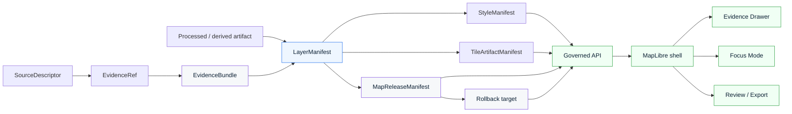

<!-- [KFM_META_BLOCK_V2]
doc_id: TODO-VERIFY(kfm://doc/<uuid>)
title: Layer Registry
type: standard
version: v1
status: draft
owners: TODO-VERIFY(data-steward, map-shell-steward, policy-steward)
created: 2026-05-01
updated: 2026-05-01
policy_label: TODO-VERIFY(public|restricted)
related: [../README.md, ../../README.md, ../../catalog/README.md, ../../published/README.md, ../../receipts/README.md, ../../proofs/README.md, ../../../schemas/contracts/v1/layers/README.md, ../../../policy/README.md, ../../../tools/validators/README.md, ../../../docs/adr/]
tags: [kfm, data, registry, layers, maplibre, layer-manifest, governance]
notes: [Draft README for data/registry/layers, Created from attached KFM doctrine and current workspace evidence, doc_id owners policy_label and adjacent path inventory require mounted-repo verification]
[/KFM_META_BLOCK_V2] -->

<a id="top"></a>

# Layer Registry

Release-aware registry surface for KFM layer manifests: what map layers may show, withhold, cite, style, release, and roll back.

<p>
  
  
  
  
  
</p>

> [!IMPORTANT]
> **Impact block**
>
> | Field | Value |
> |---|---|
> | Status | `experimental` until the mounted repository confirms path, schema, validator, and release behavior |
> | Owners | `TODO-VERIFY(data-steward, map-shell-steward, policy-steward)` |
> | Target path | `data/registry/layers/README.md` |
> | Repo fit | child registry under [`data/registry/`](../README.md); lifecycle context under [`data/`](../../README.md) |
> | Upstream | source descriptors, processed artifacts, catalog/proof/receipt closure, layer schemas, policy gates |
> | Downstream | governed API layer catalog, MapLibre shell, Evidence Drawer, Focus Mode, review/export surfaces |
> | Quick jumps | [Scope](#scope) · [Repo fit](#repo-fit) · [Inputs](#inputs) · [Exclusions](#exclusions) · [Directory tree](#directory-tree) · [Quickstart](#quickstart) · [Usage](#usage) · [Diagram](#diagram) · [Reference tables](#reference-tables) · [Task list](#task-list--definition-of-done) · [FAQ](#faq) · [Appendix](#appendix) |

> [!WARNING]
> This README documents the **layer registry boundary**, not an already-verified implementation. Exact owners, schema home, validator paths, workflow names, emitted manifests, and branch inventory remain **NEEDS VERIFICATION** until the real checkout is inspected.

---

## Scope

`data/registry/layers/` is the proposed registry home for **layer-facing control records** used by KFM map and UI surfaces.

A layer registry entry should answer a narrow set of governed questions:

- What layer is this?
- Which domain and release does it belong to?
- Which style, tile, raster, vector, or service artifacts may render it?
- Which evidence support is required before the UI can make claims?
- What geometry, time, sensitivity, freshness, and correction rules constrain display?
- What must the governed API and Evidence Drawer disclose when a user interacts with it?

This directory is **not** a map-artifact dump, a data source, a policy engine, a tile cache, or a shortcut around promotion.

### Truth posture

| Claim | Label | Meaning |
|---|---:|---|
| KFM layers are downstream of evidence, policy, release state, and governed APIs | **CONFIRMED doctrine** | The attached corpus repeatedly treats rendered layers as derived surfaces, not sovereign truth. |
| `data/registry/layers/` is the correct branch-local home for layer registry files | **PROPOSED / NEEDS VERIFICATION** | This path matches KFM directory logic and the requested target, but the active repo was not mounted here. |
| Specific filenames, schema IDs, and validator commands below are repo-ready | **PROPOSED** | They are designed to be adapted after schema-home and tooling conventions are confirmed. |

<p align="right"><a href="#top">Back to top ↑</a></p>

---

## Repo fit

Layer registry files sit between **published/release artifacts** and the **map shell**.

| Neighbor | Relationship | Current label |
|---|---|---:|
| [`../README.md`](../README.md) | parent registry orientation for data registries | **NEEDS VERIFICATION** |
| [`../../README.md`](../../README.md) | lifecycle context: source edge through published state | **NEEDS VERIFICATION** |
| [`../../catalog/README.md`](../../catalog/README.md) | catalog closure for STAC/DCAT/PROV-style outward metadata | **NEEDS VERIFICATION** |
| [`../../published/README.md`](../../published/README.md) | release-backed artifacts that layer manifests may reference | **NEEDS VERIFICATION** |
| [`../../receipts/README.md`](../../receipts/README.md) | process memory, run receipts, transform receipts, runtime receipts | **NEEDS VERIFICATION** |
| [`../../proofs/README.md`](../../proofs/README.md) | proof packs, EvidenceBundles, validation support | **NEEDS VERIFICATION** |
| [`../../../schemas/contracts/v1/layers/README.md`](../../../schemas/contracts/v1/layers/README.md) | machine schemas for `LayerManifest`, `LayerDescriptor`, `LayerCatalogItem`, and related contracts | **PROPOSED / NEEDS VERIFICATION** |
| [`../../../policy/README.md`](../../../policy/README.md) | policy rules for sensitivity, rights, stale sources, exact geometry, and release eligibility | **NEEDS VERIFICATION** |
| [`../../../tools/validators/README.md`](../../../tools/validators/README.md) | validators that should fail closed on invalid or unreleased layer entries | **NEEDS VERIFICATION** |
| [`../../../docs/adr/`](../../../docs/adr/) | ADR home for schema-home, registry-home, renderer, and release decisions | **NEEDS VERIFICATION** |

### Boundary sentence

The layer registry is a **control-plane registry** for released or release-candidate map layers. It may point to artifacts, evidence, style, policy, and release records; it must not become any of those records.

<p align="right"><a href="#top">Back to top ↑</a></p>

---

## Inputs

### Accepted inputs

The following inputs belong here only when they are manifest-shaped, reviewable, and tied to source/evidence/release posture.

| Accepted input | Typical extension | Required posture |
|---|---:|---|
| Layer registry index | `.yml` / `.yaml` / `.json` | Lists layer IDs, domains, release state, and manifest refs without duplicating full artifacts. |
| `LayerManifest` records | `.layer.yml` / `.layer.json` | Declares layer identity, domain, release binding, evidence policy, geometry policy, time model, support level, and stale behavior. |
| `LayerCatalogItem` entries | `.catalog.yml` / `.catalog.json` | Feeds UI layer lists and trust badges; must not invent evidence. |
| `LegendDescriptor` or legend refs | `.legend.yml` / `.legend.json` | Explains map symbology and meaning; must be style/release aware. |
| Verification backlog entries | `.yml` / `.md` | Captures unresolved owners, schema links, validator gaps, source-role questions, and release blockers. |
| Public-safe fixture manifests | `.fixture.yml` / `.fixture.json` | Small, no-network examples used to prove schema/policy behavior before live source activation. |

### Minimum manifest questions

A valid registry entry should be able to answer:

1. Which `layer_id` is being registered?
2. Which `domain` owns the layer?
3. Which `release_id` or release-candidate does it belong to?
4. Which artifacts may render it?
5. Which evidence support is required for popups, Evidence Drawer, Focus Mode, export, and review?
6. What happens if evidence is missing, source rights are unknown, the layer is stale, or geometry is sensitive?

<p align="right"><a href="#top">Back to top ↑</a></p>

---

## Exclusions

These items do **not** belong in `data/registry/layers/` as normal files.

| Excluded item | Goes instead | Reason |
|---|---|---|
| `RAW`, `WORK`, or `QUARANTINE` data | `data/raw/`, `data/work/`, `data/quarantine/` | Public-facing layer registries must not expose unpublished or unsafe material. |
| Processed domain records | `data/processed/` or repo-native processed store | A registry may reference processed support, not store it. |
| PMTiles, MVT, COG, GeoParquet, TileJSON, sprites, glyphs, or heavy artifacts | `data/published/`, `release/`, or artifact store | Layer registry files describe artifacts; they do not carry bytes. |
| EvidenceBundle payloads and proof packs | `data/proofs/` or proof object home | Evidence support must remain independently inspectable. |
| Run receipts, transform receipts, AI receipts, runtime receipts | `data/receipts/` | Receipts are process memory, not layer registry state. |
| STAC/DCAT/PROV catalog records | `data/catalog/` | Catalog closure is adjacent and referenceable, not duplicated here. |
| Policy source of truth | `policy/` | Registry files may carry policy labels and refs; they must not redefine policy. |
| Machine schemas | `schemas/contracts/v1/layers/` or repo-native schema home | Schema authority must remain centralized after ADR verification. |
| UI components, route handlers, model prompts, or renderer code | `apps/`, `packages/`, `contracts/api/` | The registry is consumed by runtime surfaces; it is not the runtime surface itself. |
| Direct model-runtime or source-API pointers for public use | governed API / ingestion surfaces | Direct public reads bypass evidence, policy, review, and audit controls. |

> [!CAUTION]
> A layer that renders successfully is not automatically releasable. Rendering is a downstream effect; publication depends on evidence, policy, catalog/proof closure, review state, and rollback readiness.

<p align="right"><a href="#top">Back to top ↑</a></p>

---

## Directory tree

**PROPOSED / NEEDS VERIFICATION** until the active repository confirms existing files.

```text
data/registry/layers/
├── README.md
├── INDEX.yml                         # PROPOSED: compact layer registry index
├── verification_backlog.yml          # PROPOSED: unresolved owners, schema links, source-role gaps
├── examples/
│   ├── hydrology.huc12.public.v1.layer.yml
│   └── sensitive_geometry.denied.fixture.yml
└── <domain>/
    ├── <layer_id>.layer.yml
    ├── <layer_id>.catalog.yml
    └── <layer_id>.legend.yml
```

Suggested naming convention:

```text
<domain>.<subject>.<audience-or-scope>.v<major>.layer.yml
```

Examples:

```text
hydrology.huc12.public.v1.layer.yml
habitat.grassland.generalized.v1.layer.yml
transportation.rail_network.public.v1.layer.yml
archaeology.site_density.generalized.v1.layer.yml
```

<p align="right"><a href="#top">Back to top ↑</a></p>

---

## Quickstart

Run these from the repository root after the real checkout is mounted.

### 1. Inventory the registry and adjacent contracts

```bash
find data/registry/layers -maxdepth 4 -type f | sort
find schemas contracts policy tests tools -maxdepth 5 -type f \
  | grep -Ei "layer|manifest|maplibre|drawer|release|catalog|policy" || true
```

### 2. Check for forbidden public-path drift

```bash
grep -RInE "data/(raw|work|quarantine)|localhost:11434|/api/generate|/api/chat" \
  data/registry/layers apps packages contracts schemas 2>/dev/null || true
```

Expected result: no layer registry entry should create a normal public path to raw lifecycle stores or direct model runtimes.

### 3. Validate layer fixtures with repo-native tooling

```bash
# Replace with repo-native command after schema-home and validator conventions are verified.
python tools/validators/layers/validate_layer_manifest.py \
  --registry data/registry/layers \
  --schema schemas/contracts/v1/layers/layer_manifest.schema.json
```

Expected result: valid fixtures pass; invalid fixtures fail with `ABSTAIN`, `DENY`, or `ERROR`-compatible reason codes.

> [!TIP]
> Do not upgrade this README from `experimental` to `active` until at least one layer entry proves: schema validation, policy closure, EvidenceBundle resolution, release linkage, Drawer payload compatibility, and rollback reference.

<p align="right"><a href="#top">Back to top ↑</a></p>

---

## Usage

### Layer entry lifecycle

A healthy layer registry entry should move through this reviewable path:

1. **Source and evidence support exists** through `SourceDescriptor`, `EvidenceRef`, and `EvidenceBundle` references.
2. **Processed or derived artifact exists** under the governed lifecycle, never by direct browser assembly.
3. **LayerManifest is authored** with release, artifact, time, sensitivity, stale, and evidence policy fields.
4. **Schema and policy validators run** over positive and negative fixtures.
5. **MapReleaseManifest binds** layer/style/artifact families to proof, public scope, prior release, and rollback target.
6. **Governed API serves** layer catalog and click-resolution payloads.
7. **Map shell renders** the layer with trust badges, time context, negative states, and Evidence Drawer continuity.
8. **Correction and rollback** remain visible if the release is withdrawn, superseded, or corrected.

### Illustrative `LayerManifest` shape

This is **illustrative**, not a replacement for the machine schema.

```yaml
schema: kfm.map.layer_manifest.v1
layer_id: hydrology.huc12.public.v1
title: Public HUC12 hydrologic units
domain: hydrology
status: proposed

release:
  release_id: TODO-VERIFY(maprelease_YYYY_MM_huc12)
  release_state: dry_run
  previous_release_id: null
  rollback_target: TODO-VERIFY(previous_release_or_null)

artifacts:
  - artifact_ref: TODO-VERIFY(kfm://artifact/tile/huc12_pmtiles_v1)
    artifact_kind: pmtiles
    media_type: application/vnd.pmtiles
    digest: TODO-VERIFY(sha256)

source_refs:
  - source_id: TODO-VERIFY(source_descriptor_id)
    source_role: authoritative_context
    rights_status: TODO-VERIFY(public|restricted|unknown)

evidence_policy:
  requires_evidence_bundle: true
  supports_popup_claims: false
  drawer_payload_contract: EvidenceDrawerPayload.v1
  focus_mode_allowed: evidence_bounded_only

time_model:
  valid_time: TODO-VERIFY
  source_publication_time: TODO-VERIFY
  ingestion_time: TODO-VERIFY
  release_time: TODO-VERIFY
  stale_policy: abstain_when_unknown

geometry_policy:
  public_geometry_class: public_safe
  exact_sensitive_geometry_allowed: false
  transforms_required: []

trust:
  sensitivity_class: public_safe
  support_level: released_context
  correction_state: current
  negative_states:
    - MISSING_EVIDENCE
    - SOURCE_STALE
    - DENIED_BY_POLICY
    - GENERALIZED_GEOMETRY
    - RELEASE_WITHDRAWN
```

<p align="right"><a href="#top">Back to top ↑</a></p>

---

## Diagram


```mermaid
flowchart LR
  A[SourceDescriptor] --> B[EvidenceRef]
  B --> C[EvidenceBundle]
  D[Processed / derived artifact] --> E[LayerManifest]
  C --> E
  E --> F[StyleManifest]
  E --> G[TileArtifactManifest]
  E --> H[MapReleaseManifest]
  F --> I[Governed API]
  G --> I
  H --> I
  I --> J[MapLibre shell]
  J --> K[Evidence Drawer]
  J --> L[Focus Mode]
  J --> M[Review / Export]
  H --> N[Rollback target]
  N --> I

  classDef registry fill:#eef6ff,stroke:#1f6feb,color:#0b1f33;
  classDef trust fill:#f6f8fa,stroke:#8250df,color:#0b1f33;
  classDef public fill:#f0fff4,stroke:#2ea043,color:#0b1f33;

  class E registry;
  class C,H,N trust;
  class I,J,K,L,M public;
```

The registry entry is the layer’s **control-plane join point**. It connects evidence support, renderable artifacts, release state, and UI trust behavior without becoming canonical truth.

<p align="right"><a href="#top">Back to top ↑</a></p>

---

## Reference tables

### What the registry should preserve

| Registry concern | Required field family | Why it matters |
|---|---|---|
| Identity | `layer_id`, `title`, `domain`, `version` | Keeps UI, API, release, and rollback references stable. |
| Release binding | `release_id`, `release_state`, `previous_release_id`, `rollback_target` | Prevents layer toggles from becoming silent publication actions. |
| Evidence posture | `evidence_policy`, `evidence_bundle_refs`, `source_refs` | Keeps claims one hop from support. |
| Artifact linkage | `artifact_refs`, `style_ref`, `tile_artifact_refs` | Lets clients render released assets without discovering truth ad hoc. |
| Time model | valid, observation, publication, ingestion, review, release, stale, correction time | Prevents visual time from silently diverging from evidence time. |
| Sensitivity and rights | `sensitivity_class`, `rights_status`, `geometry_policy`, `access_class` | Blocks exact sensitive geometry and rights-unknown publication. |
| Negative states | `MISSING_EVIDENCE`, `SOURCE_STALE`, `DENIED_BY_POLICY`, `RELEASE_WITHDRAWN` | Makes failure inspectable instead of invisible. |
| Correction lineage | `correction_state`, `correction_notice_ref` | Preserves public trust after fixes and withdrawals. |

### What lives here versus elsewhere

| Object family | Registry role | Canonical home to verify |
|---|---|---|
| `LayerManifest` | primary object or reference target | `data/registry/layers/` + `schemas/contracts/v1/layers/` |
| `StyleManifest` | referenced, not duplicated | `data/registry/styles/` or MapLibre contract home |
| `TileArtifactManifest` | referenced, not stored as bytes | `data/published/`, `data/manifests/`, or release artifact home |
| `EvidenceBundle` | referenced as support | `data/proofs/` or evidence bundle home |
| `MapReleaseManifest` | release authority | `data/published/`, `release/`, or release manifest home |
| `RunReceipt` / `RuntimeReceipt` | audit/process memory | `data/receipts/` |
| `CatalogMatrix` / STAC / DCAT / PROV | outward catalog closure | `data/catalog/` |
| `PolicyDecision` | emitted/enforced decision | `policy/`, governed API, or receipts/proofs as appropriate |

<p align="right"><a href="#top">Back to top ↑</a></p>

---

## Task list / definition of done

Before a layer registry entry is eligible for public or semi-public use:

- [ ] `layer_id` is stable, deterministic where practical, and not reused for a different meaning.
- [ ] `SourceDescriptor` refs identify source role, rights, access class, cadence, and citation policy.
- [ ] `EvidenceBundle` support exists or the layer is explicitly marked as non-claiming context.
- [ ] `LayerManifest` validates against the repo’s canonical schema home.
- [ ] `StyleManifest` and `TileArtifactManifest` refs validate and include digest/integrity checks.
- [ ] `MapReleaseManifest` or release-candidate object binds layer, style, artifacts, proof, prior release, and rollback target.
- [ ] Policy tests deny unknown rights, unreleased layers, exact sensitive geometry, stale/unsupported claims, and missing evidence.
- [ ] Evidence Drawer fixture opens from a selected feature and shows release, evidence, time, source role, sensitivity, transforms, and correction state.
- [ ] Focus Mode fixture returns only `ANSWER`, `ABSTAIN`, `DENY`, or `ERROR` and never receives raw hidden geometry.
- [ ] E2E smoke test covers: click → governed resolution → Drawer → optional Focus finite outcome → runtime receipt.
- [ ] Rollback drill proves a bad release can be withdrawn or restored without deleting correction lineage.
- [ ] This README and adjacent registry/schema/policy docs update in the same PR as behavior-changing layer work.

<p align="right"><a href="#top">Back to top ↑</a></p>

---

## FAQ

### Is a layer registry entry the same thing as a dataset?

No. A dataset or processed record family may support one or many layers. A layer registry entry describes a **public-facing rendering and interaction surface**, including what it may show and what evidence/policy conditions constrain it.

### Can a layer popup make claims directly from feature properties?

Only if the layer’s evidence policy explicitly permits that and the claim is already supported by released evidence. The safer default is lightweight map affordance in the popup and full claim support in the Evidence Drawer.

### Can a layer be visible before it is published?

Only as a reviewed internal, dry-run, or fixture surface with clear `release_state` and policy controls. Visibility in a developer map is not publication.

### Can this registry include sensitive layers?

It can include **controlled descriptors** for sensitive or generalized layers, but it must not publish exact sensitive geometry, hidden steward-only context, or policy-blocked release paths. Sensitive handling should fail closed and surface safe reason classes.

### What is the first layer family to prove?

Hydrology is the strongest first proof candidate in the current doctrine because it is public-safe, place/time rich, and naturally suited to proving source descriptors, catalog closure, layer manifests, Evidence Drawer behavior, and rollback.

<p align="right"><a href="#top">Back to top ↑</a></p>

---

## Appendix

<details>
<summary>Candidate field checklist for `LayerManifest.v1`</summary>

Use this checklist as a review aid until the canonical schema is confirmed.

| Field family | Candidate fields |
|---|---|
| Identity | `schema`, `layer_id`, `title`, `description`, `domain`, `version`, `status` |
| Ownership | `owner`, `steward`, `reviewer`, `maintainer_notes` |
| Release | `release_id`, `release_state`, `previous_release_id`, `rollback_target`, `public_scope` |
| Artifacts | `artifact_refs`, `tile_artifact_manifest_ids`, `style_manifest_id`, `legend_ref` |
| Evidence | `evidence_bundle_refs`, `evidence_policy`, `source_refs`, `citation_policy` |
| Time | `valid_time`, `observation_time`, `source_publication_time`, `ingestion_time`, `review_time`, `release_time`, `stale_time`, `correction_transaction_time` |
| Policy | `policy_label`, `rights_status`, `access_class`, `sensitivity_class`, `geometry_policy`, `withheld_counts` |
| UI trust | `trust_badges`, `negative_states`, `drawer_payload_contract`, `focus_mode_allowed`, `popup_claims_allowed` |
| Integrity | `spec_hash`, `manifest_digest`, `artifact_digests`, `validator_report_refs` |
| Lineage | `correction_state`, `correction_notice_ref`, `supersedes`, `superseded_by` |

</details>

<details>
<summary>Review prompts for maintainers</summary>

- Does this layer make claims, or is it purely orientation/context?
- Which evidence support object proves the claim path?
- What is the active time axis for rendering and for evidence?
- What exactly changes if the style changes?
- Are hidden counts, generalized geometry, stale state, and correction state visible?
- Does the registry entry still work if the renderer is unavailable?
- Can a bad release be withdrawn without deleting history?
- Would the same layer be safe in export, story mode, and Focus Mode?

</details>

<details>
<summary>Related implementation surfaces to verify</summary>

- `schemas/contracts/v1/layers/layer_manifest.schema.json`
- `schemas/contracts/v1/layers/layer_catalog_item.schema.json`
- `schemas/contracts/v1/layers/layer_descriptor.schema.json`
- `schemas/contracts/v1/ui/evidence_drawer_payload.schema.json`
- `schemas/contracts/v1/map/map_release_manifest.schema.json`
- `tools/validators/layers/validate_layer_manifest.py`
- `policy/layers/`
- `tests/fixtures/layers/`
- `apps/governed_api/` or repo-native governed API path
- `apps/web/` or repo-native map shell path
- `.github/workflows/` or repo-native CI path

</details>
