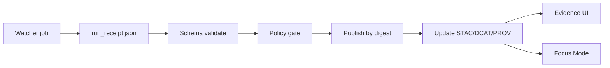

<!-- [KFM_META_BLOCK_V2]
doc_id: kfm://doc/6f2b4a28-2f52-4b6f-b7e4-f4d7475b7054
title: data/registry/schemas — Registry Contract Schemas
type: standard
version: v1
status: draft
owners: kfm-data-governance (TBD)
created: 2026-02-24
updated: 2026-02-24
policy_label: public
related:
  - kfm://doc/00000000-0000-0000-0000-000000000000 # TODO: link to Data Registry README/doc_id
tags: [kfm, registry, schemas, contracts, provenance, policy-gates]
notes:
  - Contract-first: schemas are enforced by CI/policy; invalid artifacts must fail closed.
  - This README describes the intent + invariants; the schema files are the source of truth.
[/KFM_META_BLOCK_V2] -->

# `data/registry/schemas`
**Purpose:** Canonical *contract schemas* for registry + provenance artifacts (validate → attest → gate → publish).


> **WARNING**
> These schemas sit inside the trust membrane. If something does **not** validate, it must not be signed, promoted, or shown as trusted.

---

## Quick navigation
- [Overview](#overview)
- [Directory contents](#directory-contents)
- [Contracts in this folder](#contracts-in-this-folder)
  - [Run Receipt](#run-receipt)
  - [Run Manifest](#run-manifest)
  - [Watchers Registry](#watchers-registry)
- [Validation & CI usage](#validation--ci-usage)
- [Versioning policy](#versioning-policy)
- [Acceptable inputs](#acceptable-inputs)
- [Exclusions](#exclusions)

---

## Overview

This folder is for **machine-validated contracts** that make governance “physical”:
watch → compute deterministic hashes → emit receipts → validate → policy-gate → publish immutable artifacts → surface evidence in UI/Focus Mode.

The goal is simple: **every user-facing claim is traceable to evidence, and every gate can fail closed.**



---

## Directory contents

> **NOTE**
> The exact contents may evolve, but the *pattern* should stay stable: **versioned schemas + fixtures/examples**.

Recommended layout:

```text
data/registry/schemas/                              # Registry schemas (canonical contracts + examples for CI)
├─ README.md                                       # How schemas are versioned, validated, and referenced by tools
│
├─ run_receipt.v1.schema.json                      # Run receipt contract (promotion evidence; required fields incl. spec_hash)
├─ run_manifest.v1.schema.json                     # Run manifest contract (run envelope; inputs/outputs + digests + refs)
├─ watcher.v1.schema.json                          # Watcher contract (schedule/triggers/scope + signing requirements)
│
└─ examples/                                       # Recommended: schema examples (must pass/fail deterministically)
   ├─ run_receipt.valid.json                       # Valid example (minimal)
   ├─ run_receipt.invalid.missing_spec_hash.json   # Invalid example (must fail)
   ├─ run_manifest.valid.json                      # Valid example (minimal)
   ├─ watcher.valid.json                           # Valid watcher example
   └─ watcher.invalid.unsigned.json                # Invalid: missing/invalid signature (must fail)
```

---

## Contracts in this folder

### Run Receipt

**What it is:** One receipt per ingestion/transform run.  
**Why it matters:** This is the smallest “evidence object” that makes datasets auditable.

**Minimum fields you should expect to exist (illustrative):**
- `kfm_run_id` (stable run identifier)
- `dataset` (canonical dataset id)
- `subject` (**digest**, not a tag)
- `spec_hash` (sha256 of canonicalized spec/config)
- `pipeline` (promotion path)
- `runner` (who/what executed the run)
- `inputs[]`, `outputs[]`
- `checks{...}` (must be interpreted **fail-closed**)
- `timestamps{start,end}` (RFC3339; start <= end)

**Required invariants (design intent):**
- `spec_hash` must be computed from **canonicalized** content (deterministic).
- `subject` must be a **digest** (avoid tags) to keep verification unambiguous.
- `checks` must exist and be evaluated **fail-closed** (any “fail” blocks promotion).
- timestamps must be RFC3339 and bound the run (start <= end).

<details>
<summary>Example receipt payload (minimal, illustrative)</summary>

```json
{
  "kfm_run_id": "2026-02-02T12:00Z-abc123",
  "dataset": "soils.ssurgo",
  "subject": "sha256:<digest>",
  "spec_hash": "sha256:<64-hex>",
  "pipeline": "raw->processed->catalog->prov",
  "runner": "gha://workflows/provenance-guard@v3",
  "inputs": ["uri://..."],
  "outputs": ["stac items", "prov bundle"],
  "checks": { "stac": "ok", "prov": "ok", "policy": "ok" },
  "timestamps": { "start": "2026-02-02T12:00:00Z", "end": "2026-02-02T12:03:00Z" }
}
```
</details>

[Back to top](#dataregistryschemas)

---

### Run Manifest

**What it is:** A promotion-focused rollup, distinct from a per-run receipt.  
**Why it matters:** Promotion gates often need invariants like `rekor_uuid`, `spec_hash`, and `rights` in one place.

Common fields you should expect to exist (illustrative):
- `dataset`, `run_id`
- `spec_hash`, `input_sha256`
- `rekor_uuid`
- `rights{license, attribution, redistribution, ...}`
- `produced_artifacts[]` (published references by digest)
- `materiality_delta` (typed diff signal)
- `publish_candidate` (true/false)
- `signatures[]`, `attestations[]`

<details>
<summary>Example manifest payload (minimal, illustrative)</summary>

```json
{
  "dataset": "soils.ssurgo",
  "run_id": "2026-02-02T12:00Z-abc123",
  "spec_hash": "sha256:...",
  "input_sha256": "sha256:...",
  "rekor_uuid": "c7f2...e1",
  "rights": {
    "license": "...",
    "attribution": "...",
    "redistribution": "..."
  },
  "produced_artifacts": ["oci://...@sha256:<digest>"],
  "materiality_delta": 0.03,
  "publish_candidate": true,
  "signatures": ["..."],
  "attestations": ["oci://..."]
}
```
</details>

[Back to top](#dataregistryschemas)

---

### Watchers Registry

**What it is:** A **signed allow-list** of automated watchers/fetchers.  
**Why it matters:** CI and Focus Mode need deterministic allow/deny decisions for automation.

Typical fields (illustrative; see schema for authority):
- `watcher_id` (restricted identifier pattern)
- `canonical_id`
- `endpoint` (URI)
- `poll{interval_seconds, mode}`
- `policy{staleness_s, spec_change_pct, geom_shift_m, ...}`
- `outputs[...]`
- `schema_url`
- `version`
- `spec_hash`
- `signature_ref`

**Design intent:** signatures are part of the contract to prevent silent automation drift and keep the allow-list portable.

[Back to top](#dataregistryschemas)

---

## Validation & CI usage

This directory is meant to be used in **fail-closed** gates (CI + local tooling).

Recommended minimum:
- Validate **schema compilation** (schemas are parseable/consistent)
- Validate **fixtures/examples** (valid examples pass; invalid examples fail)
- Treat validation failure as **blocking**

Example commands (pick what your toolchain uses):

```bash
# JSON Schema validation (example using AJV)
ajv validate -s run_receipt.v1.schema.json -d examples/run_receipt.valid.json

# Policy gate workflow often runs Conftest over artifacts after schema validation
# (exact policy path may differ by repo)
conftest test examples/run_receipt.valid.json -p ../../../policy/opa
```

---

## Versioning policy

**Rules**
- All schemas in this folder MUST be versioned: `*.v<major>.schema.json`
- Breaking changes require a new major version (v2, v3, …)
- Additive changes that do not break validation can stay within the same major (but still consider pinning/compat)

**Why**
- We must be able to validate **historic receipts/manifests** for audits and rollback investigations.

---

## Acceptable inputs

✅ Place here:
- Versioned JSON Schema files that define **registry/provenance contracts**
- Example fixtures used by CI gates (valid + invalid)
- Small helper notes needed to understand invariants

---

## Exclusions

❌ Do **not** place here:
- Unversioned schemas (except an explicit, deliberate alias file if governance approves)
- Runtime configuration, secrets, keys, or private endpoints
- Dataset payloads (raw/processed artifacts belong in `data/raw`, `data/processed`, etc.)
- Anything containing PII/sensitive values (examples must be scrubbed)

---

## See also
- `data/prov/` (run receipts typically live with provenance artifacts)
- `policy/` (deny-by-default gates)
- `web/` (evidence viewer / trust surfaces)
- `src/pipelines/` (emitters and validators)

