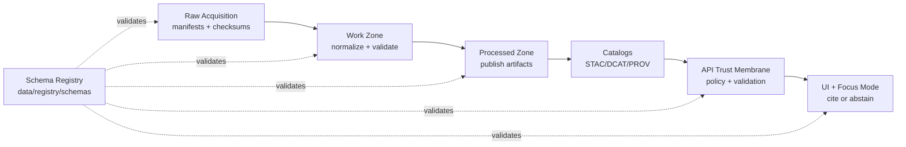

# KFM Schema Registry (data/registry/schemas)


This directory is the **canonical schema registry** for Kansas Frontier Matrix (KFM) *governed artifacts*.
If a thing is **validated in CI**, **served by the API**, **used to promote datasets**, **used to publish Story Nodes**, or **used to enforce Focus Mode cite-or-abstain**, its schema belongs here (or is pinned/linked from here).

> [!IMPORTANT]
> In KFM, schemas are not “nice-to-have docs.” They are **enforceable governance contracts**:
> - Promotion gates rely on them.
> - Policy-as-code relies on them.
> - Runtime request/response validation relies on them.
> - Audits rely on them.
>
> **If a governed artifact changes shape, the schema MUST change first, and CI MUST fail-closed until it is updated.**

---

## Why this exists

KFM is explicitly designed around:
- a **trust membrane** (clients never talk directly to databases; the governed API boundary + policy gate is the only path),
- **fail-closed** policy enforcement,
- **promotion gates** (Raw → Work → Processed) requiring catalogs and validation,
- **Focus Mode cite-or-abstain** with an audit reference per answer.

Schemas are how we make these requirements **testable** and **repeatable**.

---

## What belongs here

This registry contains (or anchors to) schemas for:

### ✅ KFM-native governed artifacts (JSON Schema)
- Pipeline **run manifests / run receipts** (`run_manifest`)
- **Watcher entries** (watchers used to trigger PR/CI/promotion workflows)
- Story Node templates (front matter + structural requirements)
- Focus Mode API artifacts (request context, response payloads, evidence refs, `audit_ref`)
- Data-source “raw fetch manifests” / connector configs (where applicable)
- Validation reports (what CI and auditors rely on)

### ✅ Standards-aligned publication artifacts (validated, pinned, and/or wrapped)
- **STAC** Collections/Items (catalog discoverability)
- **DCAT** Dataset/Distribution (catalog discoverability + license/rights surface)
- **PROV** records (lineage and audit evidence)

> [!NOTE]
> We do **not** reinvent STAC/DCAT/PROV specifications here. Instead we:
> - validate them with dedicated tools (and/or pinned schema snapshots), and
> - wrap them into KFM governance rules (required presence, required fields, resolvable refs, fail-closed promotion gates).

---

## Directory layout

This folder is intentionally boring and CI-friendly:

```text
data/
└── registry/
   └─ schemas/                                         # Schema registry (contracts that gate ingestion, APIs, and AI outputs)
      ├─ README.md                                     # How schemas are versioned, validated, and enforced in CI
      │
      ├─ kfm/                                          # KFM-owned JSON Schemas (authoritative system contracts)
      │  ├─ kfm.schema.run_manifest.v1.schema.json      # Run manifest contract (inputs/outputs/digests + trace IDs)
      │  ├─ kfm.schema.watcher.v1.schema.json           # Watcher/monitoring contract (events, triggers, schedules)
      │  ├─ kfm.schema.focus_answer.v1.schema.json      # Focus Mode answer envelope (citations, abstain reasons, audit refs)
      │  ├─ kfm.schema.focus_request.v1.schema.json     # Focus Mode request envelope (query, scope, policy context)
      │  ├─ kfm.schema.story_node.v3.schema.json        # Story Node v3 contract (frontmatter, citations, assets refs)
      │  ├─ kfm.schema.validation_report.v1.schema.json # Validator output contract (errors/warnings, machine-readable)
      │  └─ kfm.schema.policy_input.v1.schema.json      # Policy input contract (actor/resource/context passed to OPA)
      │
      ├─ external/                                     # Optional pinned upstream schemas for reproducibility (CI-stable)
      │  ├─ stac/                                      # STAC schema snapshots/references used by validators
      │  ├─ dcat/                                      # DCAT schema snapshots/references used by validators
      │  └─ prov/                                      # PROV schema snapshots/references used by validators
      │
      ├─ examples/                                     # Minimal valid examples for every KFM-owned schema (golden inputs)
      │  ├─ run_manifest.v1.example.json               # Example matching run_manifest.v1 schema
      │  ├─ watcher.v1.example.json                    # Example matching watcher.v1 schema
      │  ├─ focus_answer.v1.example.json               # Example matching focus_answer.v1 schema
      │  └─ story_node.v3.example.md                   # Example Story Node markdown (paired w/ schema expectations)
      │
      └─ tests/                                        # Schema contract tests (CI runs these; fail-closed)
         ├─ schemas_smoke_test.yml                     # Smoke suite: every schema validates its example(s)
         └─ fixtures/                                  # Test-only fixtures (invalid cases, edge cases, normalization inputs)
```

> [!IMPORTANT]
> **Every schema in `kfm/` MUST have at least one valid example in `examples/`.**
> Schemas without examples become “paper contracts” and will drift.

---

## Schema index

Below is the *expected* minimum registry for KFM governance. If a schema is not present yet, it **must be added before** introducing governed artifacts of that type.

| Schema ID (canonical) | Canonical file | Validates | Where used |
|---|---|---|---|
| `kfm.schema.run_manifest.v1` | `kfm/kfm.schema.run_manifest.v1.schema.json` | Run receipt/run manifest for pipeline jobs (inputs/outputs/hashes/rights/materiality/audit refs) | Promotion gates, provenance UI, audit trail, reproducibility checks |
| `kfm.schema.watcher.v1` | `kfm/kfm.schema.watcher.v1.schema.json` | Watcher entries (endpoint, poll/webhook, outputs, thresholds, spec hash, signature ref) | Watcher → PR → CI → Registry pattern |
| `kfm.schema.policy_input.v1` | `kfm/kfm.schema.policy_input.v1.schema.json` | OPA/Conftest policy input envelope (actor/request/resource/answer metadata) | Fail-closed policy checks at CI + API boundary |
| `kfm.schema.story_node.v3` | `kfm/kfm.schema.story_node.v3.schema.json` | Story Node front matter + structural requirements | Story Node CI validation; publishing workflows |
| `kfm.schema.focus_request.v1` | `kfm/kfm.schema.focus_request.v1.schema.json` | Focus Mode API request context (user role, view state, scope) | `/api/...` request validation + policy input |
| `kfm.schema.focus_answer.v1` | `kfm/kfm.schema.focus_answer.v1.schema.json` | Focus Mode response (citations/evidence refs, abstain rules, `audit_ref`) | “Cite or abstain” enforcement + UI rendering |
| `kfm.schema.validation_report.v1` | `kfm/kfm.schema.validation_report.v1.schema.json` | Validation report output (what passed/failed, tool versions, evidence pointers) | Promotion gates, audit review, regression checks |

---

## Versioning and compatibility rules (SemVer)

All KFM-owned schemas follow SemVer and encode their major version in the schema ID:

- **MAJOR**: breaking change (artifact producers/consumers must update together)
- **MINOR**: backward-compatible extensions (add optional fields, widen enums carefully)
- **PATCH**: non-functional changes (docs, descriptions, tightened constraints that don’t break valid artifacts)

**Rule of thumb:** If a previously valid artifact becomes invalid, it’s a **breaking change** → MAJOR bump.

---

## Canonical identifiers and `$id`

Every schema file MUST include:
- a stable `$id` (URI) and `title`
- the JSON Schema dialect via `$schema`
- `additionalProperties: false` for critical governed artifacts (run manifests, Focus answers, policy input) unless explicitly justified

Recommended `$id` pattern (stable + resolvable):

```text
kfm://schema/<schema_name>/v<major>
```

This keeps schemas stable even if file paths move.

---

## How schemas get enforced

### CI is the primary enforcement mechanism

CI MUST:
1. Validate changed governed artifacts against the correct schema(s)
2. Run policy-as-code (OPA/Conftest) with **default deny**
3. Fail closed if:
   - a schema-required field is missing,
   - a required catalog artifact is missing/invalid,
   - a required signature/attestation is missing (where required),
   - evidence refs are unresolvable.

### Acceptance harness expectations

The KFM acceptance harness is expected to run a combined verification pass that includes:
- STAC validation
- DCAT validation
- PROV validation
- Policy tests (OPA/Conftest, deny-by-default)
- Signature verification for signed artifacts (e.g., cosign verification)
- Deterministic hashing checks (`spec_hash` / canonicalization)

---

## Local validation (recommended developer workflow)

> [!TIP]
> CI is authoritative, but local validation prevents slow feedback loops.

A common local flow looks like:

1) Validate JSON against a schema (choose one tool; examples below)
```bash
# Option A: Node (AJV)
npx ajv-cli validate -s data/registry/schemas/kfm/kfm.schema.run_manifest.v1.schema.json \
  -d data/registry/schemas/examples/run_manifest.v1.example.json

# Option B: Python (check-jsonschema)
python -m check_jsonschema --schemafile data/registry/schemas/kfm/kfm.schema.run_manifest.v1.schema.json \
  data/registry/schemas/examples/run_manifest.v1.example.json
```

2) Run the “full verify” pass (if your repo provides a convenience target)
```bash
make verify
```

---

## Governance rules for schema changes

Schema changes are *production changes*.

### Required reviews
- **Data Steward** review (correctness, rights, sensitivity)
- **Platform/Infra** review (CI gates, signature verification implications)
- **Security** review when schemas touch:
  - signatures/attestations
  - policy input/output envelopes
  - anything that gates promotion or public responses

### Required artifacts in the PR
- ✅ Updated schema file(s)
- ✅ Updated example(s) proving validity
- ✅ Negative test fixture(s) (at least one “should fail” case for critical schemas)
- ✅ Updated policy pack tests if policy inputs/outputs changed
- ✅ Migration notes if producers/consumers must update

---

## Sensitivity and redaction compatibility

Some KFM datasets and narratives may be sensitive (e.g., sensitive locations, culturally restricted knowledge).

**Schema design must support sensitivity handling:**
- Artifacts MUST carry a sensitivity classification field where promotion/publication decisions depend on it
- Schemas MUST permit “redacted derivatives” where the original sensitive value is removed but provenance remains intact
- Evidence refs MUST remain resolvable (even if the resolved view is permission-gated)

---

## How this ties into KFM publishing

KFM publishing is “provenance-first”:

- A dataset is **not publishable** unless required catalogs are emitted and validated.
- A Story Node is **not publishable** unless it validates and its citations resolve.
- A Focus Mode answer is **not acceptable** unless it cites resolvable evidence — or abstains with an audit reference.

This schema registry is the contract layer that makes those rules enforceable.



---

## FAQ

### Why are schemas under `data/registry/` instead of `src/`?
Because schemas are **governed data artifacts**:
- they are versioned,
- they gate promotion/publishing,
- they are auditable,
- and they must remain stable regardless of application refactors.

### Can I loosen a schema “just to get CI green”?
No. In KFM, “green CI” without correct constraints is a trust regression.
If something is legitimately variable, model it explicitly (e.g., optional field, tagged union, or profile-specific overlay schema).

### Do we allow unknown fields?
For critical governance objects (run manifests, Focus answers, policy inputs), default posture is:
- **deny unknown fields** (`additionalProperties: false`)
- introduce new fields intentionally and version them.

---

## Ownership

**Primary owners:** Data Stewardship + Platform Governance  
**Review required:** Yes (see “Governance rules for schema changes”)

If you are unsure whether an artifact needs a schema, treat it as **yes** and open a PR adding one.

