<!--
Path: data/registry/schemas/tests/README.md
Purpose: Contract tests for governed JSON Schemas (fail-closed).
-->

# 🧪 KFM Schema Contract Tests (Fixtures + Gates)


> [!IMPORTANT]
> These tests are part of KFM’s **fail-closed governance boundary**:
> if an artifact **does not match the schema**, it cannot be **trusted**, **signed**, **promoted**, or shown as “green/trusted” in UX.  [oai_citation:2‡KFM-Bluprint-&-Ideas.pdf](sediment://file_000000004e9c71f598d3d784f6a13c46)

---

## What this folder is for

This directory contains **schema contract tests**—primarily **fixture instances** that must either:

- ✅ **validate** against a schema (valid fixtures), or
- ❌ **fail validation** (invalid fixtures) in a predictable way

This supports the Phase 0 “contracts first” adoption plan:

- add schemas
- add valid + invalid fixtures
- validate in CI
- document invariants in a short README next to schemas  
  **DoD:** CI fails on invalid examples; schema compilation is a required status check.  [oai_citation:3‡KFM-Bluprint-&-Ideas.pdf](sediment://file_000000004e9c71f598d3d784f6a13c46)

---

## Repo layout (expected / recommended)

> [!NOTE]
> If your repo layout differs, keep the intent and rename paths accordingly.

```text
data/
└─ registry/
   └─ schemas/
      ├─ *.schema.json                 # governed JSON Schemas (source of truth)
      └─ tests/
         ├─ README.md                  # (this file)
         ├─ fixtures/                  # instances (valid/invalid)
         │  └─ <schema_name>/
         │     ├─ valid__*.json
         │     └─ invalid__*.json
         └─ cases.yml                  # optional: declarative list of test cases
```

---

## What we validate (and what we don’t)

These contract tests focus on **schema conformance** (shape, required fields, types, patterns, disallowing unexpected fields).

KFM’s broader “minimum validation gates” for promoted datasets also include:

- row-level schema validation ✅ *(this folder helps)*
- geometry validity + bounds
- temporal consistency
- license + attribution
- provenance completeness + deterministic checksum  
   [oai_citation:4‡KFM_Comprehensive_Data_Source_Integration_Blueprint_v1_massive.pdf](sediment://file_000000000bbc722f8debeb7985ab63ea)

Those other checks usually live in dataset-specific validators / pipeline gates, not here.

---

## Fixture naming conventions

| Type | Pattern | Meaning |
|------|---------|---------|
| Valid | `valid__<short_reason>.json` | Must validate against the schema |
| Invalid | `invalid__<short_reason>.json` | Must fail schema validation |
| Minimal | `valid__minimal.json` | The smallest “golden” instance you expect to accept |
| Edge | `valid__edge__*.json` | Boundary case that must still pass |

> [!TIP]
> Use **small** fixtures. Keep them legible in PR diffs. Prefer synthetic values.

---

## How to run locally

> [!NOTE]
> The exact command depends on your validator toolchain (Node/AJV vs Python/jsonschema, etc.).
> Use whichever your repo already standardizes on.

### Option A: AJV CLI (Node)

```bash
# Example (adjust schema + fixture paths)
npx ajv-cli validate \
  -s ../run_receipt.v1.schema.json \
  -d fixtures/run_receipt/valid__minimal.json
```

### Option B: Python jsonschema CLI

```bash
# Example (adjust schema + fixture paths)
python -m jsonschema -i fixtures/run_receipt/valid__minimal.json ../run_receipt.v1.schema.json
```

---

## Policy gates (OPA / Conftest)

Schema validation is necessary but not always sufficient. KFM also uses **OPA/Rego policy packs** as deny-by-default gates for invariants like:

- missing `spec_hash`
- missing digests / required evidence fields
- insecure URLs (e.g., `http://`)
- missing licensing / CARE fields (when applicable)  
   [oai_citation:5‡KFM-Bluprint-&-Ideas.pdf](sediment://file_000000004e9c71f598d3d784f6a13c46)

Example CI/local policy run:

```bash
# Example from KFM Integration Pack (adjust paths)
conftest test run_receipt.json -p policy/opa
```

 [oai_citation:6‡KFM-Bluprint-&-Ideas.pdf](sediment://file_000000004e9c71f598d3d784f6a13c46)

> [!IMPORTANT]
> Keep schema checks and policy checks **separate**:
> - **Schema** answers “is the instance shaped correctly?”
> - **Policy** answers “is it acceptable to promote / expose given governance rules?”

---

## CI behavior (required)

At minimum, CI should:

1. **Compile / load** every JSON Schema under `data/registry/schemas/`
2. Validate all `valid__*.json` fixtures ✅
3. Ensure all `invalid__*.json` fixtures fail ❌
4. Run OPA/Conftest policy tests (deny-by-default) where configured  
5. Treat the overall result as a **required status check** for merging  [oai_citation:7‡KFM-Bluprint-&-Ideas.pdf](sediment://file_000000004e9c71f598d3d784f6a13c46)

A “CI-ready” test plan elsewhere in KFM also expects:
- unit tests for schema mapping/coercion
- integration tests asserting stable checksums + counts
- contract tests for API provenance + redaction
- regression tests for profiling metrics stability  
 [oai_citation:8‡KFM_Comprehensive_Data_Source_Integration_Blueprint_v1_massive.pdf](sediment://file_000000000bbc722f8debeb7985ab63ea)

---

## Adding a new schema (Definition of Done)

When you add or change a schema in `../`:

- [ ] Add/modify the schema file (`*.schema.json`)
- [ ] Add **≥ 1 valid** fixture (`valid__minimal.json`)
- [ ] Add **≥ 1 invalid** fixture (`invalid__<reason>.json`)
- [ ] If invariants go beyond schema shape, add/update corresponding **OPA policy tests**
- [ ] CI runs as a **required status check** and fails on bad fixtures  [oai_citation:9‡KFM-Bluprint-&-Ideas.pdf](sediment://file_000000004e9c71f598d3d784f6a13c46)
- [ ] Update this README if you introduced a new invariant category

---

## Governance + safety rules for fixtures

> [!WARNING]
> Fixtures are repo artifacts. Treat them as publishable.

- Do **not** commit secrets, keys, tokens, or private endpoints.
- Avoid real PII. Prefer synthetic records.
- If a schema models sensitive locations/people:
  - generalize or redact fixture content
  - ensure policy labels / restrictions are tested in policy packs (fail-closed)
- Keep fixtures minimal to reduce accidental leakage surface.

---

## Workflow overview

```mermaid
flowchart LR
  A[Schema change] --> B[Add fixtures<br/>valid + invalid]
  B --> C[JSON Schema validation]
  C -->|pass| D[OPA/Conftest policy gate]
  C -->|fail| X[❌ Block merge]
  D -->|allow| E[✅ Required CI check passes]
  D -->|deny| X
```



---

## Troubleshooting

### “format: uri” fails unexpectedly
Different validators handle JSON Schema formats differently.
- AJV often needs `ajv-formats` wired in.
- Some CLIs treat formats as warnings vs errors.

### “additionalProperties: false” breaks fixtures
That’s expected when schemas are strict. Update the fixture or update the schema intentionally—never “just loosen” without governance review.

### Invalid fixtures accidentally pass
Make the failure unambiguous:
- remove a required field
- violate a pattern
- introduce an unexpected property when `additionalProperties: false`

---

## References (design intent)

- **KFM Integration Idea Pack** (2026-02-15 draft): Phase 0 contracts-first guidance; Conftest/OPA examples.  [oai_citation:10‡KFM-Bluprint-&-Ideas.pdf](sediment://file_000000004e9c71f598d3d784f6a13c46) [oai_citation:11‡KFM-Bluprint-&-Ideas.pdf](sediment://file_000000004e9c71f598d3d784f6a13c46)
- **KFM Data Source Integration Blueprint** (v1.0, 2026-02-12): minimum validation gates + CI-ready test plan.  [oai_citation:12‡KFM_Comprehensive_Data_Source_Integration_Blueprint_v1_massive.pdf](sediment://file_000000000bbc722f8debeb7985ab63ea)