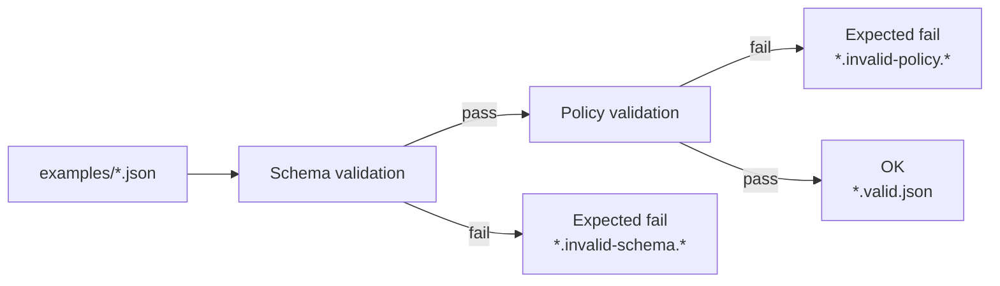

# Schema examples

> [!IMPORTANT]
> **Role of this folder:** CI fixtures for *schema + policy* validation (**fail-closed**).
>
> These JSON files are intentionally small, synthetic, and reviewable. They exist so contract changes can’t silently drift and so CI can prove it blocks malformed or non-compliant artifacts.

## What lives here

This directory contains **example JSON documents** that correspond to the versioned JSON Schemas in the parent directory (`data/registry/schemas/`).

- ✅ `*.valid.json` fixtures **must pass** schema validation (and any policy checks enforced by CI).
- ❌ `*.invalid-*.json` fixtures **must fail** validation (schema and/or policy), and CI should treat that failure as a *successful* negative test.

These examples are used to enforce the KFM stance:

- **Evidence-first:** anything shown to users must be traceable to governed artifacts.
- **Fail-closed:** if a required field, signature, or governance label is missing, promotion/serving must be blocked.

## Directory layout

> [!NOTE]
> File names below are the **recommended** convention for this repo path. If your schema filenames differ, update the layout and scripts accordingly.

```text
data/
└── registry/
    └── schemas/
        ├── (schemas live here)
        └── examples/
            ├── README.md
            ├── run_receipt.v1.valid.json
            ├── run_receipt.v1.invalid-schema.missing_required.json
            ├── run_receipt.v1.invalid-policy.insecure_access_url.json
            ├── run_manifest.v1.valid.json
            ├── run_manifest.v1.invalid-schema.bad_digest_format.json
            ├── watchers_registry.v1.valid.json
            └── watchers_registry.v1.invalid-policy.unsigned.json
```

## Naming convention

Use filenames that make the test expectation obvious **without opening the file**.

| Pattern | Meaning | Expected outcome |
|---|---|---|
| `NAME.vX.valid.json` | Canonical “happy path” fixture for schema `NAME` version `vX`. | Pass schema + pass policy |
| `NAME.vX.invalid-schema.REASON.json` | Structurally invalid for the schema (missing required field, wrong type, etc.). | Fail schema |
| `NAME.vX.invalid-policy.REASON.json` | Schema-valid, but violates governance/policy invariants (e.g., insecure URL, missing required label, unsigned registry). | Pass schema + fail policy |

**REASON** guidelines:

- Keep it short and stable (avoid timestamps).
- Prefer snake_case.
- Make it actionable (`missing_artifact_digest`, `start_after_end`, `http_url`, `expired_consent`, …).

## How CI is expected to use these fixtures



### Contract: “CI fails on invalid examples”

- `*.valid.json` **must** validate.
- `*.invalid-schema.*.json` **must not** validate.
- `*.invalid-policy.*.json` **must** validate structurally, but **must not** pass policy.

> [!TIP]
> Keep at least **one** invalid-schema and **one** invalid-policy fixture per contract version. That ensures both layers are actually enforcing something.

## Local validation

> [!NOTE]
> This repo path doesn’t assume a single tooling choice. Pick **one** validator stack and standardize it in CI.

### Option A — Node/JS (AJV)

<details>
<summary>Example commands (AJV CLI)</summary>

```bash
# install once (dev dependency)
npm i -D ajv ajv-cli

# validate a single file (example)
# NOTE: update the -s path to match your schema filename.
npx ajv validate \
  -s data/registry/schemas/run_receipt.v1.schema.json \
  -d data/registry/schemas/examples/run_receipt.v1.valid.json
```

</details>

### Option B — Python (jsonschema)

<details>
<summary>Example commands (python-jsonschema)</summary>

```bash
python -m pip install jsonschema

python - <<'PY'
import json
from jsonschema import Draft202012Validator

schema_path = "data/registry/schemas/run_receipt.v1.schema.json"
instance_path = "data/registry/schemas/examples/run_receipt.v1.valid.json"

with open(schema_path, "r", encoding="utf-8") as f:
    schema = json.load(f)
with open(instance_path, "r", encoding="utf-8") as f:
    instance = json.load(f)

Draft202012Validator(schema).validate(instance)
print("OK")
PY
```

</details>

### Policy validation (OPA/Rego via Conftest)

If your repo uses policy-as-code for invariants, run Conftest after schema validation.

<details>
<summary>Example commands (Conftest)</summary>

```bash
# policy bundle location varies by repo; common patterns:
#   policy/opa/
#   policies/
#   .policy/

conftest test \
  --policy policy/opa \
  data/registry/schemas/examples/run_receipt.v1.valid.json
```

</details>

## Adding or updating examples

1. **Start from the smallest valid fixture** (`*.valid.json`).
   - Include every required field.
   - Keep values synthetic (see safety rules below).

2. Create a **schema-negative** fixture (`*.invalid-schema.*.json`).
   - Delete one required field *or* break one type.

3. Create a **policy-negative** fixture (`*.invalid-policy.*.json`).
   - Keep schema-valid.
   - Violate one invariant your policy pack is supposed to block.

4. Run validators locally.

5. Commit all three changes together (schema + fixtures + tests), so CI proves enforcement.

## Safety & governance rules for fixtures

> [!WARNING]
> Fixtures are *repo artifacts* and are assumed to be world-readable in many workflows.

- **No secrets**: no tokens, passwords, keys, cookies.
- **No personal data**: don’t include real names, emails, phone numbers, home addresses.
- **No precise sensitive locations**: avoid coordinates of culturally restricted sites or vulnerable infrastructure.
- Prefer obviously synthetic digests (e.g., `sha256:` + 64 hex) and placeholder IDs.

If a contract requires a location field, use one of these safer patterns:

- A coarse, generalized geometry (low precision)
- A sentinel value documented by the contract (if supported)
- A synthetic point that is not tied to a real-world sensitive feature

## Definition of done

- [ ] Every schema version has at least one `*.valid.json` fixture.
- [ ] Every schema version has at least one `*.invalid-schema.*.json` fixture.
- [ ] Every schema version has at least one `*.invalid-policy.*.json` fixture (if policy checks exist).
- [ ] CI runs validators and:
  - [ ] **passes** when all valid fixtures validate
  - [ ] **fails** when an invalid fixture unexpectedly validates
- [ ] Fixtures contain no sensitive data (see Safety rules).

---

### Related docs

- Contract docs (recommended): `data/registry/schemas/README.md`
- Policy pack docs (repo-specific): typically under `policy/` or `.github/` workflows