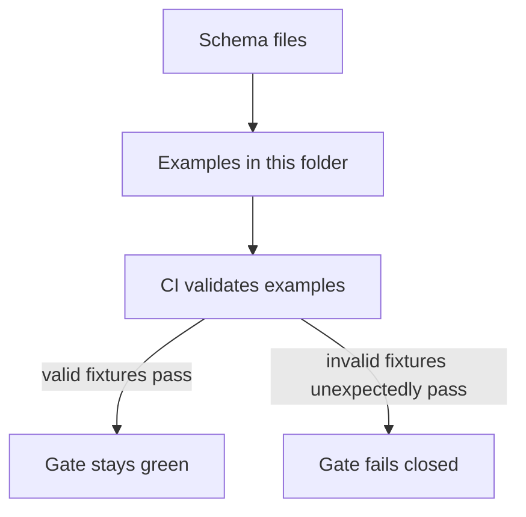

<!-- [KFM_META_BLOCK_V2]
doc_id: kfm://doc/79f8c0b5-0cd6-4e78-a326-73f9b9942c96
title: Schema Examples (fixtures)
type: standard
version: v1
status: draft
owners: KFM Platform (TODO)
created: 2026-02-24
updated: 2026-02-24
policy_label: public
related:
  - ../README.md
  - ../*.schema.json
  - ../../policy/
tags: [kfm, schemas, examples, fixtures]
notes:
  - This folder contains small, synthetic fixtures used to validate JSON Schemas and fail-closed policy gates in CI.
  - Update owners/policy_label/related paths once the repo wiring is confirmed.
[/KFM_META_BLOCK_V2] -->

# data/registry/schemas/examples
**Purpose:** Tiny **valid + invalid** example payloads (“fixtures”) for schema and policy validation in CI.


-lightgrey)

> [!NOTE]
> These files are **not production data**. Keep them small, synthetic, and safe to share.

---

## Quick links
- [What belongs here](#what-belongs-here)
- [Directory layout](#directory-layout)
- [How CI should use these](#how-ci-should-use-these)
- [Naming conventions](#naming-conventions)
- [Adding a new example](#adding-a-new-example)
- [Troubleshooting](#troubleshooting)

---

## What belongs here

### ✅ Include
- Minimal **valid** examples per schema version (the smallest payload that still passes).
- Targeted **invalid** examples that each fail for one reason (missing required field, bad enum, extra property, bad format, etc.).
- “Edge” examples for invariants (timestamps ordering, digest formats, `additionalProperties: false`, etc.).

### ❌ Don’t include
- Real secrets, credentials, API keys, or internal URLs.
- PII or sensitive location details (use synthetic/coarse geometry where needed).
- Large payloads (keep diffs readable).

---

## Directory layout

This folder is intentionally boring. A common (recommended) shape:

```text
data/registry/schemas/examples/                      # Schema examples (golden inputs for CI validation)
├─ run_receipt/
│  └─ v1/
│     ├─ valid.min.json                             # Minimal valid run_receipt v1 (must pass)
│     ├─ invalid.missing_spec_hash.json             # Invalid: missing spec_hash (must fail)
│     └─ invalid.bad_subject_digest.json            # Invalid: malformed/incorrect subject digest (must fail)
│
├─ run_manifest/
│  └─ v1/
│     ├─ valid.min.json                             # Minimal valid run_manifest v1 (must pass)
│     └─ invalid.missing_rights.json                # Invalid: missing rights/license terms (must fail)
│
└─ watcher/
   └─ v1/
      ├─ valid.min.json                             # Minimal valid watcher v1 (must pass)
      └─ invalid.missing_signature_ref.json         # Invalid: missing signature reference (must fail)
```

> [!TIP]
> If your repo keeps schemas somewhere else, keep **examples next to the schema** (or mirror the schema paths) so contributors can discover them quickly.

---

## How CI should use these



Minimum Definition of Done for this folder:
- CI validates **all** `valid.*.json` fixtures against the matching schema.
- CI asserts **all** `invalid.*.json` fixtures **fail** validation (negative tests).
- Schema validation is a **required** status check on `main`.

---

## Naming conventions

| Type | Pattern | Notes |
|------|---------|-------|
| Valid | `valid.<short>.json` | Prefer `valid.min.json` for the smallest passing payload |
| Invalid | `invalid.<reason>.json` | One failure reason per file (keeps tests precise) |
| Versioned folder | `.../<schema_name>/v<major>/` | Keeps breaking changes from clobbering older fixtures |

---

## Recommended fixture targets (KFM canonical contracts)

If your repo includes the “canonical contracts” from the KFM integration kit, prioritize fixtures for:
- **Run Receipt** (per-run receipt; hashable inputs/outputs/checks)
- **Run Manifest** (promotion-oriented rollup)
- **Watchers Registry** (signed allow-list)

> [!WARNING]
> Keep these fixtures *minimal*—they are meant to enforce invariants like:
> - `spec_hash` present and derived from canonicalized inputs
> - `subject` is a digest (not a tag)
> - `checks` interpreted fail-closed
> - RFC3339 timestamps that bound the run

---

## Adding a new example

1. Pick the schema + version folder (create it if missing).
2. Add `valid.min.json`.
3. Add at least one `invalid.<reason>.json`.
4. Run the schema validation locally (or in CI) and confirm:
   - valid passes
   - invalid fails
5. Keep the payload tiny and synthetic.

---

## Troubleshooting

- **“Valid fixture fails”**: schema changed; update the fixture *or* bump schema version.
- **“Invalid fixture passes”**: you likely loosened constraints; add/restore `required`, formats, enums, or `additionalProperties: false`.
- **“Flaky tests”**: remove timestamps that depend on “now”; use fixed RFC3339 values.

---

<details>
<summary>Local validation ideas (adapt to your tooling)</summary>

- Node (Ajv): validate JSON examples against JSON Schema.
- Python (`jsonschema`): same concept, different runtime.
- CI (Conftest/OPA): use for **policy** checks in addition to schema checks.

</details>
