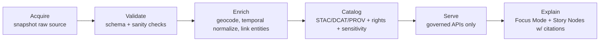

# External Schema Registry


> **Purpose:** Store **versioned, machine-validated schemas** that describe **upstream/external datasets** *as they are ingested* (or as they are represented immediately after extraction), so KFM can validate inputs, map them deterministically, and enforce governance gates before promotion.

---

## What “external” means here

External schemas describe **the shape of data as provided by a source** (agency portal, partner feed, digitized archive export, sensor API payloads, etc.). They are **not** the KFM canonical/internal models.

**External schema responsibilities**
- Define *what we expect* from an upstream dataset (fields, types, required vs optional).
- Support **fail-closed validation** at ingest and at Raw→Work and/or Work→Processed promotions.
- Make upstream change detection explicit: if the source changes shape, validation breaks *loudly* and requires a new schema version.

**Non-goals**
- This folder is **not** where processed/canonical schemas live.
- This folder is **not** a place to “fix data” by weakening schemas. If upstream is messy, handle it in *extract/normalize code* and keep schema intent strict.

---

## How this fits the KFM “Truth Path”

Schemas in this directory primarily serve the **Acquire → Validate** portion of the pipeline.



> ✅ **Governance principle:** If it can’t be validated and traced, it can’t be promoted, served, or narrated.

---

## Directory layout

This directory is organized so that:
- **each upstream dataset has its own folder**, and
- **schema versions are immutable**.

Recommended layout:

```text
data/registry/schemas/external/
  README.md                      # you are here

  <source_slug>/
    <dataset_slug>/
      vYYYY-MM-DD/               # or semver, but pick one convention and stick to it
        schema.json              # JSON Schema (preferred)
        manifest.yaml            # required: governance + provenance metadata (see below)
        examples/
          valid.sample.json      # minimum 1 valid example
          invalid.sample.json    # optional but recommended
        notes.md                 # optional: extraction quirks, field semantics, edge cases
```

### Slug rules (recommended)
- `source_slug`: lowercase, digits, hyphen/underscore only (e.g., `usgs`, `noaa`, `kansas-open-data`, `kdot`)
- `dataset_slug`: concise and stable (e.g., `nwis_dv`, `climate_normals`, `bridge_inventory`)

---

## Schema standards and conventions

### Preferred schema language
- **JSON Schema** (recommended: `draft/2020-12`) for record-level validation.

### General schema conventions
- Prefer `additionalProperties: false` unless you have a strong reason.
- Be strict on type and format:
  - timestamps: ISO 8601 strings
  - IDs: patterns, not “any string”
  - enumerations: use `enum` when known
- Treat “unknown” fields carefully:
  - Don’t accept arbitrary objects unless the upstream truly varies and you have a controlled interpretation strategy.

### Geometry and spatial fields
External sources vary widely:
- Some provide GeoJSON
- Some provide WKT/WKB
- Some provide lat/lon fields
- Some provide files (shapefile, GeoPackage, GeoTIFF)

**Rule of thumb:** your external schema should validate the **record representation at the point your pipeline first turns the input into structured records** (e.g., a CSV row normalized into JSON fields, or a GeoJSON feature).

---

## Required: `manifest.yaml`

Every external schema version must include a `manifest.yaml` so governance checks can run without guessing.

Minimum recommended fields:

| Field | Required | Example | Notes |
|---|---:|---|---|
| `schema_id` | ✅ | `external/usgs/nwis_dv/v2026-01-06` | Stable internal identifier |
| `source_name` | ✅ | `USGS` | Human-readable |
| `source_slug` | ✅ | `usgs` | Folder name must match |
| `dataset_name` | ✅ | `NWIS Daily Values` | Human-readable |
| `dataset_slug` | ✅ | `nwis_dv` | Folder name must match |
| `version` | ✅ | `v2026-01-06` | Must match folder |
| `upstream_reference` | ✅ | URL or citation string | If no URL, cite doc/partner ref |
| `license` | ✅ | SPDX id or clear label | Must be machine-checkable where possible |
| `update_cadence` | ✅ | `daily`, `monthly`, `ad-hoc` | For freshness + monitoring |
| `data_format` | ✅ | `json`, `csv`, `geojson`, `gdb`, `tiff` | Upstream form |
| `record_model` | ✅ | `row`, `feature`, `timeseries_point` | Used by validators |
| `sensitivity` | ✅ | `public`, `restricted`, `location-redacted` | Drives policy gates |
| `contains_pii` | ✅ | `false` | If true, require stricter handling |
| `contact` | ⚠️ | name/email/role | Prefer role accounts |

> 🔒 **Governance note:** if `license` or `sensitivity` is missing, the dataset should not pass promotion gates (deny-by-default).

Example `manifest.yaml`:

```yaml
schema_id: external/usgs/nwis_dv/v2026-01-06
source_name: USGS
source_slug: usgs
dataset_name: NWIS Daily Values
dataset_slug: nwis_dv
version: v2026-01-06
upstream_reference: "https://example.org/source-page-or-citation"
license: "LicenseRef-USGS-PublicDomain"   # use SPDX if available
update_cadence: daily
data_format: json
record_model: timeseries_point
sensitivity: public
contains_pii: false
contact:
  owner: "data-stewards@kfm.example"
notes:
  - "Record timestamps are UTC in upstream payload."
  - "Site identifiers are stable keys."
```

---

## Versioning rules

### Immutability
- Treat each `v*` folder as **append-only / immutable**.
- If upstream changes shape:
  - create a **new version folder**
  - update pipeline mapping/transform as needed
  - keep the old version for provenance and reproducibility

### Breaking vs non-breaking changes
Examples that should trigger a new version:
- Required field added/removed
- Type change (`string` → `number`)
- Semantic changes that alter interpretation
- Geometry encoding changes

---

## Validation & CI gates

At minimum, CI should verify:

### Schema hygiene
- [ ] schema parses
- [ ] `$schema` draft declared
- [ ] `$id` present and unique (recommended)
- [ ] `title` and `description` present
- [ ] `additionalProperties` explicitly set (recommended)
- [ ] no “always-true” schema patterns that defeat validation

### Example validation
- [ ] at least **one valid example** validates against `schema.json`
- [ ] (recommended) at least **one invalid example** fails validation

### Governance requirements
- [ ] `manifest.yaml` exists
- [ ] `license` is present and non-empty
- [ ] `sensitivity` is present and within allowed enum
- [ ] if `contains_pii: true`, ensure additional safeguards are enabled (policy gate)

> ✅ **Best practice:** make the gates run locally too (pre-commit) so contributors don’t discover failures only in CI.

---

## Adding a new external schema

### Step-by-step
1. Create folder structure under `external/<source_slug>/<dataset_slug>/vYYYY-MM-DD/`.
2. Add `schema.json` (strict).
3. Add `manifest.yaml` (complete).
4. Add `examples/valid.sample.json` (minimum).
5. Add `notes.md` if upstream has quirks or field semantics matter.
6. Ensure pipeline ingestion references this schema version explicitly (don’t “float” to latest without a governance rule).

### Definition of Done
- [ ] Schema validates and is strict enough to catch upstream drift
- [ ] Examples pass/fail as expected
- [ ] Manifest includes license + sensitivity + cadence
- [ ] CI gates green
- [ ] Mapping/transform code updated (if applicable)
- [ ] Promotion policies remain deny-by-default

---

## Sensitivity & safe handling

External schemas can represent data that should **never** be published at full fidelity (e.g., culturally restricted sites, endangered species locations, private/PII, etc.).

**Guidelines**
- Mark sensitivity in `manifest.yaml` so policy engines can enforce:
  - redaction / aggregation
  - access controls
  - review requirements
- Prefer storing sensitive location handling rules as **machine-checkable fields** (not prose-only).

---

## Glossary

- **External schema:** A contract describing *upstream input shape*.
- **Canonical schema (internal):** A contract describing KFM’s normalized/processed representation.
- **Promotion gate:** Automated validation and policy checks that must pass before data moves to a higher-trust zone.
- **Fail-closed:** Missing evidence/labels/validation ⇒ deny promotion by default.

---

## FAQ

### “Why not just accept whatever fields the source gives us?”
Because **governed systems must detect drift**. Strict schemas make upstream changes visible and auditable.

### “Can I relax the schema to get the pipeline green?”
Prefer fixing extraction/normalization and **creating a new schema version** if upstream truly changed. Relaxing schemas usually hides drift and breaks reproducibility.

### “Where do mappings to KFM canonical models live?”
Typically in pipeline code and/or mapping manifests adjacent to the pipeline. If you store mapping manifests here, keep them versioned alongside schema versions.