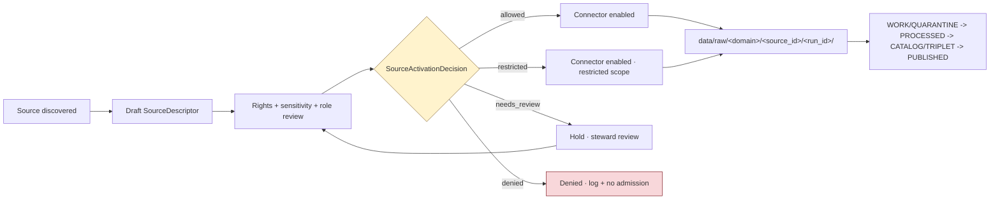

# Source Registry — `data/registry/sources/`

Admission and authority-control surface for every source KFM treats as evidence. Not a bibliography; a governed registry.

[](../../../docs/governance/directory-rules.md#91-data--the-lifecycle-invariant)
[](#status)
[](#governance-boundary)
[](../../../schemas/contracts/v1/sources/)
[](../../../docs/governance/directory-rules.md)
[](#adrs)
<!-- TODO: replace placeholder badge targets with real CI/license/build endpoints once verified. -->

> **Status: active (PROPOSED implementation bundle) · Owners: `<TODO: CODEOWNERS>` · Last reviewed: `<YYYY-MM-DD>` (placeholder)**

---

## On this page

- [Purpose](#purpose)
- [Authority level](#authority-level)
- [Status](#status)
- [What belongs here](#what-belongs-here)
- [What does NOT belong here](#what-does-not-belong-here)
- [Inputs](#inputs)
- [Outputs](#outputs)
- [Validation](#validation)
- [Review burden](#review-burden)
- [Directory layout](#directory-layout)
- [Admission flow](#admission-flow)
- [SourceDescriptor field reference](#sourcedescriptor-field-reference)
- [Source-role vocabulary](#source-role-vocabulary)
- [Directory Rules basis](#directory-rules-basis)
- [Validate locally](#validate-locally)
- [Governance boundary](#governance-boundary)
- [Open questions and drift](#open-questions-and-drift)
- [Related folders](#related-folders)
- [ADRs](#adrs)

---

## Purpose

`data/registry/sources/` records **how each admitted source may be treated** — its identity, role, rights posture, sensitivity, cadence, steward, authority scope, attribution requirements, and public-release class — so source material can be admitted, quarantined, restricted, or denied before it shapes public claims. The registry is the pre-RAW admission membrane of the lifecycle: nothing should enter `data/raw/` without a resolvable `SourceDescriptor` here.

This is **CONFIRMED doctrine** in the KFM corpus: the source registry is an admission and authority-control surface, not a bibliography. (See *Unified Implementation Architecture Build Manual* §3.6 and *Domains Atlas v1.1* §24.1.)

## Authority level

**Canonical** (rule-level). The placement of `data/registry/sources/` under `data/registry/` is CONFIRMED by Directory Rules §9.1. The **presence** of the specific files described below in any given checkout is **PROPOSED** until verified against mounted-repo evidence per Directory Rules §2.1.

## Status

| Item | Status |
|---|---|
| Folder placement rule (`data/registry/sources/`) | **CONFIRMED** (Directory Rules §9.1, §4 Step 3) |
| SourceDescriptor as the anchoring record | **CONFIRMED** doctrine (Atlas v1.1 §24.2.1, Unified Manual §3.6) |
| Schema home `schemas/contracts/v1/sources/source_descriptor.schema.json` | **PROPOSED** per ADR-0001 default; specific filename **NEEDS VERIFICATION** |
| `source_type_registry.v1.yaml` companion vocabulary | **PROPOSED** implementation artifact (this bundle) |
| Validator at `tools/validators/sources/validate_source_descriptor.py` | **PROPOSED** filename; canonical orchestrator path is `tools/validators/` per Directory Rules §7.5 |
| Pytest smoke at `tests/sources/test_source_descriptor_schema.py` | **PROPOSED** path; **NEEDS VERIFICATION** against mounted test layout |
| Fixtures at `tests/fixtures/sources/source_descriptor/` | **PROPOSED** path; valid/invalid no-network coverage |
| Source-role enum values | **PROPOSED** vocabulary v1 (ADR-S-04 backlog candidate) |

> [!IMPORTANT]
> This README documents a bundle generated **outside a mounted KFM repository**. Every concrete path or filename below is **PROPOSED** until current repo evidence (or an accepted ADR) verifies it. The folder-placement and doctrinal rules — what this directory is for, what belongs here, what does not — are CONFIRMED independent of any specific checkout.

## What belongs here

Files that record **how a source may be treated** as evidence inside KFM:

- **SourceDescriptor instances** — one per admitted source, recording identity, role, authority, rights, sensitivity, cadence, steward, attribution, retrieval window, public-release class, and the cryptographic hash that pins the admitted payload or reference.
- **Source-type vocabularies and enumerations** — e.g., `source_type_registry.v1.yaml`, which encodes the source-role taxonomy and any controlled sub-vocabularies the descriptors reference.
- **Registry indexes and crosswalks** — machine-readable maps from KFM source IDs to upstream identifiers (USGS, NOAA, KDWP, KSHS, KHRI, KBS, GBIF, iNaturalist, NatureServe, USFWS, etc.), versioned and superseded by lineage rules.
- **Supersession entries** — when a descriptor is replaced, both the old and new entries remain queryable with a `superseded_by` link, per Atlas v1.1 §24.8.2.
- **Per-domain subfolders** — `data/registry/sources/<domain>/` is permitted by Directory Rules §4 Step 3 when a domain needs its own registry segment (hydrology, fauna, archaeology, etc.).

## What does NOT belong here

The "do not put X here" list is as load-bearing as the inclusion list.

- ❌ **Raw or transformed source data.** Those belong under `data/raw/<domain>/<source_id>/<run_id>/` (or `data/quarantine/...`), emitted by `connectors/<source>/`. A descriptor points at admitted data; it is not the data.
- ❌ **Machine-shape schemas** for the SourceDescriptor object. Schemas live under `schemas/contracts/v1/sources/` per ADR-0001. This directory holds **instances and vocabularies**, not the schema definitions themselves.
- ❌ **Policy decisions** (allow/deny/restrict/abstain). Those live under `policy/sensitivity/`, `policy/rights/`, `policy/runtime/`, and `policy/release/`. A descriptor states facts about a source; a `PolicyDecision` records what KFM will do about them.
- ❌ **`SourceActivationDecision` records.** Activation is a governance gate, not source identity. Activation receipts belong with the receipt corpus (PROPOSED home: `data/receipts/` per Directory Rules §9.1).
- ❌ **EvidenceBundles, ReleaseManifests, CorrectionNotices, RollbackCards.** These belong under `data/proofs/`, `release/manifests/`, `release/correction_notices/`, and `release/rollback_cards/`.
- ❌ **Bibliographic prose.** Reading lists, narrative source notes, citation essays belong under `docs/` (e.g., `docs/sources/` or a dossier appendix).
- ❌ **Secrets, credentials, API keys.** Never. Credentials belong in the secret manager referenced by `configs/` and `infra/`.
- ❌ **Mutable, in-place edits to existing descriptors.** Corrections produce a **new descriptor + CorrectionNotice**, per Atlas v1.1 §24.1.3.

## Inputs

The registry is fed by deliberate, reviewable acts — never by silent automation:

- **Steward-authored descriptors** added via PR with rights review.
- **Connector preflight output** that proposes a candidate descriptor for review (a `SourceIntakeRecord` from a watcher does **not** publish a descriptor; it opens one for review).
- **Migration entries** from supersession of an earlier descriptor.
- **ADR-recorded vocabulary updates** when the source-role enum or sensitivity tier scheme changes (ADR-S-04, ADR-S-05 backlog candidates per Atlas v1.1 §24.12).

## Outputs

Downstream surfaces that read this registry (PROPOSED bindings; verify against mounted repo):

- `connectors/<source>/` — uses the descriptor to scope fetch, identity, rights compliance, and rate-limit posture.
- `pipelines/ingest/` — refuses to admit material into `data/raw/` without a matching, current descriptor.
- `policy/sensitivity/`, `policy/rights/` — resolves descriptor fields into allow/deny/restrict/abstain at runtime.
- `packages/source-registry/` — the canonical reader library (PROPOSED, per Directory Rules §7.2).
- `apps/governed-api/` — surfaces source identity and rights posture in `RuntimeResponseEnvelope` citations.
- `apps/review-console/` — steward UI for review, supersession, and rights re-evaluation.

## Validation

How this folder is checked:

| Check | Where | Status |
|---|---|---|
| Schema conformance of every `SourceDescriptor` instance | `tools/validators/sources/validate_source_descriptor.py` against `schemas/contracts/v1/sources/source_descriptor.schema.json` | **PROPOSED** |
| Source-role enum membership | Validator + `source_type_registry.v1.yaml` | **PROPOSED** |
| No-network valid/invalid fixtures | `tests/fixtures/sources/source_descriptor/{valid,invalid}/*.json` | **PROPOSED** |
| Smoke test | `pytest tests/sources/test_source_descriptor_schema.py` | **PROPOSED** |
| Repo-wide orchestrator entry | `tools/validators/validate_all.py` (per Directory Rules §7.5.a) | **PROPOSED** orchestrator; **NEEDS VERIFICATION** that it discovers this validator |
| Required-field presence per role (e.g., `role_authority` when role is `regulatory`/`modeled`/`aggregate`) | Validator rules driven by `source_type_registry.v1.yaml` | **PROPOSED** |
| Supersession lineage closure | Cross-check `superseded_by` references resolve | **PROPOSED** |

Invalid fixtures are **intentionally negative coverage** and must continue to fail.

## Review burden

- **Rights and licensing changes** — require rights-steward review.
- **Sensitivity tier changes** — require sensitivity steward; deny-by-default lanes (archaeology, fauna, flora, infrastructure, people/DNA, 3D) per Atlas v1.0 §20.5.
- **Source-role re-tagging** — require ADR-S-04-class review when the enum is touched; instance-level corrections produce a new descriptor + `CorrectionNotice`.
- **Cross-domain joins implied by a descriptor** — flag to cross-lane reviewer (ADR-S-14 backlog candidate).
- **CODEOWNERS reference** — `<TODO: link to .github/CODEOWNERS entry for data/registry/sources/>`.

---

## Directory layout

The tree below is **PROPOSED** until mounted-repo evidence confirms it. Per-domain subfolders are permitted by Directory Rules §4 Step 3 (`data/registry/sources/<domain>/`).

```text
data/registry/sources/
├── README.md                            # this file
├── source_type_registry.v1.yaml         # PROPOSED source-role vocabulary (v1)
├── crosswalks/                          # PROPOSED: KFM ↔ upstream-ID maps
│   └── README.md
├── superseded/                          # PROPOSED: retained replaced descriptors
│   └── README.md
└── <domain>/                            # e.g., hydrology, fauna, archaeology, ...
    ├── README.md                        # per-domain registry README
    └── <source_id>.descriptor.yaml      # PROPOSED instance shape (or .json)
```

**Sibling under `data/registry/`** (per Directory Rules §9.1 inventory): `data/registry/source_descriptors/`. The relationship between `sources/` (this folder) and `source_descriptors/` is **NEEDS VERIFICATION** — see Open questions.

## Admission flow

Source admission is **governed**, not casual. The diagram is doctrinal (Unified Manual §3.6, Atlas v1.1 §24.1, §24.6.1) and PROPOSED in its specific routing names.



> [!NOTE]
> Connectors and watchers remain **inactive** until a current `SourceDescriptor`, an explicit `SourceActivationDecision`, fixtures, validators, and policy gates all exist. This is the **watcher-as-non-publisher** invariant in operational form (Directory Rules §3, §13.5).

---

## SourceDescriptor field reference

PROPOSED descriptor surface — illustrative, not authoritative — drawn from *Atlas v1.1* §24.1.3 and §24.2.1. The canonical shape is the JSON Schema at `schemas/contracts/v1/sources/source_descriptor.schema.json`; this table summarizes intent only.

| Field | Type / vocabulary | Required? | Notes |
|---|---|---|---|
| `source_id` | stable string (deterministic) | MUST | Identity for the source family/instance. |
| `source_role` | enum: `observed` \| `regulatory` \| `modeled` \| `aggregate` \| `administrative` \| `candidate` \| `synthetic` | MUST | Set at admission. **Never edited in place**; corrections produce a new descriptor + `CorrectionNotice`. |
| `role_authority` | string (issuing body / model identity / steward) | MUST when role ∈ {`regulatory`, `modeled`, `aggregate`} | Disambiguates the authoring authority for downstream cite text. |
| `role_aggregation_unit` | geometry-scope token (county, HUC, tract, year, decade) | MUST when `source_role = aggregate` | Prevents geometry-scope drift on join. |
| `role_model_run_ref` | `EvidenceRef` → `ModelRunReceipt` | MUST when `source_role = modeled` | Pins inputs, parameters, and version. |
| `role_synthetic_basis` | `{ method, inputs, reality_boundary_note_ref }` | MUST when `source_role = synthetic` | Records what is and is not real. |
| `role_candidate_disposition` | enum: `pending` \| `merged` \| `rejected` \| `quarantined` | MUST when `source_role = candidate` | PUBLISHED edge forbidden until merged. |
| `rights` | structured (license, holder, terms, expiration) | MUST | Drives `policy/rights/` decisions. |
| `sensitivity` | tier (T0..T4 per Atlas §24.1 / §20.5) | MUST | Drives deny-by-default lanes. |
| `cadence` | duration / cron / event | MUST | Source-freshness expectation; expiry triggers stale markers (Atlas §24.8.1). |
| `steward` | string / role reference | MUST | Owns review burden. |
| `attribution` | string (citation block) | MUST | Required for public surfaces. |
| `access_method` | structured (API/file/scrape with constraints) | MUST | Drives connector behavior; scrape requires budget/identity controls. |
| `ingest_hash` | content digest (BLAKE3 / SHA-256) | MUST | Pins the admitted payload or reference. |
| `public_release_class` | enum (public / semi-public / restricted / internal) | MUST | Authority for publication posture. |
| `superseded_by` | source id reference (nullable) | optional | Supersession lineage per Atlas §24.8.2. |

> [!CAUTION]
> Names above are **PROPOSED** shape, not asserted file content. The authoritative resolution is the JSON Schema in `schemas/contracts/v1/sources/`. ADR-S-04 (source-role vocabulary v1) is the proper venue for evolving the enum.

## Source-role vocabulary

The seven PROPOSED source roles are deliberately non-interchangeable. Collapsing them is a **doctrine-significant anti-pattern** (Atlas v1.1 §24.1.2).

| Role | Used for | Anti-pattern it prevents |
|---|---|---|
| `observed` | Direct sensor / specimen / occurrence records. | Treating a model output as an observation. |
| `regulatory` | Legal-status, designation, or jurisdictional layers (e.g., NFHL, KDWP T&E lists). | Treating a regulatory layer as observed event evidence. |
| `modeled` | Outputs of a named model run with pinned inputs. | Treating a model field (AOD, hindcast) as observation. |
| `aggregate` | County/HUC/tract/decade roll-ups. | Citing an aggregate cell as per-place truth. |
| `administrative` | Compilations, indexes, gazetteers. | Citing a compilation as an observed event timeline. |
| `candidate` | Provisional records awaiting promotion. | Exposing a candidate on a public surface. |
| `synthetic` | Reconstructions, fills, AI-generated carriers. | Presenting synthetic content as observed reality. |

> [!WARNING]
> **Source role cannot be inferred from convenience.** A community-science occurrence source is not a legal-status authority; assessor rows are not title truth; regulatory flood layers are not observed inundation; operational warnings are not life-safety authority inside KFM; remote-sensing anomalies are candidates until reviewed. *(Unified Manual §3.6, CONFIRMED cross-domain rule.)*

---

## Directory Rules basis

The placement of files in this bundle, justified against Directory Rules:

| Artifact | Path | Rule basis |
|---|---|---|
| Source-type registry vocabulary | `data/registry/sources/source_type_registry.v1.yaml` | §9.1 (`data/registry/sources/` is canonical); §2.3 (source identity, rights, sensitivity live under `data/registry/`). YAML rather than JSON Schema because it is a vocabulary, not machine shape. |
| SourceDescriptor JSON Schema | `schemas/contracts/v1/sources/source_descriptor.schema.json` | §4 Step 1 ("defines an object's machine shape" → `schemas/`); §2.4 (3) + ADR-0001 (schema home is `schemas/contracts/v1/`). |
| Validator utility | `tools/validators/sources/validate_source_descriptor.py` | §7.5 (`tools/validators/`); orchestrator at `tools/validators/validate_all.py` per §7.5.a. *(Note: Directory Rules §7.5 shows the singular subfolder `tools/validators/source_descriptor/`. The plural `sources/` form in this bundle is **NEEDS VERIFICATION** — see Open questions.)* |
| Valid/invalid no-network fixtures | `tests/fixtures/sources/source_descriptor/{valid,invalid}/` | §6.6 (fixtures under `tests/fixtures/` are permitted; valid/invalid split is doctrinal). |
| Smoke test | `tests/sources/test_source_descriptor_schema.py` | §6.6 (`tests/`); domain segmentation per §4 Step 3. **NEEDS VERIFICATION** against existing `tests/` layout. |

> [!NOTE]
> Per Directory Rules §2.4 (5), **no parallel home** may be created for sources, registries, schemas, contracts, policy, releases, proofs, or receipts without an ADR. This README does not propose any new home; it documents the canonical one.

## Validate locally

```bash
# Schema conformance — single fixture
python tools/validators/sources/validate_source_descriptor.py \
  --schema schemas/contracts/v1/sources/source_descriptor.schema.json \
  tests/fixtures/sources/source_descriptor/valid/minimal.valid.json

# Smoke test — schema + fixtures + role-required-field rules
pytest tests/sources/test_source_descriptor_schema.py

# Repo-wide orchestrator (PROPOSED entry point; verify locally)
python tools/validators/validate_all.py
```

Invalid fixtures intentionally fail and should remain negative coverage. A green pytest run on this directory alone does **not** imply repo-wide enforceability — only the orchestrator + CI binding does.

> [!CAUTION]
> All commands above use **PROPOSED paths**. Confirm them against the mounted checkout, and run `tools/validators/validate_all.py` (per Directory Rules §7.5.a) before relying on this validator in CI.

---

## Governance boundary

A `SourceDescriptor` records **how a source may be treated**. It does not, by itself:

- ❌ **Make a source's claims true.** Truth is established by `EvidenceBundle` closure, not by descriptor existence.
- ❌ **Publish anything.** Publication requires `ReleaseManifest`, review state where required, correction path, and rollback target.
- ❌ **Decide allow/deny/restrict/abstain.** That is `PolicyDecision`, under `policy/`.
- ❌ **Replace** `EvidenceBundle`, `PolicyDecision`, `ReleaseManifest`, `PromotionDecision`, `ReviewRecord`, `CorrectionNotice`, or `RollbackCard`.
- ❌ **Activate a connector.** That is `SourceActivationDecision`, recorded with the receipt corpus.

The lifecycle invariant remains **RAW → WORK/QUARANTINE → PROCESSED → CATALOG/TRIPLET → PUBLISHED**, with promotion as a governed state transition — never a file move (Directory Rules §9.1; Unified Manual §3.2).

<details>
<summary><strong>Why a descriptor is not a publication ticket</strong> (expand)</summary>

A descriptor is the *admission contract*: it states what a source is, who is responsible for it, what it can be cited for, and under what terms. Even a fully validated descriptor leaves five gates downstream that can independently fail closed:

1. **Activation** — `SourceActivationDecision` must allow (or restrict) use.
2. **Normalization** — `TransformReceipt` and `ValidationReport` must pass.
3. **Catalog closure** — `EvidenceRef`s resolve into `EvidenceBundle`; `CatalogMatrix` digests close.
4. **Release** — `ReleaseManifest` records contents, rollback target, and review state.
5. **Runtime** — `PolicyDecision` returns ANSWER / ABSTAIN / DENY / ERROR per request context.

If any gate fails, the source is held, quarantined, or denied. The descriptor's truthfulness does not override the gates; the gates do not override the descriptor.

</details>

---

## Open questions and drift

Tracked alongside this README (PROPOSED home: `docs/registers/DRIFT_REGISTER.md`, `docs/registers/VERIFICATION_BACKLOG.md`).

- **NEEDS VERIFICATION** — Relationship between `data/registry/sources/` and the sibling `data/registry/source_descriptors/` shown in Directory Rules §9.1 (vocabulary + index vs. instance store, or duplicates?). Resolve by inspection or ADR.
- **NEEDS VERIFICATION** — Canonical validator subfolder name: `tools/validators/source_descriptor/` (singular, per Directory Rules §7.5 example) vs. `tools/validators/sources/` (plural, this bundle).
- **NEEDS VERIFICATION** — Whether `tools/validators/validate_all.py` already discovers `validate_source_descriptor.py`. Tied to OPEN-DR-03 in Directory Rules §18 (validator exit-code contract canonicalization).
- **ADR-S-04 (backlog)** — Canonical source-role vocabulary v1 and evolution rule (Atlas v1.1 §24.12).
- **ADR-S-05 (backlog)** — Sensitivity tier scheme (T0–T4) — adopt as canonical or revise.
- **ADR-S-12 (backlog)** — Connector cadence and quarantine recovery policy; consumed by `cadence` and stale-state markers (Atlas §24.8.1).
- **UNKNOWN** — Live-repo implementation maturity. This README documents a bundle generated outside a mounted KFM repo; treat all paths and filenames as PROPOSED until inspected.

---

## Related folders

| Folder | Relationship |
|---|---|
| `schemas/contracts/v1/sources/` | Owns the **machine shape** of `SourceDescriptor` (the schema). |
| `contracts/sources/` | Owns the **semantic meaning** of `Source` and `SourceDescriptor` (PROPOSED location per Directory Rules §4 Step 1). |
| `policy/rights/`, `policy/sensitivity/`, `policy/runtime/`, `policy/release/` | Consume descriptor fields to decide allow/deny/restrict/abstain. |
| `connectors/<source>/` | Source-specific fetcher; reads its descriptor for scope, identity, and rate-limit posture. |
| `data/raw/<domain>/<source_id>/<run_id>/` | First lifecycle phase; admitted only when a descriptor exists. |
| `data/receipts/` | Home for `SourceActivationDecision`, `TransformReceipt`, `ValidationReport`, `PolicyDecision`, `ReviewRecord`. |
| `data/proofs/` | `EvidenceBundle` closure; resolves `EvidenceRef`s pointing back at admitted sources. |
| `release/manifests/`, `release/correction_notices/`, `release/rollback_cards/` | Release decisions and the correction path. |
| `tools/validators/` | The validator orchestrator and per-object validators. |
| `tests/fixtures/sources/`, `tests/sources/` | Valid/invalid fixtures and smoke tests for this contract. |
| `docs/standards/PROV.md`, `docs/standards/ISO-19115.md` | External-standards crosswalks; consumed for `attribution` and lineage. |
| `docs/governance/directory-rules.md` | Placement law for everything in this folder. |

---

## ADRs

| ADR | Topic | Status (PROPOSED unless noted) |
|---|---|---|
| ADR-0001 | Schema home: `schemas/contracts/v1/...` is canonical. | Default per Directory Rules §2.4 (3). |
| ADR-S-04 | Source-role vocabulary v1 — canonical enum and evolution rule. | Backlog (Atlas v1.1 §24.12). |
| ADR-S-05 | Sensitivity tier scheme (T0–T4). | Backlog. |
| ADR-S-12 | Connector cadence and quarantine recovery policy. | Backlog. |
| ADR-S-13 | Drift register triage — how often, by whom, with what outcome. | Backlog. |
| `<TODO>` | Resolution of `data/registry/sources/` vs `data/registry/source_descriptors/` naming. | NEEDS VERIFICATION before ADR is written. |

---

<sub>Folder README contract per Directory Rules §15. KFM truth posture: **cite-or-abstain**. Placement law: Directory Rules §§2.1, 2.4, 4, 9.1. Lifecycle invariant: RAW → WORK/QUARANTINE → PROCESSED → CATALOG/TRIPLET → PUBLISHED.</sub>

**Last reviewed:** `<YYYY-MM-DD>` (placeholder — replace on next steward review)
**Version:** v1.1 (this README)
**[⬆ Back to top](#source-registry--dataregistrysources)**
