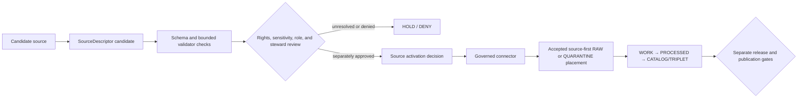

<!-- [KFM_META_BLOCK_V2]
doc_id: kfm://data/registry/sources/readme
title: Source Registry — data/registry/sources/
type: README; registry-parent-contract; canonical-lane; topology-boundary
version: v1.2
status: repository-grounded draft; canonical source-registry family; writer and record maturity unresolved
owners: NEEDS VERIFICATION — source, registry, rights, sensitivity, policy, validation, evidence, and release stewards
updated: 2026-08-29
policy_label: restricted-review; source-admission; no-direct-public-path
current_path: data/registry/sources/README.md
truth_posture: >
  CONFIRMED accepted source-registry placement, live parallel registry layouts,
  SourceDescriptor schema/validator/fixture workflow, and compatibility lanes /
  PROPOSED companion source-type vocabulary / UNKNOWN active registry writer,
  authoritative descriptor inventory, runtime consumers, source activation,
  and release effects / HOLD topology migration and exact physical RAW placement
evidence_snapshot:
  repository: bartytime4life/Kansas-Frontier-Matrix
  base_commit: 2b0ea9bbbc9d9a120ea94d92fb4617d96fe7d2a0
  prior_blob: 2821e9681273bff6b430920d0a45312c5643ba33
  directory_rules_blob: fd49a0b83e55cef52c1124281f093e263526898d
  registry_parent_blob: b327d22956f5454482a35dbf265f45b901c1f2a3
  raw_parent_blob: 560113c00e257725c0a440cb489510af44c13b12
  method: complete target read plus exact path, doctrine, schema, validator, fixture, workflow, and paired-layout inspection
related:
  - ../README.md
  - ../source_descriptors/README.md
  - ../../raw/README.md
  - ../../../docs/sources/ADMISSION_PROCESS.md
  - ../../../docs/sources/SOURCE_DESCRIPTOR_STANDARD.md
  - ../../../docs/doctrine/directory-rules.md
  - ../../../contracts/source/source_descriptor.md
  - ../../../schemas/contracts/v1/source/source_descriptor.schema.json
  - ../../../schemas/contracts/v1/sources/source_descriptor.schema.json
  - ../../../fixtures/contracts/v1/source/source_descriptor/README.md
  - ../../../tools/validators/sources/validate_source_descriptor.py
  - ../../../.github/workflows/source-descriptor-validate.yml
notes:
  - "This same-path correction replaces a repository-uninspected proposal-era bundle; it does not admit, activate, move, release, or publish a source."
  - "Directory Rules determine canonical identity and registry authority. This README records live drift but does not select a writer or migration."
[/KFM_META_BLOCK_V2] -->

<a id="top"></a>

# Source Registry — `data/registry/sources/`

`data/registry/sources/` is the canonical machine-registry family for source identities and descriptors. It records how a source may be treated; it does not store source payloads, prove claims, decide policy, activate connectors, or authorize release.

> [!IMPORTANT]
> Accepted Directory Rules require one registered `source_id` and one source-first capture identity. Current repository topology contains parallel registry views. Do not add a second authoritative descriptor or writer merely because a compatible path exists.

> [!WARNING]
> Rights, sensitivity, privacy, sovereignty, cultural restrictions, living-person information, genomic material, rare species, archaeology, infrastructure, private land, and harmful precision fail closed until the applicable evidence and review are resolved.

**Quick navigation:** [Purpose](#purpose) · [Authority](#authority-and-status) · [Topology](#current-topology) · [Contents](#what-belongs-here) · [Descriptors](#sourcedescriptor-implementation-map) · [Validation](#validate-the-bounded-implementation) · [Admission](#admission-boundary) · [Maintenance](#maintenance-and-review) · [Open items](#open-verification-register)

## Purpose

This lane owns source identity and descriptor records used to route source admission. A descriptor can preserve source role, rights, sensitivity, cadence, access, attribution, stewardship, review, release, correction, and supersession context.

It cannot establish that:

- a source is admitted or active;
- its claims are true or evidence-complete;
- a connector may retrieve it;
- a payload may leave quarantine or advance through the lifecycle;
- policy permits a requested use;
- a public client may read the registry or its internal data;
- review, merge, release, deployment, promotion, or publication occurred.

## Authority and status

Accepted [Directory Rules](../../../docs/doctrine/directory-rules.md) govern this path:

- `DIR-SOURCE-001`: capture identity is source-first; one capture may support several domains without duplicated RAW bytes.
- `DIR-SOURCE-002`: register one canonical `source_id`; domain assignments belong in descriptors and downstream projections.
- `DIR-SOURCE-003`: machine source identities and descriptors live under `data/registry/sources/`; human guidance lives under `docs/sources/`; connector code lives under `connectors/`.
- `DIR-SOURCE-004`: `data/registry/<domain>/sources/` may be a generated view, but not an independent writer, when the source-first registry is canonical.

| Surface | Current repository result |
|---|---|
| Canonical registry family | `data/registry/sources/` — **CONFIRMED by accepted rules** |
| Current child organization | Thirteen `data/registry/sources/<domain>/README.md` lanes are present |
| Parallel domain-first views | Matching `data/registry/<domain>/sources/README.md` lanes are also present |
| `data/registry/source_descriptors/` | Present and documented as compatibility/routing only |
| Companion vocabulary | `source_type_registry.v1.yaml` exists with `PROPOSED` status |
| Active writer and generated-view binding | `UNKNOWN` |
| Canonical descriptor-record inventory | `UNKNOWN`; this review did not recursively classify payloads |
| Exact physical RAW capture path | `HOLD`; the RAW parent explicitly leaves placement unresolved |
| Runtime admission and public readiness | `UNKNOWN` / deny by default |

## Current topology

The repository carries three source-registry shapes. Their presence does not grant equal authority.

```text
data/registry/sources/                    # canonical family by DIR-SOURCE-003
data/registry/<domain>/sources/           # potential generated/compatibility views
data/registry/source_descriptors/         # compatibility/routing lane
```

The 13 paired domain README lanes confirmed at the pinned base are:

| Domain | Canonical-family lane | Parallel domain-first lane |
|---|---|---|
| Agriculture | [`sources/agriculture/`](agriculture/README.md) | [`agriculture/sources/`](../agriculture/sources/README.md) |
| Atmosphere | [`sources/atmosphere/`](atmosphere/README.md) | [`atmosphere/sources/`](../atmosphere/sources/README.md) |
| Archaeology | [`sources/archaeology/`](archaeology/README.md) | [`archaeology/sources/`](../archaeology/sources/README.md) |
| Fauna | [`sources/fauna/`](fauna/README.md) | [`fauna/sources/`](../fauna/sources/README.md) |
| Flora | [`sources/flora/`](flora/README.md) | [`flora/sources/`](../flora/sources/README.md) |
| Geology | [`sources/geology/`](geology/README.md) | [`geology/sources/`](../geology/sources/README.md) |
| Habitat | [`sources/habitat/`](habitat/README.md) | [`habitat/sources/`](../habitat/sources/README.md) |
| Hazards | [`sources/hazards/`](hazards/README.md) | [`hazards/sources/`](../hazards/sources/README.md) |
| Hydrology | [`sources/hydrology/`](hydrology/README.md) | [`hydrology/sources/`](../hydrology/sources/README.md) |
| People/DNA/Land | [`sources/people-dna-land/`](people-dna-land/README.md) | [`people-dna-land/sources/`](../people-dna-land/sources/README.md) |
| Roads/Rail/Trade | [`sources/roads-rail-trade/`](roads-rail-trade/README.md) | [`roads-rail-trade/sources/`](../roads-rail-trade/sources/README.md) |
| Settlements/Infrastructure | [`sources/settlements-infrastructure/`](settlements-infrastructure/README.md) | [`settlements-infrastructure/sources/`](../settlements-infrastructure/sources/README.md) |
| Soil | [`sources/soil/`](soil/README.md) | [`soil/sources/`](../soil/sources/README.md) |

This table verifies README paths only. It does not prove that either side contains complete, equivalent, current, admitted, or runtime-consumed descriptor records.

### Write rule while topology is unresolved

Do not:

- create the same active source identity in both layouts;
- infer that a domain-first directory is an independent writer;
- treat `source_descriptors/` as a third descriptor store;
- silently migrate, mirror, or delete records;
- infer a canonical `data/registry/sources/<domain>/<source_id>` shape from the current tree.

A topology change needs an accepted path decision, writer/consumer inventory, identity crosswalk, generated-view contract, migration and readback plan, and rollback target.

## What belongs here

- canonical source identity and descriptor records after their record shape and writer are accepted;
- the proposed [`source_type_registry.v1.yaml`](source_type_registry.v1.yaml) companion vocabulary, clearly labeled as proposed;
- indexes, crosswalks, supersession pointers, or generated views that retain one canonical identity and declare their authority;
- README, migration, disposition, and rollback notes that explain the source-registry boundary.

### What does not belong here

| Do not place here | Correct home or action |
|---|---|
| RAW or transformed payloads | Governed lifecycle paths under `data/raw/`, `data/work/`, `data/quarantine/`, or `data/processed/` |
| Semantic meaning | [`contracts/source/`](../../../contracts/source/README.md) |
| Machine schema authority | [`schemas/contracts/v1/source/`](../../../schemas/contracts/v1/source/README.md) and declared compatibility aliases |
| Executable admission, rights, or sensitivity policy | `policy/source/`, `policy/rights/`, and `policy/sensitivity/` |
| Connector or watcher code | `connectors/` or another accepted implementation root |
| Fixtures and tests | `fixtures/` and `tests/` |
| Receipts, proofs, catalog/triplet records, or releases | Their distinct `data/` and `release/` authority lanes |
| Credentials, tokens, private endpoints, or unsafe details | Approved secret or restricted storage, never this registry |
| Direct public serving | Governed interfaces or released public-safe artifacts only |

## SourceDescriptor implementation map

Current `main` contains a bounded, mixed-maturity SourceDescriptor validation surface:

| Responsibility | Verified path | Bounded posture |
|---|---|---|
| Semantic meaning | [`contracts/source/source_descriptor.md`](../../../contracts/source/source_descriptor.md) | Draft semantic contract; not source truth or admission by itself |
| Rich implementation schema | [`schemas/contracts/v1/source/source_descriptor.schema.json`](../../../schemas/contracts/v1/source/source_descriptor.schema.json) | `PROPOSED` machine shape |
| Plural-path schema | [`schemas/contracts/v1/sources/source_descriptor.schema.json`](../../../schemas/contracts/v1/sources/source_descriptor.schema.json) | Compatibility alias that points to the rich singular schema |
| Generic validator entrypoint | [`tools/validators/validate_source_descriptor.py`](../../../tools/validators/validate_source_descriptor.py) | Implemented fixture validator |
| Declared plural validator | [`tools/validators/sources/validate_source_descriptor.py`](../../../tools/validators/sources/validate_source_descriptor.py) | Implemented compatibility entrypoint using the plural alias |
| Fixture family | [`fixtures/contracts/v1/source/source_descriptor/`](../../../fixtures/contracts/v1/source/source_descriptor/README.md) | Two valid fixtures and one expected-negative fixture |
| Entry-point convergence test | [`tests/validators/test_validate_source_descriptor_entrypoints.py`](../../../tests/validators/test_validate_source_descriptor_entrypoints.py) | Tests both entrypoints from repository and non-repository working directories |
| Shared schema test | [`tests/schemas/test_common_contracts.py`](../../../tests/schemas/test_common_contracts.py) | Includes SourceDescriptor schema/fixture coverage |
| Hosted workflow | [`.github/workflows/source-descriptor-validate.yml`](../../../.github/workflows/source-descriptor-validate.yml) | Fixture-only validation and fail-closed rights checks |

The schema, fixtures, validators, tests, and workflow prove only their declared shape and convergence assertions. They do not inventory registry records, bind an active writer, admit a source, resolve current rights or sensitivity, activate a connector, or approve release.

### Vocabulary boundary

[`source_type_registry.v1.yaml`](source_type_registry.v1.yaml) describes proposed `source_types` and `source_roles`. Do not copy its values into a second enum, call them accepted doctrine, or treat a matching value as evidence that a source is admitted. Vocabulary changes must remain compatible with the semantic contract, schema, fixtures, validators, policy consumers, and stored records.

## Validate the bounded implementation

From the repository root:

```bash
python tools/validators/validate_source_descriptor.py --fixtures
python tools/validators/sources/validate_source_descriptor.py --fixtures
python -m pytest -q \
  tests/validators/test_validate_source_descriptor_entrypoints.py \
  tests/schemas/test_common_contracts.py -k source_descriptor
```

The hosted profile is:

```text
.github/workflows/source-descriptor-validate.yml
```

Interpret results narrowly:

- a successful validator run means the committed fixture polarity matches the selected schema path;
- convergence means the two entrypoints agree for the tested cases;
- a workflow pass does not establish registry completeness, source availability, admissibility, runtime use, review, or release;
- an expected-negative fixture must fail for the documented reason; accepting it is a defect, not a pass;
- `KFM_NO_NETWORK=1` is declared by the workflow, but the workflow is not evidence of system-wide egress isolation beyond its executed profile.

## Admission boundary


```mermaid
flowchart LR
    D[Candidate source] --> SD[SourceDescriptor candidate]
    SD --> V[Schema and bounded validator checks]
    V --> R{Rights, sensitivity, role, and steward review}
    R -->|unresolved or denied| H[HOLD / DENY]
    R -->|separately approved| A[Source activation decision]
    A --> C[Governed connector]
    C --> Q[Accepted source-first RAW or QUARANTINE placement]
    Q --> L[WORK → PROCESSED → CATALOG/TRIPLET]
    L --> P{Separate release and publication gates}
```

The exact physical source-first RAW path is unresolved. Follow [`data/raw/README.md`](../../raw/README.md): do not substitute `data/raw/<domain>/<source_id>/<run_id>/` or another plausible path without an accepted placement and migration decision.

Watchers and connectors may propose or retrieve work only under their accepted controls. They are not publishers. Registry placement, validation, review, activation, lifecycle promotion, release, deployment, and publication remain distinct states.

## Inputs and outputs

### Inputs

- a stable source identity candidate;
- intended source role and claim limits;
- rights, access, attribution, sovereignty, sensitivity, and harmful-precision posture;
- cadence, retrieval, validity, correction, and supersession context;
- steward and review references where established;
- semantic-contract and schema version references.

Unknown or conflicting material remains held. Do not invent missing owners, permissions, dates, endpoints, or authority.

### Outputs

When separately accepted and written by a governed writer, this lane may provide source identity and routing records for connectors, policy, validation, evidence, catalog, correction, and release processes.

Public clients must use governed interfaces or released public-safe artifacts. They must not read this internal registry, a compatibility lane, a generated view, or a README as sovereign truth.

## Maintenance and review

When a descriptor, vocabulary, schema, validator, fixture, workflow, or registry view changes:

1. identify the canonical source identity and all affected views;
2. verify semantic contract, schema, fixture, and validator alignment;
3. preserve rights, sensitivity, source role, provenance, correction, and supersession information;
4. run the focused commands and record exact inputs and results;
5. inspect writer and consumer impact before moving or mirroring records;
6. provide migration, readback, and rollback evidence for any topology change;
7. keep review, merge, activation, lifecycle promotion, release, deployment, and publication claims separate.

Accountable ownership and required reviewers remain **NEEDS VERIFICATION**. CODEOWNERS routing, a pull request, or a successful check is not approval evidence.

## Open verification register

| Item | Status | Evidence required |
|---|---:|---|
| Canonical record shape beneath `data/registry/sources/` | `HOLD` | Accepted source-ID/path decision and existing-record inventory |
| Active writer and generated views | `UNKNOWN` | Writer configuration, deterministic generation contract, and single-writer proof |
| Parallel-layout equivalence and migration | `HOLD` | Identity crosswalk, byte/field comparison, consumers, migration, readback, rollback |
| `source_descriptors/` disposition | `NEEDS VERIFICATION` | Compatibility references, consumer search, and accepted retirement or retention plan |
| Complete descriptor inventory | `UNKNOWN` | Recursive tracked/external inventory with rights and sensitivity classification |
| Source activation binding | `UNKNOWN` | Accepted decision object, writer, receipts, negative cases, and runtime enforcement |
| Policy and runtime consumers | `UNKNOWN` | Exact code paths, configuration, tests, and deployed-state evidence |
| Correction and supersession propagation | `UNKNOWN` | Downstream invalidation, cache/index handling, notices, and rollback rehearsal |
| Exact physical RAW placement | `HOLD` | Accepted source-first path, writer interface, reference shape, deduplication, migration, and rollback |
| Public release | `DENY BY DEFAULT` | Governed evidence, policy, review, release, correction, rollback, and publication records |

## Evidence and lineage

This correction reconciles the complete prior README against current GitHub evidence. Connected Google Drive source-admission cards were used only as proposed lineage; their source-role, rights, sensitivity, and fail-closed ideas were retained only where current repository contracts and doctrine support them. Notion was used only as a coordination checkpoint and not as implementation authority.

No source was admitted, activated, retrieved, moved, promoted, released, deployed, or published by this documentation change.

[Back to top](#top)
