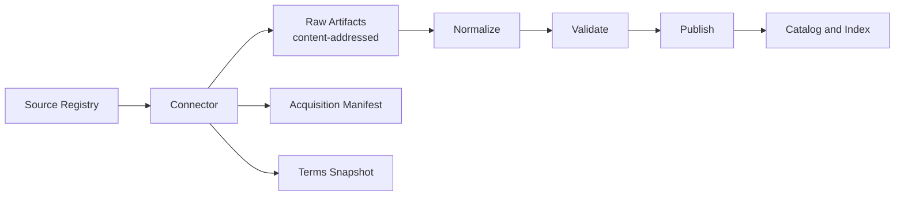

<!-- [KFM_META_BLOCK_V2]
doc_id: kfm://doc/2f8e2c1e-7b5a-4f2c-9a2d-3d6bf9b3f2fb
title: Source Connectors Registry
type: standard
version: v1
status: draft
owners: TODO
created: 2026-02-24
updated: 2026-02-24
policy_label: restricted
related:
  - TODO
tags: [kfm, registry, sources, connectors, ingest, provenance]
notes:
  - This README defines the expected contract and review gates for data-source connectors.
  - Do not commit secrets or sensitive access details to this directory.
[/KFM_META_BLOCK_V2] -->


# Source Connectors Registry
Declarative connector definitions that **discover + fetch** upstream sources, snapshot raw artifacts, and emit acquisition evidence so KFM ingestion stays **auditable, fail-closed, and reproducible**.

**Location:** `data/registry/sources/connectors/`

---

## Quick navigation
- [What this directory is](#what-this-directory-is)
- [What belongs here](#what-belongs-here)
- [What must not go here](#what-must-not-go-here)
- [How connectors fit in the promotion flow](#how-connectors-fit-in-the-promotion-flow)
- [Connector patterns](#connector-patterns)
- [Connector contract](#connector-contract)
- [Recommended directory layout](#recommended-directory-layout)
- [Add a new connector](#add-a-new-connector)
- [CI and promotion gates](#ci-and-promotion-gates)
- [Security and policy rules](#security-and-policy-rules)
- [Review checklist](#review-checklist)
- [Troubleshooting](#troubleshooting)

---

## What this directory is
This directory is the **source-of-truth registry** for how KFM connects to upstream data sources.

A connector definition should be **mostly declarative**:
- where the upstream lives (URL / endpoint),
- how we access it (auth method, pagination, headers, etc.),
- what we expect to fetch (file types, datasets, versioning strategy),
- what evidence we must produce (acquisition manifest, terms snapshot, checksums),
- and how the rest of the pipeline should treat the data (data class, sensitivity, license).

> NOTE  
> The connector’s job is to **acquire and evidence**. Normalization/validation/publish happens in pipeline code and must remain deterministic and reproducible.

---

## What belongs here
- Connector descriptors (YAML/JSON) that define upstream acquisition behavior.
- Minimal “evidence scaffolding” templates (e.g., acquisition manifest example, terms snapshot template).
- Optional connector-specific helpers **that do not embed secrets** (e.g., schema mappers, parsers for *scraped* HTML snapshots, sample request files with redacted tokens).
- Fixture examples used in CI (valid + invalid) to ensure fail-closed checks.

---

## What must not go here
- ❌ Secrets (API keys, tokens, cookies, credentials, private URLs, signed URLs).
- ❌ Raw datasets, raw API responses, or any content that belongs in **Raw storage**.
- ❌ Private partner data or restricted datasets (store in governed storage zones, not Git).
- ❌ One-off scripts that bypass governance (no “quick curl + upload” without receipts).

> WARNING  
> If a connector requires credentials, the connector descriptor MUST reference an *auth mechanism* and a *secret name*, not the secret value.

---

## How connectors fit in the promotion flow


---

## Connector patterns
Choose the simplest pattern that meets the source’s characteristics.

| Pattern | When to use | Raw artifact(s) | Extra notes |
|---|---|---|---|
| Bulk download connector | Static files (zip/CSV/shapefile dumps) | Archive file(s) + checksums | Ideal when publisher provides periodic snapshots |
| API connector | Paginated JSON/CSV APIs | Raw response pages + request metadata | Must record params, timestamps, and pagination strategy |
| Scrape connector | No official API exists | HTML snapshots + parsing scripts | Use sparingly; treat scraper as evidence-producing |
| Document ingest connector | PDFs/images/maps are first-class evidence | Document files + metadata | Keep citation targets stable (page-level if possible) |
| Streaming connector | Real-time feeds (sensors/mesonet) | Windowed snapshots | Define windowing and retention explicitly |

---

## Connector contract
Connectors MUST satisfy these evidence requirements:

1. **Record the upstream** (URL or endpoint)
2. **Record the request context** (timestamp + request parameters)
3. **Snapshot terms** when license/terms are unstable (store a “terms snapshot”)
4. **Emit an acquisition manifest** that ties together:
   - what was requested
   - what was received
   - checksums
   - timestamps
   - observed license/terms at acquisition time
   - the connector version/spec hash used

### Proposed minimal connector descriptor (example)
> This is a recommended starting point. Adjust to match your repo’s schema contracts once they exist.

```yaml
# connector.yaml (proposed)
id: kansas-xxxx-example
title: "Example Source"
owner: "TODO-team-or-role"
status: active # active|paused|deprecated
source_type: api # bulk|api|scrape|document|streaming
data_class: tabular # tabular|vector|raster|document|mixed

upstream:
  homepage: "https://example.org/datasets/foo"
  endpoint: "https://api.example.org/v1/foo"
  auth:
    method: api_key_header # none|api_key_header|oauth2|basic|signed_url|session_cookie
    secret_ref: "secrets://kfm/sources/example_api_key" # reference ONLY
    header_name: "X-API-Key"
  request_defaults:
    params:
      page_size: 1000
    headers:
      Accept: "application/json"
  pagination:
    mode: page_number # page_number|cursor|offset_limit|none
    param_page: page
    param_page_size: page_size

acquisition:
  schedule: "0 6 * * *" # cron (optional)
  output_raw_format: "json"
  snapshot_strategy: immutable # immutable|rolling
  store_terms_snapshot: true
  rate_limits:
    max_rps: 2
    retry:
      max_attempts: 5
      backoff: exponential

evidence:
  emit_manifest: true
  manifest_format: "acquisition_manifest.v1.json"
  checksums: ["sha256"]
  include_request_log: true

governance:
  license:
    spdx: "CC-BY-4.0" # or UNKNOWN (blocks promotion)
    terms_url: "https://example.org/terms"
  sensitivity:
    label: public # public|restricted|partner|pii|sensitive_location
    notes: "TODO"
```

### Acquisition manifest (example)
```json
{
  "spec_version": "acquisition_manifest.v1",
  "source_id": "kansas-xxxx-example",
  "connector_spec_hash": "sha256:…",
  "acquired_at": "2026-02-24T12:34:56Z",
  "requests": [
    {
      "endpoint": "https://api.example.org/v1/foo",
      "params": { "page": 1, "page_size": 1000 },
      "headers_redacted": ["X-API-Key"],
      "response": {
        "status": 200,
        "content_type": "application/json",
        "bytes": 123456,
        "sha256": "…"
      }
    }
  ],
  "artifacts": [
    {
      "role": "raw_response_page",
      "uri": "oci://…@sha256:…",
      "sha256": "…",
      "bytes": 123456
    }
  ],
  "terms_snapshot": {
    "captured": true,
    "uri": "oci://…@sha256:…",
    "sha256": "…"
  },
  "license_observed": {
    "spdx": "CC-BY-4.0",
    "source_terms_url": "https://example.org/terms"
  }
}
```

---

## Recommended directory layout
> This is a recommended convention to keep connector work reviewable and consistent.

```text
data/registry/sources/connectors/
  README.md

  _template/                          # optional scaffolding for new connectors
    connector.yaml
    acquisition_manifest.example.json
    terms_snapshot.template.md

  <source_id>/                         # one folder per source connector
    connector.yaml                     # declarative connector descriptor
    fixtures/                          # CI fixtures: valid/invalid examples
      valid/
      invalid/
    scripts/                           # optional helpers (no secrets)
      fetch.py
      parse.py
    notes/                             # optional human docs (risk notes, quirks)
      decisions.md
```

---

## Add a new connector
1. **Create a new folder**: `data/registry/sources/connectors/<source_id>/`
2. Add a `connector.yaml` (or your registry’s chosen schema format).
3. Add fixture examples (at least one valid and one invalid) so CI can prove it fails closed.
4. Ensure the connector can emit:
   - acquisition manifest
   - terms snapshot (if required)
   - checksums + request metadata
5. Run your local validations (schema + policy gates) before opening a PR.

> TIP  
> Treat “new connector” as a small, reversible increment: descriptor + fixtures + minimal tests first; implementation wiring second.

---

## CI and promotion gates
A connector change must fail closed unless it satisfies governance invariants.

Minimum expectations for connector registry PRs:
- [ ] Schema validation for connector descriptors
- [ ] Policy validation (deny-by-default) — blocks merge on missing license/sensitivity
- [ ] No-secret scan passes
- [ ] Link validation (upstream homepage/endpoint URLs syntactically valid)
- [ ] At least one fixture-driven test that proves an invalid connector spec is rejected

---

## Security and policy rules
- Use **scoped credentials per source** and rotate them (record rotation as an audit event).
- Store secrets in a secrets manager; connectors reference a secret **by name** only.
- Prefer “zero-trust ingest” principles: ephemeral auth, signed logs, content-addressed staging, and license gates.

> WARNING  
> If license/terms are unknown or unstable, promotion must be blocked until the connector captures a terms snapshot and provides license metadata.

---

## Review checklist
Use this checklist during PR review:

### Evidence + provenance
- [ ] Connector records endpoint/URL, timestamp, and request parameters
- [ ] Acquisition manifest emitted and ties to raw artifacts by digest/hash
- [ ] Terms snapshot captured when required
- [ ] Deterministic behavior: identical inputs → identical raw snapshot naming or content addressing

### Governance
- [ ] License captured at ingest (SPDX or explicit “UNKNOWN” that blocks promotion)
- [ ] Sensitivity label set (public/restricted/partner/pii/sensitive_location)
- [ ] No restricted location leakage in public outputs (if applicable)

### Operational safety
- [ ] No secrets committed
- [ ] Rate limiting and retries configured (or explicitly documented as unnecessary)
- [ ] “Paused/deprecated” states supported without deleting history

---

## Troubleshooting
**CI fails with “license missing”**  
Add license metadata (SPDX when possible). If truly unknown, mark it explicitly as `UNKNOWN` and ensure pipeline promotion is blocked until resolved.

**CI fails with “secret detected”**  
Remove the secret immediately, rotate it, and replace with a `secret_ref` pointer.

**Upstream terms changed**  
Update the connector to force-capture a new terms snapshot at the next acquisition and ensure the manifest links to it.

---

<a id="top"></a>
_Back to top_
