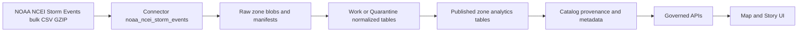

<!-- [KFM_META_BLOCK_V2]
doc_id: kfm://doc/a262c899-8d8c-41ef-af28-f38e2050bb69
title: NOAA NCEI Storm Events Connector
type: standard
version: v1
status: draft
owners: TBD
created: 2026-02-24
updated: 2026-02-24
policy_label: public
related:
  - TODO: data/registry/sources/noaa_ncei_storm_events.md
  - TODO: pipelines/ingest/noaa_ncei_storm_events/*
tags: [kfm, registry, source, connector, noaa, ncei, storm-events]
notes:
  - Uses NOAA NCEI Storm Events bulk CSV (.csv.gz) as primary ingestion surface.
  - Update detection driven by creation-date token in filenames (_cYYYYMMDD).
[/KFM_META_BLOCK_V2] -->

<a id="top"></a>

# NOAA NCEI Storm Events Connector
> Connector spec for ingesting the NOAA NCEI **Storm Events Database** (bulk CSV dumps) into KFM governed zones.


**Path:** `data/registry/sources/connectors/noaa_ncei_storm_events.md`

---

## Navigation
- [Truth labels](#truth-labels)
- [Overview](#overview)
- [Where this fits in the repo](#where-this-fits-in-the-repo)
- [KFM registry integration](#kfm-registry-integration)
- [Upstream source summary](#upstream-source-summary)
- [Distributions and join keys](#distributions-and-join-keys)
- [Access methods](#access-methods)
- [Connector contract](#connector-contract)
- [Update detection](#update-detection)
- [Governance and sensitivity](#governance-and-sensitivity)
- [Quality gates](#quality-gates)
- [Operational runbook](#operational-runbook)
- [Appendix](#appendix)

---

## Truth labels

KFM requires *cite-or-abstain*. This connector doc uses the following labels:

- **Confirmed**: supported by NOAA/NCEI upstream docs (linked in this file)
- **Proposed**: KFM recommendation (requires implementation + tests)
- **Unknown**: needs local verification (see “Minimum verification steps”)

---

## Overview

**Confirmed:** The NOAA NCEI **Storm Events Database** is the system of record used to create NOAA’s official *Storm Data* publication. It documents storms and other significant weather phenomena (with impacts such as injuries, fatalities, and damage estimates), plus selected unusual/rare events and certain records that are meteorologically significant.

**Confirmed:** NCEI publishes bulk CSV exports that include:  
1) an **event details** table, 2) **event locations**, and 3) **event fatalities**, linked by `event_id`.

**Proposed:** This connector standardizes reproducible ingestion by:
- Downloading bulk files **as-is** into the **Raw** zone
- Validating schema and checksums (fail closed)
- Normalizing to analytics-ready tables in Work/Published zones

---

## Where this fits in the repo

> Directory documentation contract (what belongs here)

```
data/
  registry/
    sources/
      connectors/
        noaa_ncei_storm_events.md   # this file (connector spec)
```

**Purpose of `data/registry/sources/connectors/`:**
- Declare *how to connect* to external sources (URLs, protocols, auth, cadence, schemas, and ingestion notes).
- Provide stable identifiers and a traceable “paper trail” for ingestion + governance.

**Acceptable inputs (in this file):**
- Source URLs, distribution formats, naming conventions
- Connector configuration defaults + parameter schema
- Data quality and sensitivity notes
- Minimum verification steps and DoD checklist

**Exclusions (do NOT put here):**
- Raw downloaded files (those belong in lifecycle zones: Raw/Work/Processed/Published)
- Secrets / credentials (store in secret manager; reference env var names only)
- Derived analytics or conclusions (those belong in published datasets / story nodes)

[Back to top](#top)

---

## KFM registry integration

**Confirmed (KFM pattern):** Each upstream source should have a registry entry defining ownership, cadence, license/constraints, fields/schema, URL(s), and pointers to pipeline/config artifacts.

**Proposed (this connector):**
- **Source registry entry (dataset-level)**: `data/registry/sources/noaa_ncei_storm_events.md` *(TODO if not present yet)*
- **Connector registry entry (this file)**: connection surface + file-format contract
- **Pipeline configs**: should reference `connector_id: noaa_ncei_storm_events`
- **Watcher**: monitors upstream directory listing and creates an ingest job when `_cYYYYMMDD` changes

[Back to top](#top)

---

## Upstream source summary

| Field | Value |
|---|---|
| Upstream owner | NOAA National Centers for Environmental Information (NCEI) |
| Upstream system | Storm Events Database (NWS-entered storm event records) |
| Coverage | United States (plus some associated areas/regions) |
| Time span (site-reported) | January 1950 to October 2025 |
| Update cadence | Monthly (with reporting/processing lag after end-of-month) |
| Primary distributions used here | Bulk CSV dumps (`.csv.gz`) via HTTP/FTP directory listing |
| Use constraints | Cite dataset when used as a source; NCEI/NWS caution that some information may be unverified (see metadata + FAQ) |

### Canonical upstream references
- Storm Events Database landing page: `https://www.ncei.noaa.gov/stormevents/`
- Bulk CSV directory (preferred for ingestion): `https://www.ncei.noaa.gov/pub/data/swdi/stormevents/csvfiles/`
- Bulk CSV naming/field docs (PDFs in same directory):
  - `Storm-Data-Bulk-csv-Format.pdf`
  - `Storm-Data-Export-Format.pdf`
- Dataset metadata (NCEI geoportal): `https://www.ncei.noaa.gov/metadata/geoportal/rest/metadata/item/gov.noaa.ncdc:C00510/html`
- FAQ (availability lag, accuracy notes): `https://www.ncei.noaa.gov/stormevents/faq.jsp`

[Back to top](#top)

---

## Distributions and join keys

**Confirmed:** NCEI provides **three related bulk files** linked by `event_id` (and by `episode_id` for event grouping).

| Stream | Filename pattern | Keys | Notes |
|---|---|---|---|
| Event details | `StormEvents_details-ftp_v1.0_dYYYY_cYYYYMMDD.csv.gz` | `event_id` | Core event record incl. times, type, state/county/zone, injuries/deaths, damage, narratives |
| Event locations | `StormEvents_locations-ftp_v1.0_dYYYY_cYYYYMMDD.csv.gz` | (`event_id`, `location_index`) *(Proposed PK)* | Multiple location points per event (lat/lon plus range/azimuth/location reference) |
| Event fatalities | `StormEvents_fatalities-ftp_v1.0_dYYYY_cYYYYMMDD.csv.gz` | `fatality_id` *(and `event_id` FK)* | Per-fatality attributes (type, date, age, sex, location code, etc.) |

**Confirmed:** the `v1.0` token reflects the internal CSV column structure/version. Treat changes to this token as schema changes.

### Diagram: trust-membrane ingest flow



[Back to top](#top)

---

## Access methods

### Preferred: bulk downloads

**HTTP directory listing (preferred):**
- `https://www.ncei.noaa.gov/pub/data/swdi/stormevents/csvfiles/`

**FTP (optional / legacy):**
- `ftp://ftp.ncei.noaa.gov/pub/data/swdi/stormevents/csvfiles/`

**Confirmed:** the directory contains `.csv.gz` files plus field-format PDFs and a README that describes the naming convention.

### Secondary: interactive search export
The Storm Events web UI supports search and export, with a separate export format description. Use this for *ad-hoc* exploration, not governed ingestion (unless you build an explicit export-based connector).

[Back to top](#top)

---

## Connector contract

### Connector ID
`noaa_ncei_storm_events`

### Authentication
None (public downloads).  
**Do not** embed credentials in code or docs.

### Parameters

```yaml
# KFM connector parameters (Proposed contract)
connector_id: noaa_ncei_storm_events

# Distribution surface
base_url: "https://www.ncei.noaa.gov/pub/data/swdi/stormevents/csvfiles/"
protocol: "https"

# What to fetch
tables: ["details", "locations", "fatalities"]
year_range:
  start: 1950
  end: 2025   # NOTE: treat as a moving target; update via watcher

# Optional downstream filters (apply AFTER raw ingest)
filters:
  state: null        # e.g., "KANSAS"
  event_type: null   # e.g., "Tornado"
```

### Output artifacts (required)

**Proposed (KFM requirement):** Each run MUST emit:
- **Raw blobs**: the exact `.csv.gz` files as downloaded (no modification)
- **Content hashes**: SHA-256 per blob
- **Fetch manifest**: remote filename, remote last-modified (if available), bytes, checksum, fetch timestamp, tool version
- **Promotion receipt**: what moved from Raw → Work/Quarantine → Published, with checks and outcomes

[Back to top](#top)

---

## Update detection

**Confirmed (upstream README):**
- The current year is updated regularly, and the `cYYYYMMDD` token changes when new data are available.
- Prior years may also receive updates/corrections, and the `cYYYYMMDD` token will change accordingly.

### Watcher strategy (Proposed)
1. **List** the remote directory index.
2. For each `(table, data_year)` pick the file with the **max creation date**.
3. Compare against the last ingested manifest.
4. Download only changed files; re-run normalization and dependent derived datasets as needed.

[Back to top](#top)

---

## Governance and sensitivity

### Policy label
`public` (upstream is publicly downloadable)

### Sensitivity notes (Proposed)
- Contains **human impacts** (injuries/deaths) and per-fatality attributes (e.g., age/sex). Treat as **public but sensitive-adjacent** for story/UI use: prefer aggregations and avoid small-n disclosure.
- Contains **narrative text** (episode/event narratives). Narratives may contain incidental personal or specific location details. If publishing narratives, run a PII scan and apply redaction rules.

### Upstream disclaimers (Confirmed)
NCEI and NWS note that some information may originate outside NWS and may be unverified; users should be cautious and cite the dataset.

[Back to top](#top)

---

## Quality gates

### Schema gates (fail closed)
- Validate gzip integrity before parse.
- Validate headers match expected columns for the `v1.0` file structure.
- Validate required key fields are present:
  - `details`: `event_id`, `episode_id`, `state`, `year`, `event_type`
  - `locations`: `event_id`, `location_index`, `lat`, `lon`
  - `fatalities`: `fatality_id`, `event_id`, `fatality_type`, `fatality_date`

### Value gates (examples)
- `event_id` and `episode_id` are integers; `event_id` is the primary key field in the event details table.
- Lat/Lon ranges:
  - lat ∈ [-90, 90], lon ∈ [-180, 180]
- Damage fields are strings with magnitude suffixes (e.g., `10.00K`, `10.00M`); normalize to numeric USD in downstream processing.
- Location precision varies by historical period; do not assume high-precision coordinates pre-2006.

### Relational gates
- `locations.event_id` ⊆ `details.event_id` (allow empty for years where locations are not populated)
- `fatalities.event_id` ⊆ `details.event_id`

### Promotion gates (Raw → Published)
- License/constraints recorded
- Validation results stored with run receipt
- Provenance graph links inputs → transforms → outputs
- Checksums recorded and verified

[Back to top](#top)

---

## Operational runbook

### Typical ingest modes

**A) Backfill (historical)**
- Download all yearly files for requested range.
- Normalize to partitioned tables (year, state, event_type).
- Publish aggregated hazard layers (county, zone, grid) as required.

**B) Incremental (monthly)**
- Watcher detects changed `_cYYYYMMDD`.
- Re-ingest only affected years and downstream partitions.

### Failure modes and mitigations
- **Upstream format version changes** (e.g., `v1.0` → `v1.1`):
  - Treat as schema-breaking; pin old parser; add new parser behind feature flag; update registry.
- **Partial year availability**:
  - Expect that current year may be incomplete due to reporting lag.
- **Empty/near-empty location files in early years**:
  - Allow; don’t fail ingest solely on row count.

[Back to top](#top)

---

## Appendix

### Definition of Done checklist
- [ ] Source URLs are reachable in CI or via a healthcheck job
- [ ] Filename parser covered by tests (table, year, creation_date, version)
- [ ] Raw storage writes are content-addressed + hashed
- [ ] Schema validation implemented for all three streams
- [ ] Update watcher implemented (creation date diff)
- [ ] Provenance receipts emitted and stored
- [ ] Policy label + sensitivity notes reviewed

### Minimum verification steps (convert Unknown → Confirmed)
1. Download a single year for each stream and verify headers match the PDF docs.
2. Inspect a sample of `event_narrative` / `episode_narrative` for PII risk to decide publish policy.
3. Confirm which years have non-empty locations/fatalities for your target scope.
4. Record the dataset citation text used by your org (from NCEI metadata page).

[Back to top](#top)
