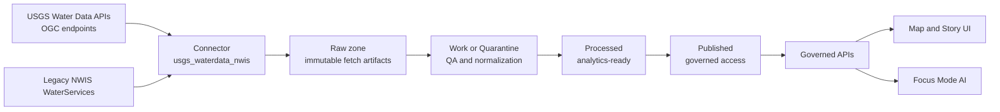

<!-- [KFM_META_BLOCK_V2]
doc_id: kfm://doc/f416b679-92a5-4a40-aa36-fc4836ba976a
title: USGS Water Data NWIS connector
type: standard
version: v1
status: draft
owners: TODO
created: 2026-02-24
updated: 2026-02-24
policy_label: public
related:
  - TODO
tags: [kfm, data-registry, source-connector, usgs, waterdata, nwis]
notes:
  - This registry entry covers both modern USGS Water Data APIs (OGC API - Features) and legacy NWIS WaterServices.
  - Treat upstream interfaces as changeable; prefer OGC APIs and keep WaterServices as a fallback while it remains available.
[/KFM_META_BLOCK_V2] -->

# USGS Water Data NWIS connector

> Governed connector spec for ingesting USGS National Water Information System data (Water Data for the Nation) via modern OGC APIs, with legacy WaterServices fallback.


<!-- TODO: replace badge labels/paths with repo-native badges once CI + governance labels are wired -->

## Navigation

- [Where this fits](#where-this-fits)
- [Registry record](#registry-record)
- [Upstream endpoints](#upstream-endpoints)
- [Decommission and lifecycle](#decommission-and-lifecycle)
- [Connector contract](#connector-contract)
- [Ingestion strategy](#ingestion-strategy)
- [Validation and promotion gates](#validation-and-promotion-gates)
- [Security and secrets](#security-and-secrets)
- [Operational notes](#operational-notes)
- [References](#references)

## Where this fits

- **Path:** `data/registry/sources/connectors/usgs_waterdata_nwis.md`
- **Role:** Source-connector registry record that defines upstream endpoints, decommission timelines, and KFM ingestion constraints.
- **Used by:** *(Proposed)* ingestion orchestration and catalog generation jobs that discover connector records under `data/registry/sources/connectors/`.

### Acceptable inputs

- API key from `api.data.gov` (optional for low-volume, required for sustained/parallel ingestion)
- Monitoring location identifiers (e.g., `USGS-<site_no>`)
- Parameter codes (`parameter_code`) and statistic codes where applicable
- Time windows (`datetime` / `time`) and/or `last_modified` watermarks
- Collection IDs discovered from the collections catalog

### Exclusions

- Do not scrape NWISWeb HTML pages for data.
- Do not call legacy `gwlevels` or SensorThings endpoints for production ingestion.
- Do not attempt bulk “download everything” operations; scope queries to defined use cases and respect rate limits.

---

## Architecture



---

## Registry record

```yaml
id: usgs_waterdata_nwis
kind: source_connector
status: draft

source:
  name: USGS Water Data for the Nation
  system: National Water Information System (NWIS)
  steward: U.S. Geological Survey (USGS)
  homepage: https://waterdata.usgs.gov/
  api_home: https://api.waterdata.usgs.gov/

license:
  default: public_domain_us_gov_work
  attribution_required: true
  attribution_note: "Credit USGS as the source; some embedded media may be copyrighted by third parties (verify per-page markings)."

sensitivity:
  classification: public
  notes:
    - "This source is generally public, but downstream products must still follow KFM redaction rules if any sensitive locations/attributes are later identified."

endpoints:
  primary:
    base_url: https://api.waterdata.usgs.gov/ogcapi/v0
    interface: OGC API - Features
    collections_catalog: https://api.waterdata.usgs.gov/ogcapi/v0/collections
    required_collections_by_name:
      - Latest continuous
      - Continuous values
      - Daily values
      - Latest daily values
      - Monitoring locations
      - Time series metadata
      - Field measurements
      - Channel measurements
      - Field measurements metadata
      - Combined metadata
    metadata_reference_tables:
      - Parameter codes
      - Statistic codes
      - Site types
      - State identifiers
      - Hydrologic unit codes (HUCs)
      - County identifiers
      - Time zone codes
      - "See catalog for full list"
  fallback:
    base_url: https://waterservices.usgs.gov/nwis
    interface: legacy REST (WaterServices)
    services:
      - iv
      - dv
      - site
      - stat
      - peak
      - rating
    excluded:
      - gwlevels  # deprecated; use field-measurements

auth:
  api_key:
    required_for_scale: true
    provider: api.data.gov
    query_param: api_key
    header: X-Api-Key

rate_limiting:
  status_code: 429
  response_headers:
    - X-RateLimit-Limit
    - X-RateLimit-Remaining

decommission:
  legacy_gwlevels:
    behavior: "gwlevels endpoint redirects starting 2026-02-01; redirects end 2026-06-01"
    replacement: "field-measurements"
  legacy_waterservices:
    planned_decommission: "2027-Q1"
    earliest_intentional_degradation: "2026-08-01"

kfm_outputs:
  proposed_dataset_ids:
    - usgs_nwis_monitoring_locations
    - usgs_nwis_time_series_metadata
    - usgs_nwis_daily_values
    - usgs_nwis_continuous_values
    - usgs_nwis_latest_daily_values
    - usgs_nwis_latest_continuous_values
    - usgs_nwis_field_measurements
    - usgs_nwis_code_tables
```

---

## Upstream endpoints

### Primary modern APIs

All modernized endpoints are published under:

- Base: `https://api.waterdata.usgs.gov/ogcapi/v0/`
- Collections index: `https://api.waterdata.usgs.gov/ogcapi/v0/collections?f=html`
- OpenAPI: `https://api.waterdata.usgs.gov/ogcapi/v0/openapi?f=html`

**Collection IDs are discoverable from the collections catalog. Do not hardcode IDs unless you also pin and test them.**

### Legacy fallback APIs

Legacy WaterServices are published under:

- Base: `https://waterservices.usgs.gov/nwis/`

Examples:

- Daily values (`dv` legacy):  
  `https://waterservices.usgs.gov/nwis/dv/?format=json&sites=02238500&period=P1D&parmCD=00065`

- Daily values (modern OGC daily):  
  `https://api.waterdata.usgs.gov/ogcapi/v0/collections/daily/items?f=json&monitoring_location_id=USGS-02238500&time=P1D&parameter_code=00065`

> WARNING: Legacy `gwlevels` is decommissioned; do not build new workflows on it. Use `field-measurements`.

---

## Decommission and lifecycle

### What to prefer

1. **Prefer modern USGS Water Data OGC APIs** (`api.waterdata.usgs.gov/ogcapi/`) for all new ingestion.
2. Use **WaterServices** (`waterservices.usgs.gov`) only as a **temporary fallback** while modern endpoints stabilize and until WaterServices retirement.

### Known retirement milestones

- Legacy `gwlevels` (groundwater levels) has been decommissioned; it redirects and will later error. Use `field-measurements`.
- WaterServices will be decommissioned in **2027-Q1**, with possible degradation/blackouts in 2026-H2 (no intentional degradation before 2026-08-01 per upstream notice).

---

## Connector contract

### Non-negotiable invariants

The connector **MUST**:

- **Fail closed** when:
  - API key is missing and the job exceeds unauthenticated rate limits
  - response schema cannot be validated against the expected collection schema
  - pagination is incomplete (missing `next` traversal) for a job marked “complete”
- **Capture provenance** for every fetch:
  - request URL + full query params (sorted, canonicalized)
  - request headers (redact secrets)
  - response status + response headers (especially rate-limit headers)
  - fetch timestamp (UTC) and connector version
  - content hash (SHA-256) of the raw payload
- **Be idempotent**:
  - same logical request → same canonical artifact path → same checksum
- **Never scrape HTML pages** intended for humans (use APIs only).

### Output artifact layout

> Proposed layout (adapt to repo conventions):

```
data/raw/usgs_waterdata_nwis/
  receipts/
    YYYY/MM/DD/<run_id>.json
  ogcapi/
    <collection_id>/
      <partition_key>/
        <time_chunk>/response.json
  waterservices/
    <service>/
      <partition_key>/
        <time_chunk>/response.json
```

---

## Ingestion strategy

### Discovery and scheduling

1. **Ingest reference tables** (parameter codes, statistic codes, site types, HUCs, etc.) on a slow cadence (weekly or monthly).
2. **Ingest monitoring locations** and **time series metadata** daily (or as needed for your use cases).
3. For values:
   - Use `latest-*` collections for “what is the newest value right now?”
   - Use full `daily` / `continuous` collections for backfills and historical loads.

### Pagination and chunking

- Use `limit` and follow `links[].rel == "next"` until exhausted.
- Chunk long time ranges into **page-sized** requests (often “per year” for 15-minute data).
- Prefer `properties=...` to reduce payload size when you only need a subset of fields.

### Incremental loads

Two safe patterns:

- **By observation time**: query by `datetime`/`time` windows and only request new time windows since the last successful watermark.
- **By update time**: query by `last_modified` (recommended when upstream can revise historical records).

### Suggested minimum fields to retain

For measurement collections (`daily`, `continuous`, `field-measurements`):

- `timeseries_id`
- `monitoring_location_id`
- `time` (observation time)
- `value`
- `approvals_status` (or equivalent)
- `qualifier`
- `last_modified`

---

## Validation and promotion gates

### Raw zone validation

- ✅ Response is JSON and parseable
- ✅ Response includes pagination metadata (`numberMatched`, `numberReturned`) when applicable
- ✅ Every feature has `id`, `geometry`, and `properties`
- ✅ Required properties exist for the collection (validate against upstream schema endpoint)

### Work or Quarantine validation

- ✅ Time parsing + canonical UTC handling (where applicable)
- ✅ Numeric coercion and NA handling rules are explicit and deterministic
- ✅ Duplicate detection is stable (define a natural key per collection)
- ✅ Unit mappings are resolved (parameter codes + statistic codes + units)

### Promotion contract

Do not promote to Published without:

- dataset identity + schema + spatial/temporal extents
- license + attribution record
- validation results + thresholds
- provenance links (inputs, transforms, tool versions)
- checksums/content integrity
- audit record: who/what/when/why + sensitivity + policy decisions

---

## Security and secrets

- Store API keys in the secret manager (never commit keys into the repo).
- Redact `api_key` from receipts and logs.
- Implement exponential backoff + jitter for 429 responses.
- Respect upstream `X-RateLimit-*` headers to avoid IP blocks.

---

## Operational notes

- Prefer **small, cacheable** requests over “download everything.”
- Treat “alpha” upstream status as a reliability risk:
  - keep schema snapshots versioned
  - pin connector behavior via contract tests
  - include a compatibility mode (legacy WaterServices) where feasible

---

## References

External docs (authoritative):

- USGS Water Data APIs home: https://api.waterdata.usgs.gov/
- USGS Water Data OGC APIs root: https://api.waterdata.usgs.gov/ogcapi/v0/
- OGC APIs docs (getting started): https://api.waterdata.usgs.gov/docs/ogcapi/
- API keys + rate limit headers: https://api.waterdata.usgs.gov/docs/ogcapi/keys/
- Efficient queries + chunking guidance: https://api.waterdata.usgs.gov/docs/ogcapi/efficiency/
- Collections catalog: https://api.waterdata.usgs.gov/ogcapi/v0/collections?f=html
- WaterServices legacy: https://waterservices.usgs.gov/
- WaterServices decommission notice: https://waterdata.usgs.gov/blog/api-waterservices-decom/
- gwlevels decommission notice: https://waterdata.usgs.gov/blog/api-decom-fall-2025/
- USGS copyright + crediting: https://www.usgs.gov/information-policies-and-instructions/copyrights-and-credits
- How to cite WDFN/NWIS data: https://waterdata.usgs.gov/citation/

---

_This file is intended to be machine- and human-readable. If you add fields, keep the YAML registry block parseable._

[Back to top](#usgs-water-data-nwis-connector)
