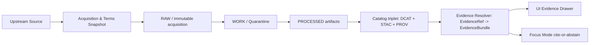

<!-- [KFM_META_BLOCK_V2]
doc_id: kfm://doc/9d9b8d7a-e9fd-4f2a-9af9-787b7032e2cf
title: Source Evidence Registry
type: standard
version: v1
status: draft
owners: TODO:data-stewards
created: 2026-02-24
updated: 2026-02-24
policy_label: public
related:
  - ../README.md
  - ../registry/README.md
  - ../../../docs/governance/README.md # TODO: verify path
tags: [kfm, registry, sources, evidence, provenance, licensing]
notes:
  - Directory README for evidence artifacts supporting upstream Source Registry entries.
  - This directory must remain safe-to-share; no secrets; redact sensitive content.
[/KFM_META_BLOCK_V2] -->

# Source Evidence Registry
Evidence artifacts that justify each upstream source’s **license**, **rights**, **sensitivity**, and **provenance** decisions — and that power **EvidenceRef → EvidenceBundle** resolution.


<!-- TODO: add real CI + policy gate badges once repo paths are confirmed -->

**Owners:** `TODO:data-stewards` • **Last updated:** 2026-02-24

**Jump to:**  
[Purpose](#purpose) • [Where this fits](#where-this-fits) • [Directory layout](#directory-layout) •
[What belongs here](#what-belongs-here) • [Evidence manifest](#evidence-manifest) •
[How to add evidence](#how-to-add-evidence) • [Promotion gates mapping](#promotion-gates-mapping) •
[Review checklist](#review-checklist) • [FAQ](#faq)

---

## Purpose

This directory contains **human-reviewable evidence** that supports each **Source Registry entry**.

Typical questions this evidence must answer (with receipts, not vibes):

- **Licensing & rights:** What license governs reuse? Who is the rights holder? What attribution is required?
- **Access method & cadence:** How do we fetch it? How often does it change?
- **Sensitivity:** Does it contain sensitive locations, PII, or culturally restricted knowledge? If so, what is the redaction/generalization plan?
- **Provenance anchors:** Where are the terms snapshots, documentation, and run receipts that back the catalogs and UI?

> **NOTE**
> This directory is part of the trust membrane: it exists so KFM can **prove** why a dataset is publishable and **block** publishing when it can’t.

[Back to top](#source-evidence-registry)

---

## Where this fits

KFM treats catalogs + provenance as contract surfaces. Evidence lives “alongside” the source registry so governance decisions are reproducible and reviewable.



**Key invariants (enforced by policy/tests, not convention):**
- Evidence must be **resolvable** for user-facing claims.
- If rights or sensitivity are unclear: **fail closed** (quarantine / block promotion / block publishing).

[Back to top](#source-evidence-registry)

---

## Directory layout

> **WARNING**
> Repo-wide naming conventions may differ. If this repository already defines a source/evidence layout, treat the tree below as a *starter* and adjust to match repo reality.

Proposed layout (per-source folders):

```text
data/registry/sources/evidence/                    # Source evidence registry (terms, licenses, sensitivity, contacts)
├─ README.md                                       # What counts as evidence + required structure + review workflow
│
├─ _templates/                                     # OPTIONAL (recommended) starter templates
│  ├─ evidence.manifest.example.yaml               # Example evidence.manifest.yaml (fields + placeholders)
│  ├─ sensitivity.review.example.md                # Example sensitivity review (rubric + obligations)
│  └─ license.snapshot.example.txt                 # Example license snapshot text (date-stamped)
│
└─ <source_slug>/                                  # One folder per upstream source (stable slug)
   ├─ evidence.manifest.yaml                       # REQUIRED: index of evidence items for this source (paths + hashes)
   ├─ README.md                                    # Optional notes/rationale (quirks, constraints, review history)
   │
   ├─ terms/                                       # Terms-of-use + API docs snapshots (immutable, dated)
   │  ├─ 2026-02-20_terms.pdf                       # Terms snapshot (as captured on date)
   │  └─ 2026-02-20_terms.sha256                    # Integrity hash (tamper detection)
   │
   ├─ license/                                     # License texts + attribution language (immutable, dated)
   │  ├─ 2026-02-20_license.txt                     # License snapshot text (or SPDX reference)
   │  └─ 2026-02-20_attribution.txt                 # Required attribution wording (if any)
   │
   ├─ sensitivity/                                 # Sensitivity assessment + handling plan
   │  ├─ review.md                                  # Human review (risks, restrictions, required redactions)
   │  └─ obligations.yaml                          # Optional machine-readable obligations (generalize/suppress/export rules)
   │
   ├─ contacts/                                    # Stewardship + escalation (NO secrets)
   │  ├─ owner.md                                   # Owning org/team contact (public-safe)
   │  └─ steward.md                                 # Data steward contact + escalation notes (public-safe)
   │
   └─ attachments/                                 # Supporting materials (bounded; licensed)
      ├─ data_dictionary.pdf                        # Data dictionary snapshot (if available)
      └─ api_reference.html                         # API reference snapshot (if captured)
```

### Naming conventions

- `source_slug` should be stable, lowercase, and readable (prefer `snake_case`).
- Put capture dates on evidence snapshots (e.g., `YYYY-MM-DD_*`).
- Do **not** embed secrets in filenames, content, or manifests.

[Back to top](#source-evidence-registry)

---

## What belongs here

### Acceptable inputs

| Evidence class | Examples | Why we keep it |
|---|---|---|
| Rights & licensing | license text, terms-of-use snapshot, attribution requirements | Required to pass licensing gates and avoid accidental misuse |
| Sensitivity review | risk notes, redaction/generalization plan, obligations | Required to publish safely and avoid leaking sensitive locations |
| Access & cadence proof | API docs, update schedule docs, contact info | Supports reproducible acquisition and “freshness” signals |
| Governance decisions | policy decision references (IDs), review notes | Makes publish/deny decisions auditable |
| Validation artifacts (lightweight) | QA report summaries, schema notes | Helps reviewers understand known limitations |

### Exclusions

Do **not** put these here:

- **Raw data extracts** (belongs in data lifecycle zones, not registries)
- **Secrets/credentials** (API keys, tokens, passwords, private endpoints)
- **High-risk PII** or restricted geometries (store in restricted systems/areas per policy; keep this directory safe-to-share)
- **Anything you can’t legally store** (copyrighted content without permission)

[Back to top](#source-evidence-registry)

---

## Evidence manifest

Each `<source_slug>/evidence.manifest.yaml` is the **index** that connects evidence artifacts to governance + promotion gates.

### Minimal recommended fields (manifest-level)

```yaml
# evidence.manifest.yaml
manifest_version: v1
source_slug: usgs_waterdata              # stable
source_name: "USGS Water Data"
authority: "USGS"
policy_label_default: public             # or restricted (must match governance decision)

captured_by:
  team: "TODO:data-stewards"
  contact: "TODO"

evidence:
  - evidence_id: "kfm://evidence/usgs_waterdata/terms/2026-02-20"
    type: terms_snapshot
    captured_at: "2026-02-20T12:00:00Z"
    original_url: "https://example.gov/terms"   # snapshot provenance
    local_path: "terms/2026-02-20_terms.pdf"
    sha256: "sha256:..."
    notes: "Terms snapshot used for licensing gate review."

  - evidence_id: "kfm://evidence/usgs_waterdata/license/2026-02-20"
    type: license_snapshot
    captured_at: "2026-02-20T12:05:00Z"
    local_path: "license/2026-02-20_license.txt"
    sha256: "sha256:..."
    license:
      spdx: "CC0-1.0"                     # example; must be verified
      attribution_required: false
    notes: "License text captured verbatim from publisher."
```

### Evidence item types (suggested)

Use a controlled vocabulary so CI and reviewers can reason about completeness:

- `terms_snapshot`
- `license_snapshot`
- `attribution_text`
- `sensitivity_review`
- `redaction_plan`
- `data_dictionary`
- `api_reference`
- `policy_decision_ref`
- `qa_summary`

[Back to top](#source-evidence-registry)

---

## How to add evidence

### Add a new source evidence folder

1. Create `data/registry/sources/evidence/<source_slug>/`
2. Add `evidence.manifest.yaml` (required).
3. Capture **terms/license snapshots**:
   - Save a copy (PDF/HTML/text) **as viewed**
   - Record the capture timestamp
   - Compute and store `sha256` for each captured file
4. Add/refresh **sensitivity review**:
   - Assign a default `policy_label`
   - If sensitive, write a redaction/generalization plan (and keep restricted details out of this directory)
5. Reference evidence IDs from the **Source Registry entry** (in `data/registry/sources/...`).

### PR checklist (fail closed)

- [ ] `evidence.manifest.yaml` exists and parses
- [ ] Every `local_path` exists
- [ ] Every evidence file has a recorded `sha256`
- [ ] License is explicit (or PR is marked “QUARANTINE” with explanation)
- [ ] Sensitivity label is assigned and reviewed
- [ ] No secrets added (scan passes)
- [ ] Any user-facing dataset/story that depends on this source has resolvable EvidenceRefs

[Back to top](#source-evidence-registry)

---

## Promotion gates mapping

This directory primarily supports **rights/sensitivity** gates, but it should also enable contract tests (evidence resolution) to run.

| Promotion gate | What this directory must provide | Typical files |
|---|---|---|
| Gate B: Licensing & rights | license clarity + rights holder + attribution language | `license/*`, `terms/*`, manifest `license` metadata |
| Gate C: Sensitivity + redaction plan | policy label + obligations + public_generalized plan (if needed) | `sensitivity/review.md`, `sensitivity/obligations.yaml` |
| Gate F: Contract tests | at least one EvidenceRef path can be resolved into a bundle | manifest `evidence_id` entries + fixtures (repo-dependent) |

> **TIP**
> If a source is “metadata-only reference” (no mirroring allowed), the manifest should still include terms/license evidence and explicitly state **what is NOT mirrored**.

[Back to top](#source-evidence-registry)

---

## Review checklist

Use this during steward review:

### Licensing
- [ ] Is reuse allowed for KFM’s intended use (including exports)?
- [ ] Are attribution requirements captured verbatim and stored?
- [ ] If unclear: did we explicitly quarantine/block promotion?

### Sensitivity
- [ ] Is `policy_label` assigned and justified?
- [ ] If sensitive locations are possible: is there a generalization/redaction plan?
- [ ] Does the plan avoid “reverse engineering” precise sites from derivatives?

### Evidence resolution readiness
- [ ] Are evidence IDs stable and consistently referenced?
- [ ] Does the evidence bundle “shape” include license + provenance + digest?

[Back to top](#source-evidence-registry)

---

## FAQ

### Is this where run receipts go?
Usually **no**. Run receipts are emitted per pipeline run and should live in the pipeline/audit outputs area. This directory may include:
- run receipt *templates*
- pointers/IDs and short summaries for review

### Can we store screenshots of web pages?
Yes, **if** it’s permitted and the screenshot is used as a terms/license snapshot. Include capture time, URL, and `sha256`.

### What if the source has restricted content?
Keep this directory safe-to-share:
- store **high-level** sensitivity review + obligations
- store precise restricted details only in approved restricted locations (per policy)

[Back to top](#source-evidence-registry)

---

## Appendix

<details>
<summary><strong>EvidenceBundle “shape” (example)</strong></summary>

```json
{
  "bundle_id": "sha256:...",
  "dataset_version_id": "kfm://dataset/@2026-02.abcd1234",
  "title": "Evidence for <claim or feature>",
  "policy": {
    "decision": "allow",
    "policy_label": "public",
    "obligations_applied": []
  },
  "license": {
    "spdx": "CC-BY-4.0",
    "attribution": "Publisher name (verbatim)"
  },
  "provenance": {
    "run_id": "kfm://run/2026-02-20T12:00:00Z.abcd"
  },
  "artifacts": [
    {
      "href": "processed/<path>",
      "digest": "sha256:...",
      "media_type": "application/x-parquet"
    }
  ],
  "checks": {
    "catalog_valid": true,
    "links_ok": true
  },
  "audit_ref": "kfm://audit/entry/..."
}
```

</details>

<details>
<summary><strong>Glossary</strong></summary>

- **EvidenceRef**: a resolvable reference (scheme-based or structured) used by stories, map features, and Focus Mode.
- **EvidenceBundle**: resolved evidence payload: human-friendly card + machine metadata + digests + audit references.
- **policy_label**: coarse access label (e.g., `public`, `restricted`) used by enforcement.
- **obligations**: required redactions/attribution/handling constraints returned by policy.

</details>
