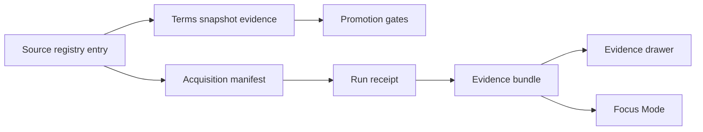

<!-- [KFM_META_BLOCK_V2]
doc_id: kfm://doc/2527a2ba-c057-4ff9-8b68-687e73b81117
title: Evidence Terms Snapshots Registry
type: standard
version: v1
status: draft
owners: KFM Data Governance (TODO confirm)
created: 2026-02-24
updated: 2026-02-24
policy_label: public
related:
  - data/registry/sources/README.md
  - data/registry/sources/evidence/README.md
tags: [kfm, registry, sources, evidence, licensing, terms]
notes:
  - This README defines how to store and reference *license/terms-of-use snapshots* for upstream sources.
  - Update related links once parent READMEs exist.
[/KFM_META_BLOCK_V2] -->

# Evidence Terms Snapshots
*Versioned snapshots of upstream **license / rights / terms-of-use** evidence for source onboarding and promotion gates.*

**Status:** `draft` • **Owners:** `KFM Data Governance (TODO)` • **Path:** `data/registry/sources/evidence/terms/`


---

## Navigation
- [Purpose](#purpose)
- [Where this fits](#where-this-fits)
- [Directory contract](#directory-contract)
- [Layout and naming](#layout-and-naming)
- [Snapshot metadata contract](#snapshot-metadata-contract)
- [How to add or update a terms snapshot](#how-to-add-or-update-a-terms-snapshot)
- [Validation and promotion gates](#validation-and-promotion-gates)
- [Examples](#examples)
- [FAQ](#faq)

---

## Purpose

KFM treats licensing and rights as **enforceable inputs** (not “paperwork”). This directory exists to store **immutable, reviewable snapshots** of an upstream source’s:

- Terms of use / terms of service (ToS)
- License text
- Rights statements / attribution requirements
- Data use agreements (when permissible to store)

These snapshots back three key behaviors:

1. **Source registry onboarding** (every source must have a record of reuse terms).
2. **Promotion gates** (promotion is blocked when rights are unclear or missing required evidence).
3. **Runtime trust surfaces** (evidence drawer / Focus Mode can display license + attribution and apply obligations).

> NOTE  
> A “terms snapshot” is the *evidence artifact* (a copy or reference to the text of terms at a point in time).  
> A “license classification” (e.g., `public_domain`, `cc-by-4.0`, `proprietary`) is a *normalized label* you put in registries and catalogs.

---

## Where this fits



**Expected references (conceptual):**
- A **source registry entry** should point to the most relevant snapshot(s) in this directory.
- Acquisition manifests and run receipts should record the snapshot reference and digest they relied on.
- Evidence resolution should be able to surface license/rights + obligations derived from the snapshot.

---

## Directory contract

### Acceptable inputs (what belongs here)

| Item | Examples | Why it belongs |
|---|---|---|
| Raw terms artifacts | `terms.pdf`, `terms.html`, `license.txt` | Primary evidence of rights/terms at capture time |
| Capture metadata | `capture.json` | Reproducible “who/what/when/where/how” for the snapshot |
| Human summary (optional) | `summary.md` | Quick review aid (never replaces raw evidence) |
| Redacted variants (optional) | `terms.redacted.pdf` | When the original contains non-shareable content |

### Exclusions (what must NOT go here)

- **Datasets or raw data payloads** (those belong in lifecycle zones: RAW/WORK/PROCESSED).
- **Credentials, API keys, session cookies**, or anything secret.
- **Legal advice** or interpretations meant to replace counsel.
- Any “scraped” material you are not authorized to store.

> WARNING  
> Do not bypass paywalls, authentication, or contractual restrictions to capture terms.  
> Capture only what your organization is permitted to access and store.

---

## Layout and naming

This repo snapshot does **not** confirm an existing naming convention for this directory. The following is a **recommended** layout that stays additive and reviewable:

```
data/registry/sources/evidence/terms/
  README.md
  <source_id>/
    <YYYY-MM-DD>/
      terms.pdf                # or terms.html / license.txt
      capture.json             # required metadata envelope
      summary.md               # optional human summary
      terms.redacted.pdf       # optional, if needed
```

### Naming rules (recommended)

- `<source_id>` **must match** the stable `source_id` in the source registry.
- `<YYYY-MM-DD>` is the **capture date** (UTC preferred).
- Never overwrite old snapshots. **Add a new dated folder** when terms change.

> TIP  
> If you need deterministic IDs beyond date folders, add a short digest prefix, e.g.  
> `<YYYY-MM-DD>__sha256_<first12>`.

---

## Snapshot metadata contract

Each snapshot folder should include a `capture.json` with (at minimum) the following fields.

### Required fields

| Field | Type | Notes |
|---|---|---|
| `source_id` | string | Stable source id (must match folder name) |
| `captured_at` | string (ISO 8601) | When the snapshot was taken |
| `retrieved_from` | object | Where it came from (`url`, `access_path`, etc.) |
| `artifact` | object | Points to stored file(s) + digests |
| `rights` | object | Rights holder + classification + attribution |
| `policy` | object | Classification for this evidence (e.g., `public`, `restricted`) |

### Recommended fields

- `upstream_last_modified` (if available)
- `upstream_version` (if the terms page shows a version/date)
- `obligations[]` (e.g., attribution text, “show notice” requirements)
- `notes`
- `review` (who reviewed, when, and decision outcome)

### Proposed `capture.json` schema (illustrative)

```json
{
  "source_id": "ipums_nhgis",
  "captured_at": "2026-02-24T00:00:00Z",
  "retrieval_method": "manual_download",
  "retrieved_from": {
    "url": "https://example.org/terms",
    "access_path": "public_web"
  },
  "artifact": {
    "files": [
      {
        "path": "terms.pdf",
        "content_type": "application/pdf",
        "sha256": "REPLACE_WITH_REAL_DIGEST"
      }
    ]
  },
  "rights": {
    "license_classification": "nhgis_terms",
    "rights_holder": "IPUMS",
    "attribution": "REPLACE_WITH_REQUIRED_ATTRIBUTION_TEXT_IF_ANY"
  },
  "policy": {
    "policy_label": "public",
    "obligations": []
  },
  "notes": "Short, factual capture notes. No legal interpretations."
}
```

> NOTE  
> If your repo already has a JSON Schema for this metadata, treat the above as *documentation only* and align to the existing schema.

---

## How to add or update a terms snapshot

### 1) Capture the terms artifact (PDF/HTML/TXT)

- Prefer the **canonical source** (publisher-hosted terms page or official license PDF).
- If the terms are a web page, capture both:
  - a **PDF print** (review-friendly), and
  - the **raw HTML** (diff-friendly), when feasible.

### 2) Compute a digest

- Record a **SHA-256** per stored artifact file.
- Use the digest for:
  - integrity checks,
  - evidence resolver confidence,
  - deterministic references in run receipts.

### 3) Create `capture.json`

Fill the required fields and include:
- where the terms were retrieved from,
- the capture time,
- digests,
- rights holder + attribution,
- the appropriate `policy_label`.

### 4) Link it from the source registry entry

Update the source registry entry to reference the new snapshot path + digest.

**Example (adjust to your registry schema):**
```yaml
source_id: ipums_nhgis
license_rights: nhgis_terms
terms_snapshot:
  path: data/registry/sources/evidence/terms/ipums_nhgis/2026-02-24/terms.pdf
  sha256: REPLACE_WITH_REAL_DIGEST
  captured_at: 2026-02-24T00:00:00Z
```

### 5) Open a PR with the checklist

**PR checklist (minimum):**
- [ ] New snapshot added under a new dated folder (no overwrites)
- [ ] `capture.json` present and valid JSON
- [ ] SHA-256 recorded and matches the artifact
- [ ] Source registry entry updated to point to the new snapshot
- [ ] `policy_label` set appropriately (default-deny if unclear)
- [ ] Any required attribution text captured verbatim
- [ ] If storage is not permitted: snapshot is *reference-only* with an explanation

---

## Validation and promotion gates

Recommended automated checks for this directory:

1. **Schema presence**: every dated folder contains `capture.json`.
2. **Digest integrity**: sha256 in `capture.json` matches file content.
3. **Controlled vocabulary checks**: `policy_label` is from the project’s controlled vocabulary.
4. **No-secret scan**: block merges if secrets are detected.
5. **Reference integrity**: source registry references resolve to real paths.

> WARNING  
> Promotion should fail closed when:
> - license evidence is missing,
> - rights are unclear,
> - or evidence files are referenced but not present.

---

## Examples

### Example folder (illustrative)

```
ipums_nhgis/                                  # Source evidence snapshots (IPUMS NHGIS)
└─ 2026-02-24/                                # Capture date (YYYY-MM-DD; immutable snapshot)
   ├─ terms.pdf                               # Terms-of-use / licensing snapshot (as retrieved on capture date)
   ├─ capture.json                            # Capture metadata (who/when/how, URL(s), hashes, tool versions)
   └─ summary.md                              # Human summary (key restrictions, attribution, redistribution notes)
```

### Example `summary.md` template (optional)

```markdown
# Terms Snapshot Summary — <source_id> — <YYYY-MM-DD>

## What changed since last snapshot?
- (bullet list; factual)

## Key reuse conditions (non-legal summary)
- Attribution required: yes/no (quote exact required text below)
- Redistribution allowed: yes/no/unclear
- Commercial use: yes/no/unclear

## Required attribution (verbatim)
> Paste the exact text from the terms artifact here.
```

---

## FAQ

### Why do we store snapshots instead of only linking to URLs?

URLs drift, pages change, and “current terms” may not match what applied when we acquired data. Snapshots make rights enforceable and auditable.

### What if we cannot legally store a copy of the terms?

Store **reference-only metadata** (URL + capture time + notes) and set a restrictive `policy_label`. Promotion should remain blocked until rights are clarified or a compliant evidence strategy is approved.

### Do we need a new snapshot every run?

Not necessarily. Create a new snapshot when:
- terms are known to change,
- a source registry entry is created/updated,
- rights classification changes,
- or a steward flags drift.

---

<details>
<summary><strong>Appendix: Controlled vocabulary reminders (starter lists)</strong></summary>

These values are maintained elsewhere in the project as controlled vocabulary. If you are unsure, use the starter lists below and align to the canonical registry when it exists.

### policy_label (starter)
- public
- public_generalized
- restricted
- restricted_sensitive_location
- internal
- embargoed
- quarantine

### artifact.zone (starter)
- raw
- work
- processed
- catalog
- published

### citation.kind (starter)
- dcat
- stac
- prov
- doc
- graph
- url (discouraged)

</details>

---

<a id="back-to-top"></a>
[Back to top](#evidence-terms-snapshots)
