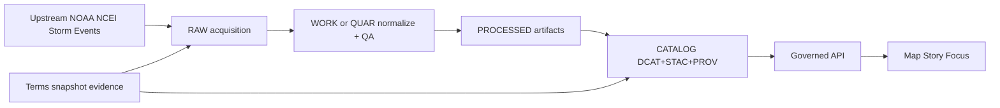

<!-- [KFM_META_BLOCK_V2]
doc_id: kfm://doc/0d2c7b4f-5c3a-4a0b-9a32-1d4e0c5c4bf1
title: NOAA NCEI Storm Events — Terms Evidence
type: standard
version: v1
status: draft
owners: TBD (data governance / stewards)
created: 2026-02-24
updated: 2026-02-24
policy_label: public
related:
  - data/registry/sources (source registry root — verify actual path)
  - data/registry/sources/evidence/terms (terms evidence root)
tags: [kfm, registry, sources, evidence, terms, noaa, ncei, storm_events]
notes:
  - This directory stores the license/terms evidence snapshots used to justify KFM’s use of NOAA NCEI Storm Events data.
  - This README is additive “glue” documentation; it should not replace source specs or governance policy.
[/KFM_META_BLOCK_V2] -->

# NOAA NCEI Storm Events — Terms Evidence

> Governed, versioned snapshots of upstream license/terms for the **NOAA NCEI Storm Events Database** source (`noaa_ncei_storm_events`).


---

## Quick navigation

- [What this folder is](#what-this-folder-is)
- [Upstream reference](#upstream-reference)
- [Where this fits in KFM](#where-this-fits-in-kfm)
- [What goes in this folder](#what-goes-in-this-folder)
- [Required evidence artifacts](#required-evidence-artifacts)
- [How KFM uses this evidence](#how-kfm-uses-this-evidence)
- [Update playbook](#update-playbook)
- [Promotion checklist](#promotion-checklist)
- [Assumptions risks tradeoffs](#assumptions-risks-tradeoffs)
- [Appendix: Suggested file conventions](#appendix-suggested-file-conventions)

---

## What this folder is

This directory is the **terms evidence anchor** for the KFM source:

- `source_id`: `noaa_ncei_storm_events`
- `authority`: NOAA NCEI
- `domain`: hazards
- `access_method`: bulk CSV (Storm Events bulk download)
- `license/rights`: *must be proven by the snapshots stored here* (default-deny if unclear)

**Goal:** make every downstream claim (API/UI/Focus Mode) traceable to a policy decision and resolvable evidence, including the “can we use this?” question.

> WARNING  
> Do **not** “assume public domain.” If the terms are unclear or cannot be snapshotted, promotion MUST fail closed until a steward resolves it.

[Back to top](#noaa-ncei-storm-events--terms-evidence)

---

## Upstream reference

The NOAA NCEI Storm Events Database provides storm event records collected by NOAA’s National Weather Service, with multiple access methods including interactive query and bulk CSV downloads.

**Primary upstream pages (authoritative):**
- Storm Events Database landing page: `https://www.ncei.noaa.gov/stormevents/`
- Bulk download page: `https://www.ncei.noaa.gov/stormevents/ftp.jsp`
- Bulk CSV directory index: `https://www.ncei.noaa.gov/pub/data/swdi/stormevents/csvfiles/`

**Bulk format documentation (field definitions):**
- `Storm-Data-Bulk-csv-Format.pdf` (in the CSV directory above)
- `Storm-Data-Export-Format.pdf` (in the CSV directory above)

> TIP  
> Keep the **terms snapshots** (rights/terms/disclaimer) separate from **format/schema docs**. If your repo has a `docs` evidence lane, store format PDFs there; keep this folder focused on *license/terms*.

[Back to top](#noaa-ncei-storm-events--terms-evidence)

---

## Where this fits in KFM

KFM’s “truth path” requires that sources are traceable across zones (RAW → WORK/QUAR → PROCESSED → CATALOG → governed surfaces). License/terms snapshots are part of that governed chain.



[Back to top](#noaa-ncei-storm-events--terms-evidence)

---

## What goes in this folder

**Acceptable inputs (this directory):**
- Snapshotted upstream pages containing license/terms/disclaimer language (HTML/PDF/text)
- A small manifest describing *what* was captured, *when*, *from which URLs*, and *hashes*
- Hash files (sha256) to make the snapshot immutable-by-digest

**Exclusions (must NOT go here):**
- Raw Storm Events data files (CSV/ZIP/GZ) — those belong in data acquisition zones (RAW)
- API keys, credentials, cookies, auth headers (never commit)
- Derived or processed artifacts (parquet, pmtiles, tiles, indexes)

[Back to top](#noaa-ncei-storm-events--terms-evidence)

---

## Required evidence artifacts

Minimum viable evidence set for a terms update PR:

| Artifact | Purpose | Required |
|---|---|---|
| `capture.json` (or similar manifest) | machine-readable “receipt” for the terms snapshot | ✅ |
| `terms__*.html` / `terms__*.pdf` | the captured terms/disclaimer text | ✅ |
| `sha256.txt` | immutable digests for captured artifacts | ✅ |
| `sources.txt` | list of upstream URLs captured | ✅ |
| `README.md` | how to interpret and update this evidence | ✅ |

> NOTE  
> File names and exact manifest schema are repo-convention dependent; see [Appendix](#appendix-suggested-file-conventions) for a suggested standard.

[Back to top](#noaa-ncei-storm-events--terms-evidence)

---

## How KFM uses this evidence

This folder is referenced by the **source registry** and used by policy and CI gates so that:

- dataset promotions are blocked if license/terms evidence is missing or unclear
- citations and evidence drawers can present **license/rights** as first-class UI surface
- Focus Mode can “cite or abstain” with resolvable EvidenceRefs

### Registry linkage (example)

Your source registry entry (JSON/YAML/CSV) should include (at minimum) the snapshot timestamp and license classification, plus a pointer to the stored evidence path.

```json
{
  "source_id": "noaa_ncei_storm_events",
  "authority": "NOAA NCEI",
  "domain": "hazards",
  "access_method": "bulk_csv",
  "cadence": "monthly",
  "terms_snapshot": {
    "license": "public_domain",
    "retrieved_at": "2026-02-20",
    "evidence_path": "data/registry/sources/evidence/terms/noaa_ncei_storm_events/snapshots/2026-02-20/"
  },
  "sensitivity": {
    "policy_label_intent": "public",
    "pii_risk": "low",
    "sensitive_location_risk": "low",
    "obligations": []
  }
}
```

> WARNING  
> The `license` value is not authoritative by itself. The **authoritative artifact** is the snapshot in this folder.

[Back to top](#noaa-ncei-storm-events--terms-evidence)

---

## Update playbook

When the upstream terms/disclaimers change (or at least once per release cadence):

1. **Identify the authoritative terms pages**
   - Prefer NCEI official pages over third-party mirrors.
2. **Capture the pages**
   - Save HTML (and/or print-to-PDF) for the specific terms/disclaimer pages.
3. **Write a capture manifest**
   - Include capture time, URLs, tooling, and a short human note explaining what changed.
4. **Compute digests**
   - Record sha256 for every captured artifact.
5. **Update the registry**
   - Bump `terms_snapshot.retrieved_at` and adjust license/notes only if the snapshot proves it.
6. **Run gates**
   - Link checks, policy tests, evidence resolver contract tests, and spec hash drift checks.
7. **Open PR**
   - Include a short summary and the manifest + digests.

### Example commands (portable, no credentials)

```bash
# From repo root (adjust paths to your conventions)

SNAP_DATE="2026-02-24"
OUT="data/registry/sources/evidence/terms/noaa_ncei_storm_events/snapshots/${SNAP_DATE}"
mkdir -p "${OUT}"

# Capture pages
curl -L "https://www.ncei.noaa.gov/stormevents/" -o "${OUT}/terms__ncei_stormevents__landing.html"
curl -L "https://www.ncei.noaa.gov/stormevents/ftp.jsp" -o "${OUT}/terms__ncei_stormevents__ftp.html"

# Record URL list
cat > "${OUT}/sources.txt" << 'EOF'
https://www.ncei.noaa.gov/stormevents/
https://www.ncei.noaa.gov/stormevents/ftp.jsp
EOF

# Digests
( cd "${OUT}" && sha256sum * > sha256.txt )
```

> TIP  
> If the page is heavily dynamic (JS-rendered), capture a PDF “print” or an archival snapshot in addition to HTML, and record both hashes.

[Back to top](#noaa-ncei-storm-events--terms-evidence)

---

## Promotion checklist

Use this checklist when this folder changes or when onboarding the source.

- [ ] Terms snapshot captured from **official** NOAA/NCEI pages
- [ ] `sources.txt` updated (URLs captured)
- [ ] `sha256.txt` updated and includes **every** artifact
- [ ] Capture manifest updated (who/what/when/why)
- [ ] Source registry entry points to correct `evidence_path`
- [ ] License classification matches what the snapshot supports (otherwise **fail closed**)
- [ ] CI gates pass (linkcheck, policy tests, evidence resolver contract tests, spec hash drift)

[Back to top](#noaa-ncei-storm-events--terms-evidence)

---

## Assumptions risks tradeoffs

### Assumptions (explicit)
- This repo uses a source registry with a `terms_snapshot` field (or equivalent).
- This directory is the canonical place to store terms evidence for `noaa_ncei_storm_events`.
- The ingestion cadence may be monthly (KFM choice), even if upstream updates are more frequent.

### Risks
- Upstream terms change silently → stale evidence → compliance risk.
- Storing terms evidence without hashes → non-reproducible audit trail.
- Mixing schema docs with terms evidence → confusing policy reviews.

### Tradeoffs
- Storing PDFs/HTML increases repo size, but improves auditability and reduces link rot.
- Capturing only a URL is lighter, but fails if content changes (not evidence-stable).

### Minimum verification steps (convert Unknown → Confirmed)
- Verify the registry entry references a real snapshot folder and the hashes match.
- Verify CI gates enforce presence of rights/terms evidence for promotion.
- Verify a steward has reviewed any license ambiguity.

[Back to top](#noaa-ncei-storm-events--terms-evidence)

---

## Appendix: Suggested file conventions

> PROPOSED (adjust if your repo already has a standard)

```text
data/registry/sources/evidence/terms/noaa_ncei_storm_events/
├── README.md
└── snapshots/
    └── YYYY-MM-DD/
        ├── capture.json
        ├── sources.txt
        ├── sha256.txt
        ├── terms__ncei_stormevents__landing.html
        └── terms__ncei_stormevents__ftp.html
```

**Suggested `capture.json`**
```json
{
  "source_id": "noaa_ncei_storm_events",
  "captured_at": "2026-02-24T00:00:00Z",
  "captured_by": "TBD",
  "urls": [
    "https://www.ncei.noaa.gov/stormevents/",
    "https://www.ncei.noaa.gov/stormevents/ftp.jsp"
  ],
  "license_assertion": "public_domain",
  "notes": "Update notes here. If license/terms are unclear, set license_assertion to 'unknown' and block promotion."
}
```
