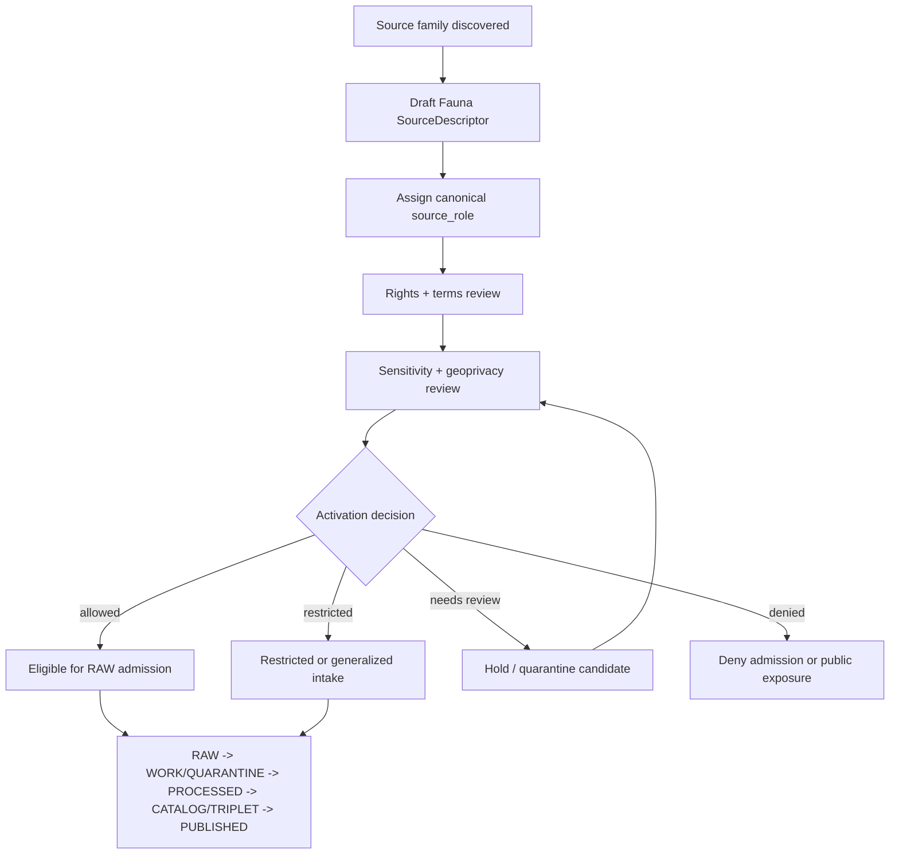

<!-- [KFM_META_BLOCK_V2]
doc_id: kfm://data/registry/sources/fauna/readme
name: Fauna Source Registry README
title: Fauna Source Registry
type: data-registry-source-domain-readme
version: v0.2.0
status: draft
owners:
  - <registry-steward>
  - <source-steward>
  - <fauna-domain-steward>
  - <rights-steward>
  - <sensitivity-steward>
  - <policy-steward>
  - <proof-steward>
  - <release-steward>
  - <docs-steward>
created: 2026-06-29
updated: 2026-06-29
policy_label: restricted-review
truth_posture: cite-or-abstain
responsibility_root: data/
artifact_family: registry
registry_scope: fauna-source-descriptor-records
domain: fauna
path_posture: existing-stub-replaced; subtype-first-source-registry-lane-confirmed-by-parent-and-domain-docs; domain-first-parallel-lane-exists; final-topology-needs-verification
sensitivity_posture: registry-internal; no-public-path; deny-by-default-sensitive-sites; source-role-preserving; evidence-aware; rights-aware; policy-aware; release-blocked-until-gates-close
related:
  - ../README.md
  - ../../README.md
  - ../../fauna/README.md
  - ../../fauna/sources/README.md
  - ../../datasets/README.md
  - ../../domains/README.md
  - ../../crosswalks/README.md
  - ../../../raw/fauna/
  - ../../../work/fauna/
  - ../../../quarantine/fauna/
  - ../../../processed/fauna/
  - ../../../catalog/domain/fauna/
  - ../../../receipts/
  - ../../../proofs/
  - ../../../../docs/domains/fauna/SOURCE_REGISTRY.md
  - ../../../../docs/domains/fauna/SOURCE_ROLES.md
  - ../../../../docs/domains/fauna/SOURCE_FAMILIES.md
  - ../../../../docs/domains/fauna/SENSITIVITY.md
  - ../../../../docs/doctrine/directory-rules.md
  - ../../../../contracts/domains/fauna/
  - ../../../../schemas/contracts/v1/source/
  - ../../../../schemas/contracts/v1/domains/fauna/
  - ../../../../policy/domains/fauna/
  - ../../../../policy/sensitivity/fauna/
  - ../../../../release/
tags:
  - kfm
  - data
  - registry
  - sources
  - fauna
  - source-descriptor
  - source-role
  - rights
  - sensitivity
  - geoprivacy
  - nests
  - dens
  - roosts
  - hibernacula
  - spawning-sites
  - evidence
  - provenance
  - release-gated
  - no-public-path
notes:
  - "This README replaces the one-character stub at `data/registry/sources/fauna/README.md`."
  - "This lane is documented as the subtype-first Fauna source registry path named by the parent source registry and Fauna source docs."
  - "A domain-first sibling lane also exists at `data/registry/fauna/sources/README.md`; do not maintain divergent source descriptor records across both lanes until topology is reconciled."
  - "Fauna exact occurrence geometry, nests, dens, roosts, hibernacula, spawning sites, breeding sites, telemetry detail, and steward-controlled records remain deny-by-default until governed redaction/review/release gates close."
[/KFM_META_BLOCK_V2] -->

<a id="top"></a>

# Fauna Source Registry

Subtype-first source registry lane for Fauna source descriptors, admission state, rights posture, sensitivity posture, and source-role discipline.

<p>
  
  
  
  
  
  
</p>

**Status:** draft  
**Owners:** `<registry-steward>` · `<source-steward>` · `<fauna-domain-steward>` · `<rights-steward>` · `<sensitivity-steward>`  
**Path:** `data/registry/sources/fauna/`  
**Public posture:** registry-internal; public clients use governed APIs and released artifacts, not this lane directly.

**Quick links:** [Scope](#scope) · [Repo fit](#repo-fit) · [Path posture](#path-posture) · [Accepted inputs](#accepted-inputs) · [Exclusions](#exclusions) · [Fauna source boundary](#fauna-source-boundary) · [Source families](#source-families) · [Admission flow](#admission-flow) · [Directory shape](#directory-shape) · [Descriptor sketch](#descriptor-sketch) · [Required checks](#required-checks-before-use) · [Status notes](#status-notes)

> [!CAUTION]
> `data/registry/sources/fauna/` is an admission and authority-control lane. It is not source data, not proof, not catalog closure, not policy, not release authority, not a public API, and not generated Fauna truth.

---

## Scope

`data/registry/sources/fauna/` documents and may hold Fauna source registry records: source descriptors, activation/admission sidecars, source-family indexes, source-role review notes, source-head references, supersession references, stale-state notes, correction references, and registry-local indexes for source families that may feed the Fauna lane.

A Fauna source registry record describes **how a source may be treated before source material reaches RAW**. It may record:

- source identity, source family, upstream authority, access method, and source-head posture;
- canonical `source_role` assignment and role-supporting notes;
- rights, license, attribution, redistribution, terms, and expiration posture;
- sensitivity, geoprivacy, stewardship, embargo, and public-exposure posture;
- cadence, retrieval window, source version, endpoint, and steward contact;
- permitted claim families, prohibited claim families, and authority limits;
- activation, intake, validation, evidence, proof, catalog, release, correction, withdrawal, supersession, and rollback references.

It does **not** record animal truth. A source can be admitted, restricted, denied, or held for review, but every public Fauna claim still requires lifecycle processing, evidence support, policy decision, review state, catalog/proof support, release state, correction path, and rollback target.

---

## Repo fit

| Responsibility | Home | Boundary |
|---|---|---|
| Cross-domain source registry parent | [`../README.md`](../README.md) | General source registry doctrine: admission and authority control, not bibliography. |
| Fauna subtype-first source registry | `data/registry/sources/fauna/` | This lane; source descriptors and admission-control records for Fauna. |
| Domain-first compatibility sibling | [`../../fauna/sources/README.md`](../../fauna/sources/README.md) | Existing sibling path; topology remains **NEEDS VERIFICATION**. Do not duplicate authority across both lanes. |
| Fauna domain-first registry parent | [`../../fauna/README.md`](../../fauna/README.md) | Routing/compatibility parent for Fauna registry material. |
| Human-facing Fauna source orientation | [`../../../../docs/domains/fauna/SOURCE_REGISTRY.md`](../../../../docs/domains/fauna/SOURCE_REGISTRY.md), [`SOURCE_ROLES.md`](../../../../docs/domains/fauna/SOURCE_ROLES.md), [`SOURCE_FAMILIES.md`](../../../../docs/domains/fauna/SOURCE_FAMILIES.md), [`SENSITIVITY.md`](../../../../docs/domains/fauna/SENSITIVITY.md) | Explains source families, roles, and sensitivity posture; not machine descriptor storage. |
| Fauna source payloads | `../../../raw/fauna/`, `../../../work/fauna/`, `../../../quarantine/fauna/`, `../../../processed/fauna/` | Actual data belongs in lifecycle lanes, not registry records. |
| Fauna semantic meaning | `../../../../contracts/domains/fauna/` | Object-family meaning and invariants. |
| Machine shape | `../../../../schemas/contracts/v1/source/`, `../../../../schemas/contracts/v1/domains/fauna/` | Schema authority; concrete enforced schema remains **NEEDS VERIFICATION**. |
| Fauna policy and sensitivity | `../../../../policy/domains/fauna/`, `../../../../policy/sensitivity/fauna/`, `../../../../policy/rights/` | Binding allow/deny/restrict/abstain rules and geoprivacy decisions. |
| Receipts and proof | `../../../receipts/`, `../../../proofs/` | Validation, redaction, review, policy, proof, and evidence closure stay separate. |
| Release decisions | `../../../../release/` | Promotion, release manifest, correction, rollback, supersession, and withdrawal authority. |
| Public surfaces | Governed APIs and released artifacts only | Public clients do not read this registry lane directly. |

---

## Path posture

This path exists in the GitHub repository and previously contained a one-character stub. The parent source registry README and Fauna source docs both name the subtype-first pattern:

```text
data/registry/sources/fauna/
```

A domain-first sibling also exists:

```text
data/registry/fauna/sources/
```

Until an accepted ADR, Directory Rules update, migration note, or repository inventory resolves the topology, treat this lane as the likely subtype-first source-descriptor home and treat the domain-first sibling as compatibility/routing evidence. Do **not** maintain two divergent descriptor sets.

> [!IMPORTANT]
> If both lanes contain records, one must be canonical and the other must be a pointer, mirror, migration record, or compatibility note with an explicit rollback target.

---

## Accepted inputs

Accepted content is limited to Fauna source registry records and registry-local support files:

- SourceDescriptor instances or pointer records;
- SourceActivationDecision references or activation sidecars where accepted;
- SourceIntakeRecord references and source-head metadata summaries;
- source-family README files and local indexes;
- source-role review notes and role-assignment records;
- rights, sensitivity, cadence, steward, endpoint, access, attribution, redistribution, and authority-scope metadata;
- embargo, stale-state, quarantine, supersession, withdrawal, correction, and rollback references;
- registry-local manifests, checksums, signatures, and index sidecars;
- pointers to validation receipts, redaction receipts, proof packs, catalog records, release candidates, ReleaseManifests, CorrectionNotices, and RollbackCards.

Keep records compact and pointer-based. Do not embed payloads, exact sensitive coordinates, proof packs, policy decisions, catalog records, release manifests, or source-native dumps in this lane.

---

## Exclusions

| Do not place here | Correct authority home |
|---|---|
| Raw Fauna source payloads, occurrence downloads, telemetry feeds, disease surveillance data, mortality reports, acoustic files, eDNA results, rasters, shapefiles, GeoParquet, COG, PMTiles, or source-native tables | `data/raw/fauna/`, `data/work/fauna/`, `data/quarantine/fauna/`, or `data/processed/fauna/` depending on lifecycle state |
| Exact sensitive coordinates, nests, dens, roosts, hibernacula, spawning sites, breeding sites, telemetry detail, private identifiers, steward-only notes, tokens, credentials, or API keys | restricted lifecycle lane, quarantine, secret manager, or governed restricted storage |
| Human-facing bibliography or narrative source guide | `docs/domains/fauna/`, `docs/sources/`, or source catalog docs |
| Dataset identity records | `data/registry/datasets/` |
| Crosswalk mapping records | `data/registry/crosswalks/` |
| Domain-state records | `data/registry/domains/` |
| Semantic object contracts | `contracts/domains/fauna/` |
| JSON Schema or machine-shape authority | `schemas/contracts/v1/source/` and `schemas/contracts/v1/domains/fauna/` |
| Policy rules, sensitivity rules, geoprivacy rules, rights rules, access-control logic, or release rules | `policy/` |
| Validation receipts, run receipts, redaction receipts, policy receipts, review receipts, or process-memory logs | `data/receipts/` |
| EvidenceBundle records, proof packs, signatures, or citation-validation closure | `data/proofs/` |
| STAC/DCAT/PROV/domain catalog records or graph/triplet projections | `data/catalog/` and `data/triplets/` |
| Published Fauna layers, reports, dashboards, tiles, API payloads, or generated-answer carriers | `data/published/`, governed app/API roots, and release-approved public artifact lanes |
| ReleaseManifest, PromotionDecision, CorrectionNotice, RollbackCard, withdrawal notice, or supersession notice | `release/` |
| Validator code, connector code, pipelines, fixtures, tests, or CI workflows | `tools/`, `connectors/`, `pipelines/`, `fixtures/`, `tests/`, `.github/workflows/` |

---

## Fauna source boundary

| Rule | Handling |
|---|---|
| Registry record is admission control | It governs how a source may be admitted and used; it does not contain the source payload. |
| Source role is fixed at admission | The canonical role must not be upgraded by processing, aggregation, cataloging, public presentation, or generated explanation. |
| Aggregator is not a role | GBIF, eBird, iNaturalist, iDigBio, BISON-like systems, and similar aggregators require origin-role discipline. The access path is not the evidence role. |
| Sensitive sites fail closed | Exact occurrence geometry, nests, dens, roosts, hibernacula, spawning sites, breeding sites, telemetry detail, and steward-controlled records are denied or restricted unless policy/review/redaction gates explicitly permit a public-safe derivative. |
| Context is not Fauna truth | Habitat, soil, hydrology, land cover, PAD-US, NWI, roads, settlements, and similar context sources support governed joins only. They do not become animal occurrence truth. |
| Registry is not evidence closure | EvidenceBundle/proof support remains separate. |
| Registry is not catalog closure | STAC/DCAT/PROV/domain catalog and graph projections remain separate. |
| Registry is not release | Public exposure requires validation, policy, review, proof/catalog support, release manifest, correction path, and rollback path. |
| Public clients do not read this lane | Public UI/API surfaces consume governed APIs, released artifacts, and evidence/policy-safe envelopes. |

---

## Source families

These families are Fauna-relevant in the inspected domain docs. Rights, current terms, endpoints, cadence, and exact descriptor IDs remain **NEEDS VERIFICATION** until confirmed against current source records and upstream terms.

| Family | Typical role posture | Registry note | Default blocker |
|---|---|---|---|
| KDWP-like steward sources | `regulatory` for status/listing determinations; `observed` for steward records | State steward and sensitive-site posture must be explicit. | Steward review and sensitivity review. |
| USFWS ECOS / IPaC-like federal sources | `regulatory` for listings and critical habitat; `observed` for federal survey records | Federal sensitivity flags and access constraints must be preserved. | Current API/terms verification. |
| NatureServe / heritage sources | `aggregate` or `regulatory` for status ranks; `observed` where element occurrences exist | Rankings are not occurrences. | Rights and controlled-access posture. |
| GBIF-like occurrence aggregators | Origin record usually remains `observed` | Aggregator is access path, not evidence role. Preserve publisher and record license. | Record-level license and sensitivity. |
| eBird EBD-like avian feeds | `observed` citizen-science, restricted-use | Downloadable does not mean republishable. | Redistribution and point-precision review. |
| iNaturalist-like observation feeds | `observed` citizen-science/research-grade | Respect obscured/private coordinates and per-record license. | Coordinate privacy and license variance. |
| iDigBio / Symbiota / in-state collections | `observed` specimen-backed | Specimen records can anchor dedupe but do not bypass sensitivity. | Institution terms and collection-security review. |
| EDDMapS / invasive feeds | `observed`, sometimes `aggregate` or `regulatory` by record type | Invasive reporting may involve private-parcel detail. | Private-parcel and rights review. |
| Agency monitoring, eDNA, acoustic, telemetry | `observed` readings; derived surfaces may be `modeled` | Keep raw detections separate from modeled utilization/suitability products. | Telemetry/sensitive geometry deny-default. |
| Context layers | Not Fauna truth; join support only | Keep owning-lane role and cite as context. | Join-induced sensitivity and authority drift. |

---

## Admission flow



The diagram is a governance map, not proof that every connector, validator, fixture, or CI gate exists. Concrete implementation remains **NEEDS VERIFICATION** unless supported by current repository evidence.

---

## Directory shape

The shape below is **PROPOSED** documentation guidance. It is not proof that child folders or records exist.

```text
data/registry/sources/fauna/
├── README.md
├── authority/
│   ├── README.md
│   └── index.local.json
├── observations/
│   ├── README.md
│   └── index.local.json
├── aggregators/
│   ├── README.md
│   └── index.local.json
├── heritage_status/
│   ├── README.md
│   └── index.local.json
├── invasive_species/
│   ├── README.md
│   └── index.local.json
├── context_layers/
│   ├── README.md
│   └── index.local.json
├── restricted_steward/
│   ├── README.md
│   └── index.local.json
└── index.local.json
```

If `data/registry/fauna/sources/` remains as a compatibility sibling, add a pointer or migration note there and keep only one descriptor authority.

---

## Descriptor sketch

The exact schema remains **NEEDS VERIFICATION**. This sketch is illustrative and must not be treated as live schema authority.

```json
{
  "id": "kfm-source:fauna:<stable-source-id>",
  "record_type": "source_descriptor",
  "domain": "fauna",
  "source_family": "authority | observation | aggregator | heritage_status | invasive_species | context_layer | restricted_steward | other",
  "source_name": "Human-readable source name",
  "source_role": "observed | regulatory | modeled | aggregate | administrative | candidate | synthetic",
  "authority_scope": "What this source may and may not support",
  "rights_posture": "open | attribution-required | restricted | stewarded | unknown | denied",
  "sensitivity_posture": "public-safe | generalized | restricted | denied | needs-review",
  "cadence": "one-time | periodic | event-driven | unknown",
  "source_head_refs": [],
  "retrieval_refs": [],
  "activation_refs": [],
  "intake_refs": [],
  "policy_refs": [],
  "validation_receipt_refs": [],
  "evidence_refs": [],
  "proof_refs": [],
  "catalog_refs": [],
  "review_refs": [],
  "release_refs": [],
  "correction_refs": [],
  "rollback_refs": [],
  "blockers": [],
  "public_exposure": "none | eligible-after-review | released-public-safe | denied",
  "created_at": "timestamp",
  "updated_at": "timestamp"
}
```

For implementation, defer to the accepted SourceDescriptor contract and schema under the appropriate `schemas/contracts/v1/` lane. This README does not create schema authority.

---

## Required checks before use

- [ ] Confirm whether `data/registry/sources/fauna/` or `data/registry/fauna/sources/` is the accepted canonical descriptor lane before adding real descriptor payloads.
- [ ] Confirm each object is a source registry record, not source data, dataset registry record, crosswalk, domain registry record, proof, receipt, catalog record, release decision, policy, schema, validator, fixture, or test.
- [ ] Confirm source identity, source role, rights posture, terms, cadence, source head, access posture, steward, and authority limits are preserved.
- [ ] Confirm source role is not upgraded by normalization, aggregation, cataloging, release review, API shaping, map rendering, or generated explanation.
- [ ] Confirm sensitive details are not exposed in registry files, local indexes, generated docs, or public summaries.
- [ ] Confirm nests, dens, roosts, hibernacula, spawning sites, breeding sites, telemetry detail, exact sensitive occurrence geometry, and steward-controlled records fail closed when unresolved.
- [ ] Confirm context sources are marked as join support and never treated as Fauna truth.
- [ ] Confirm validation receipts exist before catalog or release eligibility is asserted.
- [ ] Confirm EvidenceRef/EvidenceBundle and proof refs exist for consequential use.
- [ ] Confirm catalog refs point to STAC/DCAT/PROV/domain catalog records rather than embedding them.
- [ ] Confirm release refs point to ReleaseManifest/PromotionDecision objects rather than implying publication from registry state.
- [ ] Confirm correction, supersession, withdrawal, stale-state, and rollback paths exist for mutable or externally governed Fauna source material.
- [ ] Confirm no public client, map layer, graph edge, vector index, generated answer, report, or dashboard reads this registry lane as direct public truth.

---

## Status notes

| Claim | Status |
|---|---:|
| This README replaces the one-character stub at `data/registry/sources/fauna/README.md`. | CONFIRMED by GitHub contents API during this edit |
| `data/registry/sources/README.md` exists and defines the source registry as an admission and authority-control surface. | CONFIRMED by GitHub contents API during this edit |
| `docs/domains/fauna/SOURCE_REGISTRY.md` names `data/registry/sources/fauna/` as the machine-readable source registry lane. | CONFIRMED by GitHub contents API during this edit |
| `data/registry/fauna/README.md` and `data/registry/fauna/sources/README.md` exist as domain-first registry lanes. | CONFIRMED by GitHub contents API during this edit |
| The final accepted topology between subtype-first and domain-first Fauna source registry lanes is resolved. | NEEDS VERIFICATION |
| Concrete Fauna source descriptor payloads exist under this lane. | UNKNOWN |
| A canonical Fauna source descriptor schema is enforced in CI. | UNKNOWN |
| This README grants public access to Fauna source registry internals. | DENY |

---

## Maintainer note

Fauna source registry records are useful because they make source identity, source role, rights, sensitivity, cadence, activation, correction, and rollback inspectable before admission. They become risky when treated as payloads, proof, catalog closure, or release decisions. Keep the chain explicit:

```text
SourceDescriptor -> SourceActivationDecision -> RAW admission -> lifecycle processing -> validation receipt -> proof/catalog/policy/review -> release -> governed public surface
```

Never collapse it into:

```text
source descriptor -> public Fauna truth
```

[Back to top](#top)
