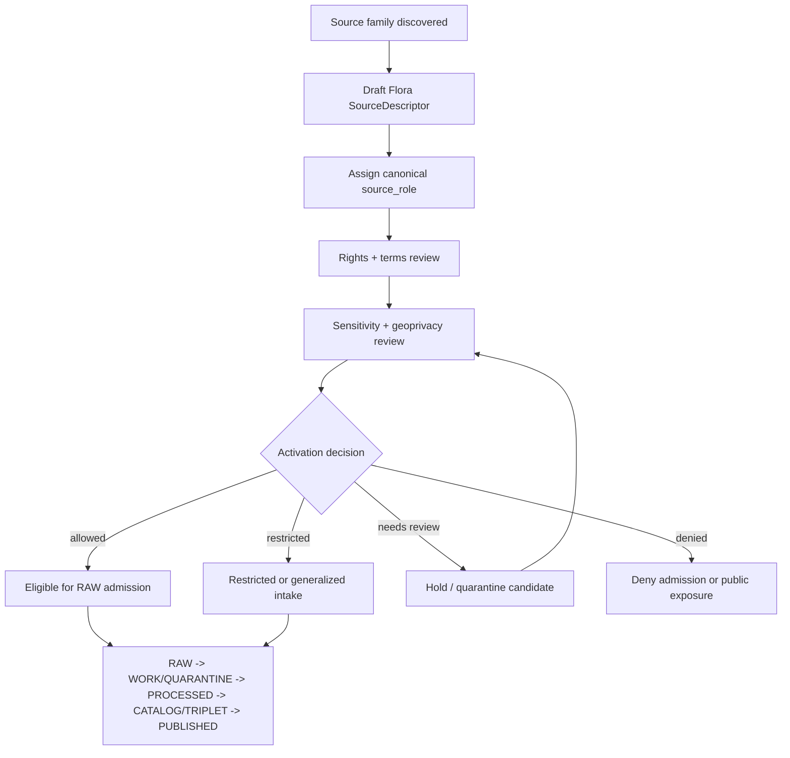

<!-- [KFM_META_BLOCK_V2]
doc_id: kfm://data/registry/sources/flora/readme
name: Flora Source Registry README
title: Flora Source Registry
type: data-registry-source-domain-readme
version: v0.2.0
status: draft
owners:
  - <registry-steward>
  - <source-steward>
  - <flora-domain-steward>
  - <rights-steward>
  - <sensitivity-steward>
  - <policy-steward>
  - <proof-steward>
  - <release-steward>
  - <docs-steward>
created: 2026-06-29
updated: 2026-06-29
policy_label: restricted-review
truth_posture: cite-or-abstain
responsibility_root: data/
artifact_family: registry
registry_scope: flora-source-descriptor-records
domain: flora
path_posture: existing-stub-replaced; subtype-first-source-registry-lane-confirmed-by-parent-and-domain-docs; domain-first-parallel-lane-exists; final-topology-needs-verification
sensitivity_posture: registry-internal; no-public-path; rare-plant-deny-default; culturally-sensitive-plant-knowledge-protected; source-role-preserving; evidence-aware; rights-aware; policy-aware; release-blocked-until-gates-close
related:
  - ../README.md
  - ../../README.md
  - ../../flora/README.md
  - ../../flora/sources/README.md
  - ../../datasets/README.md
  - ../../datasets/flora/README.md
  - ../../domains/README.md
  - ../../crosswalks/README.md
  - ../../../raw/flora/
  - ../../../work/flora/
  - ../../../quarantine/flora/
  - ../../../processed/flora/
  - ../../../catalog/domain/flora/
  - ../../../catalog/stac/flora/README.md
  - ../../../receipts/
  - ../../../proofs/
  - ../../../../docs/domains/flora/SOURCE_REGISTRY.md
  - ../../../../docs/domains/flora/SOURCE_FAMILIES.md
  - ../../../../docs/domains/flora/SOURCES.md
  - ../../../../docs/domains/flora/SOURCE_INTAKE.md
  - ../../../../docs/domains/flora/DATA_LIFECYCLE.md
  - ../../../../docs/domains/flora/SENSITIVITY.md
  - ../../../../docs/doctrine/directory-rules.md
  - ../../../../contracts/domains/flora/
  - ../../../../schemas/contracts/v1/source/
  - ../../../../schemas/contracts/v1/domains/flora/
  - ../../../../policy/domains/flora/
  - ../../../../policy/sensitivity/flora/
  - ../../../../release/
tags:
  - kfm
  - data
  - registry
  - sources
  - flora
  - source-descriptor
  - source-role
  - rights
  - sensitivity
  - geoprivacy
  - rare-plants
  - culturally-sensitive-plants
  - taxonomy
  - specimens
  - occurrences
  - vegetation
  - invasive-plants
  - phenology
  - restoration
  - evidence
  - provenance
  - release-gated
  - no-public-path
notes:
  - "This README replaces the one-character stub at `data/registry/sources/flora/README.md`."
  - "This lane is documented as the subtype-first Flora source registry path named by the parent source registry and Flora source docs."
  - "A domain-first sibling lane also exists at `data/registry/flora/sources/README.md`; do not maintain divergent source descriptor records across both lanes until topology is reconciled."
  - "Rare-plant exact geometry, culturally sensitive plant knowledge, steward-controlled records, rights-unclear feeds, taxonomy collisions, and join-induced sensitivity remain fail-closed until governed redaction/review/release gates close."
[/KFM_META_BLOCK_V2] -->

<a id="top"></a>

# Flora Source Registry

Subtype-first source registry lane for Flora source descriptors, admission state, rights posture, sensitivity posture, and source-role discipline.

<p>
  
  
  
  
  
  
</p>

**Status:** draft  
**Owners:** `<registry-steward>` · `<source-steward>` · `<flora-domain-steward>` · `<rights-steward>` · `<sensitivity-steward>`  
**Path:** `data/registry/sources/flora/`  
**Public posture:** registry-internal; public clients use governed APIs and released artifacts, not this lane directly.

**Quick links:** [Scope](#scope) · [Repo fit](#repo-fit) · [Path posture](#path-posture) · [Accepted inputs](#accepted-inputs) · [Exclusions](#exclusions) · [Flora source boundary](#flora-source-boundary) · [Source families](#source-families) · [Admission flow](#admission-flow) · [Directory shape](#directory-shape) · [Descriptor sketch](#descriptor-sketch) · [Required checks](#required-checks-before-use) · [Status notes](#status-notes)

> [!CAUTION]
> `data/registry/sources/flora/` is an admission and authority-control lane. It is not source data, not proof, not catalog closure, not policy, not release authority, not a public API, and not generated botanical truth.

---

## Scope

`data/registry/sources/flora/` documents and may hold Flora source registry records: source descriptors, activation/admission sidecars, source-family indexes, source-role review notes, source-head references, supersession references, stale-state notes, correction references, and registry-local indexes for source families that may feed the Flora lane.

A Flora source registry record describes **how a source may be treated before source material reaches RAW**. It may record:

- source identity, source family, upstream authority, access method, and source-head posture;
- canonical `source_role` assignment and role-supporting notes;
- rights, license, attribution, redistribution, terms, and expiration posture;
- sensitivity, geoprivacy, stewardship, embargo, and public-exposure posture;
- cadence, retrieval window, source version, endpoint, and steward contact;
- permitted claim families, prohibited claim families, and authority limits;
- activation, intake, validation, evidence, proof, catalog, release, correction, withdrawal, supersession, and rollback references.

It does **not** record botanical truth. A source can be admitted, restricted, denied, or held for review, but every public Flora claim still requires lifecycle processing, evidence support, policy decision, review state, catalog/proof support, release state, correction path, and rollback target.

---

## Repo fit

| Responsibility | Home | Boundary |
|---|---|---|
| Cross-domain source registry parent | [`../README.md`](../README.md) | General source registry doctrine: admission and authority control, not bibliography. |
| Flora subtype-first source registry | `data/registry/sources/flora/` | This lane; source descriptors and admission-control records for Flora. |
| Domain-first compatibility sibling | [`../../flora/sources/README.md`](../../flora/sources/README.md) | Existing sibling path; topology remains **NEEDS VERIFICATION**. Do not duplicate authority across both lanes. |
| Flora domain-first registry parent | [`../../flora/README.md`](../../flora/README.md) | Routing/compatibility parent for Flora registry material. |
| Human-facing Flora source orientation | [`../../../../docs/domains/flora/SOURCE_REGISTRY.md`](../../../../docs/domains/flora/SOURCE_REGISTRY.md), [`SOURCE_FAMILIES.md`](../../../../docs/domains/flora/SOURCE_FAMILIES.md), [`SOURCES.md`](../../../../docs/domains/flora/SOURCES.md), [`SENSITIVITY.md`](../../../../docs/domains/flora/SENSITIVITY.md) | Explains source families, roles, and sensitivity posture; not machine descriptor storage. |
| Flora source payloads | `../../../raw/flora/`, `../../../work/flora/`, `../../../quarantine/flora/`, `../../../processed/flora/` | Actual data belongs in lifecycle lanes, not registry records. |
| Flora semantic meaning | `../../../../contracts/domains/flora/` | Object-family meaning and invariants. |
| Machine shape | `../../../../schemas/contracts/v1/source/`, `../../../../schemas/contracts/v1/domains/flora/` | Schema authority; concrete enforced schema remains **NEEDS VERIFICATION**. |
| Flora policy and sensitivity | `../../../../policy/domains/flora/`, `../../../../policy/sensitivity/flora/`, `../../../../policy/rights/` | Binding allow/deny/restrict/abstain rules, rights decisions, and geoprivacy decisions. |
| Receipts and proof | `../../../receipts/`, `../../../proofs/` | Validation, redaction, review, policy, proof, and evidence closure stay separate. |
| Release decisions | `../../../../release/` | Promotion, release manifest, correction, rollback, supersession, and withdrawal authority. |
| Public surfaces | Governed APIs and released artifacts only | Public clients do not read this registry lane directly. |

---

## Path posture

This path exists in the GitHub repository and previously contained a one-character stub. The parent source registry README and Flora source docs both name the subtype-first pattern:

```text
data/registry/sources/flora/
```

A domain-first sibling also exists:

```text
data/registry/flora/sources/
```

Until an accepted ADR, Directory Rules update, migration note, or repository inventory resolves the topology, treat this lane as the likely subtype-first source-descriptor home and treat the domain-first sibling as compatibility/routing evidence. Do **not** maintain two divergent descriptor sets.

> [!IMPORTANT]
> If both lanes contain records, one must be canonical and the other must be a pointer, mirror, migration record, or compatibility note with an explicit rollback target.

---

## Accepted inputs

Accepted content is limited to Flora source registry records and registry-local support files:

- SourceDescriptor instances or pointer records;
- SourceActivationDecision references or activation sidecars where accepted;
- SourceIntakeRecord references and source-head metadata summaries;
- source-family README files and local indexes;
- source-role review notes and role-assignment records;
- rights, sensitivity, cadence, steward, endpoint, access, attribution, redistribution, and authority-scope metadata;
- embargo, stale-state, quarantine, supersession, withdrawal, correction, and rollback references;
- registry-local manifests, checksums, signatures, and index sidecars;
- pointers to validation receipts, redaction receipts, proof packs, catalog records, release candidates, ReleaseManifests, CorrectionNotices, and RollbackCards.

Keep records compact and pointer-based. Do not embed payloads, exact sensitive coordinates, culturally sensitive plant knowledge, proof packs, policy decisions, catalog records, release manifests, source-native dumps, or botanical claims in this lane.

---

## Exclusions

| Do not place here | Correct authority home |
|---|---|
| Raw Flora source payloads, herbarium archives, occurrence exports, taxonomy tables, rare-plant feeds, vegetation datasets, invasive records, phenology feeds, restoration records, remote-sensing scenes, rasters, shapefiles, GeoParquet, COG, PMTiles, or source-native tables | `data/raw/flora/`, `data/work/flora/`, `data/quarantine/flora/`, or `data/processed/flora/` depending on lifecycle state |
| Exact rare/protected/culturally sensitive plant coordinates, steward-only notes, private identifiers, tokens, credentials, API keys, or culturally sensitive plant knowledge | restricted lifecycle lane, quarantine, secret manager, or governed restricted storage |
| Human-facing bibliography or narrative source guide | `docs/domains/flora/`, `docs/sources/`, or source catalog docs |
| Dataset identity records | `data/registry/datasets/` or `data/registry/datasets/flora/` |
| Crosswalk mapping records | `data/registry/crosswalks/` |
| Domain-state records | `data/registry/domains/` |
| Semantic object contracts | `contracts/domains/flora/` |
| JSON Schema or machine-shape authority | `schemas/contracts/v1/source/` and `schemas/contracts/v1/domains/flora/` |
| Policy rules, sensitivity rules, geoprivacy rules, rights rules, access-control logic, or release rules | `policy/` |
| Validation receipts, run receipts, redaction receipts, policy receipts, review receipts, or process-memory logs | `data/receipts/` |
| EvidenceBundle records, proof packs, signatures, or citation-validation closure | `data/proofs/` |
| STAC/DCAT/PROV/domain catalog records or graph/triplet projections | `data/catalog/` and `data/triplets/` |
| Published Flora layers, reports, dashboards, tiles, API payloads, or generated-answer carriers | `data/published/`, governed app/API roots, and release-approved public artifact lanes |
| ReleaseManifest, PromotionDecision, CorrectionNotice, RollbackCard, withdrawal notice, or supersession notice | `release/` |
| Validator code, connector code, pipelines, fixtures, tests, or CI workflows | `tools/`, `connectors/`, `pipelines/`, `fixtures/`, `tests/`, `.github/workflows/` |

---

## Flora source boundary

| Rule | Handling |
|---|---|
| Registry record is admission control | It governs how a source may be admitted and used; it does not contain the source payload. |
| Source role is fixed at admission | The canonical role must not be upgraded by processing, aggregation, cataloging, public presentation, or generated explanation. |
| Descriptor is not botanical truth | PLANTS, GBIF, iNaturalist, NatureServe, herbarium, vegetation, invasive, phenology, restoration, and remote-sensing sources still require evidence and review before claims. |
| Rare and sensitive plant data fail closed | Exact rare/protected/culturally sensitive plant locations, steward-controlled records, culturally sensitive plant knowledge, taxonomy collisions, rights-unclear feeds, and join-induced sensitivity are denied or restricted unless policy/review/redaction gates explicitly permit a public-safe derivative. |
| Aggregator is not a role | GBIF, iDigBio, and similar aggregators are access paths or distributors. Preserve the originating publisher, license, role, and uncertainty. |
| Context is not Flora truth | Soil, hydrology, habitat, land cover, roads, settlements, archaeology, and similar context sources support governed joins only. They do not become botanical occurrence truth. |
| Watchers are non-publishers | Source-health, source-head, and drift watchers may create candidate intake records; they must not write directly to processed, catalog, published, or public surfaces. |
| Registry is not evidence closure | EvidenceBundle/proof support remains separate. |
| Registry is not catalog closure | STAC/DCAT/PROV/domain catalog and graph projections remain separate. |
| Registry is not release | Public exposure requires validation, policy, review, proof/catalog support, release manifest, correction path, and rollback path. |
| Public clients do not read this lane | Public UI/API surfaces consume governed APIs, released artifacts, and evidence/policy-safe envelopes. |

---

## Source families

These families are Flora-relevant in the inspected domain docs. Rights, current terms, endpoints, cadence, and exact descriptor IDs remain **NEEDS VERIFICATION** until confirmed against current source records and upstream terms.

| Family | Typical role posture | Registry note | Default blocker |
|---|---|---|---|
| KDWP listed-species and stewardship context | `regulatory` for status/listing; `administrative` for stewardship outputs | State rare-plant and stewardship posture must be explicit. | Steward review and sensitivity review. |
| Kansas Biological Survey / KU herbarium | `observed` for specimens; `administrative` for survey surfaces | Specimen records can support occurrence evidence but do not bypass sensitivity. | Institution terms and rare-plant geoprivacy. |
| K-State Herbarium and other Kansas herbaria | `observed` specimen-backed records | Preserve institution, catalog number, locality uncertainty, and license. | Institution terms and collection-security review. |
| USFWS ECOS plant context | `regulatory` for listings, recovery, and critical habitat context | Status is authority context, not observed occurrence evidence. | Current source terms and sensitivity flags. |
| NatureServe / heritage sources | `aggregate` or `regulatory` for ranks/status; `observed` only where element occurrences exist | Rankings are not occurrences; controlled access must be respected. | Rights, controlled-access posture, and sensitive-rank exposure. |
| GBIF vascular-plant downloads | Origin record usually remains `observed`; aggregate summaries remain `aggregate` | Aggregator is access path; preserve publisher and record-level license. | Record-level license and sensitive-taxon joins. |
| iDigBio / Symbiota specimen records | `observed` specimen-backed | Preserve institution terms and source-locality uncertainty. | Institution terms and sensitive locality review. |
| iNaturalist-derived observations | `observed` community observation | Respect obscured/private coordinates and per-observation license. | Coordinate privacy and license variance. |
| USDA PLANTS-style checklists | `aggregate` or `administrative`; context only for occurrence claims | County/state checklists are useful context, not exact occurrence evidence. | Join-induced sensitivity with occurrence or heritage data. |
| Vegetation and remote-sensing surfaces | `modeled` or `aggregate` depending on source product | Model/run identity and uncertainty must travel with the descriptor. | ModelRunReceipt and asset-license verification. |
| Restoration project records | `observed` project-level or `administrative` | Landowner/steward posture may restrict detail. | Rights-holder and steward review. |
| Phenology, invasive, and botanical survey feeds | `observed`, `administrative`, or `aggregate` by record type | Keep survey, report, and aggregation roles separate. | Rights, private-parcel detail, and sensitivity review. |

---

## Admission flow



The diagram is a governance map, not proof that every connector, validator, fixture, or CI gate exists. Concrete implementation remains **NEEDS VERIFICATION** unless supported by current repository evidence.

---

## Directory shape

The shape below is **PROPOSED** documentation guidance. It is not proof that child folders or records exist.

```text
data/registry/sources/flora/
├── README.md
├── taxonomy/
│   ├── README.md
│   └── index.local.json
├── specimens/
│   ├── README.md
│   └── index.local.json
├── occurrences/
│   ├── README.md
│   └── index.local.json
├── rare_plants/
│   ├── README.md
│   └── index.local.json
├── vegetation/
│   ├── README.md
│   └── index.local.json
├── invasive_plants/
│   ├── README.md
│   └── index.local.json
├── phenology/
│   ├── README.md
│   └── index.local.json
├── restoration/
│   ├── README.md
│   └── index.local.json
├── remote_sensing/
│   ├── README.md
│   └── index.local.json
├── context_layers/
│   ├── README.md
│   └── index.local.json
├── restricted_steward/
│   ├── README.md
│   └── index.local.json
└── index.local.json
```

If `data/registry/flora/sources/` remains as a compatibility sibling, add a pointer or migration note there and keep only one descriptor authority.

---

## Descriptor sketch

The exact schema remains **NEEDS VERIFICATION**. This sketch is illustrative and must not be treated as live schema authority.

```json
{
  "id": "kfm-source:flora:<stable-source-id>",
  "record_type": "source_descriptor",
  "domain": "flora",
  "source_family": "taxonomy | specimen | occurrence | rare_plant | vegetation | invasive_plant | phenology | restoration | remote_sensing | context_layer | restricted_steward | other",
  "source_name": "Human-readable source name",
  "source_role": "observed | regulatory | modeled | aggregate | administrative | candidate | synthetic",
  "authority_scope": "What this source may and may not support",
  "rights_posture": "open | attribution-required | restricted | stewarded | unknown | denied",
  "sensitivity_posture": "public-safe | generalized | restricted | denied | needs-review",
  "cadence": "one-time | periodic | event-driven | unknown",
  "source_head_refs": [],
  "retrieval_refs": [],
  "activation_refs": [],
  "intake_refs": [],
  "policy_refs": [],
  "validation_receipt_refs": [],
  "evidence_refs": [],
  "proof_refs": [],
  "catalog_refs": [],
  "review_refs": [],
  "release_refs": [],
  "correction_refs": [],
  "rollback_refs": [],
  "blockers": [],
  "public_exposure": "none | eligible-after-review | released-public-safe | denied",
  "created_at": "timestamp",
  "updated_at": "timestamp"
}
```

For implementation, defer to the accepted SourceDescriptor contract and schema under the appropriate `schemas/contracts/v1/` lane. This README does not create schema authority.

---

## Required checks before use

- [ ] Confirm whether `data/registry/sources/flora/` or `data/registry/flora/sources/` is the accepted canonical descriptor lane before adding real descriptor payloads.
- [ ] Confirm each object is a source registry record, not source data, dataset registry record, crosswalk, domain registry record, proof, receipt, catalog record, release decision, policy, schema, validator, fixture, or test.
- [ ] Confirm source identity, source role, rights posture, terms, cadence, source head, access posture, steward, and authority limits are preserved.
- [ ] Confirm source role is not upgraded by normalization, aggregation, cataloging, release review, API shaping, map rendering, or generated explanation.
- [ ] Confirm sensitive details are not exposed in registry files, local indexes, generated docs, or public summaries.
- [ ] Confirm exact rare/protected/culturally sensitive plant locations, steward-controlled records, culturally sensitive plant knowledge, taxonomy collisions, rights-unclear feeds, and join-induced sensitivity fail closed when unresolved.
- [ ] Confirm context sources are marked as join support and never treated as Flora truth.
- [ ] Confirm validation receipts exist before catalog or release eligibility is asserted.
- [ ] Confirm EvidenceRef/EvidenceBundle and proof refs exist for consequential use.
- [ ] Confirm catalog refs point to STAC/DCAT/PROV/domain catalog records rather than embedding them.
- [ ] Confirm release refs point to ReleaseManifest/PromotionDecision objects rather than implying publication from registry state.
- [ ] Confirm correction, supersession, withdrawal, stale-state, and rollback paths exist for mutable or externally governed Flora source material.
- [ ] Confirm no public client, map layer, graph edge, vector index, generated answer, report, or dashboard reads this registry lane as direct public truth.

---

## Status notes

| Claim | Status |
|---|---:|
| This README replaces the one-character stub at `data/registry/sources/flora/README.md`. | CONFIRMED by GitHub contents API during this edit |
| `data/registry/sources/README.md` exists and defines the source registry as an admission and authority-control surface. | CONFIRMED by GitHub contents API during this edit |
| `docs/domains/flora/SOURCE_REGISTRY.md` names `data/registry/sources/flora/` as the machine-readable source registry lane. | CONFIRMED by GitHub contents API during this edit |
| `data/registry/flora/README.md` and `data/registry/flora/sources/README.md` exist as domain-first registry lanes. | CONFIRMED by GitHub contents API during this edit |
| The final accepted topology between subtype-first and domain-first Flora source registry lanes is resolved. | NEEDS VERIFICATION |
| Concrete Flora source descriptor payloads exist under this lane. | UNKNOWN |
| A canonical Flora source descriptor schema is enforced in CI. | UNKNOWN |
| This README grants public access to Flora source registry internals. | DENY |

---

## Maintainer note

Flora source registry records are useful because they make source identity, source role, rights, sensitivity, cadence, activation, correction, and rollback inspectable before admission. They become risky when treated as payloads, proof, catalog closure, or release decisions. Keep the chain explicit:

```text
SourceDescriptor -> SourceActivationDecision -> RAW admission -> lifecycle processing -> validation receipt -> proof/catalog/policy/review -> release -> governed public surface
```

Never collapse it into:

```text
source descriptor -> public Flora truth
```

[Back to top](#top)
