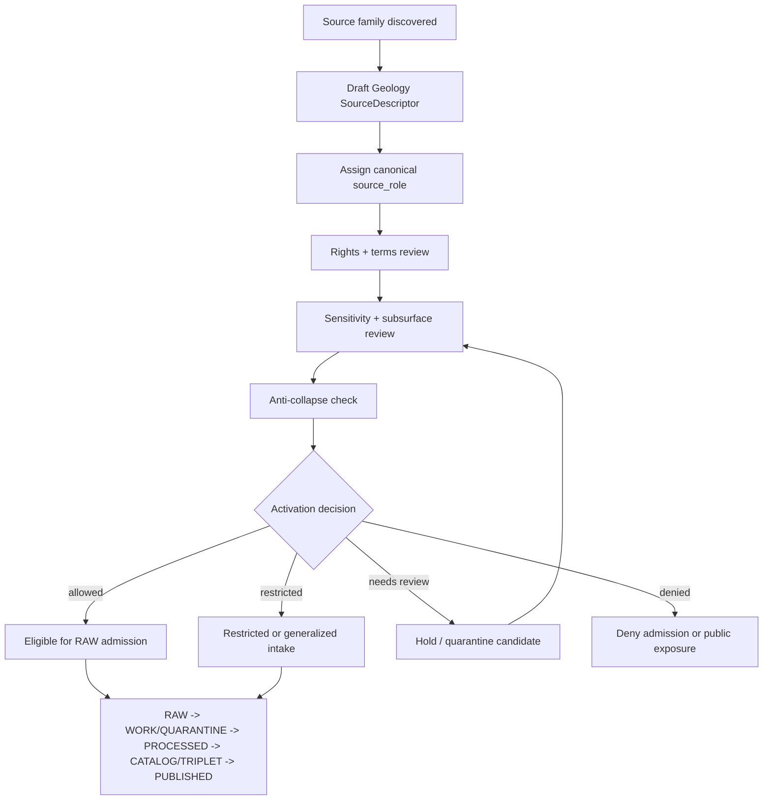

<!-- [KFM_META_BLOCK_V2]
doc_id: kfm://data/registry/sources/geology/readme
name: Geology Source Registry README
title: Geology Source Registry
type: data-registry-source-domain-readme
version: v0.2.0
status: draft
owners:
  - <registry-steward>
  - <source-steward>
  - <geology-domain-steward>
  - <rights-steward>
  - <sensitivity-steward>
  - <policy-steward>
  - <proof-steward>
  - <release-steward>
  - <docs-steward>
created: 2026-06-29
updated: 2026-06-29
policy_label: restricted-review
truth_posture: cite-or-abstain
responsibility_root: data/
artifact_family: registry
registry_scope: geology-source-descriptor-records
domain: geology
path_posture: existing-stub-replaced; subtype-first-source-registry-lane-confirmed-by-parent-and-domain-docs; domain-first-parallel-lane-exists; final-topology-needs-verification
sensitivity_posture: registry-internal; no-public-path; restricted-subsurface-details-fail-closed; source-role-preserving; evidence-aware; rights-aware; policy-aware; release-blocked-until-gates-close
related:
  - ../README.md
  - ../../README.md
  - ../../geology/README.md
  - ../../geology/sources/README.md
  - ../../datasets/README.md
  - ../../domains/README.md
  - ../../crosswalks/README.md
  - ../../../raw/geology/
  - ../../../work/geology/
  - ../../../quarantine/geology/
  - ../../../processed/geology/README.md
  - ../../../catalog/domain/geology/
  - ../../../receipts/
  - ../../../proofs/
  - ../../../../docs/domains/geology/SOURCE_REGISTRY.md
  - ../../../../docs/domains/geology/SOURCES.md
  - ../../../../docs/domains/geology/SOURCE_LEDGER.md
  - ../../../../docs/domains/geology/SOURCE_ROLE_MATRIX.md
  - ../../../../docs/domains/geology/DATA_LIFECYCLE.md
  - ../../../../docs/domains/geology/SENSITIVITY.md
  - ../../../../docs/domains/geology/POLICY.md
  - ../../../../docs/doctrine/directory-rules.md
  - ../../../../contracts/domains/geology/
  - ../../../../schemas/contracts/v1/source/
  - ../../../../schemas/contracts/v1/domains/geology/
  - ../../../../policy/domains/geology/
  - ../../../../policy/sensitivity/geology/
  - ../../../../release/
tags:
  - kfm
  - data
  - registry
  - sources
  - geology
  - source-descriptor
  - source-role
  - rights
  - sensitivity
  - subsurface
  - boreholes
  - well-logs
  - mineral-resources
  - kgs
  - kcc
  - usgs
  - ngmdb
  - gems
  - mrds
  - evidence
  - provenance
  - release-gated
  - no-public-path
notes:
  - "This README replaces the one-character stub at `data/registry/sources/geology/README.md`."
  - "This lane is documented as the subtype-first Geology source registry path named by the parent source registry and Geology source docs."
  - "A domain-first sibling lane also exists at `data/registry/geology/sources/README.md`; do not maintain divergent source descriptor records across both lanes until topology is reconciled."
  - "Restricted subsurface, resource-adjacent, well-log, private-well, sample, aggregate, model, and source-role-sensitive details remain fail-closed until governed redaction/review/release gates close."
[/KFM_META_BLOCK_V2] -->

<a id="top"></a>

# Geology Source Registry

Subtype-first source registry lane for Geology and Natural Resources source descriptors, admission state, rights posture, sensitivity posture, and source-role discipline.

<p>
  
  
  
  
  
  
</p>

**Status:** draft  
**Owners:** `<registry-steward>` · `<source-steward>` · `<geology-domain-steward>` · `<rights-steward>` · `<sensitivity-steward>`  
**Path:** `data/registry/sources/geology/`  
**Public posture:** registry-internal; public clients use governed APIs and released artifacts, not this lane directly.

**Quick links:** [Scope](#scope) · [Repo fit](#repo-fit) · [Path posture](#path-posture) · [Accepted inputs](#accepted-inputs) · [Exclusions](#exclusions) · [Geology source boundary](#geology-source-boundary) · [Source families](#source-families) · [Admission flow](#admission-flow) · [Directory shape](#directory-shape) · [Descriptor sketch](#descriptor-sketch) · [Required checks](#required-checks-before-use) · [Status notes](#status-notes)

> [!CAUTION]
> `data/registry/sources/geology/` is an admission and authority-control lane. It is not source data, not proof, not catalog closure, not policy, not release authority, not a public API, and not generated geologic truth.

---

## Scope

`data/registry/sources/geology/` documents and may hold Geology source registry records: source descriptors, activation/admission sidecars, source-family indexes, source-role review notes, source-head references, supersession references, stale-state notes, correction references, and registry-local indexes for source families that may feed the Geology and Natural Resources lane.

A Geology source registry record describes **how a source may be treated before source material reaches RAW**. It may record:

- source identity, source family, upstream authority, access method, source vintage, and source-head posture;
- canonical `source_role` assignment and role-supporting notes;
- rights, license, attribution, redistribution, terms, and expiration posture;
- sensitivity posture for subsurface, resource-adjacent, well-log, private-well, sample, and map-derived material;
- cadence, retrieval window, source version, endpoint, and steward contact;
- permitted claim families, prohibited claim families, geometry scope, and authority limits;
- activation, intake, validation, evidence, proof, catalog, release, correction, withdrawal, supersession, and rollback references.

It does **not** record geologic truth. A source can be admitted, restricted, denied, or held for review, but every public Geology claim still requires lifecycle processing, evidence support, policy decision, review state, catalog/proof support, release state, correction path, and rollback target.

---

## Repo fit

| Responsibility | Home | Boundary |
|---|---|---|
| Cross-domain source registry parent | [`../README.md`](../README.md) | General source registry doctrine: admission and authority control, not bibliography. |
| Geology subtype-first source registry | `data/registry/sources/geology/` | This lane; source descriptors and admission-control records for Geology. |
| Domain-first compatibility sibling | [`../../geology/sources/README.md`](../../geology/sources/README.md) | Existing sibling path; topology remains **NEEDS VERIFICATION**. Do not duplicate authority across both lanes. |
| Geology domain-first registry parent | [`../../geology/README.md`](../../geology/README.md) | Routing/compatibility parent for Geology registry material. |
| Human-facing Geology source orientation | [`../../../../docs/domains/geology/SOURCE_REGISTRY.md`](../../../../docs/domains/geology/SOURCE_REGISTRY.md), [`SOURCES.md`](../../../../docs/domains/geology/SOURCES.md), [`SOURCE_ROLE_MATRIX.md`](../../../../docs/domains/geology/SOURCE_ROLE_MATRIX.md), [`SENSITIVITY.md`](../../../../docs/domains/geology/SENSITIVITY.md) | Explains source families, source-role discipline, admission posture, and sensitivity; not machine descriptor storage. |
| Geology source payloads | `../../../raw/geology/`, `../../../work/geology/`, `../../../quarantine/geology/`, `../../../processed/geology/` | Actual data belongs in lifecycle lanes, not registry records. |
| Geology semantic meaning | `../../../../contracts/domains/geology/` | Object-family meaning and invariants. |
| Machine shape | `../../../../schemas/contracts/v1/source/`, `../../../../schemas/contracts/v1/domains/geology/` | Schema authority; concrete enforced schema remains **NEEDS VERIFICATION**. |
| Geology policy and sensitivity | `../../../../policy/domains/geology/`, `../../../../policy/sensitivity/geology/`, `../../../../policy/rights/` | Binding allow/deny/restrict/abstain rules, rights decisions, subsurface sensitivity, and release posture. |
| Receipts and proof | `../../../receipts/`, `../../../proofs/` | Validation, redaction, aggregation, model, review, policy, proof, and evidence closure stay separate. |
| Release decisions | `../../../../release/` | Promotion, release manifest, correction, rollback, supersession, and withdrawal authority. |
| Public surfaces | Governed APIs and released artifacts only | Public clients do not read this registry lane directly. |

---

## Path posture

This path exists in the GitHub repository and previously contained a one-character stub. The parent source registry README and Geology source docs both name the subtype-first pattern:

```text
data/registry/sources/geology/
```

A domain-first sibling also exists:

```text
data/registry/geology/sources/
```

Until an accepted ADR, Directory Rules update, migration note, or repository inventory resolves the topology, treat this lane as the likely subtype-first source-descriptor home and treat the domain-first sibling as compatibility/routing evidence. Do **not** maintain two divergent descriptor sets.

> [!IMPORTANT]
> If both lanes contain records, one must be canonical and the other must be a pointer, mirror, migration record, or compatibility note with an explicit rollback target.

---

## Accepted inputs

Accepted content is limited to Geology source registry records and registry-local support files:

- SourceDescriptor instances or pointer records;
- SourceActivationDecision references or activation sidecars where accepted;
- SourceIntakeRecord references and source-head metadata summaries;
- source-family README files and local indexes;
- source-role review notes and role-assignment records;
- rights, sensitivity, cadence, steward, endpoint, access, attribution, redistribution, and authority-scope metadata;
- source vintage, map series, well-log vintage, sample or lab lineage, model lineage, and geometry-scope metadata;
- embargo, stale-state, quarantine, supersession, withdrawal, correction, and rollback references;
- registry-local manifests, checksums, signatures, and index sidecars;
- pointers to validation receipts, redaction receipts, aggregation receipts, model receipts, proof packs, catalog records, release candidates, ReleaseManifests, CorrectionNotices, and RollbackCards.

Keep records compact and pointer-based. Do not embed payloads, restricted subsurface details, precise private-well locations, proof packs, policy decisions, catalog records, release manifests, source-native dumps, or geologic claims in this lane.

---

## Exclusions

| Do not place here | Correct authority home |
|---|---|
| Raw Geology source payloads, geologic map packages, borehole tables, well logs, LAS files, well tops, WWC5 records, KCC extracts, production tables, MRDS records, NGMDB/GeMS packages, geophysics/geochemistry files, rasters, shapefiles, GeoParquet, COG, PMTiles, or source-native tables | `data/raw/geology/`, `data/work/geology/`, `data/quarantine/geology/`, or `data/processed/geology/` depending on lifecycle state |
| Restricted subsurface details, restricted well-log detail, private-well exact locations, private identifiers, access secrets, or sensitive resource-adjacent details | restricted lifecycle lane, quarantine, secret manager, or governed restricted storage |
| Human-facing bibliography or narrative source guide | `docs/domains/geology/`, `docs/sources/`, or source catalog docs |
| Dataset identity records | `data/registry/datasets/` |
| Crosswalk mapping records | `data/registry/crosswalks/` |
| Domain-state records | `data/registry/domains/` |
| Semantic object contracts | `contracts/domains/geology/` |
| JSON Schema or machine-shape authority | `schemas/contracts/v1/source/` and `schemas/contracts/v1/domains/geology/` |
| Policy rules, sensitivity rules, rights rules, access-control logic, or release rules | `policy/` |
| Validation receipts, run receipts, redaction receipts, aggregation receipts, model receipts, policy receipts, review receipts, or process-memory logs | `data/receipts/` |
| EvidenceBundle records, proof packs, signatures, or citation-validation closure | `data/proofs/` |
| STAC/DCAT/PROV/domain catalog records or graph/triplet projections | `data/catalog/` and `data/triplets/` |
| Published Geology layers, reports, dashboards, tiles, API payloads, or generated-answer carriers | `data/published/`, governed app/API roots, and release-approved public artifact lanes |
| ReleaseManifest, PromotionDecision, CorrectionNotice, RollbackCard, withdrawal notice, or supersession notice | `release/` |
| Validator code, connector code, pipelines, fixtures, tests, or CI workflows | `tools/`, `connectors/`, `pipelines/`, `fixtures/`, `tests/`, `.github/workflows/` |

---

## Geology source boundary

| Rule | Handling |
|---|---|
| Registry record is admission control | It governs how a source may be admitted and used; it does not contain the source payload. |
| Source role is fixed at admission | The canonical role must not be upgraded by processing, aggregation, cataloging, public presentation, or generated explanation. |
| Descriptor is not geologic truth | KGS, KCC, USGS, WWC5, LAS, NGMDB, GeMS, MRDS, geophysics, geochemistry, and natural-resource sources still require evidence and review before claims. |
| Anti-collapse is mandatory | Occurrence, deposit, estimate, permit, production, reserve, borehole, well-log, sample, map unit, model, and aggregate are not interchangeable claim types. |
| Aggregates are not per-place records | County, basin, field, formation, or statewide rollups cannot be cited as individual observations or exact locations. |
| Models are not observations | Resource estimate surfaces, inversions, interpolations, interpreted polygons, and synthetic subsurface surfaces require model identity, run receipts, uncertainty, and reality-boundary notes where applicable. |
| Regulatory and administrative context remain scoped | KCC regulatory data, permit/operator records, and administrative compilations are regulatory or administrative context unless separately supported as observed geology evidence. |
| Restricted details fail closed | Sensitive subsurface, resource-adjacent, sample, well-log, private-well, and precise local details are denied, restricted, or generalized unless policy/review/redaction gates explicitly permit a public-safe derivative. |
| Context is not Geology truth | Soil, hydrology, hazards, roads, settlements, archaeology, parcel, and infrastructure context supports governed joins only. It does not become geologic evidence. |
| Watchers are non-publishers | Source-health, source-head, and drift watchers may create candidate intake records; they must not write directly to processed, catalog, published, or public surfaces. |
| Registry is not evidence closure | EvidenceBundle/proof support remains separate. |
| Registry is not catalog closure | STAC/DCAT/PROV/domain catalog and graph projections remain separate. |
| Registry is not release | Public exposure requires validation, policy, review, proof/catalog support, release manifest, correction path, and rollback path. |
| Public clients do not read this lane | Public UI/API surfaces consume governed APIs, released artifacts, and evidence/policy-safe envelopes. |

---

## Source families

These families are Geology-relevant in the inspected domain docs. Rights, current terms, endpoints, cadence, and exact descriptor IDs remain **NEEDS VERIFICATION** until confirmed against current source records and upstream terms.

| Family | Typical role posture | Registry note | Default blocker |
|---|---|---|---|
| KGS data and geologic maps | `observed`, `administrative`, `aggregate`, sometimes `modeled` | Umbrella source family; split descriptors by record type and role. | Rights, vintage, map scale, and role separation. |
| KGS surficial geology and geologic maps | `observed`, `administrative`, sometimes `modeled` | Published map scale and interpretation status must be preserved. | Model/observation collapse and map-scale overclaim. |
| USGS NGMDB / GeMS | `aggregate`, `administrative`, `modeled` by product | Indexes and compiled maps are not direct field observations unless a descriptor proves the source record is observed. | Compilation-as-observation drift. |
| KGS oil and gas wells / production | `observed`, `regulatory`, `aggregate`, `administrative` | Split well logs, production summaries, filings, and aggregates into separate descriptors. | Private-well/exact-well exposure and aggregate-as-place drift. |
| KCC oil and gas regulatory data | `regulatory`, `administrative`, `aggregate` | Regulatory filings and operator records remain regulatory/admin context. | Regulatory-as-observed collapse and private/operator joins. |
| KGS / KDHE WWC5 water-well program | `observed`, `regulatory`, `administrative`, `aggregate` | Private-well exact geometry defaults to restricted/generalized handling. | Private-well exact location exposure. |
| KGS LAS digital well logs and well tops | `observed`, sometimes `modeled` | Well-log rights and redistribution class must be explicit. | Rights-controlled content and exact well-log location exposure. |
| USGS MRDS | `observed`, `aggregate`, `administrative` | Mineral occurrence records and summaries need claim-class separation. | Occurrence/deposit/estimate collapse. |
| 3DEP terrain and geomorphology context | `observed` or `modeled` by product | Useful context; not part of the confirmed eight-source spine unless dossier extends it. | Out-of-list source admission and context-as-geology drift. |
| Geophysics and geochemistry feeds | `observed` or `modeled` | Preserve sample/lab lineage, uncertainty, and model-run refs. | Fine-grid resource targeting and sample-site exposure. |
| Mining and reclamation program records | `regulatory` or `administrative` | Site-level public posture needs rights/sensitivity review. | Permit/operation/production collapse and site exposure. |

> [!NOTE]
> The inspected Geology docs distinguish confirmed source families from inferred additions. If admitting out-of-list families such as 3DEP, geophysics/geochemistry archives, or reclamation records, mark them **PROPOSED / INFERRED** until a domain-steward decision extends the Geology source dossier.

---

## Admission flow



The diagram is a governance map, not proof that every connector, validator, fixture, or CI gate exists. Concrete implementation remains **NEEDS VERIFICATION** unless supported by current repository evidence.

---

## Directory shape

The shape below is **PROPOSED** documentation guidance. It is not proof that child folders or records exist.

```text
data/registry/sources/geology/
├── README.md
├── kgs_maps/
│   ├── README.md
│   └── index.local.json
├── usgs_ngmdb_gems/
│   ├── README.md
│   └── index.local.json
├── oil_gas_wells/
│   ├── README.md
│   └── index.local.json
├── kcc_regulatory/
│   ├── README.md
│   └── index.local.json
├── wwc5_water_wells/
│   ├── README.md
│   └── index.local.json
├── las_well_logs/
│   ├── README.md
│   └── index.local.json
├── usgs_mrds/
│   ├── README.md
│   └── index.local.json
├── geophysics_geochemistry/
│   ├── README.md
│   └── index.local.json
├── terrain_geomorphology/
│   ├── README.md
│   └── index.local.json
├── mining_reclamation/
│   ├── README.md
│   └── index.local.json
├── context_layers/
│   ├── README.md
│   └── index.local.json
└── index.local.json
```

If `data/registry/geology/sources/` remains as a compatibility sibling, add a pointer or migration note there and keep only one descriptor authority.

---

## Descriptor sketch

The exact schema remains **NEEDS VERIFICATION**. This sketch is illustrative and must not be treated as live schema authority.

```json
{
  "id": "kfm-source:geology:<stable-source-id>",
  "record_type": "source_descriptor",
  "domain": "geology",
  "source_family": "kgs_maps | usgs_ngmdb_gems | oil_gas_wells | kcc_regulatory | wwc5_water_wells | las_well_logs | usgs_mrds | geophysics_geochemistry | terrain_geomorphology | mining_reclamation | context_layer | restricted_steward | other",
  "source_name": "Human-readable source name",
  "source_role": "observed | regulatory | modeled | aggregate | administrative | candidate | synthetic",
  "authority_scope": "What this source may and may not support",
  "rights_posture": "open | attribution-required | restricted | stewarded | unknown | denied",
  "sensitivity_posture": "public-safe | generalized | restricted | denied | needs-review",
  "cadence": "one-time | periodic | event-driven | unknown",
  "source_head_refs": [],
  "retrieval_refs": [],
  "activation_refs": [],
  "intake_refs": [],
  "policy_refs": [],
  "validation_receipt_refs": [],
  "evidence_refs": [],
  "proof_refs": [],
  "catalog_refs": [],
  "review_refs": [],
  "release_refs": [],
  "correction_refs": [],
  "rollback_refs": [],
  "blockers": [],
  "public_exposure": "none | eligible-after-review | released-public-safe | denied",
  "created_at": "timestamp",
  "updated_at": "timestamp"
}
```

For implementation, defer to the accepted SourceDescriptor contract and schema under the appropriate `schemas/contracts/v1/` lane. This README does not create schema authority.

---

## Required checks before use

- [ ] Confirm whether `data/registry/sources/geology/` or `data/registry/geology/sources/` is the accepted canonical descriptor lane before adding real descriptor payloads.
- [ ] Confirm each object is a source registry record, not source data, dataset registry record, crosswalk, domain registry record, proof, receipt, catalog record, release decision, policy, schema, validator, fixture, or test.
- [ ] Confirm source identity, source role, rights posture, terms, cadence, source head, access posture, steward, source vintage, and authority limits are preserved.
- [ ] Confirm source role is not upgraded by normalization, aggregation, cataloging, release review, API shaping, map rendering, or generated explanation.
- [ ] Confirm occurrence, deposit, estimate, permit, production, reserve, borehole, well-log, sample, map unit, model, and aggregate claim types are not collapsed.
- [ ] Confirm aggregate records carry geometry scope and are never cited as per-place truth.
- [ ] Confirm modeled records carry model identity, uncertainty, and model-run references.
- [ ] Confirm sensitive details are not exposed in registry files, local indexes, generated docs, or public summaries.
- [ ] Confirm restricted subsurface, resource-adjacent, sample, well-log, private-well, and precise local details fail closed when unresolved.
- [ ] Confirm context sources are marked as context/join support and never treated as Geology truth.
- [ ] Confirm validation receipts exist before catalog or release eligibility is asserted.
- [ ] Confirm EvidenceRef/EvidenceBundle and proof refs exist for consequential use.
- [ ] Confirm catalog refs point to STAC/DCAT/PROV/domain catalog records rather than embedding them.
- [ ] Confirm release refs point to ReleaseManifest/PromotionDecision objects rather than implying publication from registry state.
- [ ] Confirm correction, supersession, withdrawal, stale-state, and rollback paths exist for mutable or externally governed Geology source material.
- [ ] Confirm no public client, map layer, graph edge, vector index, generated answer, report, or dashboard reads this registry lane as direct public truth.

---

## Status notes

| Claim | Status |
|---|---:|
| This README replaces the one-character stub at `data/registry/sources/geology/README.md`. | CONFIRMED by GitHub contents API during this edit |
| `data/registry/sources/README.md` exists and defines the source registry as an admission and authority-control surface. | CONFIRMED by GitHub contents API during this edit |
| `docs/domains/geology/SOURCE_REGISTRY.md` and `SOURCES.md` name `data/registry/sources/geology/` as the machine-readable source registry lane. | CONFIRMED by GitHub contents API during this edit |
| `data/registry/geology/README.md` and `data/registry/geology/sources/README.md` exist as domain-first registry lanes. | CONFIRMED by GitHub contents API during this edit |
| The final accepted topology between subtype-first and domain-first Geology source registry lanes is resolved. | NEEDS VERIFICATION |
| Concrete Geology source descriptor payloads exist under this lane. | UNKNOWN |
| A canonical Geology source descriptor schema is enforced in CI. | UNKNOWN |
| This README grants public access to Geology source registry internals. | DENY |

---

## Maintainer note

Geology source registry records are useful because they make source identity, source role, rights, sensitivity, cadence, activation, correction, and rollback inspectable before admission. They become risky when treated as payloads, proof, catalog closure, or release decisions. Keep the chain explicit:

```text
SourceDescriptor -> SourceActivationDecision -> RAW admission -> lifecycle processing -> validation receipt -> proof/catalog/policy/review -> release -> governed public surface
```

Never collapse it into:

```text
source descriptor -> public Geology truth
```

[Back to top](#top)
