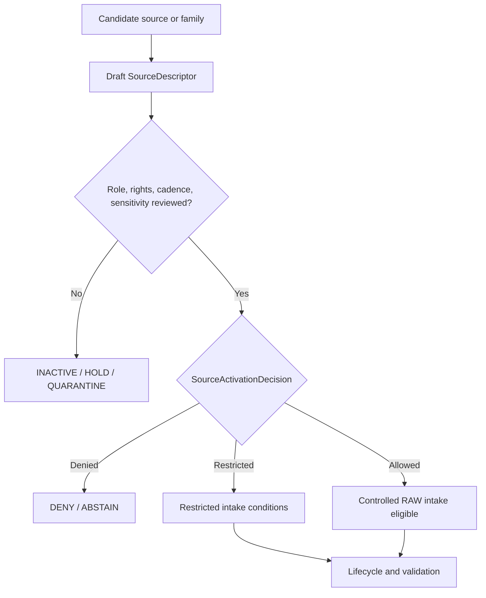

<!-- [KFM_META_BLOCK_V2]
doc_id: kfm://doc/NEEDS-VERIFICATION
title: Habitat Source Registry
type: standard
version: v1
status: draft
owners: OWNER_TBD
created: 2026-06-29
updated: 2026-06-29
policy_label: restricted-review
related: [../README.md, ../../README.md, ../../habitat/README.md, ../../habitat/sources/README.md, ecoregions/README.md, ../../../../docs/domains/habitat/SOURCE_REGISTRY.md, ../../../../docs/domains/habitat/SOURCE_FAMILIES.md, ../../../../docs/domains/habitat/HABITAT_SOURCE_LEDGER.md]
tags: [kfm, data, registry, sources, habitat, source-descriptor, source-role, rights, sensitivity, evidence, provenance, admission, release-gated, no-public-path]
notes: ["Replaces the empty README at data/registry/sources/habitat/README.md.", "This subtype-first lane is named by Habitat source-registry docs as the machine-readable Habitat source registry home.", "Domain-first Habitat registry material also exists under data/registry/habitat/ and data/registry/habitat/sources/; final topology remains NEEDS VERIFICATION.", "Habitat source registry records are admission and authority-control records, not source payloads, proof closure, catalog closure, policy, release authority, or public output."]
[/KFM_META_BLOCK_V2] -->

<a id="top"></a>

# Habitat Source Registry

Machine-readable orientation lane for Habitat source descriptor and source-admission records.

> [!IMPORTANT]
> **Status:** experimental  
> **Owners:** OWNER_TBD  
> **Path:** `data/registry/sources/habitat/`  
> **Truth posture:** cite-or-abstain; deny-by-default source admission; no public path from registry internals.


**Quick links:** [Scope](#scope) | [Repo fit](#repo-fit) | [Inputs](#accepted-inputs) | [Exclusions](#exclusions) | [Habitat source boundary](#habitat-source-boundary) | [Source families](#source-families) | [Admission flow](#admission-flow) | [Required checks](#required-checks-before-use)

> [!CAUTION]
> This directory is a registry lane, not a data lake. It may describe how Habitat sources are admitted, restricted, quarantined, denied, superseded, or reviewed. It must not store source payloads, sensitive joined details, proofs, catalogs, policies, release manifests, map tiles, generated summaries, or public API/UI artifacts.

## Scope

`data/registry/sources/habitat/` is the subtype-first Habitat source registry lane. Its job is to keep source admission inspectable before source material enters the KFM lifecycle.

A Habitat source registry record may answer:

- What source is being considered or admitted?
- What canonical `source_role` is declared for that source?
- What rights, terms, attribution, cadence, steward, native version, sensitivity, and authority limits apply?
- What source families, source heads, activation decisions, validation receipts, proof references, catalog references, correction notices, and rollback targets are linked?
- What must remain denied, restricted, quarantined, or unresolved before downstream use?

A source descriptor does not prove a habitat claim. It only records the conditions under which a source may shape later evidence processing.

## Repo fit

| Relationship | Path | Status | Notes |
| --- | --- | --- | --- |
| This lane | `data/registry/sources/habitat/` | CONFIRMED | Existing subtype-first Habitat source registry path. |
| Cross-domain source registry parent | [`../README.md`](../README.md) | CONFIRMED | Establishes source registry as admission and authority-control surface. |
| Data registry root | [`../../README.md`](../../README.md) | NEEDS VERIFICATION | Linked for registry context; current contents not re-audited for this update. |
| Ecoregions child lane | [`ecoregions/README.md`](ecoregions/README.md) | CONFIRMED | Child README for ecoregion/context-fabric source descriptors. |
| Domain-first Habitat registry parent | [`../../habitat/README.md`](../../habitat/README.md) | CONFIRMED | Existing companion lane; marks path topology as unresolved. |
| Domain-first Habitat sources lane | [`../../habitat/sources/README.md`](../../habitat/sources/README.md) | CONFIRMED | Existing companion lane; warns against divergent source descriptor authority. |
| Human-facing Habitat source registry | [`../../../../docs/domains/habitat/SOURCE_REGISTRY.md`](../../../../docs/domains/habitat/SOURCE_REGISTRY.md) | CONFIRMED | Admission and activation control surface for maintainers. |
| Habitat source-family dossiers | [`../../../../docs/domains/habitat/SOURCE_FAMILIES.md`](../../../../docs/domains/habitat/SOURCE_FAMILIES.md) | CONFIRMED | Per-family descriptions; descriptors remain the authority. |
| Habitat source ledger | [`../../../../docs/domains/habitat/HABITAT_SOURCE_LEDGER.md`](../../../../docs/domains/habitat/HABITAT_SOURCE_LEDGER.md) | CONFIRMED | Deny-by-default posture and source-family inventory. |

### Path posture

This README follows the subtype-first pattern because current Habitat docs name `data/registry/sources/habitat/` as the machine-readable Habitat source registry home, and because the cross-domain parent `data/registry/sources/README.md` describes per-domain source subfolders.

NEEDS VERIFICATION: domain-first source registry material also exists under `data/registry/habitat/` and `data/registry/habitat/sources/`. Until an ADR, directory-rule update, migration note, or registry topology decision settles the relationship, maintain one authoritative descriptor record and use pointers or redirect notes rather than divergent copies.

## Accepted inputs

Accepted material is compact, reviewable, and pointer-based:

- `SourceDescriptor` instances or descriptor pointers for Habitat source families.
- Source-family README files and local index files.
- Source-head metadata summaries: upstream version, edition, native class system, source vintage, endpoint, checksum, manifest, publication date, and spatial/temporal scope.
- Source role, authority scope, rights, terms, attribution, cadence, steward, reviewer, and sensitivity metadata.
- `SourceActivationDecision` references or activation sidecars where the accepted registry pattern allows them.
- Supersession, withdrawal, stale-state, embargo, correction, quarantine, and rollback references.
- Pointers to validation receipts, model or aggregation receipts, proof packs, catalog records, policy decisions, release candidates, correction notices, and rollback cards.
- Crosswalk references that preserve native classification systems and record transform loss.

Use `NEEDS VERIFICATION`, `UNKNOWN`, `ABSTAIN`, or `DENY` rather than filling missing rights, cadence, owner, source-role, schema, or sensitivity facts with plausible defaults.

## Exclusions

| Do not place here | Use instead | Why |
| --- | --- | --- |
| Raw source downloads, shapefiles, GeoPackages, rasters, COGs, PMTiles, source-native tables, API dumps, or zipped packages | `data/raw/habitat/`, `data/work/habitat/`, `data/quarantine/habitat/`, or `data/processed/habitat/` after path verification | Registry records are not payload storage. |
| Policy rules, sensitivity rules, rights rules, access-control logic, or release rules | `policy/` roots after ownership verification | Policy authority must stay separate from source metadata. |
| JSON Schema, semantic contracts, DTOs, or validator code | `schemas/`, `contracts/`, `tools/validators/`, or tests after verification | This lane may hold instances and indexes, not schema or code authority. |
| Validation receipts, run receipts, redaction receipts, or process logs | `data/receipts/` after verification | Receipts are process-memory objects. |
| EvidenceBundles, proof packs, signatures, or citation-validation closure | `data/proofs/` after verification | Proof is a separate object family. |
| STAC, DCAT, PROV, domain catalog records, or graph/triplet projections | `data/catalog/` and triplet lanes after verification | Catalog and graph projections are downstream. |
| Release manifests, promotion decisions, correction notices, rollback cards, supersession notices, or withdrawal notices | `release/` after verification | Publication and correction are governed release objects. |
| Public tiles, dashboards, screenshots, generated summaries, app payloads, or API/UI artifacts | Governed APIs and released artifacts | Public clients must not consume registry internals. |
| Species occurrence truth, plant taxon truth, rare-location details, hydrologic truth, soil truth, or land/title truth | Owning domain lanes | Habitat may consume governed context without absorbing neighbor authority. |

## Habitat source boundary

| Rule | Handling |
| --- | --- |
| Registry is admission control | It records how a source may be treated before intake. It does not contain the source payload or prove claims. |
| Source role is canonical | Use only `observed`, `regulatory`, `modeled`, `aggregate`, `administrative`, `candidate`, or `synthetic` in new descriptors unless the active schema says otherwise. |
| Role is not inferred | A filename, provider name, map service, or visual appearance does not establish the role. Review does. |
| Habitat does not own occurrence truth | Occurrence aggregators, Fauna records, Flora records, and heritage records are governed context unless their owning lanes release public-safe derivatives. |
| Sensitive joins fail closed | Public-safe habitat context can become restricted when joined to sensitive occurrence, rare-species, cultural, archaeological, stewardship, infrastructure, or living-person context. |
| Native classifications are preserved | NLCD, NWI, GAP, LANDFIRE, NatureServe, PAD-US, EPA ecoregions, PLSS, WBD/HUC12, and local systems must retain native versions and classification meaning. |
| Crosswalks are advisory | Crosswalks must record method, source versions, known loss, review state, and rollback target. They do not silently become truth. |
| Models are not observations | Modeled suitability, ecological-system, fire, vegetation, or restoration-priority layers require model identity, run receipts, uncertainty, and role preservation. |
| Regulatory products remain scoped | Critical habitat, wetland designations, stewardship overlays, and protected-area inventories retain issuing authority and authority limits. |
| Publication is separate | Release requires validation, policy, review, evidence/proof support, catalog support, release state, correction path, and rollback target. |

## Source families

The table is an orientation surface, not an activation decision. Each admitted source needs its own descriptor and review.

| Family | Typical role | Habitat use | Default blockers |
| --- | --- | --- | --- |
| Land cover, including NLCD-style products | `observed` or `aggregate` by product | Habitat patch context, land-cover summaries, suitability inputs | Vintage, native classes, rights, cadence, and aggregation scope. |
| Wetlands, including NWI-style products | `observed`, `regulatory`, or `administrative` by product | Wetland and riparian habitat context | Product-specific role, legal framing, Cowardin/native classes, and update strategy. |
| GAP / LANDFIRE / ecological systems | `modeled` or `aggregate` by product | Ecological systems, vegetation, habitat suitability context | Model/run identity, uncertainty, native classification, and role-collapse risk. |
| Critical habitat and regulatory services | `regulatory` | Designation context and regulated overlay review | Issuing authority, species/taxon ownership, legal scope, join sensitivity. |
| Stewardship and protected-area context | `administrative` | Stewardship zones, conservation context, protected-area overlays | Boundary vintage, rights, sovereign/steward restrictions, and administrative-truth limits. |
| Occurrence context aggregators | `observed` as foreign-owned context, or `candidate` before review | Habitat joins against occurrence context | Fauna/Flora ownership, geoprivacy, sensitive taxa, and public-safe geometry. |
| Remote-sensing vegetation indices | `observed`, `modeled`, or `aggregate` by product | Vegetation condition, change, and contextual signals | Sensor/product lineage, model status, temporal window, and uncertainty. |
| Field surveys and steward-reviewed datasets | `observed` or `candidate` before review | Ground observations and reviewed habitat records | Steward terms, precise-location sensitivity, review state, and access controls. |
| Ecoregions and landscape context fabric | `administrative` or `aggregate` by product | Stratification, filtering, ecoregion/watershed/survey-unit context | Topology, hydrology ownership, classification version, and context-as-truth risk. |

See [`ecoregions/README.md`](ecoregions/README.md) for the confirmed child-lane README covering EPA ecoregions, PLSS, WBD/HUC12, and related context-fabric admission concerns.

## Admission flow



A passing activation decision does not publish anything. It only permits controlled intake under the declared conditions. The lifecycle still has to move through RAW, WORK or QUARANTINE, PROCESSED, CATALOG or TRIPLET, and PUBLISHED gates with receipts, proof support, policy, review, release state, correction path, and rollback target.

## Directory shape

Current confirmed child lanes:

```text
data/registry/sources/habitat/
|-- README.md
`-- ecoregions/
    `-- README.md
```

PROPOSED future child lanes, if topology and descriptor ownership are accepted:

```text
data/registry/sources/habitat/
|-- README.md
|-- land_cover/
|   |-- README.md
|   `-- index.local.json
|-- wetlands/
|   |-- README.md
|   `-- index.local.json
|-- ecological_systems/
|   |-- README.md
|   `-- index.local.json
|-- critical_habitat/
|   |-- README.md
|   `-- index.local.json
|-- stewardship/
|   |-- README.md
|   `-- index.local.json
|-- occurrence_context/
|   |-- README.md
|   `-- index.local.json
|-- remote_sensing/
|   |-- README.md
|   `-- index.local.json
|-- field_surveys/
|   |-- README.md
|   `-- index.local.json
|-- ecoregions/
|   |-- README.md
|   `-- index.local.json
`-- index.local.json
```

Do not create child directories merely for taxonomy neatness. Add them only when there is a reviewed descriptor, migration note, source-family need, or stewardship path.

## Descriptor sketch

Illustrative only. Confirm the active schema before creating records.

```json
{
  "id": "kfm-source:habitat:<source-family>:<stable-source-id>",
  "record_type": "source_descriptor",
  "domain": "habitat",
  "source_family": "land_cover | wetlands | ecological_systems | critical_habitat | stewardship | occurrence_context | remote_sensing | field_surveys | ecoregions | other",
  "source_name": "SOURCE_NAME_TBD",
  "source_role": "observed | regulatory | modeled | aggregate | administrative | candidate | synthetic",
  "role_authority": "ROLE_AUTHORITY_TBD",
  "native_classification_system": "NATIVE_SYSTEM_TBD",
  "native_version": "VERSION_TBD",
  "authority_scope": "AUTHORITY_SCOPE_TBD",
  "rights_posture": "RIGHTS_TBD",
  "sensitivity_posture": "SENSITIVITY_TBD",
  "cadence": "CADENCE_TBD",
  "source_head_ref": "SOURCE_HEAD_TBD",
  "activation_decision_ref": "ACTIVATION_DECISION_TBD",
  "validation_receipts": [],
  "proof_refs": [],
  "catalog_refs": [],
  "policy_refs": [],
  "review_state": "draft",
  "release_state": "not_released",
  "correction_path": "CORRECTION_PATH_TBD",
  "rollback_target": "ROLLBACK_TARGET_TBD",
  "notes": [
    "NEEDS VERIFICATION: confirm schema, owner, source role, rights, cadence, sensitivity, and topology before use."
  ]
}
```

## Required checks before use

- [ ] Confirm final topology for `data/registry/sources/habitat/` versus `data/registry/habitat/sources/`.
- [ ] Confirm active SourceDescriptor schema path and field names. Current docs show schema-home drift between singular and plural path forms.
- [ ] Confirm owner, reviewer, rights steward, sensitivity steward, policy steward, proof steward, and release steward.
- [ ] Confirm canonical source-role enum and any role-conditional required fields.
- [ ] Confirm rights, terms, redistribution, attribution, expiration, and derivative-use posture for each source.
- [ ] Confirm cadence, source-head identity, native version, classification system, spatial scope, and temporal scope.
- [ ] Confirm sensitive-join handling before any Habitat product joins Fauna, Flora, heritage, rare-species, cultural, archaeological, infrastructure, or living-person context.
- [ ] Confirm crosswalk loss, method, source versions, review state, and rollback target.
- [ ] Confirm validation receipts before using descriptors in processed, catalog, triplet, or published surfaces.
- [ ] Confirm public use only through governed APIs and released artifacts.

## Status notes

| Claim | Label | Evidence / limit |
| --- | --- | --- |
| This README replaced an empty file at the target path. | CONFIRMED | GitHub contents read before update showed only a blank line. |
| `data/registry/sources/README.md` defines source registry as admission and authority-control surface. | CONFIRMED | Current repo file inspected during this update. |
| Habitat docs name `data/registry/sources/habitat/` as the machine-readable source registry home. | CONFIRMED | Current Habitat source-registry and source-ledger docs were inspected. |
| Domain-first Habitat registry material also exists. | CONFIRMED | `data/registry/habitat/README.md` and `data/registry/habitat/sources/README.md` were inspected. |
| Final topology between subtype-first and domain-first Habitat registry lanes is settled. | NEEDS VERIFICATION | Existing docs explicitly preserve the path-form question. |
| Concrete Habitat SourceDescriptor payloads exist in this lane. | UNKNOWN | Not verified in this session. |
| This README grants activation, publication, or public access. | DENY | Activation and publication require separate governed decisions and release gates. |

## Maintainer note

Keep the registry membrane visible:

```text
SourceDescriptor -> SourceActivationDecision -> RAW -> WORK / QUARANTINE -> PROCESSED -> CATALOG / TRIPLET -> PUBLISHED
```

The source registry can admit, restrict, hold, or deny sources. It cannot make a Habitat claim true, publish a layer, bypass policy, or replace EvidenceBundle-backed review.

[Back to top](#top)
