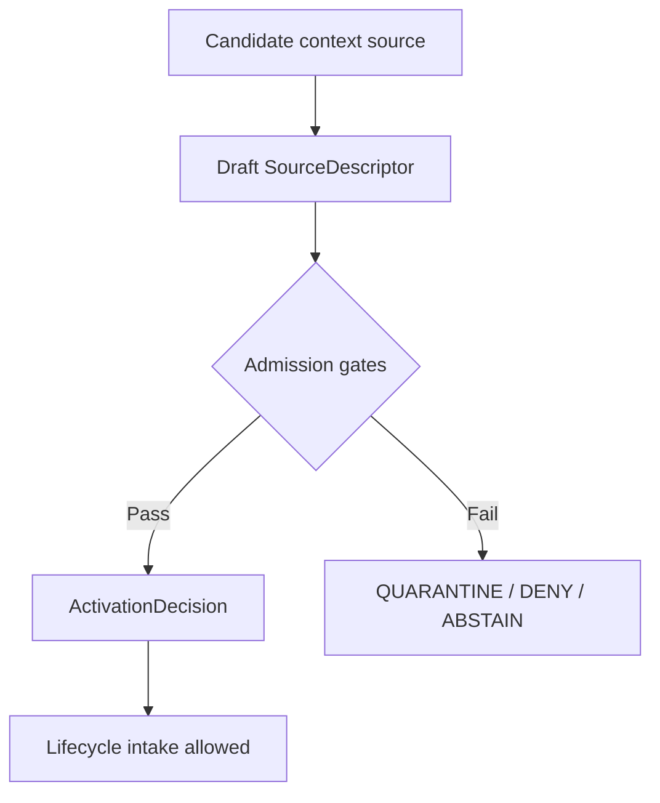

<!-- [KFM_META_BLOCK_V2]
doc_id: kfm://doc/NEEDS-VERIFICATION
title: Habitat Ecoregions Source Registry
type: standard
version: v1
status: draft
owners: OWNER_TBD
created: 2026-06-29
updated: 2026-06-29
policy_label: restricted-review
related: [../README.md, ../../../habitat/README.md, ../../../habitat/sources/README.md, ../../../../../docs/domains/habitat/SOURCE_REGISTRY.md, ../../../../../docs/domains/habitat/SOURCE_FAMILIES.md, ../../../../../docs/domains/habitat/HABITAT_SOURCE_LEDGER.md]
tags: [kfm, data, registry, sources, habitat, ecoregions, source-descriptor, context-layer, evidence, provenance, rights, sensitivity, release-gated]
notes: ["Replaces the one-character stub at data/registry/sources/habitat/ecoregions/README.md.", "Immediate parent data/registry/sources/habitat/README.md is currently empty; domain-first Habitat registry docs provide the stronger current evidence.", "EPA ecoregions, PLSS, and WBD HUC12 are treated as adjacent context fabric until source records, rights, cadence, and topology are verified."]
[/KFM_META_BLOCK_V2] -->

# Habitat Ecoregions Source Registry

Admission guidance for ecoregion and landscape-context source descriptors used by the KFM Habitat domain.

> [!IMPORTANT]
> **Status:** experimental  
> **Owners:** OWNER_TBD  
> **Path:** `data/registry/sources/habitat/ecoregions/`  
> **Truth posture:** cite-or-abstain; source descriptors are not habitat truth, publication approval, or public access paths.


**Quick links:** [Scope](#scope) | [Repo fit](#repo-fit) | [Inputs](#accepted-inputs) | [Exclusions](#exclusions) | [Boundary](#ecoregions-source-boundary) | [Admission flow](#admission-flow) | [Required checks](#required-checks-before-use)

> [!CAUTION]
> This registry lane does not publish ecoregion layers, grant source activation, or authorize habitat claims. It only documents what source descriptor records may live here and what gates must close before those records can support downstream work.

## Scope

This directory is the subtype-first Habitat source registry lane for ecoregion, survey-unit, watershed-boundary, and related landscape-context source descriptors.

It is meant to answer maintainers' first questions before admitting a source:

- What source family is this record part of?
- What source role does it claim under KFM's canonical role vocabulary?
- What native classification, version, rights posture, cadence, spatial scope, and authority limit must be preserved?
- What evidence, validation, review, sensitivity, and release gates must be satisfied before downstream use?

CONFIRMED from current repo evidence: the target file existed as a one-character stub before this README replaced it. The stronger Habitat source-registry doctrine currently lives in the domain-first Habitat registry documentation and related Habitat docs.

## Repo fit

| Relationship | Path | Status | Notes |
| --- | --- | --- | --- |
| This child lane | `data/registry/sources/habitat/ecoregions/` | CONFIRMED | Existing subtype-first child path for Habitat ecoregion/context source descriptors. |
| Immediate parent | [`../README.md`](../README.md) | CONFIRMED, thin | Parent file exists but is currently empty; do not infer complete parent behavior from it. |
| Domain-first Habitat registry | [`../../../habitat/README.md`](../../../habitat/README.md) | CONFIRMED | Describes Habitat registry boundaries and flags topology questions. |
| Domain-first Habitat sources | [`../../../habitat/sources/README.md`](../../../habitat/sources/README.md) | CONFIRMED | Points to `data/registry/sources/habitat/` as the machine-readable source registry lane while keeping topology NEEDS VERIFICATION. |
| Human-facing source registry | [`../../../../../docs/domains/habitat/SOURCE_REGISTRY.md`](../../../../../docs/domains/habitat/SOURCE_REGISTRY.md) | CONFIRMED | Describes source admission, source authority, and open path-form questions. |
| Source-family dossiers | [`../../../../../docs/domains/habitat/SOURCE_FAMILIES.md`](../../../../../docs/domains/habitat/SOURCE_FAMILIES.md) | CONFIRMED | Lists EPA ecoregions, PLSS, and WBD HUC12 as adjacent context-fabric families with PROPOSED ownership/scope. |
| Habitat source ledger | [`../../../../../docs/domains/habitat/HABITAT_SOURCE_LEDGER.md`](../../../../../docs/domains/habitat/HABITAT_SOURCE_LEDGER.md) | CONFIRMED | Establishes deny-by-default admission and activation-decision expectations. |

### Path posture

This README follows the existing subtype-first path because the file already exists here and the Habitat registry docs name `data/registry/sources/habitat/` as a machine-readable source registry home.

NEEDS VERIFICATION: the repository also contains domain-first Habitat source-registry material under `data/registry/habitat/sources/`. Until an ADR or migration note settles topology, maintainers should avoid divergent authority between the two forms.

## Accepted inputs

This lane may hold source registry records and local indexes for context-fabric source families, not source payloads. Acceptable contents include:

- `SourceDescriptor` records for ecoregion, survey-unit, watershed-boundary, and ecoregion-crosswalk source families.
- Local index files that point to descriptor records, source heads, validation receipts, rights notes, activation decisions, and review records.
- Source-head references for upstream version, edition, publication date, classification level, spatial extent, and checksum or manifest identity.
- Rights and terms evidence sufficient to decide whether the source can be admitted, restricted, quarantined, or denied.
- Cadence and vintage notes showing whether the source is static, periodically refreshed, superseded, or requires watcher review.
- Crosswalk references that preserve native classification systems and clearly mark lossy transforms.
- Validation pointers to receipts, proofs, catalog records, release gates, or rollback targets once those artifacts exist.

Every descriptor should preserve source role, authority scope, native classification, rights posture, sensitivity posture, and review state. Where evidence is insufficient, use `NEEDS VERIFICATION`, `UNKNOWN`, `ABSTAIN`, or `DENY` rather than filling gaps with plausible prose.

## Exclusions

Do not place the following in this directory:

| Excluded material | Use instead | Why |
| --- | --- | --- |
| Raw shapefiles, GeoPackages, rasters, zipped downloads, API dumps, or extracted GIS payloads | `data/raw/habitat/`, `data/work/habitat/`, `data/quarantine/habitat/`, or `data/processed/habitat/` after path verification | Registry records are not payload storage. |
| Policy rules, sensitivity policies, release rules, or deny/abstain logic | `policy/` roots after ownership verification | Policy authority must not be hidden in a source lane. |
| Schemas, contracts, DTOs, or validation code | `schemas/`, `contracts/`, or implementation roots after verification | Source registry content must not create parallel schema authority. |
| Receipts, proofs, catalogs, manifests, or release bundles | `data/receipts/`, `data/proofs/`, catalog roots, or `release/` after verification | These are separate object families in the KFM trust membrane. |
| Public tiles, map layers, screenshots, dashboards, or generated summaries | Released artifacts and governed APIs | Public clients must not read source registry internals as a normal path. |
| Species occurrence truth, rare species locations, or heritage occurrence records | Fauna, Flora, or heritage-owned source lanes | Habitat may use governed context, but it does not own occurrence truth. |
| Hydrologic truth or water-boundary canonical authority | Hydrology-owned lanes | WBD/HUC12 can support Habitat context, but Habitat does not become hydrologic authority. |

## Ecoregions source boundary

Ecoregions and adjacent context fabrics help locate, stratify, compare, or summarize habitat evidence. They do not, by themselves, prove habitat condition, habitat presence, protected status, restoration success, or species occurrence.

Keep these rules visible in every descriptor review:

- Use canonical KFM source roles only: `observed`, `regulatory`, `modeled`, `aggregate`, `administrative`, `candidate`, or `synthetic`.
- Treat `context` as a family or use case, not as an unapproved source-role value.
- Preserve the native classification system, level, edition, and version. Do not silently collapse EPA Level III, EPA Level IV, PLSS units, WBD HUC12 boundaries, or local crosswalks into one geometry truth.
- Crosswalks are advisory unless validated and reviewed. They must record transform method, source versions, known loss, and rollback target.
- WBD/HUC12 inputs are hydrologic context when used here. Habitat use does not transfer Hydrology ownership.
- Joins against Fauna, Flora, heritage, rare-species, archaeological, cultural, living-person, or other sensitive lanes fail closed until policy and evidence allow release.
- Derived ecoregion summaries require aggregation or model receipts before they can support consequential claims.

## Source families

| Family | Typical role | What it can support | Default blockers |
| --- | --- | --- | --- |
| EPA ecoregions | `administrative` or `aggregate`, depending on descriptor evidence | Landscape/ecoregion context, stratification, map filtering, comparison units | Rights, cadence, version, classification level, and context-as-truth risk. |
| PLSS survey units | `administrative` | Survey/location context and historical spatial referencing | Does not prove habitat, occurrence, or ecological condition. |
| WBD/HUC12 | `administrative` or `aggregate` | Watershed context for Habitat joins and summaries | Hydrology ownership, boundary vintage, and hydrologic-truth confusion. |
| State or regional ecoregion crosswalks | `administrative` or `aggregate` | Localized context or classification bridge | Crosswalk loss, conflicting systems, undocumented transform method. |
| Derived habitat ecoregion summaries | `aggregate` or `modeled` | Reviewed summary claims over a released context fabric | Missing `AggregationReceipt`, `ModelRunReceipt`, policy review, or release decision. |
| Candidate context source | `candidate` | Intake evaluation only | Source cannot support claims until admission and activation gates close. |

## Admission flow



Admission is not publication. A passing activation decision only makes controlled intake eligible. Downstream public use still depends on validation, provenance, policy, review, release state, correction path, and rollback target.

## Directory shape

Recommended local shape for this child lane:

```text
data/registry/sources/habitat/ecoregions/
|-- README.md
|-- epa_ecoregions/
|   |-- README.md
|   `-- index.local.json
|-- plss/
|   |-- README.md
|   `-- index.local.json
|-- wbd_huc12/
|   |-- README.md
|   `-- index.local.json
|-- crosswalks/
|   |-- README.md
|   `-- index.local.json
`-- index.local.json
```

PROPOSED: child directories should remain local indexes and descriptor homes only. Do not add source payloads or derived products here.

## Descriptor sketch

Illustrative only. Confirm the active SourceDescriptor schema before creating records.

```json
{
  "id": "kfm-source:habitat:ecoregions:<stable-source-id>",
  "record_type": "source_descriptor",
  "domain": "habitat",
  "source_family": "ecoregion | survey_unit | watershed_boundary | ecoregion_crosswalk | derived_summary | other",
  "source_name": "SOURCE_NAME_TBD",
  "source_role": "observed | regulatory | modeled | aggregate | administrative | candidate | synthetic",
  "native_classification_system": "EPA ecoregion | PLSS | WBD HUC12 | SOURCE_SYSTEM_TBD",
  "native_version": "VERSION_TBD",
  "authority_scope": "AUTHORITY_SCOPE_TBD",
  "spatial_scope": "SPATIAL_SCOPE_TBD",
  "temporal_scope": "TEMPORAL_SCOPE_TBD",
  "rights_posture": "RIGHTS_TBD",
  "sensitivity_posture": "SENSITIVITY_TBD",
  "cadence": "CADENCE_TBD",
  "source_head_ref": "SOURCE_HEAD_TBD",
  "activation_decision_ref": "ACTIVATION_DECISION_TBD",
  "validation_receipts": [],
  "policy_refs": [],
  "review_state": "draft",
  "release_state": "not_released",
  "rollback_target": "ROLLBACK_TARGET_TBD",
  "notes": [
    "NEEDS VERIFICATION: confirm active schema, owner, rights, cadence, native version, and topology before use."
  ]
}
```

## Required checks before use

- [ ] Confirm final topology for `data/registry/sources/habitat/` versus `data/registry/habitat/sources/`.
- [ ] Confirm active SourceDescriptor schema and allowed source-role enum.
- [ ] Confirm owner, steward, and reviewer for this child lane.
- [ ] Confirm rights, terms, attribution, redistribution, and derivative-use posture for each source.
- [ ] Confirm native classification system, level, version, publication date, and spatial extent.
- [ ] Confirm cadence and watcher expectations before marking a source refreshable.
- [ ] Confirm sensitivity rules for joins against Fauna, Flora, heritage, occurrence, cultural, archaeological, infrastructure, or living-person lanes.
- [ ] Confirm that crosswalks record method, loss, source versions, review state, and rollback target.
- [ ] Confirm validation receipts before using a descriptor in processed, catalog, triplet, or published surfaces.
- [ ] Confirm public use through governed APIs and released artifacts only.

## Status notes

| Claim | Label | Evidence / limit |
| --- | --- | --- |
| This README replaced a one-character stub at the target path. | CONFIRMED | Verified by GitHub contents read before update. |
| `data/registry/sources/habitat/README.md` exists but is thin. | CONFIRMED | GitHub contents read showed an empty immediate parent README. |
| Domain-first Habitat registry docs exist and flag topology questions. | CONFIRMED | Current repo docs under `data/registry/habitat/` and `data/registry/habitat/sources/` were inspected. |
| EPA ecoregions, PLSS, and WBD HUC12 are adjacent context-fabric families. | CONFIRMED as documented; PROPOSED for final source ownership | Habitat source-family documentation describes these as proposed adjacent context-fabric families. |
| Concrete ecoregion source descriptor payloads already exist here. | UNKNOWN | Not verified in this session. |
| This README grants source activation or public access. | DENY | Source activation and publication require separate governed decisions and release gates. |

## Maintainer note

Keep the chain inspectable:

```text
SourceDescriptor -> SourceActivationDecision -> RAW -> WORK / QUARANTINE -> PROCESSED -> CATALOG / TRIPLET -> PUBLISHED
```

Never collapse `ecoregion descriptor exists` into `habitat claim is true`. Ecoregion/context sources can support governed interpretation only after evidence, rights, sensitivity, validation, review, policy, release, correction, and rollback checks are satisfied.
