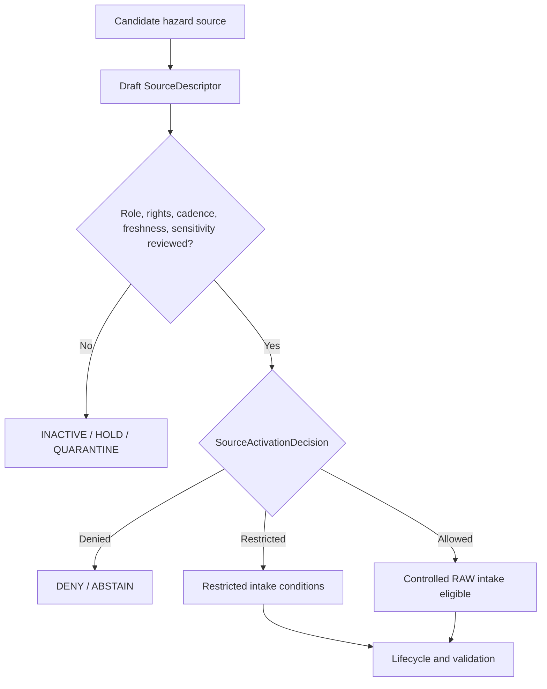

<!-- [KFM_META_BLOCK_V2]
doc_id: kfm://doc/NEEDS-VERIFICATION
title: Hazards Source Registry
type: standard
version: v1
status: draft
owners: OWNER_TBD
created: 2026-06-29
updated: 2026-06-29
policy_label: restricted-review
related: [../README.md, ../../README.md, ../../hazards/README.md, ../../hazards/sources/README.md, ../../../../docs/domains/hazards/README.md, ../../../../docs/domains/hazards/SOURCE_REGISTRY.md, ../../../../docs/domains/hazards/SOURCES.md, ../../../../docs/domains/hazards/SOURCE_ROLE_MATRIX.md]
tags: [kfm, data, registry, sources, hazards, source-descriptor, source-role, freshness, rights, sensitivity, not-an-alert-system, evidence, provenance, admission, release-gated, no-public-path]
notes: ["Replaces the one-character stub at data/registry/sources/hazards/README.md.", "This subtype-first lane is named by Hazards source-registry docs as the machine-readable Hazards source registry home.", "Domain-first Hazards registry material also exists under data/registry/hazards/ and data/registry/hazards/sources/; final topology remains NEEDS VERIFICATION.", "Hazards source registry records are admission and authority-control records, not source payloads, current operational guidance, proof closure, catalog closure, policy, release authority, or public output."]
[/KFM_META_BLOCK_V2] -->

<a id="top"></a>

# Hazards Source Registry

Machine-readable orientation lane for Hazards source descriptor and source-admission records.

> [!IMPORTANT]
> **Status:** experimental  
> **Owners:** OWNER_TBD  
> **Path:** `data/registry/sources/hazards/`  
> **Truth posture:** cite-or-abstain; deny-by-default source admission; not an emergency alert system; no public path from registry internals.


**Quick links:** [Scope](#scope) | [Repo fit](#repo-fit) | [Inputs](#accepted-inputs) | [Exclusions](#exclusions) | [Hazards source boundary](#hazards-source-boundary) | [Source families](#source-families) | [Admission flow](#admission-flow) | [Required checks](#required-checks-before-use)

> [!CAUTION]
> KFM Hazards is not an emergency alert system. Operational warning, watch, advisory, fire, smoke, flood, earthquake, drought, or emergency-management feeds may be preserved as evidence or context only. They must not become life-safety instructions, official-source substitutes, public alert surfaces, or current operational guidance through this registry.

## Scope

`data/registry/sources/hazards/` is the subtype-first Hazards source registry lane. Its job is to keep source admission inspectable before hazard-related source material enters the KFM lifecycle.

A Hazards source registry record may answer:

- What source family, authority, endpoint, product, or dataset is being considered or admitted?
- What canonical `source_role` is declared for that source?
- What rights, terms, attribution, cadence, source time, retrieval time, freshness posture, steward, native version, sensitivity, and authority limits apply?
- What source heads, activation decisions, validation receipts, model or aggregation receipts, proof references, catalog references, correction notices, stale-state records, and rollback targets are linked?
- What must remain denied, restricted, quarantined, expired, stale, or unresolved before downstream use?

A source descriptor does not prove a hazard claim and does not publish a warning. It records the conditions under which a source may shape later evidence processing.

## Repo fit

| Relationship | Path | Status | Notes |
| --- | --- | --- | --- |
| This lane | `data/registry/sources/hazards/` | CONFIRMED | Existing subtype-first Hazards source registry path. |
| Cross-domain source registry parent | [`../README.md`](../README.md) | CONFIRMED | Establishes source registry as admission and authority-control surface. |
| Data registry root | [`../../README.md`](../../README.md) | NEEDS VERIFICATION | Linked for registry context; current contents not re-audited for this update. |
| Domain-first Hazards registry parent | [`../../hazards/README.md`](../../hazards/README.md) | CONFIRMED | Existing companion lane; marks path topology as unresolved. |
| Domain-first Hazards sources lane | [`../../hazards/sources/README.md`](../../hazards/sources/README.md) | CONFIRMED | Existing companion lane; warns against divergent source descriptor authority. |
| Hazards domain README | [`../../../../docs/domains/hazards/README.md`](../../../../docs/domains/hazards/README.md) | CONFIRMED | Defines the not-for-life-safety boundary and domain scope. |
| Human-facing Hazards source registry | [`../../../../docs/domains/hazards/SOURCE_REGISTRY.md`](../../../../docs/domains/hazards/SOURCE_REGISTRY.md) | CONFIRMED | Admission and authority-control surface for maintainers. |
| Hazards source dossier | [`../../../../docs/domains/hazards/SOURCES.md`](../../../../docs/domains/hazards/SOURCES.md) | CONFIRMED | Source families, rights/freshness posture, and descriptor discipline. |
| Hazards source-role matrix | [`../../../../docs/domains/hazards/SOURCE_ROLE_MATRIX.md`](../../../../docs/domains/hazards/SOURCE_ROLE_MATRIX.md) | CONFIRMED | Anti-collapse matrix for source roles and object families. |

### Path posture

This README follows the subtype-first pattern because current Hazards docs name `data/registry/sources/hazards/` as the machine-readable Hazards source registry home, and because the cross-domain parent `data/registry/sources/README.md` describes per-domain source subfolders.

NEEDS VERIFICATION: domain-first source registry material also exists under `data/registry/hazards/` and `data/registry/hazards/sources/`. Until an ADR, directory-rule update, migration note, or registry topology decision settles the relationship, maintain one authoritative descriptor record and use pointers or redirect notes rather than divergent copies.

## Accepted inputs

Accepted material is compact, reviewable, and pointer-based:

- `SourceDescriptor` instances or descriptor pointers for Hazards source families.
- Source-family README files and local index files.
- Source-head metadata summaries: upstream authority, endpoint, product version, native class system, source vintage, publication date, checksum, manifest, and spatial/temporal scope.
- Source role, authority scope, rights, terms, attribution, cadence, freshness posture, steward, reviewer, and sensitivity metadata.
- Source time, retrieval time, expiry time, stale-state posture, and public-use blockers for operational or near-real-time context.
- `SourceActivationDecision` references or activation sidecars where the accepted registry pattern allows them.
- Supersession, withdrawal, stale-state, embargo, correction, quarantine, denial, and rollback references.
- Pointers to validation receipts, model or aggregation receipts, proof packs, catalog records, policy decisions, release candidates, correction notices, and rollback cards.
- Crosswalk references that preserve authority IDs, native classifications, event IDs, product versions, and transform loss.

Use `NEEDS VERIFICATION`, `UNKNOWN`, `ABSTAIN`, or `DENY` rather than filling missing rights, cadence, freshness, owner, source-role, schema, or sensitivity facts with plausible defaults.

## Exclusions

| Do not place here | Use instead | Why |
| --- | --- | --- |
| Raw hazard feeds, warning captures, shapefiles, GeoPackages, rasters, COGs, PMTiles, source-native tables, API dumps, or zipped packages | `data/raw/hazards/`, `data/work/hazards/`, `data/quarantine/hazards/`, or `data/processed/hazards/` after path verification | Registry records are not payload storage. |
| Current operational guidance, life-safety instructions, emergency alerts, or official-source replacement text | DENY or redirect to official sources through governed surfaces | KFM Hazards is not an alert authority. |
| Policy rules, sensitivity rules, rights rules, freshness policy, access-control logic, or release rules | `policy/` roots after ownership verification | Policy authority must stay separate from source metadata. |
| JSON Schema, semantic contracts, DTOs, or validator code | `schemas/`, `contracts/`, `tools/validators/`, or tests after verification | This lane may hold instances and indexes, not schema or code authority. |
| Validation receipts, run receipts, redaction receipts, or process logs | `data/receipts/` after verification | Receipts are process-memory objects. |
| EvidenceBundles, proof packs, signatures, or citation-validation closure | `data/proofs/` after verification | Proof is a separate object family. |
| STAC, DCAT, PROV, domain catalog records, or graph/triplet projections | `data/catalog/` and triplet lanes after verification | Catalog and graph projections are downstream. |
| Release manifests, promotion decisions, correction notices, rollback cards, supersession notices, or withdrawal notices | `release/` after verification | Publication and correction are governed release objects. |
| Public tiles, dashboards, screenshots, generated summaries, app payloads, or API/UI artifacts | Governed APIs and released artifacts | Public clients must not consume registry internals. |
| Hydrology, atmosphere, infrastructure, road, archaeology, parcel, or living-person truth | Owning domain lanes | Hazards may consume governed context without absorbing neighbor authority. |

## Hazards source boundary

| Rule | Handling |
| --- | --- |
| Registry is admission control | It records how a source may be treated before intake. It does not contain the source payload or prove claims. |
| Not an alert system | Registry state must not become current operational guidance, emergency instruction, or alert authority. |
| Source role is canonical | Use only `observed`, `regulatory`, `modeled`, `aggregate`, `administrative`, `candidate`, or `synthetic` in new descriptors unless the active schema says otherwise. |
| Role is not inferred | A provider name, feed URL, map service, timestamp, or visual appearance does not establish the role. Review does. |
| Time-bound context expires | Warnings, watches, advisories, detections, and near-real-time products need source time, retrieval time, expiry/freshness posture, stale-state handling, and public-use blockers. |
| Regulatory is not observed | NFHL and other regulatory hazard layers must not be framed as observed flood, fire, seismic, or damage events. |
| Detection is not confirmation | FIRMS, HMS, reports, candidates, and remote-sensing detections require disposition and evidence review before being treated as confirmed event claims. |
| Administrative is not event truth | Declarations, rosters, programs, grants, and accounting records are administrative context unless independently supported. |
| Models are not observations | Forecast, risk, exposure, scenario, susceptibility, smoke, drought, or modeled hazard surfaces require model identity, run receipts, uncertainty, and role preservation. |
| Candidate is not published | Candidate records remain in WORK or QUARANTINE until a governed transition resolves their disposition. |
| Publication is separate | Release requires validation, policy, review, evidence/proof support, catalog support, release state, correction path, and rollback target. |

## Source families

The table is an orientation surface, not an activation decision. Each admitted source needs its own descriptor and review.

| Family | Typical role | Hazards use | Default blockers |
| --- | --- | --- | --- |
| NOAA Storm Events / NCEI | `observed` or `administrative` | Historical event and observation context | Source vintage, event IDs, rights, cadence, and narrative sensitivity. |
| NWS warnings, advisories, and watches | `observed` or `administrative`, context only | WarningContext and AdvisoryContext as time-bound historical/operational context | Not-for-life-safety boundary, issue time, expiry time, freshness, official-source redirect. |
| FEMA Disaster Declarations / OpenFEMA | `administrative`, plus `regulatory` where binding | DisasterDeclaration and administrative context | Declaration scope, legal force, version, rights, and event-vs-administration framing. |
| FEMA NFHL / MSC flood hazard | `regulatory` | FloodContext and regulatory flood-zone context | Regulatory-not-observed boundary, effective date, map revision, Hydrology ownership. |
| USGS Earthquake Catalog | `observed`, with modeled attributes where applicable | EarthquakeEvent and seismic observation context | Magnitude/location uncertainty, revision handling, source time, supersession. |
| USGS Water Data via Hydrology | `observed` | FloodContext cross-lane support | Hydrology ownership, freshness, gauge context, not Hazards-owned water truth. |
| NOAA HMS fire and smoke | `observed`, `modeled`, or `candidate` by product | SmokeContext and WildfireDetection context | Detection-not-confirmation, analyst vintage, model trajectory, Atmosphere ownership. |
| NASA FIRMS active fire | `observed` or `candidate` | WildfireDetection candidate and sensor-detection context | Detection caveats, confidence, review disposition, confirmed-fire framing. |
| Drought monitors and indicators | `modeled` or `aggregate` | DroughtIndicator and resilience context | Aggregation scope, per-place claim risk, cadence, model/indicator lineage. |
| Kansas and local emergency management | `administrative` or `candidate` | Local declaration, advisory, and emergency-management context | Rights, access controls, freshness, official-source substitution risk. |
| State or regional resilience plans | `administrative`, `modeled`, or `aggregate` by product | ResilienceSummary and planning context | Planning-not-event boundary, revision date, rights, model assumptions. |

## Admission flow



A passing activation decision does not publish anything and does not make KFM an alert authority. It only permits controlled intake under declared conditions. The lifecycle still has to move through RAW, WORK or QUARANTINE, PROCESSED, CATALOG or TRIPLET, and PUBLISHED gates with receipts, proof support, policy, review, freshness state, release state, correction path, and rollback target.

## Directory shape

Current confirmed state:

```text
data/registry/sources/hazards/
`-- README.md
```

PROPOSED future child lanes, if topology and descriptor ownership are accepted:

```text
data/registry/sources/hazards/
|-- README.md
|-- noaa_ncei_storm_events/
|   |-- README.md
|   `-- index.local.json
|-- nws_operational_context/
|   |-- README.md
|   `-- index.local.json
|-- fema_declarations/
|   |-- README.md
|   `-- index.local.json
|-- fema_nfhl/
|   |-- README.md
|   `-- index.local.json
|-- usgs_earthquake/
|   |-- README.md
|   `-- index.local.json
|-- fire_smoke_remote_sensing/
|   |-- README.md
|   `-- index.local.json
|-- drought_indicators/
|   |-- README.md
|   `-- index.local.json
|-- state_local_emergency_context/
|   |-- README.md
|   `-- index.local.json
|-- resilience_plans/
|   |-- README.md
|   `-- index.local.json
`-- index.local.json
```

Do not create child directories merely for taxonomy neatness. Add them only when there is a reviewed descriptor, migration note, source-family need, or stewardship path.

## Descriptor sketch

Illustrative only. Confirm the active schema before creating records.

```json
{
  "id": "kfm-source:hazards:<source-family>:<stable-source-id>",
  "record_type": "source_descriptor",
  "domain": "hazards",
  "source_family": "storm_events | operational_context | disaster_declarations | flood_hazard | earthquake | fire_smoke | drought | emergency_management | resilience_plans | other",
  "source_name": "SOURCE_NAME_TBD",
  "source_role": "observed | regulatory | modeled | aggregate | administrative | candidate | synthetic",
  "role_authority": "ROLE_AUTHORITY_TBD",
  "native_identifier_system": "NATIVE_ID_SYSTEM_TBD",
  "native_version": "VERSION_TBD",
  "authority_scope": "AUTHORITY_SCOPE_TBD",
  "rights_posture": "RIGHTS_TBD",
  "sensitivity_posture": "SENSITIVITY_TBD",
  "cadence": "CADENCE_TBD",
  "source_time_ref": "SOURCE_TIME_TBD",
  "retrieval_time_ref": "RETRIEVAL_TIME_TBD",
  "freshness_posture": "FRESHNESS_TBD",
  "expiry_time_ref": "EXPIRY_TIME_TBD_IF_APPLICABLE",
  "not_for_life_safety": true,
  "not_authoritative_for": [
    "life_safety_alerting",
    "official_emergency_instruction"
  ],
  "source_head_ref": "SOURCE_HEAD_TBD",
  "activation_decision_ref": "ACTIVATION_DECISION_TBD",
  "validation_receipts": [],
  "proof_refs": [],
  "catalog_refs": [],
  "policy_refs": [],
  "review_state": "draft",
  "release_state": "not_released",
  "correction_path": "CORRECTION_PATH_TBD",
  "rollback_target": "ROLLBACK_TARGET_TBD",
  "notes": [
    "NEEDS VERIFICATION: confirm schema, owner, source role, rights, cadence, freshness, sensitivity, and topology before use."
  ]
}
```

## Required checks before use

- [ ] Confirm final topology for `data/registry/sources/hazards/` versus `data/registry/hazards/sources/`.
- [ ] Confirm active SourceDescriptor schema path and field names. Current docs show schema-home drift between singular and plural path forms.
- [ ] Confirm owner, reviewer, rights steward, sensitivity steward, policy steward, proof steward, release steward, and release-safety reviewer.
- [ ] Confirm canonical source-role enum and any role-conditional required fields.
- [ ] Confirm rights, terms, redistribution, attribution, expiration, and derivative-use posture for each source.
- [ ] Confirm cadence, source-head identity, native version, authority scope, spatial scope, temporal scope, source time, retrieval time, and expiry/freshness posture.
- [ ] Confirm not-for-life-safety handling before admitting operational warning, advisory, watch, or emergency-management context.
- [ ] Confirm official-source redirect behavior before any public or semi-public Hazards surface is released.
- [ ] Confirm sensitive-join handling before Hazards products join infrastructure, roads, parcels, archaeology, hydrology, atmosphere, living-person, or restricted local emergency-management context.
- [ ] Confirm validation receipts before using descriptors in processed, catalog, triplet, or published surfaces.
- [ ] Confirm public use only through governed APIs and released artifacts.

## Status notes

| Claim | Label | Evidence / limit |
| --- | --- | --- |
| This README replaced a one-character stub at the target path. | CONFIRMED | GitHub contents read before update showed `y`. |
| `data/registry/sources/README.md` defines source registry as admission and authority-control surface. | CONFIRMED | Current repo file inspected during this update. |
| Hazards docs name `data/registry/sources/hazards/` as the machine-readable source registry home. | CONFIRMED | Current Hazards source-registry and source docs were inspected. |
| Domain-first Hazards registry material also exists. | CONFIRMED | `data/registry/hazards/README.md` and `data/registry/hazards/sources/README.md` were inspected. |
| Final topology between subtype-first and domain-first Hazards registry lanes is settled. | NEEDS VERIFICATION | Existing docs preserve the topology question. |
| Concrete Hazards SourceDescriptor payloads exist in this lane. | UNKNOWN | Not verified in this session. |
| This README grants activation, publication, public access, or life-safety authority. | DENY | Activation and publication require separate governed decisions and release gates; KFM Hazards is not an alert authority. |

## Maintainer note

Keep the registry membrane visible:

```text
SourceDescriptor -> SourceActivationDecision -> RAW -> WORK / QUARANTINE -> PROCESSED -> CATALOG / TRIPLET -> PUBLISHED
```

The source registry can admit, restrict, hold, quarantine, or deny sources. It cannot make a hazard claim true, publish a warning, bypass freshness policy, replace official emergency sources, or stand in for EvidenceBundle-backed review.

[Back to top](#top)
