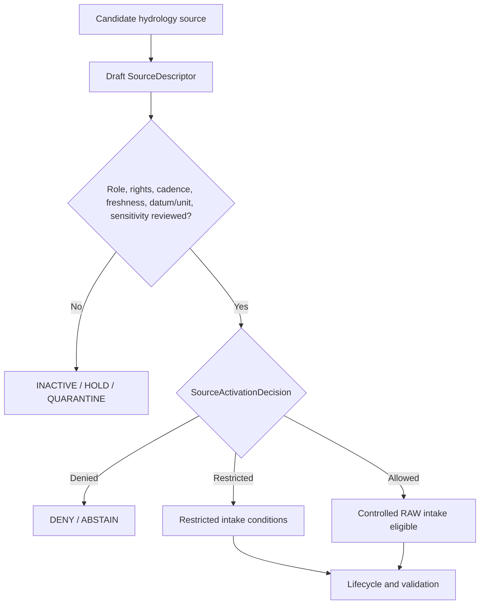

<!-- [KFM_META_BLOCK_V2]
doc_id: kfm://doc/NEEDS-VERIFICATION
title: Hydrology Source Registry
type: standard
version: v1
status: draft
owners: OWNER_TBD
created: 2026-06-29
updated: 2026-06-29
policy_label: restricted-review
related: [../README.md, ../../README.md, ../../hydrology/README.md, ../../hydrology/sources/README.md, ../../../../docs/domains/hydrology/README.md, ../../../../docs/domains/hydrology/SOURCE_REGISTRY.md, ../../../../docs/domains/hydrology/SOURCE_FAMILIES.md, ../../../../docs/domains/hydrology/SOURCE_ROLE_MATRIX.md]
tags: [kfm, data, registry, sources, hydrology, source-descriptor, source-role, freshness, rights, sensitivity, watershed, huc, streamgage, nfhl, flood-context, evidence, provenance, admission, release-gated, no-public-path]
notes: ["Replaces the PROPOSED scaffold at data/registry/sources/hydrology/README.md.", "This subtype-first lane is named by Hydrology source-registry docs as the registry data home.", "Domain-first Hydrology registry material also exists under data/registry/hydrology/ and data/registry/hydrology/sources/; final topology remains NEEDS VERIFICATION.", "Hydrology source registry records are admission and authority-control records, not source payloads, hydrologic truth, emergency alerts, proof closure, catalog closure, policy, release authority, or public output."]
[/KFM_META_BLOCK_V2] -->

<a id="top"></a>

# Hydrology Source Registry

Machine-readable orientation lane for Hydrology source descriptor and source-admission records.

> [!IMPORTANT]
> **Status:** experimental  
> **Owners:** OWNER_TBD  
> **Path:** `data/registry/sources/hydrology/`  
> **Truth posture:** cite-or-abstain; deny-by-default source admission; no public path from registry internals.


**Quick links:** [Scope](#scope) | [Repo fit](#repo-fit) | [Inputs](#accepted-inputs) | [Exclusions](#exclusions) | [Hydrology source boundary](#hydrology-source-boundary) | [Source families](#source-families) | [Admission flow](#admission-flow) | [Required checks](#required-checks-before-use)

> [!CAUTION]
> This directory is a source registry lane, not hydrologic truth storage. It may describe how Hydrology sources are admitted, restricted, quarantined, denied, superseded, or reviewed. It must not store source payloads, regulatory flood layers, gauge extracts, emergency-alert material, proof packs, catalog records, release manifests, map tiles, generated summaries, or public API/UI artifacts.

## Scope

`data/registry/sources/hydrology/` is the subtype-first Hydrology source registry lane. Its job is to keep source admission inspectable before hydrology source material enters the KFM lifecycle.

A Hydrology source registry record may answer:

- What source family, authority, endpoint, product, version, or dataset is being considered or admitted?
- What canonical `source_role` is declared for that source?
- What rights, terms, attribution, cadence, steward, native version, datum, units, parameter identity, sensitivity, and authority limits apply?
- What source time, observed time, retrieval time, valid/effective time, release time, correction time, source heads, activation decisions, validation receipts, proof references, catalog references, stale-state records, and rollback targets are linked?
- What must remain denied, restricted, quarantined, stale, unresolved, or role-blocked before downstream use?

A source descriptor does not prove a hydrologic claim. It records the conditions under which a source may shape later evidence processing.

## Repo fit

| Relationship | Path | Status | Notes |
| --- | --- | --- | --- |
| This lane | `data/registry/sources/hydrology/` | CONFIRMED | Existing subtype-first Hydrology source registry path. |
| Cross-domain source registry parent | [`../README.md`](../README.md) | CONFIRMED | Establishes source registry as admission and authority-control surface. |
| Data registry root | [`../../README.md`](../../README.md) | NEEDS VERIFICATION | Linked for registry context; current contents not re-audited for this update. |
| Domain-first Hydrology registry parent | [`../../hydrology/README.md`](../../hydrology/README.md) | CONFIRMED | Existing companion lane; marks path topology as unresolved. |
| Domain-first Hydrology sources lane | [`../../hydrology/sources/README.md`](../../hydrology/sources/README.md) | CONFIRMED | Existing companion lane; warns against divergent source descriptor authority. |
| Hydrology domain README | [`../../../../docs/domains/hydrology/README.md`](../../../../docs/domains/hydrology/README.md) | CONFIRMED | Defines Hydrology scope, source families, pipeline shape, and anti-collapse boundaries. |
| Human-facing Hydrology source registry | [`../../../../docs/domains/hydrology/SOURCE_REGISTRY.md`](../../../../docs/domains/hydrology/SOURCE_REGISTRY.md) | CONFIRMED | Admission and authority-control surface for maintainers. |
| Hydrology source-family catalog | [`../../../../docs/domains/hydrology/SOURCE_FAMILIES.md`](../../../../docs/domains/hydrology/SOURCE_FAMILIES.md) | CONFIRMED | Source families, source-role vocabulary, rights/freshness posture, and anti-collapse notes. |
| Hydrology source-role matrix | [`../../../../docs/domains/hydrology/SOURCE_ROLE_MATRIX.md`](../../../../docs/domains/hydrology/SOURCE_ROLE_MATRIX.md) | CONFIRMED | Prove/cannot-prove grid for source roles and object families. |

### Path posture

This README follows the subtype-first pattern because current Hydrology docs name `data/registry/sources/hydrology/` as the registry data home, and because the cross-domain parent `data/registry/sources/README.md` describes per-domain source subfolders.

NEEDS VERIFICATION: domain-first source registry material also exists under `data/registry/hydrology/` and `data/registry/hydrology/sources/`. Until an ADR, directory-rule update, migration note, or registry topology decision settles the relationship, maintain one authoritative descriptor record and use pointers or redirect notes rather than divergent copies.

## Accepted inputs

Accepted material is compact, reviewable, and pointer-based:

- `SourceDescriptor` instances or descriptor pointers for Hydrology source families.
- Source-family README files and local index files.
- Source-head metadata summaries: upstream authority, endpoint, product version, native identifier system, source vintage, publication date, checksum, manifest, and spatial/temporal scope.
- Source role, authority scope, rights, terms, attribution, cadence, freshness posture, steward, reviewer, and sensitivity metadata.
- Source time, observed time, retrieval time, valid/effective time, release time, correction time, stale-state posture, approval status, and public-use blockers.
- Datum, units, parameter codes, gauge/site identity, HUC level, reach identity, geometry/support metadata, native class fields, and model or aggregation scope where relevant.
- `SourceActivationDecision` references or activation sidecars where the accepted registry pattern allows them.
- Supersession, withdrawal, stale-state, embargo, correction, quarantine, denial, and rollback references.
- Pointers to validation receipts, model or aggregation receipts, proof packs, catalog records, policy decisions, release candidates, correction notices, and rollback cards.
- Crosswalk references that preserve source IDs, authority IDs, parameters, units, datums, reach IDs, HUC IDs, field names, and transform loss.

Use `NEEDS VERIFICATION`, `UNKNOWN`, `ABSTAIN`, or `DENY` rather than filling missing rights, cadence, freshness, owner, source-role, schema, datum, units, or sensitivity facts with plausible defaults.

## Exclusions

| Do not place here | Use instead | Why |
| --- | --- | --- |
| Raw WBD/NHDPlus packages, NWIS extracts, NFHL packages, 3DEP products, groundwater records, water-quality tables, rasters, COGs, PMTiles, shapefiles, GeoPackages, API dumps, or zipped packages | `data/raw/hydrology/`, `data/work/hydrology/`, `data/quarantine/hydrology/`, or `data/processed/hydrology/` after path verification | Registry records are not payload storage. |
| Emergency alerts, life-safety instructions, flood warnings, or official-source replacement text | DENY or redirect to official sources through governed surfaces | KFM Hydrology is not an emergency warning system. |
| Policy rules, sensitivity rules, rights rules, datum/unit policy, access-control logic, or release rules | `policy/` roots after ownership verification | Policy authority must stay separate from source metadata. |
| JSON Schema, semantic contracts, DTOs, or validator code | `schemas/`, `contracts/`, `tools/validators/`, or tests after verification | This lane may hold instances and indexes, not schema or code authority. |
| Validation receipts, run receipts, redaction receipts, or process logs | `data/receipts/` after verification | Receipts are process-memory objects. |
| EvidenceBundles, proof packs, signatures, or citation-validation closure | `data/proofs/` after verification | Proof is a separate object family. |
| STAC, DCAT, PROV, domain catalog records, or graph/triplet projections | `data/catalog/` and triplet lanes after verification | Catalog and graph projections are downstream. |
| Release manifests, promotion decisions, correction notices, rollback cards, supersession notices, or withdrawal notices | `release/` after verification | Publication and correction are governed release objects. |
| Public tiles, dashboards, screenshots, generated summaries, app payloads, or API/UI artifacts | Governed APIs and released artifacts | Public clients must not consume registry internals. |
| Hazards, Habitat, Soil, Agriculture, Geology, Infrastructure, Roads, Land, or living-person truth | Owning domain lanes | Hydrology may consume governed context without absorbing neighbor authority. |

## Hydrology source boundary

| Rule | Handling |
| --- | --- |
| Registry is admission control | It records how a source may be treated before intake. It does not contain the source payload or prove claims. |
| Source role is canonical | Use only `observed`, `regulatory`, `modeled`, `aggregate`, `administrative`, `candidate`, or `synthetic` in new descriptors unless the active schema says otherwise. |
| Role is not inferred | A provider name, feed URL, gauge number, layer name, map service, or visual appearance does not establish the role. Review does. |
| NFHL is not observed flooding | FEMA NFHL and similar regulatory flood context must not be reframed as observed inundation, forecast, or model output. |
| Observations are not regulations | NWIS readings, water-quality readings, field marks, and groundwater observations do not become regulatory determinations through processing. |
| Models are not observations | Rating curves, value-added attributes, catchments, DEM derivatives, reconstructed traces, modeled hydrographs, and scenario surfaces require model identity, run receipts, uncertainty, and role preservation. |
| Aggregates are not per-place truth | Daily values, annual statistics, HUC rollups, drought classes, and irrigation summaries must carry aggregation scope. |
| Provisional is not approved | Provisional readings, watcher candidates, unreviewed flood marks, and ambiguous reach matches remain WORK or QUARANTINE until reviewed. |
| Time kinds stay distinct | Source time, observed time, valid/effective time, retrieval time, release time, and correction time remain separate where material. |
| Datum and units travel | Datum, units, parameter identity, site identity, geometry/support metadata, and approval status should remain explicit through lifecycle movement. |
| Publication is separate | Release requires validation, policy, review, evidence/proof support, catalog support, release state, correction path, and rollback target. |

## Source families

The table is an orientation surface, not an activation decision. Each admitted source needs its own descriptor and review.

| Family | Typical canonical role | Hydrology use | Default blockers |
| --- | --- | --- | --- |
| USGS WBD / HUC12 | `observed` boundary geometry or `aggregate` unit context by claim | Watershed and HUCUnit context | HUC level, vintage, geometry identity, aggregation scope, rights. |
| USGS NHDPlus HR / 3DHP hydrography | `observed` network identity or `modeled` derived attributes by product | ReachIdentity, flow direction, catchments, network context | Version, reach ambiguity, derived/model lineage, geometry support. |
| USGS Water Data / NWIS | `observed`; `aggregate` for daily/statistical values | GaugeSite, FlowObservation, WaterLevelObservation, WaterQualityObservation | Parameter code, unit, datum, approval/provisional state, cadence, retrieval time. |
| FEMA NFHL / MSC | `regulatory` | NFHLZone and regulatory FloodContext | Effective date, revision, legal scope, not-observed-inundation boundary. |
| USGS 3DEP terrain | `observed` elevation source or `modeled` derivative by product | Elevation support and terrain-derived hydrology | DEM vintage, resolution, derivative method, model/run receipt. |
| Water quality and groundwater sources | `observed`; `administrative` for well registries | WaterQualityObservation, GroundwaterWell, AquiferObservation | Parameter metadata, QA flags, well/owner sensitivity, rights. |
| Historical observed flood evidence | `observed` or `candidate` before review | Observed flood evidence and historical context | Provenance, location confidence, review state, event-vs-regulatory separation. |
| Drought and irrigation link sources | `aggregate`, `modeled`, or `administrative` by product | DroughtLink, IrrigationLink, water-use context | Aggregation scope, cross-domain ownership, per-place claim risk. |

## Admission flow



A passing activation decision does not publish anything and does not make KFM an emergency warning authority. It only permits controlled intake under declared conditions. The lifecycle still has to move through RAW, WORK or QUARANTINE, PROCESSED, CATALOG or TRIPLET, and PUBLISHED gates with receipts, proof support, policy, review, freshness state, release state, correction path, and rollback target.

## Directory shape

Current confirmed state:

```text
data/registry/sources/hydrology/
`-- README.md
```

PROPOSED future child lanes, if topology and descriptor ownership are accepted:

```text
data/registry/sources/hydrology/
|-- README.md
|-- usgs_wbd/
|   |-- README.md
|   `-- index.local.json
|-- usgs_nhdplus_hr/
|   |-- README.md
|   `-- index.local.json
|-- usgs_water_data/
|   |-- README.md
|   `-- index.local.json
|-- fema_nfhl/
|   |-- README.md
|   `-- index.local.json
|-- usgs_3dep/
|   |-- README.md
|   `-- index.local.json
|-- water_quality/
|   |-- README.md
|   `-- index.local.json
|-- groundwater/
|   |-- README.md
|   `-- index.local.json
|-- historical_flood_evidence/
|   |-- README.md
|   `-- index.local.json
|-- drought_irrigation/
|   |-- README.md
|   `-- index.local.json
`-- index.local.json
```

Do not create child directories merely for taxonomy neatness. Add them only when there is a reviewed descriptor, migration note, source-family need, or stewardship path.

## Descriptor sketch

Illustrative only. Confirm the active schema before creating records.

```json
{
  "id": "kfm-source:hydrology:<source-family>:<stable-source-id>",
  "record_type": "source_descriptor",
  "domain": "hydrology",
  "source_family": "wbd_huc | nhdplus_hr | water_data | nfhl | terrain_3dep | water_quality | groundwater | historical_flood_evidence | drought_irrigation | other",
  "source_name": "SOURCE_NAME_TBD",
  "source_role": "observed | regulatory | modeled | aggregate | administrative | candidate | synthetic",
  "role_authority": "ROLE_AUTHORITY_TBD",
  "native_identifier_system": "NATIVE_ID_SYSTEM_TBD",
  "native_version": "VERSION_TBD",
  "authority_scope": "AUTHORITY_SCOPE_TBD",
  "rights_posture": "RIGHTS_TBD",
  "sensitivity_posture": "SENSITIVITY_TBD",
  "cadence": "CADENCE_TBD",
  "source_time_ref": "SOURCE_TIME_TBD",
  "observed_time_ref": "OBSERVED_TIME_TBD_IF_APPLICABLE",
  "retrieval_time_ref": "RETRIEVAL_TIME_TBD",
  "valid_effective_time_ref": "VALID_EFFECTIVE_TIME_TBD_IF_APPLICABLE",
  "freshness_posture": "FRESHNESS_TBD",
  "datum": "DATUM_TBD",
  "units": "UNITS_TBD",
  "parameter_identity": "PARAMETER_TBD",
  "geometry_support": "GEOMETRY_SUPPORT_TBD",
  "approval_status": "APPROVAL_STATUS_TBD",
  "not_authoritative_for": [
    "emergency_alerting",
    "life_safety_instruction"
  ],
  "source_head_ref": "SOURCE_HEAD_TBD",
  "activation_decision_ref": "ACTIVATION_DECISION_TBD",
  "validation_receipts": [],
  "proof_refs": [],
  "catalog_refs": [],
  "policy_refs": [],
  "review_state": "draft",
  "release_state": "not_released",
  "correction_path": "CORRECTION_PATH_TBD",
  "rollback_target": "ROLLBACK_TARGET_TBD",
  "notes": [
    "NEEDS VERIFICATION: confirm schema, owner, source role, rights, cadence, freshness, datum, units, sensitivity, and topology before use."
  ]
}
```

## Required checks before use

- [ ] Confirm final topology for `data/registry/sources/hydrology/` versus `data/registry/hydrology/sources/`.
- [ ] Confirm active SourceDescriptor schema path and field names. Current docs show schema-home drift between singular and plural path forms.
- [ ] Confirm owner, reviewer, rights steward, sensitivity steward, policy steward, proof steward, and release steward.
- [ ] Confirm canonical source-role enum and any role-conditional required fields.
- [ ] Confirm rights, terms, redistribution, attribution, expiration, and derivative-use posture for each source.
- [ ] Confirm cadence, source-head identity, native version, authority scope, spatial scope, temporal scope, source time, observed time, retrieval time, valid/effective time, and freshness posture.
- [ ] Confirm datum, units, parameter identity, site identity, geometry/support metadata, and approval/provisional status for gauge and observation sources.
- [ ] Confirm NFHL and regulatory flood context cannot be used as observed inundation or forecast evidence.
- [ ] Confirm sensitive-join handling before Hydrology products join infrastructure, roads, parcels, archaeology, habitat, hazards, agriculture, land, or living-person context.
- [ ] Confirm validation receipts before using descriptors in processed, catalog, triplet, or published surfaces.
- [ ] Confirm public use only through governed APIs and released artifacts.

## Status notes

| Claim | Label | Evidence / limit |
| --- | --- | --- |
| This README replaced a scaffold at the target path. | CONFIRMED | GitHub contents read before update showed a short PROPOSED scaffold. |
| `data/registry/sources/README.md` defines source registry as admission and authority-control surface. | CONFIRMED | Current repo file inspected during this update. |
| Hydrology docs name `data/registry/sources/hydrology/` as the registry data home. | CONFIRMED | Current Hydrology source-registry and source-family docs were inspected. |
| Domain-first Hydrology registry material also exists. | CONFIRMED | `data/registry/hydrology/README.md` and `data/registry/hydrology/sources/README.md` were inspected. |
| `docs/domains/hydrology/SOURCES.md` exists. | UNKNOWN / not found | GitHub contents read returned 404 for that path; use `SOURCE_REGISTRY.md`, `SOURCE_FAMILIES.md`, and `SOURCE_ROLE_MATRIX.md` for current evidence. |
| Final topology between subtype-first and domain-first Hydrology registry lanes is settled. | NEEDS VERIFICATION | Existing docs preserve the topology question. |
| Concrete Hydrology SourceDescriptor payloads exist in this lane. | UNKNOWN | Not verified in this session. |
| This README grants activation, publication, public access, or emergency-warning authority. | DENY | Activation and publication require separate governed decisions and release gates; KFM Hydrology is not an emergency warning system. |

## Maintainer note

Keep the registry membrane visible:

```text
SourceDescriptor -> SourceActivationDecision -> RAW -> WORK / QUARANTINE -> PROCESSED -> CATALOG / TRIPLET -> PUBLISHED
```

The source registry can admit, restrict, hold, quarantine, or deny sources. It cannot make a hydrologic claim true, publish a warning, collapse NFHL into observed inundation, hide datum/unit uncertainty, or stand in for EvidenceBundle-backed review.

[Back to top](#top)
