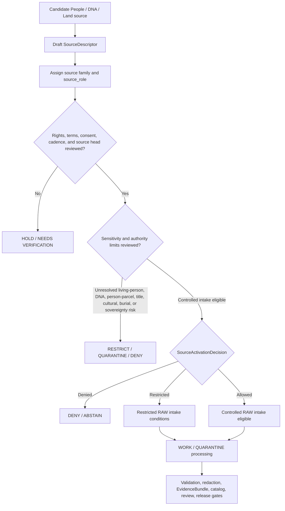

<!-- [KFM_META_BLOCK_V2]
doc_id: kfm://doc/NEEDS-VERIFICATION
title: People / DNA / Land Source Registry
type: standard
version: v1
status: draft
owners: OWNER_TBD
created: 2026-06-29
updated: 2026-06-29
policy_label: restricted-review
related: [../README.md, ../../README.md, ../people/README.md, ../../people-dna-land/README.md, ../../people-dna-land/sources/README.md, land-ownership/README.md, ../../../../docs/domains/people-dna-land/README.md, ../../../../docs/domains/people-dna-land/SOURCE_REGISTRY.md, ../../../../docs/domains/people-dna-land/SOURCE_FAMILIES.md, ../../../../docs/domains/people-dna-land/LAND_OWNERSHIP.md]
tags: [kfm, data, registry, sources, people-dna-land, people, source-descriptor, source-role, consent, revocation, privacy, living-person, dna, genomic, genealogy, land-ownership, title, parcel, rights, sensitivity, sovereignty, evidence, provenance, release-gated, no-public-path]
notes: ["Replaces the one-character stub at data/registry/sources/people-dna-land/README.md.", "This is the subtype-first People / DNA / Land source registry parent under data/registry/sources/.", "Topology between data/registry/sources/people-dna-land/, data/registry/sources/people/, and data/registry/people-dna-land/sources/ remains NEEDS VERIFICATION.", "Source registry records are admission and authority-control records, not source payloads, person truth, DNA truth, title truth, consent authority, policy, release authority, proof, catalog, or public output."]
[/KFM_META_BLOCK_V2] -->

<a id="top"></a>

# People / DNA / Land Source Registry

Subtype-first source registry parent for People / DNA / Land source descriptors and admission-control records.

> [!IMPORTANT]
> **Status:** experimental  
> **Owners:** OWNER_TBD  
> **Path:** `data/registry/sources/people-dna-land/`  
> **Truth posture:** cite-or-abstain; deny-by-default source admission; consent-aware; no public path from registry internals.


**Quick links:** [Scope](#scope) | [Repo fit](#repo-fit) | [Accepted inputs](#accepted-inputs) | [Exclusions](#exclusions) | [Source boundary](#source-boundary) | [Source families](#source-families) | [Admission flow](#admission-flow) | [Directory map](#directory-map) | [Required checks](#required-checks-before-use)

> [!CAUTION]
> This directory is a source registry lane, not a store for person records, DNA data, genealogy truth, land-title truth, consent decisions, policy decisions, proof packs, release manifests, public maps, or generated answers. Living-person, DNA/genomic, DNA-derived relationship, private person-parcel, title-sensitive, cultural, burial, and sovereignty-sensitive material fails closed unless the required evidence, rights, consent where applicable, sensitivity, review, release, correction, and rollback gates close.

## Scope

`data/registry/sources/people-dna-land/` is a subtype-first source registry parent for the People / Genealogy / DNA / Land Ownership domain.

A source registry record here may answer:

- What source family, authority, provider, jurisdiction, record series, export, endpoint, dataset, or instrument class is being considered or admitted?
- What canonical `source_role` is declared for the source?
- What rights, terms, attribution, permitted use, consent posture, revocation posture, cadence, steward, source head, native version, sensitivity, and authority limits apply?
- What living-person, DNA/genomic, genealogy, land-instrument, title, parcel, person-parcel, burial, cultural, sovereignty, or security blockers are attached?
- What activation decision, validation receipt, redaction/generalization receipt, consent receipt, EvidenceBundle, proof reference, catalog reference, release state, correction notice, withdrawal record, and rollback target is required before consequential use?

A source descriptor does not prove identity, kinship, relationship, DNA interpretation, residence, title, boundary, land ownership, consent, or publication eligibility. It records the conditions under which a source may shape later evidence processing.

## Repo fit

| Relationship | Path | Status | Notes |
| --- | --- | --- | --- |
| This lane | `data/registry/sources/people-dna-land/` | CONFIRMED | Target README existed as a one-character stub before this update. |
| Cross-domain source registry parent | [`../README.md`](../README.md) | CONFIRMED | Establishes source registry as pre-RAW admission and authority-control surface. |
| Data registry root | [`../../README.md`](../../README.md) | NEEDS VERIFICATION | Linked for registry context; current contents not re-audited for this update. |
| Short-slug People source lane | [`../people/README.md`](../people/README.md) | CONFIRMED | Existing companion lane; preserves `people` vs `people-dna-land` topology uncertainty. |
| Domain-first People / DNA / Land registry parent | [`../../people-dna-land/README.md`](../../people-dna-land/README.md) | CONFIRMED | Existing domain-first routing lane. |
| Domain-first People / DNA / Land sources lane | [`../../people-dna-land/sources/README.md`](../../people-dna-land/sources/README.md) | CONFIRMED | Existing domain-first source registry lane; warns against divergent descriptor authority. |
| Land ownership child lane | [`land-ownership/README.md`](land-ownership/README.md) | CONFIRMED | Child source registry lane for land-ownership source admission. |
| People / DNA / Land domain README | [`../../../../docs/domains/people-dna-land/README.md`](../../../../docs/domains/people-dna-land/README.md) | CONFIRMED | Establishes high-sensitivity People / DNA / Land posture. |
| Human-facing source registry | [`../../../../docs/domains/people-dna-land/SOURCE_REGISTRY.md`](../../../../docs/domains/people-dna-land/SOURCE_REGISTRY.md) | CONFIRMED | Admission and authority-control orientation for maintainers. |
| Source-family catalog | [`../../../../docs/domains/people-dna-land/SOURCE_FAMILIES.md`](../../../../docs/domains/people-dna-land/SOURCE_FAMILIES.md) | CONFIRMED | Source families, source-role taxonomy, rights/sensitivity posture, and anti-collapse notes. |
| Land ownership model | [`../../../../docs/domains/people-dna-land/LAND_OWNERSHIP.md`](../../../../docs/domains/people-dna-land/LAND_OWNERSHIP.md) | CONFIRMED | Domain reference for land instruments, ownership intervals, chain gaps, assessor/title separation, and geometry/title separation. |

### Path posture

This README follows the requested and confirmed subtype-first path:

```text
data/registry/sources/people-dna-land/
```

Current evidence also confirms two overlapping companion paths:

```text
data/registry/sources/people/
data/registry/people-dna-land/sources/
```

NEEDS VERIFICATION: final descriptor topology is not settled. Until an ADR, Directory Rules update, migration note, or registry inventory resolves the relationship, maintain one authoritative descriptor record and use pointers, redirect notes, or migration notes rather than divergent copies.

## Accepted inputs

Accepted material is compact, reviewable, and pointer-based:

- `SourceDescriptor` instances or descriptor pointers for People / DNA / Land source families.
- Source-family README files and local index files.
- Source-head metadata summaries: provider, jurisdiction, record series, export version, source vintage, publication date, checksum, manifest, retrieval window, and temporal scope.
- Source role, authority scope, rights, terms, attribution, consent posture, revocation posture, cadence, steward, reviewer, and sensitivity metadata.
- Consent grant/refusal/revocation references, permitted-use constraints, living-person status flags, public-safe transform refs, and withdrawal refs.
- Supersession, withdrawal, correction, embargo, quarantine, revocation, denial, stale-state, and rollback references.
- Pointers to validation receipts, redaction/generalization receipts, consent receipts, proof packs, catalog records, policy decisions, release candidates, correction notices, and rollback cards.
- Crosswalk references that preserve source IDs, person assertion IDs, record IDs, kit/export IDs, parcel IDs, legal descriptions, PLSS keys, title-instrument IDs, transform loss, and source-native identifiers.

Use `NEEDS VERIFICATION`, `UNKNOWN`, `ABSTAIN`, or `DENY` rather than filling missing rights, consent, revocation, owner, source-role, schema, sensitivity, identity, relationship, DNA, title, or publication facts with plausible defaults.

## Exclusions

| Do not place here | Use instead | Why |
| --- | --- | --- |
| Raw GEDCOM/GEDZip exports, tree exports, DNA segment data, kit IDs, match CSVs, vendor exports, vital-record extracts, cemetery files, census schedules, court/probate files, deed packages, assessor rolls, parcel files, source-native tables, API dumps, or zipped packages | `data/raw/people-dna-land/`, `data/work/people-dna-land/`, `data/quarantine/people-dna-land/`, or `data/processed/people-dna-land/` after path verification | Registry records are not payload storage. |
| Living-person identifiers, private relationship detail, DNA segment detail, private person-parcel joins, current-owner exposure, access secrets, restricted review notes, or restricted family context | Restricted lifecycle lanes, quarantine, or governed restricted storage | Sensitive material must not sit in registry prose or indexes. |
| Identity truth, relationship truth, title truth, boundary truth, legal advice, ownership certification, or publication assertions | EvidenceBundle, policy, review, catalog, and release paths after verification | A registry record admits a source; it does not prove a claim. |
| Consent decisions, consent render gates, sensitivity rules, rights rules, access-control logic, or release rules | `policy/consent/people/`, `policy/sensitivity/people/`, `policy/rights/`, or accepted policy homes | Policy and consent authority must stay separate from source metadata. |
| JSON Schema, semantic contracts, DTOs, parser code, validators, tests, fixtures, or workflows | `schemas/`, `contracts/`, `tools/validators/`, `tests/`, `fixtures/`, or `.github/workflows/` after verification | This lane may hold instances and indexes, not schema or code authority. |
| Validation receipts, consent receipts, redaction receipts, run receipts, review receipts, or process logs | `data/receipts/` after verification | Receipts are process-memory objects. |
| EvidenceBundles, proof packs, signatures, or citation-validation closure | `data/proofs/` after verification | Proof is a separate object family. |
| STAC, DCAT, PROV, domain catalog records, or graph/triplet projections | `data/catalog/` and triplet lanes after verification | Catalog and graph projections are downstream. |
| Release manifests, promotion decisions, correction notices, rollback cards, supersession notices, or withdrawal notices | `release/` after verification | Publication and correction are governed release objects. |
| Public maps, identity pages, genealogy trees, title reports, dashboards, generated narratives, app payloads, API payloads, vector indexes, or UI artifacts | Governed APIs and released artifacts | Public clients must not consume registry internals. |

## Source boundary

| Rule | Handling |
| --- | --- |
| Registry is admission control | It records how a source may be treated before intake. It does not contain the source payload or prove claims. |
| Consent is not publication | Consent constrains use and rendering. It does not itself publish data or satisfy release gates. |
| Consent is revocable | Revocation refs, tombstone/withdrawal behavior, downstream cleanup obligations, and rollback targets must remain visible where applicable. |
| Living-person content fails closed | Living-person identifiers, relationship assertions, person-parcel joins, current-owner exposure, and private context remain denied or restricted unless policy/review/release gates explicitly permit a public-safe derivative. |
| DNA/genomic material fails closed | Raw kit IDs, segment data, triangulation outputs, and DNA-derived relationship evidence do not become public artifacts. |
| Tree evidence is not authority | GEDCOM, tree overlays, and user-contributed genealogy assertions are `candidate` or `modeled` evidence until independently supported and reviewed. |
| Assessor and tax records are not title truth | Assessor/tax records are `administrative` context. They do not satisfy title or ownership claims. |
| Parcel geometry is not title boundary proof | Parcel, survey, PLSS, and derived geometry must preserve role, vintage, and uncertainty. Geometry alone is not title proof. |
| Land instruments require chain context | Deeds, patents, liens, easements, leases, probate records, mineral records, water records, and access instruments support evidence-bound temporal assertions, not automatic ownership truth. |
| Sovereignty and cultural context fail closed | Burial, cultural heritage, tribal/sovereignty-sensitive, and living-descendant contexts require the most restrictive applicable policy posture. |
| Source role is canonical | Use only `observed`, `regulatory`, `modeled`, `aggregate`, `administrative`, `candidate`, or `synthetic` in new descriptors unless the active schema says otherwise. |
| AI is evidence-subordinate | Generated summaries, maps, graph projections, vector indexes, and Focus Mode answers are interpretive surfaces, not root truth. |
| Publication is separate | Release requires validation, consent/rights/sensitivity policy, review, evidence/proof support, catalog support, release state, correction path, and rollback target. |

## Source families

The table is an orientation surface, not an activation decision. Each admitted source needs its own descriptor and review.

| Family | Typical canonical role | People / DNA / Land use | Default blockers |
| --- | --- | --- | --- |
| Vital, cemetery, burial, obituary, church, school, military, census, directory, court, and probate records | `observed`, `administrative`, `aggregate`, or `candidate` by record | Life events, person assertions, historical context, estate/probate context | Living-person fields, rights, source vintage, jurisdiction, evidence confidence, burial/cultural sensitivity. |
| GEDCOM, GEDZip, and family-tree overlays | `candidate` or `modeled` | Relationship hypotheses, imported assertions, tree context | Rights, living flags, submitter authority, dedup state, no public edge until reviewed. |
| DNA vendor match, segment, and triangulation data | `observed` for measurements; `modeled` for relationship hypotheses; `candidate` before review | Genetic evidence under consent and review | Consent, revocation, raw segment denial, vendor terms, relationship-as-truth risk, no public raw genomic data. |
| Patent, deed, mortgage, lien, easement, lease, mineral, water, access, and probate instruments | `observed`, `regulatory`, or `administrative` by instrument and schema | LandInstrument evidence and temporal ownership assertions | Chain gaps, jurisdiction, recording status, title-weight limits, rights, current-owner exposure. |
| Assessor and tax-roll records | `administrative` | Valuation, tax, and administrative parcel context | Assessor-as-title DENY, current-owner sensitivity, residence-grade joins, tax-year scope. |
| Plat, survey, metes-and-bounds, PLSS, subdivision, and derived geometry | `observed`, `regulatory`, or `modeled` by product | Geometry context and boundary evidence support | Geometry-as-title DENY, vintage, survey authority, transform loss, incidental personal data. |
| Derived summaries, AI notes, chain sketches, and reconciliation products | `modeled`, `aggregate`, `candidate`, or `synthetic` by method | Reviewer-facing context, candidate joins, gap inventories, summary aids | Not source truth, not publication, requires evidence/proof refs, receipts, and reality-boundary notes. |

## Admission flow



A passing activation decision does not publish anything and does not establish identity, relationship, DNA interpretation, title, boundary, or ownership truth. The governed lifecycle still has to move through:

```text
SourceDescriptor -> SourceActivationDecision -> RAW -> WORK / QUARANTINE -> PROCESSED -> CATALOG / TRIPLET -> PUBLISHED
```

## Directory map

Current confirmed state:

```text
data/registry/sources/people-dna-land/
|-- README.md
`-- land-ownership/
    `-- README.md
```

PROPOSED future child lanes, if topology and descriptor ownership are accepted:

```text
data/registry/sources/people-dna-land/
|-- README.md
|-- person-records/
|   |-- README.md
|   `-- index.local.json
|-- genealogy-trees/
|   |-- README.md
|   `-- index.local.json
|-- dna-genomic/
|   |-- README.md
|   `-- index.local.json
|-- land-ownership/
|   |-- README.md
|   `-- index.local.json
|-- consent-frameworks/
|   |-- README.md
|   `-- index.local.json
`-- index.local.json
```

Do not create child directories merely for taxonomy neatness. Add them only when there is a reviewed descriptor, migration note, source-family need, consent path, stewardship path, and rollback path.

## Descriptor sketch

Illustrative only. Confirm the active schema before creating records.

```json
{
  "id": "kfm-source:people-dna-land:<source-family>:<stable-source-id>",
  "record_type": "source_descriptor",
  "domain": "people-dna-land",
  "registry_slug": "people-dna-land",
  "source_family": "person_records | genealogy_trees | dna_genomic | land_ownership | consent_frameworks | derived_summary | other",
  "source_name": "SOURCE_NAME_TBD",
  "source_role": "observed | regulatory | modeled | aggregate | administrative | candidate | synthetic",
  "role_authority": "ROLE_AUTHORITY_TBD",
  "jurisdiction_or_provider": "JURISDICTION_OR_PROVIDER_TBD",
  "record_series": "RECORD_SERIES_TBD",
  "native_version": "VERSION_TBD",
  "rights_posture": "RIGHTS_TBD",
  "consent_posture": "CONSENT_TBD",
  "revocation_posture": "REVOCATION_TBD",
  "sensitivity_posture": "SENSITIVITY_TBD",
  "living_person_posture": "LIVING_PERSON_TBD",
  "dna_publication_posture": "DNA_PUBLICATION_TBD",
  "person_parcel_posture": "PERSON_PARCEL_TBD",
  "title_truth_posture": "not_established_by_descriptor",
  "cadence": "CADENCE_TBD",
  "source_head_ref": "SOURCE_HEAD_TBD",
  "activation_decision_ref": "ACTIVATION_DECISION_TBD",
  "consent_refs": [],
  "validation_receipts": [],
  "redaction_receipts": [],
  "evidence_bundle_refs": [],
  "proof_refs": [],
  "catalog_refs": [],
  "policy_refs": [],
  "review_state": "draft",
  "release_state": "not_released",
  "correction_path": "CORRECTION_PATH_TBD",
  "rollback_target": "ROLLBACK_TARGET_TBD",
  "notes": [
    "NEEDS VERIFICATION: confirm schema, owner, source role, rights, consent, revocation, sensitivity, and topology before use."
  ]
}
```

## Required checks before use

- [ ] Confirm final topology for `data/registry/sources/people-dna-land/`, `data/registry/sources/people/`, and `data/registry/people-dna-land/sources/`.
- [ ] Confirm active SourceDescriptor schema path and field names.
- [ ] Confirm owner, reviewer, privacy steward, consent steward, rights steward, sensitivity steward, policy steward, proof steward, release steward, and sovereignty reviewer.
- [ ] Confirm canonical source-role enum and any role-conditional required fields.
- [ ] Confirm rights, terms, redistribution, attribution, expiration, permitted-use, and derivative-use posture for each source.
- [ ] Confirm consent grant/refusal/revocation posture before admitting living-person or DNA/genomic material.
- [ ] Confirm raw DNA, kit IDs, segment data, and DNA-derived relationship evidence remain denied from public artifacts.
- [ ] Confirm GEDCOM, GEDZip, and tree evidence remain candidate or modeled until independently supported and reviewed.
- [ ] Confirm assessor/tax records cannot be used as title truth.
- [ ] Confirm parcel geometry cannot be used as title boundary proof without supporting evidence and release review.
- [ ] Confirm living-person, person-parcel, burial, cultural, sovereignty, title, and restricted-family joins fail closed.
- [ ] Confirm validation, redaction/generalization, consent, and review receipts before using descriptors in processed, catalog, triplet, or published surfaces.
- [ ] Confirm public use only through governed APIs and released artifacts.

## Status notes

| Claim | Label | Evidence / limit |
| --- | --- | --- |
| This README replaced a one-character stub at the target path. | CONFIRMED | GitHub contents read before update showed `y`. |
| `data/registry/sources/README.md` defines source registry as admission and authority-control surface. | CONFIRMED | Current repo file inspected during this update. |
| `data/registry/sources/people/README.md` exists as a short-slug companion lane. | CONFIRMED | Current repo file inspected during this update. |
| `data/registry/sources/people-dna-land/land-ownership/README.md` exists as a child lane. | CONFIRMED | Current repo file inspected during this update. |
| Domain-first People / DNA / Land registry material also exists. | CONFIRMED | `data/registry/people-dna-land/sources/README.md` was inspected. |
| People / DNA / Land source-family and source-registry doctrine exists under `docs/domains/people-dna-land/`. | CONFIRMED | `SOURCE_REGISTRY.md` and `SOURCE_FAMILIES.md` were inspected. |
| Final slug topology between `people` and `people-dna-land` is settled. | NEEDS VERIFICATION | Existing docs preserve slug/path conflict. |
| Concrete People / DNA / Land SourceDescriptor payloads exist in this lane. | UNKNOWN | Not verified in this session. |
| CI validates People / DNA / Land source descriptor records. | UNKNOWN | No workflow/test execution was performed for this Markdown-only update. |
| This README grants activation, consent, publication, public access, identity truth, relationship truth, DNA release, title truth, or boundary truth. | DENY | Activation, consent handling, and publication require separate governed decisions and release gates. |

## Maintainer note

Keep the registry membrane visible:

```text
SourceDescriptor -> SourceActivationDecision -> RAW -> WORK / QUARANTINE -> PROCESSED -> CATALOG / TRIPLET -> PUBLISHED
```

The source registry can admit, restrict, hold, quarantine, or deny sources. It cannot make a person claim true, publish DNA material, prove kinship, infer consent, prove title, certify parcel boundaries, collapse assessor records into ownership, or stand in for EvidenceBundle-backed review.

[Back to top](#top)
