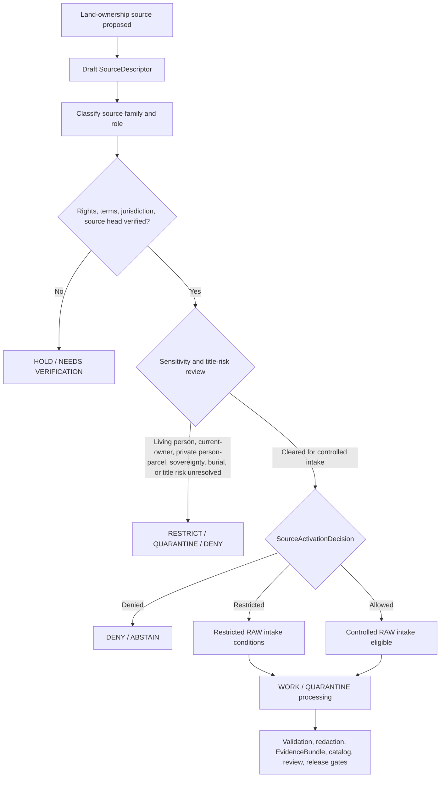

<!-- [KFM_META_BLOCK_V2]
doc_id: kfm://doc/NEEDS-VERIFICATION
title: People / DNA / Land Ownership Source Registry
type: standard
version: v1
status: draft
owners: OWNER_TBD
created: 2026-06-29
updated: 2026-06-29
policy_label: restricted-review
related: [../README.md, ../../README.md, ../../people/README.md, ../../../people-dna-land/README.md, ../../../people-dna-land/sources/README.md, ../../../../../docs/domains/people-dna-land/README.md, ../../../../../docs/domains/people-dna-land/SOURCE_REGISTRY.md, ../../../../../docs/domains/people-dna-land/SOURCE_FAMILIES.md, ../../../../../docs/domains/people-dna-land/LAND_OWNERSHIP.md]
tags: [kfm, data, registry, sources, people-dna-land, land-ownership, source-descriptor, source-role, deed, title, parcel, assessor, tax-roll, plss, survey, chain-of-title, consent, living-person, rights, sensitivity, evidence, provenance, release-gated, no-public-path]
notes: ["Replaces the one-character stub at data/registry/sources/people-dna-land/land-ownership/README.md.", "The immediate parent data/registry/sources/people-dna-land/README.md currently exists as a one-character stub and still needs a full routing README.", "This child lane is source-registry material only: it admits and constrains land-ownership sources; it does not store deeds, prove title, certify boundaries, publish current ownership, or provide legal advice.", "Topology between data/registry/sources/people-dna-land/, data/registry/sources/people/, and data/registry/people-dna-land/sources/ remains NEEDS VERIFICATION."]
[/KFM_META_BLOCK_V2] -->

<a id="top"></a>

# People / DNA / Land Ownership Source Registry

Source-admission lane for land-ownership records in the People / DNA / Land domain.

> [!IMPORTANT]
> **Status:** experimental  
> **Owners:** OWNER_TBD  
> **Path:** `data/registry/sources/people-dna-land/land-ownership/`  
> **Truth posture:** source-admission only; no title opinion; no parcel-boundary proof; no public path from registry internals.


**Quick links:** [Scope](#scope) | [Repo fit](#repo-fit) | [Accepted inputs](#accepted-inputs) | [Exclusions](#exclusions) | [Land ownership boundary](#land-ownership-boundary) | [Source families](#source-families) | [Admission flow](#admission-flow) | [Descriptor sketch](#descriptor-sketch) | [Required checks](#required-checks-before-use)

> [!CAUTION]
> This directory is not a title plant, deed repository, assessor roll, parcel layer, survey archive, chain-of-title opinion, legal advice surface, or public ownership endpoint. It may record how land-ownership sources are admitted and constrained; it must not turn source metadata into ownership truth.

## Scope

`data/registry/sources/people-dna-land/land-ownership/` is a child source-registry lane for land-ownership source descriptors and source-admission metadata under the People / DNA / Land domain.

A record here may answer:

- Which land-ownership source family is being admitted or held?
- What source role, jurisdiction, recording office, source head, instrument family, rights posture, terms, cadence, and steward apply?
- What temporal scope, legal-description posture, parcel/PLSS context, chain position, and transform-loss limits are known?
- What sensitivity blockers apply for living persons, private person-parcel joins, current-owner exposure, cultural/burial contexts, sovereignty-sensitive contexts, or title-sensitive claims?
- Which activation decision, validation receipt, redaction/generalization receipt, EvidenceBundle, catalog reference, release state, correction path, withdrawal path, and rollback target must be resolved before downstream use?

A descriptor in this lane does not prove ownership, marketable title, boundary location, mineral ownership, water-right ownership, access rights, inheritance, consent, or public-release eligibility. It records the conditions under which a source may enter governed KFM processing.

## Repo fit

| Relationship | Path | Status | Notes |
| --- | --- | --- | --- |
| This child lane | `data/registry/sources/people-dna-land/land-ownership/` | CONFIRMED | Target README existed as a one-character stub before this update. |
| Immediate source-slug parent | [`../README.md`](../README.md) | CONFIRMED stub / NEEDS WORK | Parent exists but is currently a one-character stub. Do not treat it as a settled topology statement yet. |
| Cross-domain source registry parent | [`../../README.md`](../../README.md) | CONFIRMED | Defines source registry as pre-RAW admission and authority-control surface. |
| Short-slug People source lane | [`../../people/README.md`](../../people/README.md) | CONFIRMED | Existing companion lane; preserves `people` vs `people-dna-land` topology uncertainty. |
| Domain-first People / DNA / Land registry parent | [`../../../people-dna-land/README.md`](../../../people-dna-land/README.md) | CONFIRMED | Existing compatibility/routing lane for People / DNA / Land registry material. |
| Domain-first People / DNA / Land sources lane | [`../../../people-dna-land/sources/README.md`](../../../people-dna-land/sources/README.md) | CONFIRMED | Existing domain-first source registry lane; warns against divergent descriptor authority. |
| People / DNA / Land domain README | [`../../../../../docs/domains/people-dna-land/README.md`](../../../../../docs/domains/people-dna-land/README.md) | CONFIRMED | Establishes high-sensitivity People / DNA / Land domain posture. |
| Human-facing source registry | [`../../../../../docs/domains/people-dna-land/SOURCE_REGISTRY.md`](../../../../../docs/domains/people-dna-land/SOURCE_REGISTRY.md) | CONFIRMED | Defines source families and anti-collapse rules, including assessor/tax and parcel geometry limits. |
| Source-family catalog | [`../../../../../docs/domains/people-dna-land/SOURCE_FAMILIES.md`](../../../../../docs/domains/people-dna-land/SOURCE_FAMILIES.md) | CONFIRMED | Defines source-role posture for land instruments, assessor/tax records, and geometry families. |
| Land ownership model | [`../../../../../docs/domains/people-dna-land/LAND_OWNERSHIP.md`](../../../../../docs/domains/people-dna-land/LAND_OWNERSHIP.md) | CONFIRMED | Domain reference for land instruments, ownership intervals, chain gaps, assessor/title separation, and geometry/title separation. |

### Path posture

This README follows the requested path because the file exists in the repository. The broader topology remains unsettled:

- `data/registry/sources/people-dna-land/` exists, but its parent README is still a stub.
- `data/registry/sources/people/` exists and now carries a short-slug People source registry README.
- `data/registry/people-dna-land/sources/` exists as a domain-first source registry lane.

Until an ADR, Directory Rules update, migration note, or registry topology decision settles the relationship, create one authoritative descriptor record and use pointers rather than duplicating land-ownership descriptors across all three lanes.

## Accepted inputs

Accepted content is compact, reviewable, pointer-based source registry material:

- `SourceDescriptor` records or descriptor pointers for land-ownership source families.
- Source-family READMEs, local indexes, manifest pointers, checksum pointers, and supersession pointers.
- Source-head metadata for recording jurisdictions, land offices, assessor offices, survey products, PLSS products, title-affecting court records, and derived chain summaries.
- Instrument-family metadata: patent, deed, mortgage, lien, easement, lease, mineral instrument, water-right instrument, access instrument, probate instrument, tax-sale record, survey, plat, subdivision record, PLSS layer, assessor roll, and tax roll.
- Jurisdiction and record-location metadata: recording office, county, book/page, instrument number, reception number, tract book, plat book, survey number, parcel identifier, PLSS key, legal-description reference, and source-native citation.
- Temporal metadata: execution date, recording date, effective date, tax year, assessment year, survey vintage, PLSS vintage, model-run date, retrieval date, and source validity window.
- Source-role, rights, terms, attribution, permitted use, cadence, steward, reviewer, activation posture, sensitivity posture, living-person posture, current-owner posture, and title-limitation posture.
- References to activation decisions, validation receipts, redaction/generalization receipts, consent or restriction receipts, EvidenceBundles, catalog records, release candidates, correction notices, withdrawal notices, supersession notices, stale-state notices, and rollback cards.

Use `UNKNOWN`, `NEEDS VERIFICATION`, `ABSTAIN`, or `DENY` instead of filling missing title, rights, source-role, jurisdiction, chain, survey, current-owner, living-person, or release facts with plausible defaults.

## Exclusions

| Do not place here | Use instead | Why |
| --- | --- | --- |
| Deed images, patent scans, mortgage packets, lien filings, easement documents, probate files, assessor exports, tax-roll files, parcel shapefiles, survey PDFs, plat images, PLSS datasets, GeoParquet, PMTiles, COGs, CSVs, API dumps, or zipped source packages | `data/raw/people-dna-land/`, `data/work/people-dna-land/`, `data/quarantine/people-dna-land/`, or `data/processed/people-dna-land/` after path verification | Registry records are not payload storage. |
| Living-person owner details, private person-parcel joins, current-owner exposure, home-address inference, access secrets, restricted review notes, or restricted family context | Restricted lifecycle lanes, quarantine, or governed restricted storage | Sensitive detail must not sit in source registry prose or local indexes. |
| Title opinions, marketability determinations, legal advice, ownership certificates, boundary determinations, or current-owner public endpoints | Outside KFM source registry scope; released artifacts may only state evidence-bound, policy-approved claims | KFM records evidence about title; it does not certify title. |
| Consent decisions, sensitivity rules, rights rules, access-control logic, release rules, or title-publication policy | `policy/consent/people/`, `policy/sensitivity/people/`, `policy/rights/`, release policy homes, or accepted policy roots | Policy authority is separate from source metadata. |
| JSON Schema, semantic contracts, DTOs, parser code, validators, fixtures, tests, or workflows | `schemas/`, `contracts/`, `tools/validators/`, `fixtures/`, `tests/`, `.github/workflows/` after verification | This lane may hold instances and indexes, not schema or code authority. |
| Validation receipts, redaction receipts, consent receipts, run receipts, review receipts, or process logs | `data/receipts/` after verification | Receipts are process-memory objects. |
| EvidenceBundles, proof packs, signatures, citation-validation closure, or proof graphs | `data/proofs/` after verification | Proof is a separate object family. |
| STAC, DCAT, PROV, domain catalog records, chain graph projections, or public discovery indexes | `data/catalog/` and triplet lanes after verification | Catalog and graph projections are downstream. |
| Release manifests, promotion decisions, correction notices, withdrawal notices, rollback cards, or supersession decisions | `release/` after verification | Publication and correction are governed release objects. |
| Public ownership maps, generated narratives, title summaries, dashboards, API payloads, vector indexes, or UI assets | Governed APIs and released artifacts only | Public clients must not consume registry internals. |

## Land ownership boundary

| Rule | Handling |
| --- | --- |
| Registry is source admission | A descriptor may admit, restrict, hold, quarantine, or deny a source. It does not establish a land claim. |
| KFM land ownership is evidence, not title | Even a gapless chain is evidence about title, not a legal title opinion or marketability conclusion. |
| Land instruments need chain context | Patents, deeds, liens, easements, leases, probate records, mineral instruments, water-right instruments, and access instruments support evidence-bound assertions only when interpreted in chain context. |
| Assessor/tax records are administrative | Assessor and tax-roll records may support valuation, taxpayer, parcel-admin, or tax-year context. They never satisfy title or ownership truth. |
| Parcel geometry is not boundary proof | Parcel polygons, survey geometry, PLSS layers, and derived boundaries must preserve role, vintage, uncertainty, and transform loss. Geometry alone is not a title boundary. |
| Legal descriptions remain distinct | The original legal description should be preserved and cited. Normalized geometry must not replace it. |
| Chain gaps remain visible | Missing conveyance links, probate uncertainty, tax-sale redemption windows, conflicting instruments, and severed-estate gaps must surface as gaps or conflicts. They are not smoothed. |
| Current-owner exposure fails closed | Current-owner or residence-grade person-parcel joins require restrictive policy handling and are not public by default. |
| Living-person material fails closed | Living-person identifiers, person-parcel joins, and private context remain denied or restricted unless policy, consent where applicable, review, release, correction, and rollback gates close. |
| Cultural, burial, and sovereignty contexts fail closed | Burial, cultural heritage, tribal/sovereignty-sensitive, and living-descendant contexts require the most restrictive applicable review posture. |
| Mineral, water, access, and surface estates are separate | Do not infer mineral, water, access, or lease interests from surface ownership, or surface ownership from severed interests. |
| Source role is preserved | Use the active source-role vocabulary. Do not upgrade administrative, modeled, aggregate, candidate, or synthetic records through processing or presentation. |
| AI is subordinate | Generated chain summaries, map notes, or Focus Mode answers are interpretive and must resolve evidence, policy, review, and release state before speaking. |
| Public release is separate | Release requires validation, rights/sensitivity policy, evidence/proof support, review state, catalog support, release state, correction path, and rollback target. |

> [!WARNING]
> The common failure mode is assessor-as-owner. An assessor/tax record may name a taxpayer of record for an assessment cycle; it is not a title instrument and must not be rendered as current ownership truth.

## Source families

This table is an orientation surface. Each source still needs its own descriptor, rights review, sensitivity review, and activation decision.

| Source family | Typical source role | What it may support | Default blockers |
| --- | --- | --- | --- |
| Patents and land-office instruments | `regulatory`, `administrative`, or `observed` by active schema | Root-of-chain evidence, public-land transfer context, historical tract context | Source vintage, tract identity, legal description, scanned-record rights, chain continuation. |
| Deeds and conveyance instruments | `observed`, `regulatory`, or `administrative` by record and schema | Evidence-bound conveyance assertions and chain intervals | Chain gaps, recording status, grantor/grantee ambiguity, legal-description mismatch, living-person/current-owner exposure. |
| Mortgages, liens, leases, easements, access instruments | `observed`, `regulatory`, or `administrative` by record and schema | Encumbrances, limited interests, access rights, leasehold context | Do not flatten to fee ownership; preserve interest type, duration, priority, and release/satisfaction state. |
| Mineral and water-right instruments | `observed`, `regulatory`, or `administrative` by record and schema | Severed estates, rights, reservations, appropriations, and time-bounded interest context | Surface/mineral/water collapse, agency terms, sensitivity, current-holder exposure, source-specific rights. |
| Probate and court title-affecting records | `regulatory`, `administrative`, or `observed` by record and schema | Succession context, estate transfers, court-ordered title effects | Jurisdiction, confidentiality, living-person descendants, incomplete docket, chain uncertainty. |
| Assessor and tax-roll records | `administrative` | Valuation, taxpayer-of-record, assessment-year, parcel-admin, and tax context | Assessor-as-title DENY, current-owner sensitivity, residence-grade joins, tax-year scope. |
| Plats, surveys, metes-and-bounds, subdivision records | `observed`, `regulatory`, or `modeled` by product | Legal-description context, survey context, parcel version support, boundary evidence support | Geometry-as-title DENY, survey vintage, georeferencing loss, incidental personal data, source authority. |
| PLSS and cadastral products | `observed`, `regulatory`, `administrative`, or `modeled` by product | PLSS keys, cadastral spine, survey lineage, present-day or historical survey context | Do not merge present-day cadastre with original survey records; preserve product, vintage, and authority. |
| Derived chain-of-title summaries | `modeled`, `aggregate`, `candidate`, or `synthetic` by method | Reviewer-facing chain sketch, gap inventory, candidate interval composition | Not source truth, not title opinion, requires input EvidenceBundles, run receipts, and clear reality boundary. |

### Source-role note

The active source-role vocabulary must be verified before creating descriptor instances. Adjacent source-registry docs emphasize the seven-role vocabulary: `observed`, `regulatory`, `modeled`, `aggregate`, `administrative`, `candidate`, and `synthetic`.

NEEDS VERIFICATION: the domain land-ownership reference also uses older `authority` wording in examples. This README follows the source-registry vocabulary and treats any `authority` role label as a term requiring schema/ADR reconciliation before descriptor use.

## Admission flow



A passing activation decision does not publish anything and does not prove ownership. It only permits controlled intake under declared conditions. The downstream lifecycle still has to move through:

```text
SourceDescriptor -> SourceActivationDecision -> RAW -> WORK / QUARANTINE -> PROCESSED -> CATALOG / TRIPLET -> PUBLISHED
```

## Directory shape

Current confirmed state:

```text
data/registry/sources/people-dna-land/land-ownership/
`-- README.md
```

PROPOSED future child lanes, if topology and descriptor ownership are accepted:

```text
data/registry/sources/people-dna-land/land-ownership/
|-- README.md
|-- land_instruments/
|   |-- README.md
|   `-- index.local.json
|-- assessor_tax_rolls/
|   |-- README.md
|   `-- index.local.json
|-- plats_surveys_plss/
|   |-- README.md
|   `-- index.local.json
|-- mineral_water_access/
|   |-- README.md
|   `-- index.local.json
|-- probate_court/
|   |-- README.md
|   `-- index.local.json
|-- chain_of_title_summaries/
|   |-- README.md
|   `-- index.local.json
`-- index.local.json
```

Do not create child directories only for taxonomy neatness. Add them when there is a reviewed descriptor, a source-family need, a migration note, a stewardship path, and a rollback path.

## Descriptor sketch

Illustrative only. Confirm the active schema before creating records.

```json
{
  "id": "kfm-source:people-dna-land:land-ownership:<stable-source-id>",
  "record_type": "source_descriptor",
  "domain": "people-dna-land",
  "registry_slug": "people-dna-land",
  "source_family": "land_instrument | assessor_tax_roll | plat_survey_plss | mineral_water_access | probate_court | derived_chain_summary | other",
  "source_name": "SOURCE_NAME_TBD",
  "source_role": "observed | regulatory | modeled | aggregate | administrative | candidate | synthetic",
  "role_authority": "ROLE_AUTHORITY_TBD",
  "jurisdiction": "JURISDICTION_TBD",
  "recording_office": "RECORDING_OFFICE_TBD",
  "instrument_type": "INSTRUMENT_TYPE_TBD",
  "instrument_number": "INSTRUMENT_NUMBER_TBD",
  "book_page_ref": "BOOK_PAGE_REF_TBD",
  "legal_description_ref": "LEGAL_DESCRIPTION_REF_TBD",
  "parcel_id_ref": "PARCEL_ID_REF_TBD",
  "plss_key_ref": "PLSS_KEY_REF_TBD",
  "recording_time_ref": "RECORDING_TIME_REF_TBD",
  "effective_time_ref": "EFFECTIVE_TIME_REF_TBD",
  "assessment_year_ref": "ASSESSMENT_YEAR_REF_TBD",
  "survey_vintage_ref": "SURVEY_VINTAGE_REF_TBD",
  "chain_position_ref": "CHAIN_POSITION_REF_TBD",
  "interest_type": "fee | life_estate | leasehold | easement | lien | mortgage | mineral | water | access | tax | probate | other | UNKNOWN",
  "title_truth_posture": "not_established_by_descriptor",
  "boundary_truth_posture": "not_established_by_geometry",
  "assessor_title_posture": "administrative_only_not_title",
  "living_person_posture": "LIVING_PERSON_TBD",
  "current_owner_exposure": "CURRENT_OWNER_EXPOSURE_TBD",
  "rights_posture": "RIGHTS_TBD",
  "sensitivity_posture": "SENSITIVITY_TBD",
  "source_head_ref": "SOURCE_HEAD_TBD",
  "activation_decision_ref": "ACTIVATION_DECISION_TBD",
  "validation_receipts": [],
  "redaction_receipts": [],
  "evidence_bundle_refs": [],
  "catalog_refs": [],
  "policy_refs": [],
  "review_state": "draft",
  "release_state": "not_released",
  "correction_path": "CORRECTION_PATH_TBD",
  "rollback_target": "ROLLBACK_TARGET_TBD",
  "notes": [
    "NEEDS VERIFICATION: confirm schema, owner, source role, rights, jurisdiction, title limits, boundary limits, sensitivity, and topology before use."
  ]
}
```

## Required checks before use

- [ ] Confirm final topology for `data/registry/sources/people-dna-land/`, `data/registry/sources/people/`, and `data/registry/people-dna-land/sources/`.
- [ ] Replace or complete the parent `data/registry/sources/people-dna-land/README.md` stub before relying on this path as canonical.
- [ ] Confirm active SourceDescriptor schema path, field names, source-role enum, and validator behavior.
- [ ] Confirm owner, land-records steward, privacy steward, rights steward, sensitivity steward, policy steward, proof steward, release steward, and sovereignty reviewer.
- [ ] Confirm source family, jurisdiction, recording office, source head, native citation, source vintage, and retrieval/cadence posture.
- [ ] Confirm rights, redistribution, attribution, terms, expiration, permitted-use, and derivative-use posture for each source.
- [ ] Confirm living-person, current-owner, private person-parcel, burial, cultural, sovereignty, and restricted-family risks before activation.
- [ ] Confirm assessor/tax records are always `administrative` and cannot satisfy title truth.
- [ ] Confirm parcel geometry, survey geometry, PLSS products, and derived geometry cannot satisfy title-boundary proof by themselves.
- [ ] Confirm legal-description original text and normalized form are preserved where applicable.
- [ ] Confirm chain gaps, conflicts, probate uncertainty, tax-sale redemption windows, severed estates, and released/satisfied encumbrances remain visible.
- [ ] Confirm mineral, water, access, easement, leasehold, lien, mortgage, and surface interests are not flattened into fee ownership.
- [ ] Confirm no descriptor grants legal advice, title opinion, marketability conclusion, public current-owner display, or public person-parcel join.
- [ ] Confirm validation, redaction/generalization, review, EvidenceBundle, catalog, release, correction, withdrawal, and rollback references before public or semi-public use.
- [ ] Confirm public clients use governed APIs and released artifacts, not this registry lane.

## Status notes

| Claim | Label | Evidence / limit |
| --- | --- | --- |
| This README replaced a one-character stub at the target path. | CONFIRMED | GitHub contents read before update showed `y`. |
| The immediate parent `data/registry/sources/people-dna-land/README.md` exists. | CONFIRMED stub | GitHub contents read showed a one-character stub, not a finished routing README. |
| `data/registry/sources/README.md` defines source registry as admission and authority-control surface. | CONFIRMED | Current repo file inspected during this update. |
| `data/registry/sources/people/README.md` exists as a short-slug companion lane. | CONFIRMED | Current repo file inspected during this update. |
| Domain-first People / DNA / Land registry material exists. | CONFIRMED | `data/registry/people-dna-land/README.md` and `data/registry/people-dna-land/sources/README.md` were inspected. |
| The land ownership domain reference exists. | CONFIRMED | `docs/domains/people-dna-land/LAND_OWNERSHIP.md` was inspected. |
| Final slug topology between `people` and `people-dna-land` is settled. | NEEDS VERIFICATION | Existing docs preserve slug/path conflict. |
| Concrete land-ownership SourceDescriptor payloads exist in this child lane. | UNKNOWN | Not verified in this session. |
| CI validates land-ownership source descriptor records. | UNKNOWN | No workflow/test execution was performed for this Markdown-only update. |
| This README grants activation, title truth, boundary truth, legal advice, public access, or publication. | DENY | Activation and publication require separate governed decisions and release gates. |

## Maintainer note

Keep the registry membrane visible:

```text
SourceDescriptor -> SourceActivationDecision -> RAW -> WORK / QUARANTINE -> PROCESSED -> CATALOG / TRIPLET -> PUBLISHED
```

This lane can help KFM decide whether a land-ownership source may be admitted and under what constraints. It cannot certify title, prove parcel boundaries, publish current ownership, infer consent, collapse assessor records into ownership, or let generated summaries outrank EvidenceBundle-backed review.

[Back to top](#top)
