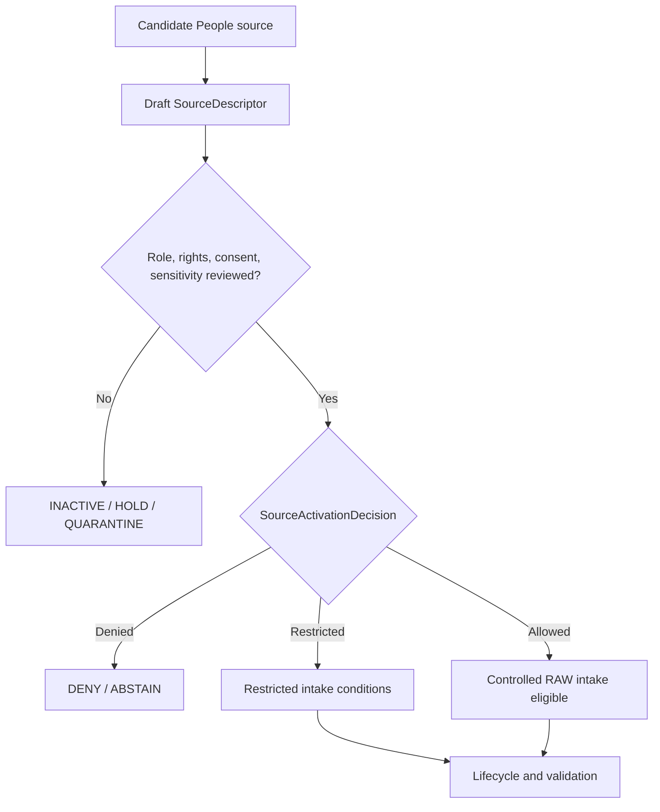

<!-- [KFM_META_BLOCK_V2]
doc_id: kfm://doc/NEEDS-VERIFICATION
title: People Source Registry
type: standard
version: v1
status: draft
owners: OWNER_TBD
created: 2026-06-29
updated: 2026-06-29
policy_label: restricted-review
related: [../README.md, ../../README.md, ../../people-dna-land/README.md, ../../people-dna-land/sources/README.md, ../../../../docs/domains/people-dna-land/README.md, ../../../../docs/domains/people-dna-land/SOURCE_REGISTRY.md, ../../../../docs/domains/people-dna-land/SOURCE_FAMILIES.md]
tags: [kfm, data, registry, sources, people, people-dna-land, source-descriptor, source-role, consent, revocation, privacy, living-person, dna, genomic, genealogy, land-ownership, title, parcel, rights, sensitivity, evidence, provenance, release-gated, no-public-path]
notes: ["Replaces the one-character stub at data/registry/sources/people/README.md.", "This short-slug subtype-first lane is connected to People / DNA / Land doctrine, where slug topology between people and people-dna-land remains NEEDS VERIFICATION.", "Domain-first People / DNA / Land registry material exists under data/registry/people-dna-land/ and data/registry/people-dna-land/sources/.", "People source registry records are admission and authority-control records, not source payloads, person truth, title truth, DNA truth, consent authority, policy, release authority, or public output."]
[/KFM_META_BLOCK_V2] -->

<a id="top"></a>

# People Source Registry

Short-slug source registry lane for People / DNA / Land source descriptor and source-admission records.

> [!IMPORTANT]
> **Status:** experimental  
> **Owners:** OWNER_TBD  
> **Path:** `data/registry/sources/people/`  
> **Truth posture:** cite-or-abstain; deny-by-default source admission; consent-aware; no public path from registry internals.


**Quick links:** [Scope](#scope) | [Repo fit](#repo-fit) | [Inputs](#accepted-inputs) | [Exclusions](#exclusions) | [People source boundary](#people-source-boundary) | [Source families](#source-families) | [Admission flow](#admission-flow) | [Required checks](#required-checks-before-use)

> [!CAUTION]
> This directory is a source registry lane, not a store for person records, genealogy truth, DNA data, land-title truth, consent decisions, or public artifacts. Living-person, DNA/genomic, DNA-derived relationship, private person-parcel, and title-sensitive material fails closed unless consent, rights, sensitivity, evidence, review, release, correction, and rollback gates close.

## Scope

`data/registry/sources/people/` is the short-slug subtype-first source registry lane associated with the People / Genealogy / DNA / Land Ownership domain.

A People source registry record may answer:

- What source family, authority, jurisdiction, record series, export, endpoint, or dataset is being considered or admitted?
- What canonical `source_role` is declared for that source?
- What rights, terms, attribution, consent, revocation, cadence, steward, native version, sensitivity, and authority limits apply?
- What living-person, DNA/genomic, genealogy, land-instrument, title, parcel, person-parcel, cultural, sovereignty, or burial-related blockers are attached?
- What source heads, activation decisions, validation receipts, redaction/generalization receipts, consent receipts, proof references, catalog references, correction notices, withdrawal records, and rollback targets are linked?

A source descriptor does not prove identity, kinship, title, boundary, residence, consent, or DNA-derived relationship truth. It records the conditions under which a source may shape later evidence processing.

## Repo fit

| Relationship | Path | Status | Notes |
| --- | --- | --- | --- |
| This lane | `data/registry/sources/people/` | CONFIRMED | Existing short-slug subtype-first source registry path. |
| Cross-domain source registry parent | [`../README.md`](../README.md) | CONFIRMED | Establishes source registry as admission and authority-control surface. |
| Data registry root | [`../../README.md`](../../README.md) | NEEDS VERIFICATION | Linked for registry context; current contents not re-audited for this update. |
| Domain-first People / DNA / Land registry parent | [`../../people-dna-land/README.md`](../../people-dna-land/README.md) | CONFIRMED | Existing companion lane; marks slug/topology conflict as unresolved. |
| Domain-first People / DNA / Land sources lane | [`../../people-dna-land/sources/README.md`](../../people-dna-land/sources/README.md) | CONFIRMED | Existing companion lane; warns against divergent descriptor authority. |
| People / DNA / Land domain README | [`../../../../docs/domains/people-dna-land/README.md`](../../../../docs/domains/people-dna-land/README.md) | CONFIRMED | Defines the high-sensitivity domain, consent, revocation, and slug conflict posture. |
| Human-facing source registry | [`../../../../docs/domains/people-dna-land/SOURCE_REGISTRY.md`](../../../../docs/domains/people-dna-land/SOURCE_REGISTRY.md) | CONFIRMED | Admission and authority-control surface for maintainers. |
| Source-family catalog | [`../../../../docs/domains/people-dna-land/SOURCE_FAMILIES.md`](../../../../docs/domains/people-dna-land/SOURCE_FAMILIES.md) | CONFIRMED | Source families, source-role taxonomy, rights/sensitivity posture, and anti-collapse notes. |

### Path posture

This README follows the existing short-slug path because the file exists at `data/registry/sources/people/README.md`, and the People / DNA / Land docs explicitly surface slug drift between `people` and `people-dna-land`.

NEEDS VERIFICATION: the repository also contains domain-first registry material under `data/registry/people-dna-land/` and `data/registry/people-dna-land/sources/`. Until an ADR, directory-rule update, migration note, or registry topology decision settles the relationship, maintain one authoritative descriptor record and use pointers or redirect notes rather than divergent copies.

## Accepted inputs

Accepted material is compact, reviewable, and pointer-based:

- `SourceDescriptor` instances or descriptor pointers for People / DNA / Land source families.
- Source-family README files and local index files.
- Source-head metadata summaries: provider, jurisdiction, record series, export version, source vintage, publication date, checksum, manifest, and temporal scope.
- Source role, authority scope, rights, terms, attribution, consent posture, revocation posture, cadence, steward, reviewer, and sensitivity metadata.
- Consent grant/refusal/revocation references, permitted-use constraints, living-person status flags, public-safe transform refs, and withdrawal refs.
- Supersession, withdrawal, correction, embargo, quarantine, revocation, denial, and rollback references.
- Pointers to validation receipts, redaction/generalization receipts, consent receipts, proof packs, catalog records, policy decisions, release candidates, correction notices, and rollback cards.
- Crosswalk references that preserve source IDs, person assertion IDs, record IDs, parcel IDs, legal descriptions, PLSS keys, title-instrument IDs, and transform loss.

Use `NEEDS VERIFICATION`, `UNKNOWN`, `ABSTAIN`, or `DENY` rather than filling missing rights, consent, revocation, owner, source-role, schema, sensitivity, or title evidence facts with plausible defaults.

## Exclusions

| Do not place here | Use instead | Why |
| --- | --- | --- |
| Raw GEDCOM/GEDZip exports, DNA segment data, kit IDs, vendor CSVs, vital-record extracts, deed packages, assessor rolls, parcel files, source-native tables, API dumps, or zipped packages | `data/raw/people-dna-land/`, `data/work/people-dna-land/`, `data/quarantine/people-dna-land/`, or `data/processed/people-dna-land/` after path verification | Registry records are not payload storage. |
| Living-person identifiers, private relationship detail, DNA segment detail, private person-parcel joins, access secrets, or restricted review notes | Restricted lifecycle lanes, quarantine, or governed restricted storage | Sensitive material must not sit in registry prose or indexes. |
| Consent decisions, consent render gates, sensitivity rules, rights rules, access-control logic, or release rules | `policy/consent/people/`, `policy/sensitivity/people/`, `policy/rights/`, or accepted policy homes | Policy and consent authority must stay separate from source metadata. |
| JSON Schema, semantic contracts, DTOs, or validator code | `schemas/`, `contracts/`, `tools/validators/`, or tests after verification | This lane may hold instances and indexes, not schema or code authority. |
| Validation receipts, consent receipts, redaction receipts, run receipts, or process logs | `data/receipts/` after verification | Receipts are process-memory objects. |
| EvidenceBundles, proof packs, signatures, or citation-validation closure | `data/proofs/` after verification | Proof is a separate object family. |
| STAC, DCAT, PROV, domain catalog records, or graph/triplet projections | `data/catalog/` and triplet lanes after verification | Catalog and graph projections are downstream. |
| Release manifests, promotion decisions, correction notices, rollback cards, supersession notices, or withdrawal notices | `release/` after verification | Publication and correction are governed release objects. |
| Public maps, identity pages, genealogy trees, title reports, dashboards, generated narratives, app payloads, or API/UI artifacts | Governed APIs and released artifacts | Public clients must not consume registry internals. |

## People source boundary

| Rule | Handling |
| --- | --- |
| Registry is admission control | It records how a source may be treated before intake. It does not contain the source payload or prove claims. |
| Consent is not publication | Consent constrains use and rendering; it does not itself publish data or satisfy release gates. |
| Consent is revocable | Revocation refs, tombstone/withdrawal behavior, and downstream cleanup obligations must remain visible where applicable. |
| Living-person content fails closed | Living-person identifiers, relationship assertions, person-parcel joins, and private context remain denied or restricted unless policy/review/release gates explicitly permit a public-safe derivative. |
| DNA/genomic material fails closed | Raw kit IDs, segment data, triangulation outputs, and DNA-derived relationship evidence do not become public artifacts. |
| Tree evidence is not authority | GEDCOM, tree overlays, and user-contributed genealogy assertions are `candidate` or `modeled` evidence until independently supported and reviewed. |
| Assessor and tax records are not title truth | Assessor/tax records are `administrative` context; they do not satisfy title or ownership claims. |
| Parcel geometry is not title boundary proof | Parcel, survey, PLSS, and derived geometry must preserve role, vintage, and uncertainty; geometry alone is not title proof. |
| Land instruments require chain context | Deeds, patents, liens, easements, leases, probate records, and related instruments support evidence-bound temporal assertions, not automatic ownership truth. |
| Sovereignty and cultural context fail closed | Burial, cultural heritage, tribal/sovereignty-sensitive, and living-descendant contexts require the most restrictive applicable policy posture. |
| Source role is canonical | Use only `observed`, `regulatory`, `modeled`, `aggregate`, `administrative`, `candidate`, or `synthetic` in new descriptors unless the active schema says otherwise. |
| Publication is separate | Release requires validation, consent/rights/sensitivity policy, review, evidence/proof support, catalog support, release state, correction path, and rollback target. |

## Source families

The table is an orientation surface, not an activation decision. Each admitted source needs its own descriptor and review.

| Family | Typical canonical role | People / DNA / Land use | Default blockers |
| --- | --- | --- | --- |
| Vital, cemetery, burial, obituary, church, school, military, census, directory, court, and probate records | `observed`, `administrative`, `aggregate`, or `candidate` by record | Life events, person assertions, historical context, census summaries | Living-person fields, rights, source vintage, jurisdiction, and evidence confidence. |
| GEDCOM, GEDZip, and family-tree overlays | `candidate` or `modeled` | Relationship hypotheses, imported assertions, tree context | Rights, living flags, submitter authority, dedup state, no-public edge until reviewed. |
| DNA vendor match, segment, and triangulation data | `observed` for measurements; `modeled` for relationship hypotheses; `candidate` before review | Genetic evidence under consent and review | Consent, revocation, raw segment denial, vendor terms, relationship-as-truth risk. |
| Patent, deed, mortgage, lien, easement, lease, mineral, water, access, and probate instruments | `observed`, `regulatory`, or `administrative` by instrument | LandInstrument evidence and temporal ownership assertions | Chain gaps, jurisdiction, recording status, title-weight limits, rights. |
| Assessor and tax-roll records | `administrative` | Valuation, tax, and administrative parcel context | Assessor-as-title denial, current-owner sensitivity, living-person joins. |
| Plat, survey, metes-and-bounds, PLSS, subdivision, and derived geometry | `observed`, `regulatory`, or `modeled` by product | Geometry context and boundary evidence support | Geometry-as-title denial, vintage, survey authority, transform loss. |

## Admission flow



A passing activation decision does not publish anything and does not establish identity, kinship, title, boundary, consent, or relationship truth. It only permits controlled intake under declared conditions. The lifecycle still has to move through RAW, WORK or QUARANTINE, PROCESSED, CATALOG or TRIPLET, and PUBLISHED gates with receipts, proof support, policy, review, release state, correction path, and rollback target.

## Directory shape

Current confirmed state:

```text
data/registry/sources/people/
`-- README.md
```

PROPOSED future child lanes, if slug topology and descriptor ownership are accepted:

```text
data/registry/sources/people/
|-- README.md
|-- vital_records/
|   |-- README.md
|   `-- index.local.json
|-- genealogy_trees/
|   |-- README.md
|   `-- index.local.json
|-- dna_vendor_exports/
|   |-- README.md
|   `-- index.local.json
|-- land_instruments/
|   |-- README.md
|   `-- index.local.json
|-- assessor_tax_rolls/
|   |-- README.md
|   `-- index.local.json
|-- plats_surveys_plss/
|   |-- README.md
|   `-- index.local.json
`-- index.local.json
```

Do not create child directories merely for taxonomy neatness. Add them only when there is a reviewed descriptor, migration note, source-family need, consent path, or stewardship path.

## Descriptor sketch

Illustrative only. Confirm the active schema before creating records.

```json
{
  "id": "kfm-source:people:<source-family>:<stable-source-id>",
  "record_type": "source_descriptor",
  "domain": "people-dna-land",
  "registry_slug": "people",
  "source_family": "vital_records | genealogy_trees | dna_vendor_exports | land_instruments | assessor_tax_rolls | plats_surveys_plss | other",
  "source_name": "SOURCE_NAME_TBD",
  "source_role": "observed | regulatory | modeled | aggregate | administrative | candidate | synthetic",
  "role_authority": "ROLE_AUTHORITY_TBD",
  "jurisdiction_or_provider": "JURISDICTION_OR_PROVIDER_TBD",
  "record_series": "RECORD_SERIES_TBD",
  "native_version": "VERSION_TBD",
  "rights_posture": "RIGHTS_TBD",
  "consent_posture": "CONSENT_TBD",
  "revocation_posture": "REVOCATION_TBD",
  "sensitivity_posture": "SENSITIVITY_TBD",
  "living_person_posture": "LIVING_PERSON_TBD",
  "cadence": "CADENCE_TBD",
  "source_head_ref": "SOURCE_HEAD_TBD",
  "activation_decision_ref": "ACTIVATION_DECISION_TBD",
  "consent_refs": [],
  "validation_receipts": [],
  "redaction_receipts": [],
  "proof_refs": [],
  "catalog_refs": [],
  "policy_refs": [],
  "review_state": "draft",
  "release_state": "not_released",
  "correction_path": "CORRECTION_PATH_TBD",
  "rollback_target": "ROLLBACK_TARGET_TBD",
  "notes": [
    "NEEDS VERIFICATION: confirm schema, owner, source role, rights, consent, revocation, sensitivity, and slug topology before use."
  ]
}
```

## Required checks before use

- [ ] Confirm final topology for `data/registry/sources/people/`, `data/registry/sources/people-dna-land/`, and `data/registry/people-dna-land/sources/`.
- [ ] Confirm active SourceDescriptor schema path and field names.
- [ ] Confirm owner, reviewer, privacy steward, consent steward, rights steward, sensitivity steward, policy steward, proof steward, release steward, and sovereignty reviewer.
- [ ] Confirm canonical source-role enum and any role-conditional required fields.
- [ ] Confirm rights, terms, redistribution, attribution, expiration, permitted-use, and derivative-use posture for each source.
- [ ] Confirm consent grant/refusal/revocation posture before admitting living-person or DNA/genomic material.
- [ ] Confirm raw DNA, kit IDs, segment data, and DNA-derived relationship evidence remain denied from public artifacts.
- [ ] Confirm assessor/tax records cannot be used as title truth.
- [ ] Confirm parcel geometry cannot be used as title boundary proof without supporting land instruments.
- [ ] Confirm living-person, person-parcel, burial, cultural, sovereignty, and restricted-family joins fail closed.
- [ ] Confirm validation, redaction/generalization, and consent receipts before using descriptors in processed, catalog, triplet, or published surfaces.
- [ ] Confirm public use only through governed APIs and released artifacts.

## Status notes

| Claim | Label | Evidence / limit |
| --- | --- | --- |
| This README replaced a one-character stub at the target path. | CONFIRMED | GitHub contents read before update showed `y`. |
| `data/registry/sources/README.md` defines source registry as admission and authority-control surface. | CONFIRMED | Current repo file inspected during this update. |
| People / DNA / Land docs exist under `docs/domains/people-dna-land/`. | CONFIRMED | Current repo README, SOURCE_REGISTRY, and SOURCE_FAMILIES were inspected. |
| Domain-first People / DNA / Land registry material also exists. | CONFIRMED | `data/registry/people-dna-land/README.md` and `data/registry/people-dna-land/sources/README.md` were inspected. |
| `docs/domains/people/` and `data/registry/people/` are populated companion paths. | UNKNOWN / not found | GitHub contents reads returned 404 for those direct paths. |
| Final slug topology between `people` and `people-dna-land` is settled. | NEEDS VERIFICATION | Existing docs explicitly preserve a slug/path conflict. |
| Concrete People SourceDescriptor payloads exist in this lane. | UNKNOWN | Not verified in this session. |
| This README grants activation, consent, publication, public access, title truth, identity truth, relationship truth, or DNA release. | DENY | Activation, consent handling, and publication require separate governed decisions and release gates. |

## Maintainer note

Keep the registry membrane visible:

```text
SourceDescriptor -> SourceActivationDecision -> RAW -> WORK / QUARANTINE -> PROCESSED -> CATALOG / TRIPLET -> PUBLISHED
```

The source registry can admit, restrict, hold, quarantine, or deny sources. It cannot make a person claim true, publish DNA material, prove title, infer consent, collapse assessor records into ownership, or stand in for EvidenceBundle-backed review.

[Back to top](#top)
