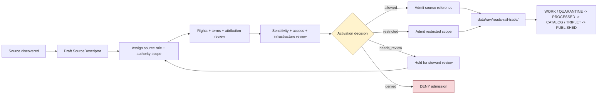

<!-- [KFM_META_BLOCK_V2]
doc_id: kfm://data/registry/sources/roads-rail-trade/readme
name: Roads Rail Trade Subtype-First Source Registry README
path: data/registry/sources/roads-rail-trade/README.md
type: data-registry-sources-roads-rail-trade-readme
version: v0.1.0
status: draft
owners:
  - <registry-steward>
  - <source-steward>
  - <roads-rail-trade-domain-steward>
  - <transport-network-steward>
  - <rights-steward>
  - <sensitivity-steward>
  - <policy-steward>
  - <proof-steward>
  - <release-steward>
  - <docs-steward>
created: 2026-06-29
updated: 2026-06-29
policy_label: restricted-review
truth_posture: cite-or-abstain
responsibility_root: data/
artifact_family: registry
registry_scope: roads-rail-trade-subtype-first-source-registry
domain: roads-rail-trade
path_posture: existing-blank-readme-replaced; subtype-first-source-registry-lane-present; domain-first-registry-parent-confirmed; domain-first-sources-child-confirmed; final-registry-topology-needs-verification
sensitivity_posture: registry-internal; no-public-path; not-navigation-authority; not-current-operational-status; not-legal-access-advice; not-railroad-operating-instructions; source-role-preserving; rights-aware; access-and-restriction-context-fail-closed; infrastructure-and-sensitive-route-context-reviewed; historic-route-overprecision-denial-aware; evidence-aware; policy-aware; release-blocked-until-gates-close
related:
  - ../README.md
  - ../../README.md
  - ../../roads-rail-trade/README.md
  - ../../roads-rail-trade/sources/README.md
  - ../../datasets/README.md
  - ../../domains/README.md
  - ../../crosswalks/README.md
  - ../../rights/README.md
  - ../../sensitivity/README.md
  - ../../layers/README.md
  - ../../../raw/roads-rail-trade/
  - ../../../work/roads-rail-trade/
  - ../../../quarantine/roads-rail-trade/
  - ../../../processed/roads-rail-trade/
  - ../../../catalog/domain/roads-rail-trade/
  - ../../../published/layers/roads-rail-trade/
  - ../../../receipts/roads-rail-trade/
  - ../../../proofs/roads-rail-trade/
  - ../../../../docs/domains/roads-rail-trade/README.md
  - ../../../../packages/domains/roads-rail-trade/README.md
  - ../../../../packages/domains/roads-rail-trade/network/README.md
  - ../../../../packages/domains/roads-rail-trade/identity/README.md
  - ../../../../packages/domains/roads-rail-trade/graph_projection/README.md
  - ../../../../packages/domains/roads-rail-trade/frontier_routes/README.md
  - ../../../../packages/domains/roads-rail-trade/generalization/README.md
  - ../../../../contracts/transport/
  - ../../../../schemas/contracts/v1/source/
  - ../../../../schemas/contracts/v1/transport/
  - ../../../../policy/domains/roads-rail-trade/
  - ../../../../policy/rights/
  - ../../../../policy/sensitivity/
  - ../../../../release/
tags:
  - kfm
  - data
  - registry
  - sources
  - roads-rail-trade
  - source-descriptor
  - source-role
  - transport
  - roads
  - rail
  - trade-routes
  - historic-routes
  - frontier-routes
  - transport-network
  - crossings
  - restrictions
  - access-context
  - graph-projection
  - topology
  - rights
  - sensitivity
  - evidence
  - provenance
  - release-gated
  - rollback
  - no-public-path
notes:
  - "This README replaces the blank `data/registry/sources/roads-rail-trade/README.md` file."
  - "The cross-domain source registry parent supports `data/registry/sources/<domain>/` as a per-domain source-registry segment."
  - "The repository also contains `data/registry/roads-rail-trade/` and `data/registry/roads-rail-trade/sources/`; topology remains NEEDS VERIFICATION until an ADR, migration note, Directory Rules update, or registry inventory selects the canonical lane."
  - "Roads/Rail/Trade source registry records are admission and authority-control records. They do not store source payloads, prove route/current-status/access/navigation claims, define contracts, enforce schemas, hold policy, close catalogs, or publish artifacts."
  - "KFM transport context is evidence and governed publication material, not emergency guidance, navigation instruction, legal access advice, railroad-operating instruction, or current road-condition authority."
[/KFM_META_BLOCK_V2] -->

<a id="top"></a>

# Roads / Rail / Trade Source Registry

Subtype-first source-registry lane for Roads / Rail / Trade source descriptor and source-admission records.

<p>
  
  
  
  
  
  
  
</p>

**Quick links:** [Scope](#scope) · [Path posture](#path-posture) · [Repo fit](#repo-fit) · [Source boundary](#source-boundary) · [Accepted material](#accepted-material) · [Exclusions](#exclusions) · [Source-family orientation](#source-family-orientation) · [Admission flow](#admission-flow) · [Suggested directory shape](#suggested-directory-shape) · [Suggested descriptor shape](#suggested-descriptor-shape) · [Required checks](#required-checks-before-use) · [Status notes](#status-notes)

> [!CAUTION]
> `data/registry/sources/roads-rail-trade/` is a source-registry lane for admission and authority-control records. It is not RAW source storage, WORK staging, QUARANTINE, PROCESSED data, catalog output, proof storage, receipt storage, semantic contract authority, schema authority, policy, release authority, public API/UI material, navigation guidance, legal access advice, railroad-operating instruction, current-condition authority, or generated-answer authority.

---

## Scope

`data/registry/sources/roads-rail-trade/` documents and may hold source descriptor records, source-family indexes, activation/admission sidecars, source-head references, source-role review notes, supersession references, and registry-local indexes for source material that may feed the Roads / Rail / Trade lane.

A source registry record may describe how KFM can treat sources for:

- road segments, route identifiers, route membership, jurisdictional context, and restrictions;
- rail segments, operators, status events, depots, sidings, yards, crossings, and facilities;
- historic roads, trails, military roads, stage routes, wagon roads, cattle trails, postal routes, ferry/crossing references, trade corridors, and interpretive reconstructions;
- bridges, crossings, restrictions, access notes, freight corridors, movement story nodes, and graph-projection candidates;
- source identity, source role, source vintage, retrieval time, rights, terms, cadence, attribution, authority limits, sensitivity, caveats, activation state, and review state.

It does **not** prove that a road, rail line, crossing, bridge, ferry, route, corridor, restriction, operator, access condition, or facility is true, current, complete, safe, legally accessible, operational, or public-safe. Consequential transport claims still require lifecycle processing, evidence support, policy decision, review state, catalog/proof support, release state, correction path, and rollback target.

---

## Path posture

This requested lane is the subtype-first source-registry path:

```text
data/registry/sources/roads-rail-trade/
```

The repository also contains the domain-first registry lane:

```text
data/registry/roads-rail-trade/
data/registry/roads-rail-trade/sources/
```

The cross-domain source registry parent supports `data/registry/sources/<domain>/` as a per-domain source-registry segment, while the domain-first Roads / Rail / Trade parent treats the final registry topology as **NEEDS VERIFICATION**.

Until an ADR, migration note, Directory Rules update, or repository-wide registry inventory resolves this topology, do **not** maintain divergent descriptor sets in both the domain-first and subtype-first locations. Use one record family, preserve redirects or indexes, and keep rollback mechanical.

---

## Repo fit

| Responsibility | Home | Boundary |
|---|---|---|
| Subtype-first Roads / Rail / Trade source records | `data/registry/sources/roads-rail-trade/` | Source descriptors and source-admission metadata for this domain lane. |
| Cross-domain source registry parent | [`../README.md`](../README.md) | General SourceDescriptor and admission-control doctrine. |
| Domain-first registry parent | [`../../roads-rail-trade/README.md`](../../roads-rail-trade/README.md) | Existing routing/compatibility parent for the Roads / Rail / Trade registry lane. |
| Domain-first source lane | [`../../roads-rail-trade/sources/README.md`](../../roads-rail-trade/sources/README.md) | Existing companion source-registry README; must not diverge from this lane. |
| Source payloads | `../../../raw/roads-rail-trade/`, `../../../work/roads-rail-trade/`, `../../../quarantine/roads-rail-trade/`, `../../../processed/roads-rail-trade/` | Actual source data belongs in lifecycle lanes, not registry records. |
| Domain doctrine | [`../../../../docs/domains/roads-rail-trade/README.md`](../../../../docs/domains/roads-rail-trade/README.md) | Human-facing scope, object families, source families, sensitivity, and publication posture. |
| Shared helpers | [`../../../../packages/domains/roads-rail-trade/README.md`](../../../../packages/domains/roads-rail-trade/README.md) | Reusable implementation helpers only; not source authority or release authority. |
| Semantic contracts | `../../../../contracts/transport/` | Domain dossier records `transport/` as the contract segment; presence and companion-registry references need verification. |
| Source schemas | `../../../../schemas/contracts/v1/source/` | Machine shape for source descriptor records, subject to schema-home verification. |
| Transport schemas | `../../../../schemas/contracts/v1/transport/` | Machine shape for transport objects where accepted; exact presence remains NEEDS VERIFICATION. |
| Policy and rights | `../../../../policy/domains/roads-rail-trade/`, `../../../../policy/rights/`, `../../../../policy/sensitivity/` | Allow / deny / restrict / abstain decisions; registry facts are policy inputs, not approvals. |
| Receipts and proofs | `../../../receipts/roads-rail-trade/`, `../../../proofs/roads-rail-trade/` | Process memory and evidence closure; not registry records. |
| Catalog/triplet/published artifacts | `../../../catalog/domain/roads-rail-trade/`, `../../../published/layers/roads-rail-trade/`, accepted triplet lanes | Downstream discovery, graph, and public-safe artifacts after gates close. |
| Release decisions | `../../../../release/` | Promotion, correction, rollback, supersession, withdrawal, and release manifests. |
| Public surfaces | governed APIs and released artifacts only | Public clients do not read this registry lane directly. |

---

## Source boundary

| Rule | Handling |
|---|---|
| Registry record is admission control | It governs how a source may be admitted and used; it does not contain the source payload. |
| Transport source is not operational authority | A source record does not make KFM a navigation, dispatch, road-condition, railroad-operating, legal-access, or emergency-routing authority. |
| Source role is fixed at admission | Observed, regulatory, administrative, modeled, aggregate, candidate, context, synthetic, or restricted roles must not be upgraded by processing, topology, graph projection, cataloging, rendering, or generated explanation. |
| Current status requires current-source support | Closures, restrictions, access status, ownership/operator state, route status, and active infrastructure conditions must carry source time, valid/effective time, retrieval time, stale-state handling, and official authority limits. |
| Historic routes carry uncertainty | Trails, frontier roads, military roads, postal routes, stage routes, trade corridors, and reconstructed paths must preserve source vintage, method, confidence, geometry uncertainty, and overprecision denial checks. |
| Geometry is not legal access | Road, rail, parcel, PLSS, bridge, ferry, crossing, route, and corridor geometry does not prove legal access, safety, current passability, ownership, or operating status by itself. |
| Graph edges are derived | Graph projection outputs are analytic candidates under stated evidence and policy conditions; they are not source truth or public routing authority. |
| Rights and restrictions travel | License, attribution, redistribution, source terms, access restrictions, private-road restrictions, and sensitive infrastructure caveats must remain attached downstream. |
| Sensitive route/access context fails closed | Sensitive facilities, restricted access, private access notes, cultural corridors, critical-facility detail, and safety-relevant context require policy review before exposure. |
| Registry is not validation | Validation receipts, topology receipts, run receipts, and generalization receipts remain separate process-memory objects. |
| Registry is not proof | EvidenceBundle and proof support remain separate. |
| Registry is not catalog | STAC/DCAT/PROV/domain catalog records and graph/triplet projections live under catalog/triplet lanes. |
| Registry is not release | Public exposure requires validation, policy, review, proof/catalog support, release manifest, correction path, and rollback path. |
| Public clients do not read this lane | Public UI/API surfaces consume governed APIs, released artifacts, catalog/triplet/proof-backed responses, and policy-safe envelopes. |

---

## Accepted material

Accepted content is limited to Roads / Rail / Trade source registry records and registry-local support files:

- SourceDescriptor instances or pointers;
- SourceActivationDecision references or activation sidecars where accepted by repo convention;
- SourceIntakeRecord references and source-head metadata summaries;
- source-family README files and local indexes;
- source-role review notes and role-assignment records;
- rights, license, attribution, redistribution, cadence, access, endpoint, terms, steward, authority-scope, and caveat metadata;
- source vintage, route-status basis, jurisdiction, operator/owner assertion scope, transport context, scale/accuracy notes, retrieval refs, and freshness state;
- sensitivity notes for restricted access, private roads, critical infrastructure, cultural corridors, historic-route overprecision, and public-safe generalization requirements;
- supersession, correction, withdrawal, stale-state, and rollback pointers.

---

## Exclusions

| Do not put here | Correct home or owner | Why |
|---|---|---|
| Raw source payloads, API dumps, shapefiles, GeoJSON, tiles, PMTiles, GeoParquet, COGs, CSVs, extracts, or derived datasets | `../../../raw/roads-rail-trade/`, `../../../work/roads-rail-trade/`, `../../../quarantine/roads-rail-trade/`, `../../../processed/roads-rail-trade/` | Registry records describe source authority; lifecycle lanes hold data. |
| Live source fetchers, scrapers, credentials, or source-specific admission code | `connectors/`, `pipelines/`, `pipeline_specs/`, `configs/`, secret-management infrastructure | Source activation is governed and source-specific, not registry-local executable code. |
| Semantic contracts | `../../../../contracts/transport/` or ADR-selected contract lane | Contracts define meaning; registry records reference them. |
| JSON Schemas | `../../../../schemas/contracts/v1/source/`, `../../../../schemas/contracts/v1/transport/`, or ADR-selected schema lane | Schemas define machine shape; registry records are instances or indexes. |
| Policy rules, sensitivity rules, public-safe geometry rules, release policies | `../../../../policy/` | Policy owns allow / deny / restrict / abstain decisions. |
| EvidenceBundles, proof packs, validation reports, topology receipts, run receipts, generalization receipts | `../../../proofs/roads-rail-trade/`, `../../../receipts/roads-rail-trade/`, or accepted trust-object lanes | Proof and process memory remain independently addressable. |
| Catalog records, graph/triplet projections, layer manifests, published artifacts | `../../../catalog/domain/roads-rail-trade/`, `data/triplets/`, `../../../published/layers/roads-rail-trade/` | Downstream publication carriers are not source descriptors. |
| Release manifests, promotion decisions, correction notices, rollback cards | `../../../../release/` | Publication is a governed state transition, not a registry side effect. |
| Navigation instructions, emergency routing, road-condition alerts, legal access advice, or railroad-operating instructions | Outside this registry; use official sources and KFM policy-reviewed public guidance | KFM may provide evidence context, not operational authority. |
| AI-generated route histories or corridor explanations as truth | Governed AI runtime and AIReceipt surfaces | Generated language is interpretive and evidence-subordinate. |

---

## Source-family orientation

These source-family categories are admission aids. They do not assign final authority by source name; the binding role is whatever the reviewed SourceDescriptor records at admission.

| Source family | Typical source-role posture | Registry requirements | Public exposure posture |
|---|---|---|---|
| Census TIGER/Line roads | observed / administrative | source vintage, geometry caveats, rights/attribution, scale, retrieval ref | No legal-status claim by geometry alone. |
| FHWA HPMS | administrative / aggregate | reporting year, aggregation unit, authority scope, rights, cadence | Aggregate and administrative context only unless corroborated. |
| FHWA National Highway Freight Network | regulatory / administrative | designation date, authority scope, version, source vintage, rights | Designation context, not universal freight-route truth. |
| WZDx feeds | observed | endpoint/cadence, retrieval time, stale-state, source-head ref, terms | High-cadence context; public use requires freshness and policy gates. |
| KDOT / KanPlan / KanDrive / Kansas GIS | administrative / observed | issuing authority, dataset version, retrieval time, terms, stale-state, steward | Current-status claims need current-source support and caveats. |
| County / state bridge and restriction data | administrative / observed | authority scope, effective/observed time, restriction class, bridge/crossing IDs | Not legal access, safety, or passability by itself. |
| Rail alignment/operator/status records | administrative / regulatory / observed | operator/status scope, effective interval, source vintage, rights, caveats | Rail operating/status claims require explicit authority and time window. |
| GNIS names | administrative / context | feature ID, name scope, source vintage, rights | Name context only; not legal/status authority. |
| OpenStreetMap | observed / candidate | ODbL/attribution posture, version/diff, contributor-source caveats, legal-status denial test | Candidate/observed context; not legal-status, ownership, designation, or operator authority. |
| Historic maps, atlases, plats, railroad timetables, guidebooks, newspapers, and archival route descriptions | context / observed / candidate | source date, creator, scale, georeferencing method, transcription confidence, rights, cultural sensitivity | Historic route claims require uncertainty, citation, and overprecision denial checks. |
| Oral history, tribal knowledge, treaty/cultural corridor references, and community-supplied route knowledge | restricted / context / candidate | consent/sovereignty posture, steward review, access class, geometry generalization requirement, withdrawal path | Default generalized, staged, or denied unless policy and steward review allow release. |
| Modeled or reconstructed corridors | modeled / synthetic / candidate | model/run ref, input evidence refs, parameters, uncertainty, validation receipt, caveats | Interpretive only; must not replace source evidence. |

> [!IMPORTANT]
> OSM, GNIS, graph projections, modeled corridors, generalized public lines, and AI summaries must not be treated as legal-status, ownership, operator, safety, access, or current-condition authorities unless a reviewed source descriptor, evidence bundle, policy decision, and release state explicitly support the narrow claim.

---

## Admission flow



> [!NOTE]
> A watcher, connector, model, graph process, map renderer, or AI runtime may propose intake material, but none of them publishes a Roads / Rail / Trade claim. Promotion requires governed evidence, validation, policy, review, release, correction, and rollback support.

---

## Suggested directory shape

This shape is **PROPOSED** until the registry topology is reconciled. Do not pre-create empty stubs.

```text
data/registry/sources/roads-rail-trade/
├── README.md
├── index.descriptor.yaml                 # PROPOSED: registry-local source index
├── crosswalks/                           # PROPOSED: source IDs to route/segment/operator IDs
│   └── README.md
├── source_families/                      # PROPOSED: per-family registry notes
│   ├── roads.md
│   ├── rail.md
│   ├── historic-routes.md
│   └── restrictions.md
├── superseded/                           # PROPOSED: replaced descriptors retained with lineage
│   └── README.md
└── <source_id>.descriptor.yaml           # PROPOSED: reviewed SourceDescriptor instance
```

If the domain-first lane remains canonical, this README should become a redirecting orientation page or be migrated with a manifest. If this subtype-first lane becomes canonical, the domain-first source README should redirect here or become a compatibility index. Either migration needs rollback notes.

---

## Suggested descriptor shape

Illustrative only. The canonical source descriptor shape belongs to the accepted source schema.

```yaml
source_id: SOURCE_ID_TBD
domain: roads-rail-trade
source_family: historic-routes | roads | rail | restrictions | crossings | freight | modeled-corridors
source_role: observed | regulatory | modeled | aggregate | administrative | candidate | synthetic | restricted
role_authority: SOURCE_AUTHORITY_TBD
rights:
  license: NEEDS VERIFICATION
  attribution: NEEDS VERIFICATION
  redistribution: NEEDS VERIFICATION
sensitivity:
  baseline: NEEDS VERIFICATION
  public_geometry: exact | generalized | redacted | withheld
  reason_codes:
    - access-context-review-required
cadence:
  source_vintage: DATE_OR_PERIOD_TBD
  retrieval_time: NEEDS VERIFICATION
  stale_after: NEEDS VERIFICATION
evidence:
  source_head_ref: SOURCE_HEAD_TBD
  evidence_ref: EVIDENCE_REF_TBD
  input_digest: DIGEST_TBD
authority_limits:
  - not-navigation-authority
  - not-legal-access-advice
  - not-current-condition-authority
activation:
  status: needs_review | allowed | restricted | denied
  decision_ref: SOURCE_ACTIVATION_DECISION_TBD
review:
  steward: OWNER_TBD
  reviewed_at: NEEDS VERIFICATION
  rollback_target: ROLLBACK_TARGET_TBD
```

---

## Required checks before use

- [ ] Confirm whether `data/registry/sources/roads-rail-trade/` or `data/registry/roads-rail-trade/sources/` is the canonical source-registry lane.
- [ ] Confirm CODEOWNERS for source, domain, rights, sensitivity, policy, proof, release, and docs review.
- [ ] Confirm source descriptor schema home and field names before adding descriptor instances.
- [ ] Confirm the `transport/` contract/schema slug split against current ADRs and update registry companion docs if needed.
- [ ] Confirm no descriptor is duplicated in both subtype-first and domain-first lanes without a migration/index rule.
- [ ] Confirm rights, license, attribution, redistribution, endpoint, terms, and source cadence for each admitted source.
- [ ] Confirm source-role assignment is per-record or per-source-instance and cannot be upgraded downstream.
- [ ] Confirm OSM/GNIS legal-status denial checks before catalog or release.
- [ ] Confirm WZDx, closures, restrictions, access, and current-status material carries retrieval time, stale-state handling, and official authority limits.
- [ ] Confirm historic-route and cultural-corridor records carry uncertainty, sensitivity review, and public-geometry generalization rules.
- [ ] Confirm graph-projection outputs remain derived candidates and never replace source evidence.
- [ ] Confirm public clients use governed APIs, released artifacts, catalog/triplet/proof-backed responses, and policy-safe envelopes only.
- [ ] Confirm rollback target and correction path before any source registry migration.

---

## Status notes

| Item | Status | Notes |
|---|---:|---|
| Target path presence | CONFIRMED | This README replaces a blank file at `data/registry/sources/roads-rail-trade/README.md`. |
| Parent source registry pattern | CONFIRMED | `data/registry/sources/README.md` supports per-domain source-registry segments. |
| Domain-first registry parent | CONFIRMED | `data/registry/roads-rail-trade/README.md` exists and warns that topology needs verification. |
| Domain-first source child | CONFIRMED | `data/registry/roads-rail-trade/sources/README.md` exists as a companion source-registry lane. |
| Final canonical registry lane | NEEDS VERIFICATION | Requires ADR, migration note, Directory Rules update, or inventory decision. |
| Source descriptor payloads | UNKNOWN | This README does not prove descriptor instances exist. |
| Source schema and validator enforcement | NEEDS VERIFICATION | Schema paths, validator paths, fixtures, and CI behavior were not proven by this edit. |
| Contract/schema slug split | NEEDS VERIFICATION | Domain dossier records `contracts/transport/` and `schemas/contracts/v1/transport/`; companion registry docs may still need reconciliation. |
| Rights and freshness | NEEDS VERIFICATION | Every source family must be reviewed before activation. |
| Public release readiness | DENY until proven | Registry state alone cannot publish transport claims. |

---

## Evidence ledger

| Source | Status | Supports | Limits |
|---|---|---|---|
| [`../README.md`](../README.md) | CONFIRMED | Cross-domain source registry role and `data/registry/sources/<domain>/` pattern. | Does not settle Roads / Rail / Trade canonical topology or descriptor payload existence. |
| [`../../roads-rail-trade/README.md`](../../roads-rail-trade/README.md) | CONFIRMED | Domain-first registry parent, topology warning, no-public-path boundary. | Does not make subtype-first or domain-first canonical by itself. |
| [`../../roads-rail-trade/sources/README.md`](../../roads-rail-trade/sources/README.md) | CONFIRMED | Domain-first source-registry companion and transport-specific source boundary. | Does not prove descriptors, schemas, validators, tests, or releases exist. |
| [`../../../../docs/domains/roads-rail-trade/README.md`](../../../../docs/domains/roads-rail-trade/README.md) | CONFIRMED | Domain scope, object families, source-family examples, slug split, sensitivity/publication posture. | Does not prove runtime implementation, CI, source rights, or public release readiness. |
| [`../../../../packages/domains/roads-rail-trade/README.md`](../../../../packages/domains/roads-rail-trade/README.md) | CONFIRMED | Package boundary and anti-collapse rules for implementation helpers. | Package README does not make registry, policy, proof, or release claims authoritative. |

[Back to top](#top)
