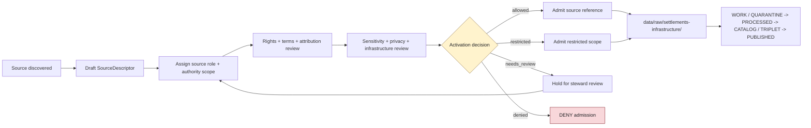

<!-- [KFM_META_BLOCK_V2]
doc_id: kfm://data/registry/sources/settlements-infrastructure/readme
name: Settlements Infrastructure Subtype-First Source Registry README
path: data/registry/sources/settlements-infrastructure/README.md
type: data-registry-sources-settlements-infrastructure-readme
version: v0.1.0
status: draft
owners:
  - <registry-steward>
  - <source-steward>
  - <settlements-infrastructure-domain-steward>
  - <settlements-steward>
  - <infrastructure-steward>
  - <rights-steward>
  - <sensitivity-steward>
  - <policy-steward>
  - <proof-steward>
  - <release-steward>
  - <docs-steward>
created: 2026-06-29
updated: 2026-06-29
policy_label: restricted-review
truth_posture: cite-or-abstain
responsibility_root: data/
artifact_family: registry
registry_scope: settlements-infrastructure-subtype-first-source-registry-parent
domain: settlements-infrastructure
path_posture: existing-blank-readme-replaced; subtype-first-source-registry-parent-present; census-tiger-child-readme-confirmed; domain-first-registry-parent-confirmed; domain-first-sources-child-confirmed; canonical-path-doc-confirms-hyphenated-slug-but-records-settlement-and-infrastructure-policy-variance; final-source-registry-topology-needs-verification
sensitivity_posture: registry-internal; no-public-path; source-role-preserving; rights-aware; legal-status-not-authoritative; operational-status-not-authoritative; precise-facility-context-reviewed; critical-asset-detail-deny-default; operator-condition-dependency-context-fail-closed; private-property-living-person-cultural-context-reviewed; tribal-cultural-sovereignty-context-reviewed; evidence-aware; policy-aware; release-blocked-until-gates-close
related:
  - ../README.md
  - ../../README.md
  - ../../settlements-infrastructure/README.md
  - ../../settlements-infrastructure/sources/README.md
  - census-tiger/README.md
  - ../../datasets/README.md
  - ../../domains/README.md
  - ../../crosswalks/README.md
  - ../../rights/README.md
  - ../../sensitivity/README.md
  - ../../layers/README.md
  - ../../../raw/settlements-infrastructure/
  - ../../../work/settlements-infrastructure/
  - ../../../quarantine/settlements-infrastructure/
  - ../../../processed/settlements-infrastructure/
  - ../../../catalog/domain/settlements-infrastructure/
  - ../../../triplets/settlements-infrastructure/
  - ../../../published/layers/settlements-infrastructure/
  - ../../../receipts/settlements-infrastructure/
  - ../../../proofs/settlements-infrastructure/
  - ../../../../docs/domains/settlements-infrastructure/README.md
  - ../../../../docs/domains/settlements-infrastructure/SOURCE_REGISTRY.md
  - ../../../../docs/domains/settlements-infrastructure/CANONICAL_PATHS.md
  - ../../../../docs/domains/settlements-infrastructure/sublanes/settlements.md
  - ../../../../docs/domains/settlements-infrastructure/sublanes/infrastructure.md
  - ../../../../docs/sources/catalog/census/tiger-line.md
  - ../../../../docs/sources/catalog/usgs/gnis-names.md
  - ../../../../contracts/domains/settlements-infrastructure/README.md
  - ../../../../schemas/contracts/v1/source/
  - ../../../../schemas/contracts/v1/domains/settlements-infrastructure/
  - ../../../../policy/domains/settlements-infrastructure/
  - ../../../../policy/sensitivity/infrastructure/
  - ../../../../policy/rights/
  - ../../../../pipelines/domains/settlements-infrastructure/README.md
  - ../../../../release/
tags:
  - kfm
  - data
  - registry
  - sources
  - settlements-infrastructure
  - source-descriptor
  - source-role
  - settlements
  - infrastructure
  - municipalities
  - census-places
  - townsites
  - ghost-towns
  - forts
  - missions
  - reservation-communities
  - infrastructure-assets
  - facilities
  - service-areas
  - operators
  - condition-observations
  - dependencies
  - census-tiger
  - gnis
  - state-local-gis
  - municipal-records
  - historical-gazetteers
  - infrastructure-operators
  - kdot
  - fema
  - rights
  - sensitivity
  - evidence
  - provenance
  - release-gated
  - rollback
  - no-public-path
notes:
  - "This README replaces the blank `data/registry/sources/settlements-infrastructure/README.md` file."
  - "This is the subtype-first source-registry parent for Settlements / Infrastructure source descriptor and source-admission records."
  - "The repository also contains `data/registry/settlements-infrastructure/` and `data/registry/settlements-infrastructure/sources/`; topology remains NEEDS VERIFICATION until an ADR, migration note, Directory Rules update, or registry inventory selects the canonical lane."
  - "The confirmed child `census-tiger/README.md` is now routed from this parent."
  - "Source registry records are admission and authority-control records. They do not store source payloads, prove settlement/facility/legal/operational claims, define contracts, enforce schemas, hold policy, close catalogs, or publish artifacts."
[/KFM_META_BLOCK_V2] -->

<a id="top"></a>

# Settlements / Infrastructure Source Registry

Subtype-first source-registry parent for Settlements / Infrastructure source descriptor and source-admission records.

<p>
  
  
  
  
  
  
  
</p>

**Quick links:** [Scope](#scope) · [Path posture](#path-posture) · [Repo fit](#repo-fit) · [Confirmed child lanes](#confirmed-child-lanes) · [Source boundary](#source-boundary) · [Accepted material](#accepted-material) · [Exclusions](#exclusions) · [Source-family orientation](#source-family-orientation) · [Admission flow](#admission-flow) · [Suggested directory shape](#suggested-directory-shape) · [Suggested descriptor shape](#suggested-descriptor-shape) · [Required checks](#required-checks-before-use) · [Status notes](#status-notes)

> [!CAUTION]
> `data/registry/sources/settlements-infrastructure/` is a source-registry parent for admission and authority-control records. It is not RAW source storage, WORK staging, QUARANTINE, PROCESSED data, catalog output, proof storage, receipt storage, semantic contract authority, schema authority, policy, release authority, public API/UI material, legal-status authority, operational-status authority, infrastructure-security guidance, emergency guidance, or generated-answer authority.

---

## Scope

`data/registry/sources/settlements-infrastructure/` documents and may hold source descriptor records, source-family indexes, activation/admission sidecars, source-head references, source-role review notes, supersession references, and registry-local indexes for source material that may feed the Settlements / Infrastructure lane.

Settlements / Infrastructure source registry records describe how a source may be treated **before** source material reaches RAW. They may record:

- source identity, source family, source role, authority scope, and permitted claim families;
- rights, license, attribution, redistribution, endpoint terms, access posture, cadence, source head, retrieval window, source vintage, effective time, valid time, and source version;
- sensitivity posture for settlements, municipalities, census places, historic townsites, ghost towns, forts, missions, reservation communities, infrastructure assets, facilities, service areas, operators, condition observations, dependencies, private-property context, living-person context, cultural context, and public-safety-relevant material;
- steward, contact, reviewer, activation state, correction state, supersession state, stale-state handling, withdrawal state, and rollback pointers;
- required quarantine, validation, normalization, geocoding, redaction, generalization, proof, catalog, release, correction, and rollback requirements.

They do **not** prove that a settlement, municipality, census place, townsite, fort, mission, reservation community, facility, network asset, service area, operator, condition, dependency, address, boundary, access condition, legal status, ownership, service availability, emergency readiness, or operational state is true, current, complete, public-safe, or release-approved.

---

## Path posture

The requested and existing lane is:

```text
data/registry/sources/settlements-infrastructure/
```

This is the subtype-first source-registry pattern under:

```text
data/registry/sources/
```

The repository also contains the domain-first registry lane:

```text
data/registry/settlements-infrastructure/
data/registry/settlements-infrastructure/sources/
```

The current domain documentation confirms the hyphenated `settlements-infrastructure` slug while also recording path-shape variance with singular `settlement` and infrastructure policy projections. Therefore this path is treated as **CONFIRMED path presence / NEEDS VERIFICATION topology**.

Until an ADR, migration note, Directory Rules update, or repository-wide registry inventory resolves this topology, do **not** maintain divergent descriptor sets in both the subtype-first and domain-first locations. Use one record family, preserve redirects or indexes, and keep rollback mechanical.

---

## Repo fit

| Responsibility | Home | Boundary |
|---|---|---|
| Subtype-first Settlements / Infrastructure source records | `data/registry/sources/settlements-infrastructure/` | Source descriptors and source-admission metadata for this domain lane. |
| Cross-domain source registry parent | [`../README.md`](../README.md) | General source registry doctrine and `data/registry/sources/<domain>/` pattern. |
| Census TIGER child source lane | [`census-tiger/README.md`](census-tiger/README.md) | TIGER/Line source-admission metadata for this domain. |
| Domain-first registry parent | [`../../settlements-infrastructure/README.md`](../../settlements-infrastructure/README.md) | Existing routing/compatibility parent; not canonical by itself. |
| Domain-first source registry | [`../../settlements-infrastructure/sources/README.md`](../../settlements-infrastructure/sources/README.md) | Existing companion source-registry lane; must not diverge from this lane. |
| Source payloads | `../../../raw/settlements-infrastructure/`, `../../../work/settlements-infrastructure/`, `../../../quarantine/settlements-infrastructure/`, `../../../processed/settlements-infrastructure/` | Actual data belongs in lifecycle lanes, not registry records. |
| Domain doctrine | [`../../../../docs/domains/settlements-infrastructure/README.md`](../../../../docs/domains/settlements-infrastructure/README.md) | Human-facing domain scope, object families, source families, sensitivity, and publication posture. |
| Source-family doctrine | [`../../../../docs/domains/settlements-infrastructure/SOURCE_REGISTRY.md`](../../../../docs/domains/settlements-infrastructure/SOURCE_REGISTRY.md) | Human-facing source orientation; operational registry records live here or in reconciled registry lanes. |
| Canonical path guidance | [`../../../../docs/domains/settlements-infrastructure/CANONICAL_PATHS.md`](../../../../docs/domains/settlements-infrastructure/CANONICAL_PATHS.md) | Path registry and slug-variance control surface; not source descriptors. |
| Semantic meaning | `../../../../contracts/domains/settlements-infrastructure/` | Object-family meaning and invariants. |
| Machine shape | `../../../../schemas/contracts/v1/source/`, `../../../../schemas/contracts/v1/domains/settlements-infrastructure/`, or ADR-selected schema lane | Schema enforcement; exact source descriptor schema state remains NEEDS VERIFICATION. |
| Policy, sensitivity, and rights | `../../../../policy/domains/settlements-infrastructure/`, `../../../../policy/sensitivity/infrastructure/`, `../../../../policy/rights/`, and accepted sensitivity/access policy lanes | Access, rights, sensitivity, stale-state, dependency, infrastructure, privacy, and release rules. |
| Pipeline logic | `../../../../pipelines/domains/settlements-infrastructure/` | Executable transformation support only; not source descriptors, data, policy, proof, release, or public authority. |
| Validation/redaction/pipeline receipts | `../../../receipts/settlements-infrastructure/` and accepted receipt lanes | Process memory for checks and public-safe transforms. |
| Proof/evidence | `../../../proofs/settlements-infrastructure/` or accepted proof lanes | EvidenceBundle closure, proof packs, signatures, and citation validation. |
| Catalog and graph projections | `../../../catalog/domain/settlements-infrastructure/`, `../../../triplets/settlements-infrastructure/`, and accepted graph/catalog lanes | Catalog/discovery carriers and derived relationship projections after catalog closure. |
| Release decisions | `../../../../release/` | Promotion, correction, rollback, supersession, withdrawal, and release manifests. |
| Public surfaces | governed APIs and released artifacts only | Public clients do not read this registry lane directly. |

---

## Confirmed child lanes

This confirms path/README evidence only. It does not prove emitted records, schemas, validators, fixtures, CI enforcement, signing, release integration, correction hooks, rollback hooks, governed API behavior, public-safe summaries, or public UI behavior.

| Child lane | Status | Purpose | Boundary |
|---|---:|---|---|
| [`census-tiger/`](census-tiger/README.md) | CONFIRMED README | Census TIGER/Line source-admission metadata for vintage-tagged administrative geometry and GEOID context. | Not Census attribute data, municipal legal status, cadastral truth, canonical roads truth, canonical hydrology truth, source payload storage, proof, policy, release, or public output. |

Future child lanes should be created only when there is real source-family content and a clear registry need. Do not create empty placeholder folders.

---

## Source boundary

| Rule | Handling |
|---|---|
| Registry record is admission control | It governs how a source may be admitted and used; it does not contain the source payload. |
| Source is not legal or operational authority | A source descriptor does not make KFM the authority for municipal status, address validity, land access, service availability, facility condition, utility dependency, emergency readiness, or operational instructions. |
| Source role is fixed at admission | Observed, regulatory, administrative, modeled, aggregate, candidate, and synthetic roles must not be upgraded by processing, normalization, geocoding, cataloging, rendering, or generated explanation. |
| Restricted access is not a truth role by itself | If the accepted schema uses a seven-role vocabulary, use sensitivity/access fields for restriction rather than inventing a new truth role. |
| Current status requires current-source support | Municipal status, facility operation, condition observations, dependencies, service areas, ownership/operator state, and infrastructure condition claims must carry source time, valid/effective time, retrieval time, stale-state handling, and authority limits. |
| Historic and cultural places carry uncertainty | Townsites, ghost towns, forts, missions, reservation communities, boundary changes, name changes, and historical settlement references must preserve source vintage, method, confidence, and geometry uncertainty. |
| Geometry is not legal status | Points, polygons, addresses, footprints, service areas, networks, and boundaries do not prove legal existence, jurisdiction, ownership, access, service entitlement, safety, or current operational state by themselves. |
| Infrastructure-sensitive context fails closed | Critical assets, exact facility geometry, dependency chains, utility/security-sensitive detail, private-property context, and public-safety-relevant fields require policy review before exposure. |
| Living-person and private-property joins fail closed | Address, operator, parcel, owner, tenant, resident, employee, facility, and service-dependency joins must not expose living-person or private-property detail without explicit policy support. |
| Tribal and cultural context requires review | Reservation communities, missions, forts, cultural places, oral history, tribal geography, and sovereignty-related context require steward review where applicable. |
| Rights and restrictions travel | License, attribution, redistribution, endpoint terms, source restrictions, private-source restrictions, and steward caveats must remain attached downstream. |
| Registry is not validation | Validation receipts, geocoding receipts, normalization receipts, redaction receipts, policy receipts, and run receipts remain separate process-memory objects. |
| Registry is not proof | EvidenceBundle/proof support remains separate. |
| Registry is not catalog | STAC/DCAT/PROV/domain catalog records and graph/triplet projections live under catalog/triplet lanes. |
| Registry is not release | Public exposure requires validation, policy, review, proof/catalog support, release manifest, correction path, and rollback path. |
| Public clients do not read this lane | Public UI/API surfaces consume governed APIs, released artifacts, catalog/triplet/proof-backed responses, and policy-safe envelopes. |

---

## Accepted material

Accepted content is limited to Settlements / Infrastructure source registry records and registry-local support files:

- SourceDescriptor instances or pointers;
- SourceActivationDecision references or activation sidecars where accepted by repo convention;
- SourceIntakeRecord references and source-head metadata summaries;
- source-family README files and local indexes;
- source-role review notes and role-assignment records;
- rights, license, attribution, redistribution, cadence, access, endpoint, terms, steward, authority-scope, and caveat metadata;
- source vintage, legal-status basis, operational-status basis, place-name scope, boundary scope, address/facility context, operator assertion scope, service-area scope, condition/dependency scope, geometry/support notes, retrieval refs, and freshness state;
- sensitivity notes for precise facilities, critical assets, dependencies, private-property context, living-person context, tribal/cultural context, and public-safe generalization requirements;
- supersession, correction, withdrawal, stale-state, and rollback pointers.

---

## Exclusions

| Do not put here | Correct home or owner | Why |
|---|---|---|
| Raw source payloads, API dumps, shapefiles, GeoJSON, GeoParquet, PMTiles, CSVs, database exports, or transformed datasets | `../../../raw/settlements-infrastructure/`, `../../../work/settlements-infrastructure/`, `../../../quarantine/settlements-infrastructure/`, `../../../processed/settlements-infrastructure/` | Registry records describe source authority; lifecycle lanes hold data. |
| Live source fetchers, scrapers, credentials, or source-specific admission code | `connectors/`, `pipelines/`, `pipeline_specs/`, `configs/`, secret-management infrastructure | Source activation is governed and source-specific, not registry-local executable code. |
| Semantic contracts | `../../../../contracts/domains/settlements-infrastructure/` or ADR-selected contract lane | Contracts define meaning; registry records reference them. |
| JSON Schemas | `../../../../schemas/contracts/v1/source/`, `../../../../schemas/contracts/v1/domains/settlements-infrastructure/`, or ADR-selected schema lane | Schemas define machine shape; registry records are instances or indexes. |
| Policy rules, sensitivity rules, public-safe geometry rules, release policies | `../../../../policy/` | Policy owns allow / deny / restrict / abstain decisions. |
| EvidenceBundles, proof packs, validation reports, redaction receipts, run receipts, geocoding receipts, policy receipts | `../../../proofs/settlements-infrastructure/`, `../../../receipts/settlements-infrastructure/`, or accepted trust-object lanes | Proof and process memory remain independently addressable. |
| Catalog records, graph/triplet projections, layer manifests, published artifacts | `../../../catalog/domain/settlements-infrastructure/`, `../../../triplets/settlements-infrastructure/`, `../../../published/layers/settlements-infrastructure/` | Downstream publication carriers are not source descriptors. |
| Release manifests, promotion decisions, correction notices, rollback cards | `../../../../release/` | Publication is a governed state transition, not a registry side effect. |
| Legal advice, operational instructions, emergency readiness guidance, access permission, utility/security guidance, or public-safety instructions | Outside this registry; use official sources and KFM policy-reviewed public guidance | KFM may provide evidence context, not operational authority. |
| AI-generated place histories, facility summaries, or infrastructure explanations as truth | Governed AI runtime and AIReceipt surfaces | Generated language is interpretive and evidence-subordinate. |

---

## Source-family orientation

These source-family categories are admission aids. They do not assign final authority by source name; the binding role is whatever the reviewed SourceDescriptor records at admission.

| Source family | Typical source-role posture | Registry requirements | Public exposure posture |
|---|---|---|---|
| Census TIGER / census-place geography | administrative / observed / aggregate context | product vintage, GEOID rules, feature-class scope, rights, retrieval ref, legal-status caveat | Geometry context only; not municipal legal status or cadastral truth. |
| GNIS and gazetteers | administrative / observed / context | feature ID, name scope, source vintage, rights, alternate-name rules | Name evidence only; not legal existence or current status by itself. |
| State / local GIS | administrative / observed / aggregate | publisher authority, dataset version, retrieval time, terms, feature scope, sensitivity | GIS convenience does not decide source role or release state. |
| Municipal and local legal records | administrative / regulatory / observed by record type | jurisdiction, event type, effective date, legal instrument ref, rights | Can support legal-status claims only within source scope and review state. |
| Historical gazetteers and maps | observed / candidate / context | source date, creator, scale, georeferencing method, confidence, rights | Historic places require uncertainty and sensitivity review before public use. |
| Infrastructure operators and providers | administrative / observed / restricted-access context | operator authority, access terms, condition/dependency sensitivity, freshness, review state | Default restricted/deny for condition, dependency, and precise geometry detail. |
| KDOT / bridge / facility sources | administrative / observed / aggregate | source vintage, facility/bridge IDs, cross-lane relation to Roads/Rail, terms, freshness | Facility context only until policy, evidence, and release gates close. |
| FEMA / hazards / resilience sources | regulatory / observed / administrative | layer/event distinction, effective date, revision date, hazard-domain relation, rights | Regulatory layers are not observed events; Hazards owns warning/event truth. |

---

## Admission flow



> [!NOTE]
> A watcher, connector, model, map renderer, or AI runtime may propose intake material, but none of them publishes a Settlements / Infrastructure claim. Promotion requires governed evidence, validation, policy, review, release, correction, and rollback support.

---

## Suggested directory shape

This shape is **PROPOSED** until the registry topology is reconciled. Do not pre-create empty stubs.

```text
data/registry/sources/settlements-infrastructure/
├── README.md
├── census-tiger/
│   └── README.md
├── gnis-gazetteers/                       # PROPOSED: create only with real source content
│   └── README.md
├── state-local-gis/                       # PROPOSED
│   └── README.md
├── municipal-legal-records/               # PROPOSED
│   └── README.md
├── historical-gazetteers-maps/            # PROPOSED
│   └── README.md
├── infrastructure-operators/              # PROPOSED
│   └── README.md
├── kdot-bridge-facility/                  # PROPOSED
│   └── README.md
├── fema-hazards-resilience/               # PROPOSED
│   └── README.md
├── crosswalks/                            # PROPOSED: source IDs to names, boundaries, places, facilities, operators, service areas
│   └── README.md
├── superseded/                            # PROPOSED: replaced descriptors retained with lineage
│   └── README.md
└── index.descriptor.yaml                  # PROPOSED: registry-local source index
```

If the domain-first lane remains canonical, this README should become a redirecting orientation page or be migrated with a manifest. If this subtype-first lane becomes canonical, the domain-first source README should redirect here or become a compatibility index. Either migration needs rollback notes.

---

## Suggested descriptor shape

Illustrative only. The canonical source descriptor shape belongs to the accepted source schema.

```yaml
source_id: SOURCE_ID_TBD
domain: settlements-infrastructure
source_family: census-tiger | gnis-gazetteers | state-local-gis | municipal-legal-records | historical-gazetteers-maps | infrastructure-operators | kdot-bridge-facility | fema-hazards-resilience
source_role: observed | regulatory | modeled | aggregate | administrative | candidate | synthetic
role_authority: SOURCE_AUTHORITY_TBD
claim_scope:
  object_families:
    - Settlement
    - Municipality
    - CensusPlace
    - Townsite
    - GhostTown
    - Fort
    - Mission
    - ReservationCommunity
    - InfrastructureAsset
    - Facility
    - ServiceArea
    - Operator
    - ConditionObservation
    - Dependency
  denied_claims:
    - legal-status-without-legal-source
    - operational-status-without-current-source
rights:
  license: NEEDS VERIFICATION
  attribution: NEEDS VERIFICATION
  redistribution: NEEDS VERIFICATION
sensitivity:
  baseline: NEEDS VERIFICATION
  access: public | restricted | named-party | internal-only
  public_geometry: exact | generalized | redacted | withheld
  reason_codes:
    - source-role-review-required
    - infrastructure-join-review-required
    - living-person-private-property-review-required
cadence:
  source_vintage: DATE_OR_PERIOD_TBD
  retrieval_time: NEEDS VERIFICATION
  stale_after: NEEDS VERIFICATION
evidence:
  source_head_ref: SOURCE_HEAD_TBD
  evidence_ref: EVIDENCE_REF_TBD
  input_digest: DIGEST_TBD
authority_limits:
  - not-legal-status-authority-by-default
  - not-operational-status-authority-by-default
  - not-release-authority
activation:
  status: needs_review | allowed | restricted | denied
  decision_ref: SOURCE_ACTIVATION_DECISION_TBD
review:
  steward: OWNER_TBD
  reviewed_at: NEEDS VERIFICATION
  rollback_target: ROLLBACK_TARGET_TBD
```

---

## Required checks before use

- [ ] Confirm whether `data/registry/sources/settlements-infrastructure/` or `data/registry/settlements-infrastructure/sources/` is the canonical source-registry lane.
- [ ] Confirm whether this parent should remain a record home, an index, or a redirect/compatibility README after topology reconciliation.
- [ ] Confirm CODEOWNERS for source, domain, rights, sensitivity, policy, proof, release, and docs review.
- [ ] Confirm accepted source descriptor schema home and field names before adding descriptor instances.
- [ ] Confirm source-role vocabulary and whether restricted access belongs in `source_role` or access/sensitivity fields.
- [ ] Confirm no descriptor is duplicated in both subtype-first and domain-first lanes without a migration/index rule.
- [ ] Confirm rights, license, attribution, redistribution, endpoint, terms, and source cadence for each admitted source.
- [ ] Confirm municipal/legal-status claims require legal-source support and cannot be inferred from geometry or names alone.
- [ ] Confirm operational/facility/condition/dependency claims carry current-source support, stale-state handling, and authority limits.
- [ ] Confirm critical infrastructure, exact facility geometry, dependency, operator-sensitive, private-property, living-person, tribal/cultural, and emergency-adjacent details fail closed until policy review.
- [ ] Confirm cross-lane joins preserve owning-domain authority for Roads/Rail, Hydrology, Hazards, People/Land, Archaeology, Flora, Fauna, and Habitat evidence.
- [ ] Confirm validation, redaction, geocoding, topology, and run receipts live outside the registry.
- [ ] Confirm public clients use governed APIs, released artifacts, catalog/triplet/proof-backed responses, and policy-safe envelopes only.
- [ ] Confirm rollback target and correction path before any source registry migration or public release.

---

## Status notes

| Item | Status | Notes |
|---|---:|---|
| Target path presence | CONFIRMED | This README replaces a blank file at `data/registry/sources/settlements-infrastructure/README.md`. |
| Cross-domain source registry pattern | CONFIRMED | `data/registry/sources/README.md` supports per-domain source-registry segments. |
| Census TIGER child lane | CONFIRMED | `census-tiger/README.md` exists and is routed from this parent. |
| Domain-first registry parent | CONFIRMED | `data/registry/settlements-infrastructure/README.md` exists and warns that topology needs verification. |
| Domain-first source child | CONFIRMED | `data/registry/settlements-infrastructure/sources/README.md` exists as a companion source-registry lane. |
| Final canonical registry lane | NEEDS VERIFICATION | Requires ADR, migration note, Directory Rules update, or inventory decision. |
| Source descriptor payloads | UNKNOWN | This README does not prove descriptor instances exist. |
| Source schema and validator enforcement | NEEDS VERIFICATION | Schema paths, validator paths, fixtures, and CI behavior were not proven by this edit. |
| Rights and freshness | NEEDS VERIFICATION | Every source family must be reviewed before activation. |
| Public release readiness | DENY until proven | Registry state alone cannot publish settlement, place, boundary, infrastructure, or layer claims. |

---

## Evidence ledger

| Source | Status | Supports | Limits |
|---|---|---|---|
| [`../README.md`](../README.md) | CONFIRMED | Cross-domain source registry role and `data/registry/sources/<domain>/` pattern. | Does not settle Settlements / Infrastructure canonical topology or descriptor payload existence. |
| [`census-tiger/README.md`](census-tiger/README.md) | CONFIRMED | Child lane boundary for Census TIGER/Line source-admission metadata. | Does not prove descriptor instances, payloads, validators, or releases exist. |
| [`../../settlements-infrastructure/README.md`](../../settlements-infrastructure/README.md) | CONFIRMED | Domain-first registry parent, topology warning, no-public-path boundary. | Does not make subtype-first or domain-first canonical by itself. |
| [`../../settlements-infrastructure/sources/README.md`](../../settlements-infrastructure/sources/README.md) | CONFIRMED | Domain-first source-registry companion and Settlements / Infrastructure source boundary. | Does not prove descriptors, schemas, validators, tests, or releases exist. |
| [`../../../../docs/domains/settlements-infrastructure/SOURCE_REGISTRY.md`](../../../../docs/domains/settlements-infrastructure/SOURCE_REGISTRY.md) | CONFIRMED | Source-family list, source-role taxonomy, activation flow, sensitivity defaults, and cross-lane sourcing rules. | Human-facing orientation; implementation bindings remain NEEDS VERIFICATION where marked. |
| [`../../../../docs/domains/settlements-infrastructure/CANONICAL_PATHS.md`](../../../../docs/domains/settlements-infrastructure/CANONICAL_PATHS.md) | CONFIRMED | Hyphenated slug and path-variance/open-question posture. | Does not prove all listed paths exist or are implemented. |
| [`../../../raw/settlements-infrastructure/README.md`](../../../raw/settlements-infrastructure/README.md) | CONFIRMED | RAW no-public-path boundary and source-family posture. | RAW README does not authorize registry records or public release. |

[Back to top](#top)
