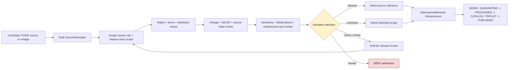

<!-- [KFM_META_BLOCK_V2]
doc_id: kfm://data/registry/sources/settlements-infrastructure/census-tiger/readme
name: Settlements Infrastructure Census TIGER Source Registry README
path: data/registry/sources/settlements-infrastructure/census-tiger/README.md
type: data-registry-sources-settlements-infrastructure-census-tiger-readme
version: v0.1.0
status: draft
owners:
  - <registry-steward>
  - <source-steward>
  - <settlements-infrastructure-domain-steward>
  - <settlements-steward>
  - <infrastructure-steward>
  - <census-source-steward>
  - <rights-steward>
  - <sensitivity-steward>
  - <policy-steward>
  - <proof-steward>
  - <release-steward>
  - <docs-steward>
created: 2026-06-29
updated: 2026-06-29
policy_label: restricted-review
truth_posture: cite-or-abstain
responsibility_root: data/
artifact_family: registry
registry_scope: settlements-infrastructure-census-tiger-source-registry-child-lane
domain: settlements-infrastructure
source_family: census-tiger
path_posture: existing-blank-readme-replaced; parent-subtype-first-readme-blank; domain-first-registry-parent-confirmed; domain-first-sources-child-confirmed; census-tiger-catalog-profile-confirmed; final-source-registry-topology-needs-verification
sensitivity_posture: registry-internal; no-public-path; source-role-preserving; vintage-pinned; geoid-join-guarded; legal-status-not-authoritative; census-geometry-not-cadastral-boundary; roads-and-hydro-context-not-canonical; tribal-and-cultural-context-reviewed; critical-facility-and-infrastructure-joins-fail-closed; rights-aware; policy-aware; release-blocked-until-gates-close
related:
  - ../README.md
  - ../../README.md
  - ../../../README.md
  - ../../../settlements-infrastructure/README.md
  - ../../../settlements-infrastructure/sources/README.md
  - ../../../../raw/settlements-infrastructure/
  - ../../../../work/settlements-infrastructure/
  - ../../../../quarantine/settlements-infrastructure/
  - ../../../../processed/settlements-infrastructure/
  - ../../../../catalog/domain/settlements-infrastructure/
  - ../../../../triplets/settlements-infrastructure/
  - ../../../../published/layers/settlements-infrastructure/
  - ../../../../receipts/settlements-infrastructure/
  - ../../../../proofs/settlements-infrastructure/
  - ../../../../../docs/domains/settlements-infrastructure/README.md
  - ../../../../../docs/domains/settlements-infrastructure/SOURCE_REGISTRY.md
  - ../../../../../docs/domains/settlements-infrastructure/CANONICAL_PATHS.md
  - ../../../../../docs/sources/catalog/census/tiger-line.md
  - ../../../../../schemas/contracts/v1/source/
  - ../../../../../schemas/contracts/v1/domains/settlements-infrastructure/
  - ../../../../../policy/domains/settlements-infrastructure/
  - ../../../../../policy/sensitivity/infrastructure/
  - ../../../../../policy/rights/
  - ../../../../../release/
tags:
  - kfm
  - data
  - registry
  - sources
  - settlements-infrastructure
  - census-tiger
  - tiger-line
  - census-place
  - administrative-geometry
  - geoid
  - vintage
  - source-descriptor
  - source-role
  - rights
  - sensitivity
  - evidence
  - provenance
  - release-gated
  - no-public-path
notes:
  - "This README replaces the blank `data/registry/sources/settlements-infrastructure/census-tiger/README.md` file."
  - "The immediate parent `data/registry/sources/settlements-infrastructure/README.md` is currently blank, so this child README is self-bounding and points to confirmed domain-first companion docs."
  - "Census TIGER/Line is treated here as a source-admission lane for vintage-tagged administrative geometry and GEOID context, not as Census attribute data, municipal legal status, cadastral truth, canonical roads truth, canonical hydrology truth, or public release authority."
  - "Final topology between `data/registry/sources/settlements-infrastructure/` and `data/registry/settlements-infrastructure/sources/` remains NEEDS VERIFICATION until an ADR, migration note, Directory Rules update, or registry inventory resolves it."
[/KFM_META_BLOCK_V2] -->

<a id="top"></a>

# Census TIGER Source Registry

Child source-registry lane for Census TIGER/Line admission metadata used by the Settlements / Infrastructure domain.

<p>
  
  
  
  
  
  
  
</p>

**Quick links:** [Scope](#scope) · [Path posture](#path-posture) · [Repo fit](#repo-fit) · [TIGER source boundary](#tiger-source-boundary) · [Accepted material](#accepted-material) · [Exclusions](#exclusions) · [Source-role handling](#source-role-handling) · [Admission flow](#admission-flow) · [Suggested directory shape](#suggested-directory-shape) · [Suggested descriptor shape](#suggested-descriptor-shape) · [Required checks](#required-checks-before-use) · [Status notes](#status-notes)

> [!CAUTION]
> `data/registry/sources/settlements-infrastructure/census-tiger/` is a source-registry child lane. It is not TIGER payload storage, a Census download mirror, a municipal legal-status register, cadastral boundary authority, canonical road truth, canonical hydrology truth, proof storage, receipt storage, policy, release authority, public API/UI material, public layer material, or generated-answer authority.

---

## Scope

This directory documents and may hold source-admission metadata for Census TIGER/Line material used by the Settlements / Infrastructure domain. It is specifically for registry-side records that describe how KFM may admit, cite, constrain, join, validate, quarantine, supersede, or deny TIGER-derived source material before any payload enters RAW.

For this lane, source registry records may describe:

- TIGER/Line product identity, source family, product vintage, source head, retrieval window, and source version;
- feature-class allow lists relevant to settlements and infrastructure, such as places, census places, county subdivisions, tracts, blocks, tribal areas, roads as context, hydrography as context, or other reviewed classes;
- GEOID handling, vintage pins, cross-vintage crosswalk requirements, and join constraints;
- source-role posture for administrative geometry, aggregate contexts, and candidate joins;
- rights, attribution, redistribution, endpoint terms, cadence, freshness, and steward review state;
- caveats that prevent TIGER geometry from becoming legal municipal status, cadastral truth, transport authority, hydrology authority, or public release approval;
- sensitivity notes for tribal/cultural geography, infrastructure joins, exact facility joins, and downstream public-safe geometry.

This directory does **not** prove that a place, municipality, census place, townsite, reservation community, facility, service area, boundary, address, road, hydro feature, infrastructure asset, or dependency is true, current, legal, complete, operational, or public-safe. Consequential claims require lifecycle processing, evidence support, policy decision, review state, catalog/proof support, release state, correction path, and rollback target.

---

## Path posture

The requested child lane is:

```text
data/registry/sources/settlements-infrastructure/census-tiger/
```

The immediate parent exists but is currently blank:

```text
data/registry/sources/settlements-infrastructure/README.md
```

The repository also contains a domain-first Settlements / Infrastructure registry lane and source child:

```text
data/registry/settlements-infrastructure/
data/registry/settlements-infrastructure/sources/
```

Domain documentation also records path-shape variance for this lane, including the hyphenated `settlements-infrastructure` slug and variance with singular `settlement` and infrastructure policy projections. Until an ADR, migration note, Directory Rules update, or repository-wide inventory resolves this topology, do **not** maintain divergent SourceDescriptor sets across the subtype-first and domain-first paths.

---

## Repo fit

| Responsibility | Home | Boundary |
|---|---|---|
| Census TIGER child source registry | `data/registry/sources/settlements-infrastructure/census-tiger/` | Source-admission records and registry-local orientation for TIGER/Line in this domain. |
| Subtype-first Settlements / Infrastructure source parent | [`../README.md`](../README.md) | Currently blank; topology and parent contract need follow-up. |
| Cross-domain source registry parent | [`../../README.md`](../../README.md) | General source registry doctrine and `data/registry/sources/<domain>/` pattern. |
| Domain-first registry parent | [`../../../settlements-infrastructure/README.md`](../../../settlements-infrastructure/README.md) | Confirmed routing/compatibility parent; not canonical by itself. |
| Domain-first source registry | [`../../../settlements-infrastructure/sources/README.md`](../../../settlements-infrastructure/sources/README.md) | Confirmed companion source-registry lane; must not diverge from this child lane. |
| Human-facing domain source doctrine | [`../../../../../docs/domains/settlements-infrastructure/SOURCE_REGISTRY.md`](../../../../../docs/domains/settlements-infrastructure/SOURCE_REGISTRY.md) | Explains source families and roles; operational registry records live under `data/registry/`. |
| Census TIGER catalog profile | [`../../../../../docs/sources/catalog/census/tiger-line.md`](../../../../../docs/sources/catalog/census/tiger-line.md) | Human-facing catalog/product page; not SourceDescriptor authority. |
| TIGER payload capture | `../../../../raw/settlements-infrastructure/` | Raw payloads or payload references after source activation; not registry state. |
| WORK / QUARANTINE / PROCESSED data | `../../../../work/settlements-infrastructure/`, `../../../../quarantine/settlements-infrastructure/`, `../../../../processed/settlements-infrastructure/` | Lifecycle data and holds; not source registry records. |
| Catalog, triplets, proof, receipts | `../../../../catalog/domain/settlements-infrastructure/`, `../../../../triplets/settlements-infrastructure/`, `../../../../proofs/settlements-infrastructure/`, `../../../../receipts/settlements-infrastructure/` | Evidence, process memory, and downstream discovery carriers. |
| Schemas | `../../../../../schemas/contracts/v1/source/`, `../../../../../schemas/contracts/v1/domains/settlements-infrastructure/` | Machine shape; exact schema paths and fields remain NEEDS VERIFICATION. |
| Policy and rights | `../../../../../policy/domains/settlements-infrastructure/`, `../../../../../policy/sensitivity/infrastructure/`, `../../../../../policy/rights/` | Allow / deny / restrict / abstain decisions; registry facts are policy inputs, not approvals. |
| Release decisions | `../../../../../release/` | Promotion, correction, rollback, supersession, withdrawal, and release manifests. |
| Public surfaces | governed APIs and released artifacts only | Public clients do not read this registry child directly. |

---

## TIGER source boundary

| Rule | Handling |
|---|---|
| TIGER is geometry and administrative context | Treat TIGER/Line as vintage-tagged administrative geometry and GEOID-keyed linework, not as all Census data. |
| TIGER is not Census attribute data | Counts, estimates, characteristics, and microdata belong to separate census source/product lanes. |
| Vintage must travel | Product year, retrieval time, source vintage, feature class, and GEOID vintage must remain attached to every downstream use. |
| GEOID joins are vintage-scoped | Do not silently join counts or features across vintages without a reviewed crosswalk or explicit compatibility statement. |
| TIGER geometry is not legal status | Census place, CDP, tract, block, road, hydro, or boundary geometry does not prove incorporation, annexation, dissolution, ownership, access, service entitlement, or legal boundary in a dispute. |
| TIGER is not cadastral truth | Parcel, PLSS, lot, title, and ownership truth belongs to People / Land or land/cadastre lanes, not TIGER. |
| TIGER roads are context only here | Roads / Rail owns transport-network truth; TIGER roads can be source context only under reviewed source role and domain join rules. |
| TIGER hydrography is context only here | Hydrology owns water evidence; TIGER hydrography must not become canonical hydrology truth. |
| Tribal and cultural geography requires review | Tribal-area, reservation, cultural, sovereignty, and sensitive historic-place joins require steward review and public-geometry controls. |
| Critical infrastructure joins fail closed | Exact facility, service-area, operator, condition, dependency, and critical-asset joins require policy review before exposure. |
| Registry is not validation | Topology checks, GEOID checks, vintage-diff checks, and CRS checks emit receipts or validation reports elsewhere. |
| Registry is not proof | EvidenceBundle/proof support remains separate. |
| Registry is not release | Public exposure requires validation, policy, review, proof/catalog support, release manifest, correction path, and rollback path. |
| AI is evidence-subordinate | Generated explanations may describe released evidence; they do not upgrade TIGER or replace EvidenceBundle support. |

---

## Accepted material

Accepted content is limited to Census TIGER source-registry records and registry-local support files:

- SourceDescriptor instances or pointers for TIGER/Line product families used by Settlements / Infrastructure;
- SourceActivationDecision references or activation sidecars where accepted by repo convention;
- source-family README files and registry-local indexes;
- source-head, retrieval, vintage, product-year, feature-class, and GEOID metadata summaries;
- rights, license, attribution, redistribution, endpoint terms, cadence, steward, authority-scope, and caveat metadata;
- feature-class allow lists and deny lists for Settlements / Infrastructure use;
- cross-vintage crosswalk requirements and GEOID compatibility notes;
- sensitivity notes for tribal/cultural geography, infrastructure joins, exact facility joins, critical-asset joins, and public-safe generalization;
- supersession, correction, withdrawal, stale-state, and rollback pointers.

---

## Exclusions

| Do not put here | Correct home or owner | Why |
|---|---|---|
| TIGER shapefiles, zipped downloads, GeoJSON, GeoParquet, tiles, PMTiles, extracts, or transformed geometry payloads | `../../../../raw/settlements-infrastructure/`, `../../../../work/settlements-infrastructure/`, `../../../../quarantine/settlements-infrastructure/`, `../../../../processed/settlements-infrastructure/` | Registry records describe source authority; lifecycle lanes hold data. |
| Census counts, ACS estimates, decennial characteristics, microdata, or NHGIS tables | Census attribute source/product lanes and downstream catalog/data lanes | TIGER is geometry, not attribute data. |
| Cartographic Boundary Files as if they were TIGER/Line | Separate source/product lane | CBF and TIGER/Line have different generalization and intended use. |
| Municipal incorporation, annexation, dissolution, charter, ordinance, or legal boundary decisions | Municipal/local legal-record sources and domain legal-status processing | TIGER does not prove legal municipal status by itself. |
| Parcel, PLSS, title, ownership, owner, resident, or person-place joins | People / DNA / Land and land/cadastre lanes | Living-person, ownership, and title-sensitive surfaces fail closed. |
| Canonical roads, rail, route, access, or crossing truth | Roads / Rail / Trade lanes | TIGER roads are contextual in this child lane. |
| Canonical water, stream, floodplain, watershed, or hydrography truth | Hydrology lanes | TIGER hydrography is contextual here. |
| Semantic contracts | `../../../../../contracts/domains/settlements-infrastructure/` or ADR-selected contract lane | Contracts define meaning; registry records reference them. |
| JSON Schemas | `../../../../../schemas/contracts/v1/source/` and accepted domain schema lanes | Schemas define machine shape; registry records are instances or indexes. |
| Policy decisions, sensitivity rules, or release policies | `../../../../../policy/` | Policy owns allow / deny / restrict / abstain decisions. |
| EvidenceBundles, proof packs, validation reports, topology receipts, run receipts, vintage-diff receipts | `../../../../proofs/settlements-infrastructure/`, `../../../../receipts/settlements-infrastructure/`, or accepted trust-object lanes | Proof and process memory remain independently addressable. |
| Catalog records, graph/triplet projections, layer manifests, published artifacts | `../../../../catalog/domain/settlements-infrastructure/`, `../../../../triplets/settlements-infrastructure/`, `../../../../published/layers/settlements-infrastructure/` | Downstream publication carriers are not source descriptors. |
| Release manifests, promotion decisions, correction notices, rollback cards | `../../../../../release/` | Publication is a governed state transition, not a registry side effect. |

---

## Source-role handling

Source role is assigned by the reviewed descriptor, not by the source-family name. The table below is an admission guide, not an authority upgrade.

| TIGER usage pattern | Likely role posture | Required guardrail |
|---|---|---|
| Census place / CDP / place geometry by vintage | `administrative` / `observed` context | Does not prove municipal incorporation or legal boundary by itself. |
| GEOID-keyed geometry used as join anchor | `administrative` | Join must match vintage or carry reviewed crosswalk. |
| Aggregated counts joined onto TIGER geometry | `aggregate` for the attribute lane; TIGER remains geometry context | `role_aggregation_unit` and source-vintage compatibility required. |
| Road linework present in TIGER | `observed` / `administrative` context | Roads / Rail owns transport truth; no legal access or current passability claim. |
| Hydrography present in TIGER | context | Hydrology owns water evidence; no hydrologic authority upgrade. |
| Tribal area or culturally sensitive geography | `administrative` / `restricted` depending on detail | Sovereignty/cultural review and public-safe geometry controls required. |
| Generalized public display candidate | derived / candidate | Generalization receipt and release review required before public exposure. |
| Cross-vintage diff or boundary-change analysis | modeled / candidate / administrative depending on method | Method, source vintages, crosswalk, and uncertainty must be documented. |

> [!IMPORTANT]
> A TIGER-derived line or polygon may be useful evidence, but it is never enough by itself to publish legal status, ownership, access, service availability, current facility condition, emergency readiness, or operational state.

---

## Admission flow



> [!NOTE]
> Watchers and connectors may propose a new TIGER vintage or endpoint, but they do not activate, admit, publish, or answer claims. Activation requires descriptor, rights, sensitivity, vintage, fixtures, validators, policy gates, and steward review support.

---

## Suggested directory shape

This shape is **PROPOSED** until the registry topology is reconciled. Do not pre-create empty stubs.

```text
data/registry/sources/settlements-infrastructure/census-tiger/
├── README.md
├── index.descriptor.yaml                   # PROPOSED: registry-local TIGER source index
├── feature_classes.yaml                    # PROPOSED: reviewed Settlements/Infrastructure allow list
├── vintages/                               # PROPOSED: source-head and vintage metadata records
│   └── README.md
├── crosswalks/                             # PROPOSED: GEOID and vintage-compatibility notes
│   └── README.md
├── superseded/                             # PROPOSED: replaced descriptors retained with lineage
│   └── README.md
└── <source_id>.descriptor.yaml             # PROPOSED: reviewed SourceDescriptor instance
```

If the domain-first lane remains canonical, this child README should become a redirecting orientation page or be migrated with a manifest. If this subtype-first lane becomes canonical, the domain-first source README should redirect here or become a compatibility index. Either migration needs rollback notes.

---

## Suggested descriptor shape

Illustrative only. The canonical source descriptor shape belongs to the accepted source schema.

```yaml
source_id: SOURCE_ID_TBD
domain: settlements-infrastructure
source_family: census-tiger
source_product: tiger-line
source_role: administrative | observed | aggregate | candidate | restricted
role_authority: U.S. Census Bureau # NEEDS VERIFICATION against descriptor convention
feature_scope:
  allowed_feature_classes:
    - census-place
    - place
    - tract
    - block-group
    - block
  denied_or_context_only:
    - roads-context-only
    - hydrography-context-only
vintage:
  product_year: YEAR_TBD
  source_head_ref: SOURCE_HEAD_TBD
  retrieval_time: NEEDS VERIFICATION
  cross_vintage_join_policy: reviewed-crosswalk-required
geoid:
  join_key: GEOID
  vintage_locked: true
rights:
  license: NEEDS VERIFICATION
  attribution: NEEDS VERIFICATION
  redistribution: NEEDS VERIFICATION
sensitivity:
  baseline: NEEDS VERIFICATION
  public_geometry: exact | generalized | redacted | withheld
  reason_codes:
    - vintage-pin-required
    - legal-status-not-authority
    - tribal-cultural-review-if-applicable
    - infrastructure-join-review-required
evidence:
  evidence_ref: EVIDENCE_REF_TBD
  input_digest: DIGEST_TBD
authority_limits:
  - not-census-attribute-data
  - not-legal-boundary-authority
  - not-cadastral-truth
  - not-roads-authority
  - not-hydrology-authority
activation:
  status: needs_review | allowed | restricted | denied
  decision_ref: SOURCE_ACTIVATION_DECISION_TBD
review:
  steward: OWNER_TBD
  reviewed_at: NEEDS VERIFICATION
  rollback_target: ROLLBACK_TARGET_TBD
```

---

## Required checks before use

- [ ] Confirm whether `data/registry/sources/settlements-infrastructure/` or `data/registry/settlements-infrastructure/sources/` is the canonical source-registry lane.
- [ ] Fill or redirect the blank parent `data/registry/sources/settlements-infrastructure/README.md` so child lanes have a clear parent contract.
- [ ] Confirm CODEOWNERS for census source, Settlements / Infrastructure, rights, sensitivity, policy, proof, release, and docs review.
- [ ] Confirm accepted source descriptor schema home and field names before adding descriptor instances.
- [ ] Confirm source endpoint, retrieval method, current terms, attribution, redistribution, and rights posture.
- [ ] Confirm which TIGER/Line feature classes are allowed for Settlements / Infrastructure and which are context-only or denied.
- [ ] Confirm pinned product vintage(s), retrieval time, source-head ref, and stale-state policy.
- [ ] Confirm GEOID join rules and cross-vintage crosswalk requirements before any attribute join.
- [ ] Confirm TIGER/Line and Cartographic Boundary Files are not mixed without explicit source distinction.
- [ ] Confirm TIGER roads and hydrography cannot become Roads / Rail or Hydrology truth by convenience.
- [ ] Confirm municipal legal-status claims require municipal/local legal records, not TIGER alone.
- [ ] Confirm tribal, cultural, critical infrastructure, exact facility, service-area, operator, condition, dependency, private-property, and living-person joins fail closed until policy review.
- [ ] Confirm validation receipts for topology, CRS, GEOID schema, feature counts, vintage diffs, and digest closure live outside the registry.
- [ ] Confirm public clients use governed APIs, released artifacts, catalog/triplet/proof-backed responses, and policy-safe envelopes only.
- [ ] Confirm rollback target and correction path before any source registry migration or public release.

---

## Status notes

| Item | Status | Notes |
|---|---:|---|
| Target path presence | CONFIRMED | This README replaces a blank file at `data/registry/sources/settlements-infrastructure/census-tiger/README.md`. |
| Immediate parent README | CONFIRMED blank | `data/registry/sources/settlements-infrastructure/README.md` exists but is currently blank. |
| Cross-domain source registry pattern | CONFIRMED | `data/registry/sources/README.md` supports per-domain source-registry segments. |
| Domain-first registry parent | CONFIRMED | `data/registry/settlements-infrastructure/README.md` exists and warns that topology needs verification. |
| Domain-first source child | CONFIRMED | `data/registry/settlements-infrastructure/sources/README.md` exists as a companion source-registry lane. |
| Census TIGER catalog profile | CONFIRMED | `docs/sources/catalog/census/tiger-line.md` exists and frames TIGER as vintage-tagged administrative geometry. |
| Final canonical registry lane | NEEDS VERIFICATION | Requires ADR, migration note, Directory Rules update, or inventory decision. |
| Source descriptor payloads | UNKNOWN | This README does not prove descriptor instances exist. |
| Source schema and validator enforcement | NEEDS VERIFICATION | Schema paths, validator paths, fixtures, and CI behavior were not proven by this edit. |
| Rights and freshness | NEEDS VERIFICATION | Each TIGER vintage/source endpoint must be reviewed before activation. |
| Public release readiness | DENY until proven | Registry state alone cannot publish settlement, place, boundary, infrastructure, or layer claims. |

---

## Evidence ledger

| Source | Status | Supports | Limits |
|---|---|---|---|
| [`../../README.md`](../../README.md) | CONFIRMED | Cross-domain source registry role and `data/registry/sources/<domain>/` pattern. | Does not settle Settlements / Infrastructure canonical topology or descriptor payload existence. |
| [`../README.md`](../README.md) | CONFIRMED blank | Immediate subtype-first parent exists. | Provides no parent-level lane contract yet. |
| [`../../../settlements-infrastructure/README.md`](../../../settlements-infrastructure/README.md) | CONFIRMED | Domain-first registry parent, topology warning, no-public-path boundary. | Does not make subtype-first or domain-first canonical by itself. |
| [`../../../settlements-infrastructure/sources/README.md`](../../../settlements-infrastructure/sources/README.md) | CONFIRMED | Domain-first source-registry companion and Settlements / Infrastructure source boundary. | Does not prove descriptors, schemas, validators, tests, or releases exist. |
| [`../../../../../docs/domains/settlements-infrastructure/SOURCE_REGISTRY.md`](../../../../../docs/domains/settlements-infrastructure/SOURCE_REGISTRY.md) | CONFIRMED | Source-family list, source-role taxonomy, activation flow, sensitivity defaults, and cross-lane sourcing rules. | Human-facing orientation; implementation bindings remain NEEDS VERIFICATION where marked. |
| [`../../../../../docs/sources/catalog/census/tiger-line.md`](../../../../../docs/sources/catalog/census/tiger-line.md) | CONFIRMED | TIGER/Line catalog posture: vintage-tagged geometry, GEOID joins, not Census attributes, not CBF, not cadastral truth, not canonical roads/hydro truth. | Product page does not replace SourceDescriptor records or rights/current-term verification. |
| [`../../../../../docs/domains/settlements-infrastructure/CANONICAL_PATHS.md`](../../../../../docs/domains/settlements-infrastructure/CANONICAL_PATHS.md) | CONFIRMED | Hyphenated slug and path-variance/open-question posture. | Does not prove all listed paths exist or are implemented. |
| [`../../../../raw/settlements-infrastructure/README.md`](../../../../raw/settlements-infrastructure/README.md) | CONFIRMED | RAW no-public-path boundary and source-family posture including Census TIGER. | RAW README does not authorize registry records or public release. |

[Back to top](#top)
