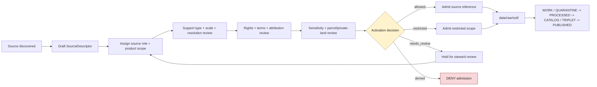

<!-- [KFM_META_BLOCK_V2]
doc_id: kfm://data/registry/sources/soil/readme
name: Soil Subtype-First Source Registry README
path: data/registry/sources/soil/README.md
type: data-registry-sources-soil-readme
version: v0.1.0
status: draft
owners:
  - <registry-steward>
  - <source-steward>
  - <soil-domain-steward>
  - <nrcs-source-steward>
  - <rights-steward>
  - <sensitivity-steward>
  - <policy-steward>
  - <proof-steward>
  - <release-steward>
  - <docs-steward>
created: 2026-06-29
updated: 2026-06-29
policy_label: restricted-review
truth_posture: cite-or-abstain
responsibility_root: data/
artifact_family: registry
registry_scope: soil-subtype-first-source-registry-parent
domain: soil
path_posture: existing-blank-readme-replaced; subtype-first-source-registry-parent-present; domain-first-registry-parent-confirmed; domain-first-sources-child-confirmed; cross-domain-source-registry-parent-confirms-data-registry-sources-domain-pattern; soil-canonical-paths-doc-confirms-data-registry-sources-soil-pattern; final-source-registry-topology-needs-verification
sensitivity_posture: registry-internal; no-public-path; source-role-preserving; support-type-separation-required; scale-and-resolution-aware; private-land-and-parcel-joins-reviewed; field-verification-not-implied; conservation-compliance-not-implied; rights-aware; evidence-aware; policy-aware; release-blocked-until-gates-close
related:
  - ../README.md
  - ../../README.md
  - ../../soil/README.md
  - ../../soil/sources/README.md
  - ../../domains/soil/README.md
  - ../../datasets/README.md
  - ../../crosswalks/README.md
  - ../../rights/README.md
  - ../../sensitivity/README.md
  - ../../layers/README.md
  - ../../../raw/soil/README.md
  - ../../../work/soil/
  - ../../../quarantine/soil/
  - ../../../processed/soil/
  - ../../../catalog/domain/soil/
  - ../../../triplets/domain/soil/
  - ../../../published/layers/soil/
  - ../../../receipts/
  - ../../../proofs/
  - ../../../../docs/domains/soil/CANONICAL_PATHS.md
  - ../../../../docs/domains/soil/DATA_LIFECYCLE.md
  - ../../../../docs/sources/catalog/nrcs.md
  - ../../../../docs/sources/catalog/nrcs/README.md
  - ../../../../docs/sources/catalog/nrcs/soil-data-access.md
  - ../../../../docs/sources/catalog/nrcs/ssurgo.md
  - ../../../../docs/sources/catalog/nrcs/web-soil-survey.md
  - ../../../../contracts/domains/soil/README.md
  - ../../../../schemas/contracts/v1/source/
  - ../../../../schemas/contracts/v1/domains/soil/
  - ../../../../schemas/contracts/v1/soil/
  - ../../../../policy/domains/soil/
  - ../../../../policy/rights/
  - ../../../../policy/sensitivity/
  - ../../../../connectors/nrcs/README.md
  - ../../../../connectors/nrcs/ssurgo/README.md
  - ../../../../connectors/nrcs/gssurgo/README.md
  - ../../../../connectors/nrcs/gnatsgo/README.md
  - ../../../../connectors/nrcs/sda/README.md
  - ../../../../release/
tags:
  - kfm
  - data
  - registry
  - sources
  - soil
  - source-descriptor
  - source-role
  - support-type
  - nrcs
  - ssurgo
  - gssurgo
  - gnatsgo
  - statsgo2
  - soil-data-access
  - web-soil-survey
  - scan
  - smap
  - soil-map-unit
  - soil-component
  - horizon
  - soil-property
  - soil-moisture
  - gridded-derivatives
  - scale
  - resolution
  - rights
  - sensitivity
  - evidence
  - provenance
  - release-gated
  - rollback
  - no-public-path
notes:
  - "This README replaces the blank `data/registry/sources/soil/README.md` file."
  - "This is the subtype-first source-registry parent for Soil source descriptor and source-admission records."
  - "The repository also contains `data/registry/soil/` and `data/registry/soil/sources/`; topology remains NEEDS VERIFICATION until an ADR, migration note, Directory Rules update, or registry inventory selects the canonical lane."
  - "Soil source registry records are admission and authority-control records. They do not store source payloads, prove soil claims, define contracts, enforce schemas, hold policy, close catalogs, or publish artifacts."
  - "NRCS and other soil source families must not be collapsed into one source role, cadence, scale, support type, rights posture, or release posture."
[/KFM_META_BLOCK_V2] -->

<a id="top"></a>

# Soil Source Registry

Subtype-first source-registry parent for Soil source descriptor and source-admission records.

<p>
  
  
  
  
  
  
  
</p>

**Quick links:** [Scope](#scope) · [Path posture](#path-posture) · [Repo fit](#repo-fit) · [Confirmed companion lanes](#confirmed-companion-lanes) · [Soil source boundary](#soil-source-boundary) · [Accepted material](#accepted-material) · [Exclusions](#exclusions) · [Source-family orientation](#source-family-orientation) · [Admission flow](#admission-flow) · [Suggested directory shape](#suggested-directory-shape) · [Suggested descriptor shape](#suggested-descriptor-shape) · [Required checks](#required-checks-before-use) · [Status notes](#status-notes)

> [!CAUTION]
> `data/registry/sources/soil/` is a source-registry parent for admission and authority-control records. It is not RAW source storage, WORK staging, QUARANTINE, PROCESSED data, catalog output, proof storage, receipt storage, semantic contract authority, schema authority, policy, release authority, public API/UI material, parcel truth, field-verification truth, conservation-compliance truth, soil-claim truth, or generated-answer authority.

---

## Scope

`data/registry/sources/soil/` documents and may hold source descriptor records, source-family indexes, activation/admission sidecars, source-head references, source-role review notes, supersession references, and registry-local indexes for source material that may feed the Soil lane.

Soil source registry records describe how a source may be treated **before** source material reaches RAW. They may record:

- source identity, source family, source role, authority scope, and permitted claim families;
- rights, license, attribution, redistribution, endpoint terms, access posture, cadence, source head, retrieval window, source vintage, effective time, valid time, source scale, spatial resolution, attribute support, and source version;
- support posture for map units, components, horizons, station/depth observations, gridded derivatives, remote-sensing products, model-derived surfaces, and interpretation surfaces;
- sensitivity posture for private-land joins, parcel-adjacent use, field-specific interpretation, conservation-practice context, farm/owner-specific detail, and operational sensor context;
- steward, contact, reviewer, activation state, correction state, supersession state, stale-state handling, withdrawal state, and rollback pointers;
- required quarantine, validation, unit normalization, support-type checks, projection checks, aggregation checks, redaction, proof, catalog, release, correction, and rollback requirements.

They do **not** prove that a soil map unit, component, horizon, soil property, hydrologic soil group, soil-moisture observation, station reading, gridded derivative, suitability rating, erosion risk, conservation practice, parcel-scale interpretation, field condition, crop-management conclusion, or site-specific outcome is true, current, complete, public-safe, or release-approved.

---

## Path posture

The requested and existing lane is:

```text
data/registry/sources/soil/
```

This is the subtype-first source-registry pattern under:

```text
data/registry/sources/
```

The repository also contains the domain-first registry lane:

```text
data/registry/soil/
data/registry/soil/sources/
```

The Soil canonical-path documentation names `data/registry/sources/soil/` as a valid Soil lane, and the domain-first registry parent points to this subtype-first path as a potential canonical source registry. Therefore this path is treated as **CONFIRMED path presence / NEEDS VERIFICATION topology**.

Until an ADR, migration note, Directory Rules update, or repository-wide registry inventory resolves this topology, do **not** maintain divergent descriptor sets in both the subtype-first and domain-first locations. Use one record family, preserve redirects or indexes, and keep rollback mechanical.

---

## Repo fit

| Responsibility | Home | Boundary |
|---|---|---|
| Subtype-first Soil source records | `data/registry/sources/soil/` | Source descriptors and source-admission metadata for this domain lane. |
| Cross-domain source registry parent | [`../README.md`](../README.md) | General source registry doctrine and `data/registry/sources/<domain>/` pattern. |
| Domain-first registry parent | [`../../soil/README.md`](../../soil/README.md) | Existing routing/compatibility parent; not canonical by itself. |
| Domain-first source registry | [`../../soil/sources/README.md`](../../soil/sources/README.md) | Existing companion source-registry lane; must not diverge from this lane. |
| Source payloads | `../../../raw/soil/`, `../../../work/soil/`, `../../../quarantine/soil/`, `../../../processed/soil/` | Actual data belongs in lifecycle lanes, not registry records. |
| Domain placement guidance | [`../../../../docs/domains/soil/CANONICAL_PATHS.md`](../../../../docs/domains/soil/CANONICAL_PATHS.md) | Soil lane placement, responsibility-root map, path variance, and anti-patterns. |
| Soil lifecycle / continuity docs | [`../../../../docs/domains/soil/DATA_LIFECYCLE.md`](../../../../docs/domains/soil/DATA_LIFECYCLE.md) | Human-facing inventory and lifecycle orientation; not registry storage. |
| NRCS catalog docs | [`../../../../docs/sources/catalog/nrcs/README.md`](../../../../docs/sources/catalog/nrcs/README.md), [`ssurgo.md`](../../../../docs/sources/catalog/nrcs/ssurgo.md), [`soil-data-access.md`](../../../../docs/sources/catalog/nrcs/soil-data-access.md), [`web-soil-survey.md`](../../../../docs/sources/catalog/nrcs/web-soil-survey.md) | Reader-oriented source/product pages; not authoritative descriptor instances. |
| Connector logic | `../../../../connectors/nrcs/` and product connector lanes | Fetch/admission helpers only; not source truth, registry truth, pipeline truth, proof, policy, catalog, or release. |
| Semantic meaning | `../../../../contracts/domains/soil/` or accepted Soil contract lane | Object-family meaning and invariants. |
| Machine shape | `../../../../schemas/contracts/v1/source/`, `../../../../schemas/contracts/v1/domains/soil/`, `../../../../schemas/contracts/v1/soil/`, or ADR-selected schema lane | Schema enforcement; exact source/soil schema state remains NEEDS VERIFICATION. |
| Policy, sensitivity, and rights | `../../../../policy/domains/soil/`, `../../../../policy/rights/`, `../../../../policy/sensitivity/`, and accepted support/sensitivity policy lanes | Exposure, rights, support type, sensitivity, and admissibility rules. |
| Validation/support receipts | `../../../receipts/` and accepted Soil receipt lanes | Process memory for checks, transforms, aggregation, support validation, and redaction. |
| Proof/evidence | `../../../proofs/` or accepted proof lanes | EvidenceBundle closure, proof packs, signatures, and citation validation. |
| Catalog and graph projections | `../../../catalog/domain/soil/`, `../../../triplets/domain/soil/`, STAC/DCAT/PROV lanes, and accepted graph/catalog lanes | Catalog/discovery carriers after catalog closure. |
| Release decisions | `../../../../release/` | Promotion, correction, rollback, supersession, withdrawal, and release manifests. |
| Public surfaces | governed APIs and released artifacts only | Public clients do not read this registry lane directly. |

---

## Confirmed companion lanes

This confirms path/README evidence only. It does not prove emitted records, schemas, validators, fixtures, CI enforcement, signing, release integration, correction hooks, rollback hooks, governed API behavior, public-safe summaries, or public UI behavior.

| Companion lane | Status | Purpose | Boundary |
|---|---:|---|---|
| [`../../soil/`](../../soil/README.md) | CONFIRMED README | Domain-first Soil registry parent. | Routing/compatibility only; not source payloads, proof, policy, release, or public output. |
| [`../../soil/sources/`](../../soil/sources/README.md) | CONFIRMED README | Domain-first Soil source descriptor and source-admission registry lane. | Not source payload storage, soil truth, parcel truth, field verification, proof, receipt storage, catalog closure, semantic contract authority, schema authority, policy, release authority, or public output. |

Future child source-family lanes under this subtype-first parent should be created only when there is real source-family content and a clear registry need. Do not create empty placeholder folders.

---

## Soil source boundary

| Rule | Handling |
|---|---|
| Registry record is admission control | It governs how a source may be admitted and used; it does not contain the source payload. |
| Registry is not soil truth | Registry state does not prove map units, components, horizons, soil properties, station readings, gridded surfaces, interpretations, suitability, field conditions, parcel outcomes, or conservation compliance. |
| Source role is fixed at admission | Observed, regulatory, modeled, aggregate, administrative, candidate, synthetic, or accepted legacy source roles must not be upgraded by processing, normalization, joining, cataloging, rendering, or generated explanation. |
| Vocabulary drift is explicit | Current repo docs show both canonical role vocabulary and older soil/source-role language. Descriptor instances must follow the accepted source schema and mark vocabulary differences for review. |
| Support type is preserved | Map-unit, component, horizon, station/depth, grid-cell, model-surface, and interpretation support must not be silently merged. |
| Scale and resolution matter | Survey, generalized, station, gridded, remote-sensing, and model sources must preserve intended scale, resolution, support, and uncertainty. |
| Soil geometry is not parcel truth | Soil map units, component joins, and gridded surfaces do not prove parcel ownership, field verification, legal access, conservation compliance, crop management, or site-specific suitability by themselves. |
| Station observations are not area truth | Soil-moisture or climate station readings require station, depth, unit, QC, time, and support metadata and must not be generalized into area truth without governed processing. |
| Derived interpretations are downstream carriers | Suitability ratings, hydrologic soil groups, erosion risk, productivity, and model-derived layers inherit source role, scale, support, uncertainty, rights, sensitivity, and release posture. |
| NRCS material is multi-product | SSURGO, gSSURGO, gNATSGO, STATSGO2, SDA, Web Soil Survey, SCAN, and other NRCS products require product-specific role, cadence, scale, rights, support, and release posture. |
| Cross-lane context stays owned | Agriculture, Hydrology, Habitat, Fauna, Flora, Geology, Hazards, and People/Land keep their own truth, sensitivity, and release authority. |
| Rights and restrictions travel | License, attribution, redistribution, endpoint terms, source restrictions, private-source restrictions, and steward caveats must remain attached downstream. |
| Registry is not validation | Validation receipts, unit-normalization receipts, support-type receipts, transform receipts, policy receipts, and run receipts remain separate process-memory objects. |
| Registry is not proof | EvidenceBundle/proof support remains separate. |
| Registry is not catalog | STAC/DCAT/PROV/domain catalog records and graph/triplet projections live under catalog/triplet lanes. |
| Registry is not release | Public exposure requires validation, policy, review, proof/catalog support, release manifest, correction path, and rollback path. |
| Public clients do not read this lane | Public UI/API surfaces consume governed APIs, released artifacts, catalog/triplet/proof-backed responses, and policy-safe envelopes. |

---

## Accepted material

Accepted content is limited to Soil source registry records and registry-local support files:

- SourceDescriptor instances or pointers;
- SourceActivationDecision references or activation sidecars where accepted by repo convention;
- SourceIntakeRecord references and source-head metadata summaries;
- source-family README files and local indexes;
- source-role review notes and role-assignment records;
- rights, license, attribution, redistribution, cadence, access, endpoint, terms, steward, authority-scope, and caveat metadata;
- source vintage, survey area, geography, spatial precision, temporal precision, scale, resolution, support type, attribute-support notes, retrieval refs, and stale-state notes;
- support-type, unit, CRS, projection, MUKEY/component/horizon/station/depth/grid/model-run, and interpretation-surface caveats;
- sensitivity notes for private-land joins, parcel-adjacent use, field-specific interpretation, conservation-practice context, and public-safe generalization requirements;
- supersession, withdrawal, correction, embargo, stale-state, quarantine, and rollback references;
- registry-local manifests, checksums, signatures, and index sidecars.

---

## Exclusions

| Do not put here | Correct home or owner | Why |
|---|---|---|
| Raw source payloads, API dumps, shapefiles, file geodatabases, GeoPackages, GeoJSON, GeoParquet, rasters, COGs, PMTiles, CSVs, database exports, or transformed datasets | `../../../raw/soil/`, `../../../work/soil/`, `../../../quarantine/soil/`, `../../../processed/soil/` | Registry records describe source authority; lifecycle lanes hold data. |
| Live source fetchers, scrapers, credentials, or source-specific admission code | `connectors/`, `pipelines/`, `pipeline_specs/`, `configs/`, secret-management infrastructure | Source activation is governed and source-specific, not registry-local executable code. |
| Semantic contracts | `../../../../contracts/domains/soil/` or ADR-selected contract lane | Contracts define meaning; registry records reference them. |
| JSON Schemas | `../../../../schemas/contracts/v1/source/`, `../../../../schemas/contracts/v1/domains/soil/`, `../../../../schemas/contracts/v1/soil/`, or ADR-selected schema lane | Schemas define machine shape; registry records are instances or indexes. |
| Policy rules, sensitivity rules, rights decisions, public-safe geometry rules, release policies | `../../../../policy/` | Policy owns allow / deny / restrict / abstain decisions. |
| EvidenceBundles, proof packs, validation reports, support-type receipts, unit-normalization receipts, transform receipts, run receipts | `../../../proofs/`, `../../../receipts/`, or accepted trust-object lanes | Proof and process memory remain independently addressable. |
| Catalog records, STAC/DCAT/PROV records, graph/triplet projections, layer manifests, published artifacts | `../../../catalog/`, `../../../triplets/`, `../../../published/layers/soil/` | Downstream publication carriers are not source descriptors. |
| Release manifests, promotion decisions, correction notices, rollback cards | `../../../../release/` | Publication is a governed state transition, not a registry side effect. |
| Parcel ownership, land access, conservation-compliance decisions, crop-management advice, or field-specific suitability claims | People/Land, Agriculture, policy/review lanes, and official decision authorities | Soil source metadata can support evidence context; it cannot decide these outcomes. |
| AI-generated soil summaries or management recommendations as truth | Governed AI runtime and AIReceipt surfaces | Generated language is interpretive and evidence-subordinate. |

---

## Source-family orientation

These source-family categories are admission aids. They do not assign final authority by source name; the binding role is whatever the reviewed SourceDescriptor records at admission.

| Source family | Typical source-role posture | Registry requirements | Public exposure posture |
|---|---|---|---|
| NRCS SSURGO | observed / administrative context; authoritative static survey characteristics | survey area, source vintage, MUKEY/component/horizon keys, scale, support type, rights, retrieval ref | Public-safe at survey scale only; not field verification or parcel truth. |
| NRCS Soil Data Access | observed / administrative access surface over SSURGO/NASIS/STATSGO2-derived rows | endpoint terms, query scope, retrieval time, source vintage, SQL/query digest, support type | API output still inherits product-specific support and scale caveats. |
| Web Soil Survey | observed / administrative manual download portal | download package identity, report/product type, source vintage, terms, user/export caveats | Not a separate soil truth if it repeats SSURGO authority; descriptor must state relationship. |
| gSSURGO | observed / derived gridded product | raster/grid support, cell resolution, source SSURGO vintage, derivation notes, rights | Gridded derivative; not equivalent to vector survey polygons or field truth. |
| gNATSGO | observed / modeled / aggregate characteristics depending on filled gaps and product construction | national product vintage, grid support, gap-fill/model notes, STATSGO2 relation, rights | National seamless context; support and uncertainty must travel. |
| STATSGO2 | aggregate / generalized context | generalized scale, map unit support, national coverage, source vintage, caveats | Not county-scale SSURGO substitute where fine-scale claims matter. |
| NRCS SCAN | observed station readings | station ID, depth, unit, sensor, QC, retrieval time, cadence, stale-state, rights | Station/depth observation only; no area truth without governed interpolation/modeling. |
| Kansas Mesonet soil moisture | observed station readings | station/depth/unit/QC, retrieval time, cadence, terms, cross-domain ownership | Station context; public use requires freshness and policy gates. |
| NOAA USCRN soil variables | observed station readings | station metadata, sensor/depth fields, QC flags, cadence, retrieval time | Station/depth context; not map-unit truth. |
| NASA SMAP or satellite soil-moisture products | remote-sensing / modeled / aggregate | sensor/product version, grid resolution, retrieval algorithm, model/run refs, uncertainty | Coarse gridded context; not field-level soil condition truth. |
| SoilGrids or other global modeled surfaces | modeled / synthetic / aggregate | model run, inputs, parameters, uncertainty, resolution, rights | Interpretive/model context only; not replacement for SSURGO. |
| Conservation practice records | administrative | agency record scope, effective date, privacy/sensitivity, rights, relation to Agriculture | Agriculture-adjacent; not soil property truth or public compliance finding. |

> [!IMPORTANT]
> NRCS catalog pages, connector READMEs, API outputs, gridded derivatives, station feeds, model surfaces, public tiles, and AI summaries must not collapse source role, support type, scale, resolution, rights, sensitivity, proof, or release state.

---

## Admission flow



> [!NOTE]
> A watcher, connector, model, map renderer, or AI runtime may propose intake material, but none of them publishes a Soil claim. Promotion requires governed evidence, validation, policy, review, release, correction, and rollback support.

---

## Suggested directory shape

This shape is **PROPOSED** until the registry topology is reconciled. Do not pre-create empty stubs.

```text
data/registry/sources/soil/
├── README.md
├── nrcs-ssurgo/                         # PROPOSED: create only with real source content
│   └── README.md
├── nrcs-soil-data-access/               # PROPOSED
│   └── README.md
├── nrcs-web-soil-survey/                # PROPOSED
│   └── README.md
├── nrcs-gssurgo/                        # PROPOSED
│   └── README.md
├── nrcs-gnatsgo/                        # PROPOSED
│   └── README.md
├── nrcs-statsgo2/                       # PROPOSED
│   └── README.md
├── nrcs-scan/                           # PROPOSED
│   └── README.md
├── mesonet-soil-moisture/               # PROPOSED
│   └── README.md
├── noaa-uscrn-soil/                     # PROPOSED
│   └── README.md
├── nasa-smap/                           # PROPOSED
│   └── README.md
├── modeled-surfaces/                    # PROPOSED
│   └── README.md
├── crosswalks/                          # PROPOSED: source IDs to MUKEY/component/horizon/station/grid/model identifiers
│   └── README.md
├── superseded/                          # PROPOSED: replaced descriptors retained with lineage
│   └── README.md
└── index.descriptor.yaml                # PROPOSED: registry-local source index
```

If the domain-first lane remains canonical, this README should become a redirecting orientation page or be migrated with a manifest. If this subtype-first lane becomes canonical, the domain-first source README should redirect here or become a compatibility index. Either migration needs rollback notes.

---

## Suggested descriptor shape

Illustrative only. The canonical source descriptor shape belongs to the accepted source schema.

```yaml
source_id: SOURCE_ID_TBD
domain: soil
source_family: nrcs-ssurgo | nrcs-sda | nrcs-web-soil-survey | nrcs-gssurgo | nrcs-gnatsgo | nrcs-statsgo2 | nrcs-scan | mesonet-soil-moisture | noaa-uscrn-soil | nasa-smap | modeled-surfaces
source_role: observed | regulatory | modeled | aggregate | administrative | candidate | synthetic
role_authority: SOURCE_AUTHORITY_TBD
claim_scope:
  object_families:
    - SoilMapUnit
    - SoilComponent
    - Horizon
    - SoilProperty
    - HydrologicSoilGroup
    - SoilMoistureObservation
    - Pedon
    - SoilProfileView
    - ErosionRisk
    - SuitabilityRating
    - SoilTimeCaveat
  denied_claims:
    - parcel-truth-without-review
    - field-verification-without-field-evidence
    - conservation-compliance-without-official-authority
support:
  support_type: map_unit | component | horizon | station_depth | grid_cell | model_surface | interpretation
  scale_or_resolution: NEEDS VERIFICATION
  units: NEEDS VERIFICATION
rights:
  license: NEEDS VERIFICATION
  attribution: NEEDS VERIFICATION
  redistribution: NEEDS VERIFICATION
sensitivity:
  baseline: NEEDS VERIFICATION
  access: public | restricted | named-party | internal-only
  public_geometry: exact | generalized | redacted | withheld
  reason_codes:
    - support-type-review-required
    - parcel-private-land-review-required
    - field-verification-not-implied
cadence:
  source_vintage: DATE_OR_PERIOD_TBD
  retrieval_time: NEEDS VERIFICATION
  stale_after: NEEDS VERIFICATION
evidence:
  source_head_ref: SOURCE_HEAD_TBD
  evidence_ref: EVIDENCE_REF_TBD
  input_digest: DIGEST_TBD
authority_limits:
  - not-field-verification
  - not-parcel-truth
  - not-conservation-compliance-authority
  - not-release-authority
activation:
  status: needs_review | allowed | restricted | denied
  decision_ref: SOURCE_ACTIVATION_DECISION_TBD
review:
  steward: OWNER_TBD
  reviewed_at: NEEDS VERIFICATION
  rollback_target: ROLLBACK_TARGET_TBD
```

---

## Required checks before use

- [ ] Confirm whether `data/registry/sources/soil/` or `data/registry/soil/sources/` is the canonical source-registry lane.
- [ ] Confirm whether this parent should remain a record home, an index, or a redirect/compatibility README after topology reconciliation.
- [ ] Confirm CODEOWNERS for source, Soil domain, NRCS source stewardship, rights, sensitivity, policy, proof, release, and docs review.
- [ ] Confirm accepted source descriptor schema home and field names before adding descriptor instances.
- [ ] Confirm source-role vocabulary and reconcile any older role-language references with the accepted source schema.
- [ ] Confirm no descriptor is duplicated in both subtype-first and domain-first lanes without a migration/index rule.
- [ ] Confirm rights, license, attribution, redistribution, endpoint, terms, and source cadence for each admitted source.
- [ ] Confirm product-specific source identity for SSURGO, SDA, Web Soil Survey, gSSURGO, gNATSGO, STATSGO2, SCAN, Mesonet, USCRN, SMAP, and modeled surfaces.
- [ ] Confirm source vintage, source head, retrieval time, stale-state policy, and correction/supersession rules.
- [ ] Confirm support type, scale/resolution, units, CRS/projection, and uncertainty before processing or joining.
- [ ] Confirm MUKEY/component/horizon/station/depth/grid/model-run identifiers are preserved and not silently collapsed.
- [ ] Confirm parcel, private-land, field-specific, owner/farm-specific, conservation-compliance, and management-advice joins fail closed until policy review.
- [ ] Confirm station readings and remote-sensing/model products cannot become area truth without governed processing and receipts.
- [ ] Confirm cross-lane joins preserve owning-domain authority for Agriculture, Hydrology, Habitat, Fauna, Flora, Geology, Hazards, and People/Land evidence.
- [ ] Confirm validation, unit-normalization, support-type, CRS/projection, aggregation, redaction, and run receipts live outside the registry.
- [ ] Confirm public clients use governed APIs, released artifacts, catalog/triplet/proof-backed responses, and policy-safe envelopes only.
- [ ] Confirm rollback target and correction path before any source registry migration or public release.

---

## Status notes

| Item | Status | Notes |
|---|---:|---|
| Target path presence | CONFIRMED | This README replaces a blank file at `data/registry/sources/soil/README.md`. |
| Cross-domain source registry pattern | CONFIRMED | `data/registry/sources/README.md` supports per-domain source-registry segments. |
| Soil canonical path doc | CONFIRMED | `docs/domains/soil/CANONICAL_PATHS.md` names `data/registry/sources/soil/`. |
| Domain-first registry parent | CONFIRMED | `data/registry/soil/README.md` exists and warns that topology needs verification. |
| Domain-first source child | CONFIRMED | `data/registry/soil/sources/README.md` exists as a companion source-registry lane. |
| Final canonical registry lane | NEEDS VERIFICATION | Requires ADR, migration note, Directory Rules update, or inventory decision. |
| Source descriptor payloads | UNKNOWN | This README does not prove descriptor instances exist. |
| Source schema and validator enforcement | NEEDS VERIFICATION | Schema paths, validator paths, fixtures, and CI behavior were not proven by this edit. |
| Source-role vocabulary | NEEDS VERIFICATION | Current docs show canonical seven-role vocabulary and legacy/source-family role language. Use accepted schema before adding records. |
| Rights and freshness | NEEDS VERIFICATION | Every source family must be reviewed before activation. |
| Public release readiness | DENY until proven | Registry state alone cannot publish soil, parcel, field, suitability, conservation, or layer claims. |

---

## Evidence ledger

| Source | Status | Supports | Limits |
|---|---|---|---|
| [`../README.md`](../README.md) | CONFIRMED | Cross-domain source registry role and `data/registry/sources/<domain>/` pattern. | Does not settle Soil canonical topology or descriptor payload existence. |
| [`../../soil/README.md`](../../soil/README.md) | CONFIRMED | Domain-first registry parent, topology warning, no-public-path boundary. | Does not make subtype-first or domain-first canonical by itself. |
| [`../../soil/sources/README.md`](../../soil/sources/README.md) | CONFIRMED | Domain-first source-registry companion and Soil source boundary. | Does not prove descriptors, schemas, validators, tests, or releases exist. |
| [`../../../../docs/domains/soil/CANONICAL_PATHS.md`](../../../../docs/domains/soil/CANONICAL_PATHS.md) | CONFIRMED | Soil domain segment, lifecycle, `data/registry/sources/soil/` path pattern, and anti-root warning. | Does not prove every listed path exists or is implemented. |
| [`../../../../docs/domains/soil/DATA_LIFECYCLE.md`](../../../../docs/domains/soil/DATA_LIFECYCLE.md) | CONFIRMED | Soil owned object families, source-family continuity, lifecycle posture, and cross-lane boundaries. | Human-facing inventory; implementation maturity remains bounded where marked. |
| [`../../../../docs/sources/catalog/nrcs/README.md`](../../../../docs/sources/catalog/nrcs/README.md) | CONFIRMED | NRCS source-family orientation, source role concerns, and admission-vs-documentation boundary. | Catalog page does not replace SourceDescriptor records or rights/current-term verification. |
| [`../../../../docs/sources/catalog/nrcs/ssurgo.md`](../../../../docs/sources/catalog/nrcs/ssurgo.md) | CONFIRMED | SSURGO source/product posture, static survey distinction, SDA/gSSURGO separation, and source authority boundary. | Product page does not prove descriptor records, connectors, validators, or releases. |
| [`../../../../docs/sources/catalog/nrcs/soil-data-access.md`](../../../../docs/sources/catalog/nrcs/soil-data-access.md) | CONFIRMED | SDA programmatic-surface boundary and descriptor-not-doc authority rule. | Product page does not verify live endpoint terms or current behavior. |

[Back to top](#top)
