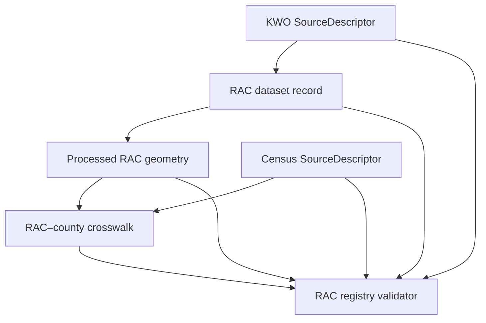

<a id="top"></a>

# Water-planning source registry

[](https://github.com/bartytime4life/Kansas-Frontier-Matrix/actions/workflows/briefing-integration.yml)
[](#status-and-authority)
[](#status-and-authority)
[](#status-and-authority)

**Purpose.** `data/registry/sources/water_planning/` is the canonical source-registry lane for the two public geometry inputs pinned by the internal Regional Advisory Committee (RAC) geometry and county-crosswalk candidate.

> [!IMPORTANT]
> Both descriptors are `proposed` and `needs_review`; their connectors are `disabled`, their rights status is `noassertion`, and their release state is `not_released`. A descriptor records source identity and bounded admissibility. It does not activate recurring retrieval, clear rights, prove a downstream claim, or authorize release or publication.

## Quick navigation

- [Scope and placement](#scope-and-placement)
- [Status and authority](#status-and-authority)
- [Concrete inventory](#concrete-inventory)
- [Claim boundaries](#claim-boundaries)
- [Source-head integrity](#source-head-integrity)
- [Downstream relationships](#downstream-relationships)
- [Validation](#validation)
- [Rights, citation, and sensitivity](#rights-citation-and-sensitivity)
- [Freshness and lifecycle](#freshness-and-lifecycle)
- [Maintenance, correction, and rollback](#maintenance-correction-and-rollback)
- [Open verification items](#open-verification-items)
- [Related authority](#related-authority)

## Scope and placement

| Field | Current posture |
|---|---|
| Path | `data/registry/sources/water_planning/` |
| Inherited parent | [`data/registry/sources/`](../README.md) |
| Owning responsibility root | `data/` — lifecycle and registry material |
| Registry family | `sources` — machine source identities and descriptors |
| Scope lane | `water_planning`, with `hydrology` or `shared_geography` declared in each descriptor |
| README profile | `BOUNDARY_COMPACT` |
| Exposure | Public repository metadata about public-source inputs; downstream release remains separately governed |
| Permitted mutation | Reviewed repository changes; no recurring connector or watcher is enabled by this lane |
| Review route | [`.github/CODEOWNERS`](../../../../.github/CODEOWNERS) routes `/data/registry/` to `@bartytime4life`; this is routing, not proof of independent review |

This is subtype-first placement under `data/registry/sources/`, not a parallel `data/registry/<domain>/sources/` authority. The accepted [Directory Rules](../../../../docs/doctrine/directory-rules.md) place machine source identities and descriptors here (`DIR-SOURCE-003`) and require a compact local contract for a scope boundary (`DIR-README-001` through `DIR-README-005`). [ADR-0029](../../../../docs/adr/ADR-0029-adopt-directory-governance-standard-v2.md) adopts those rules.

### What belongs here

- Versioned `SourceDescriptor` records for source inputs used by the bounded water-planning candidate.
- Stable source identity, provider, role, authority scope, source head, cadence, access, citation, rights, sensitivity, review, release, and lifecycle metadata.
- Governance references that resolve each descriptor to this registry path.

### What does not belong here

- Retrieved or transformed geometry payloads.
- Dataset or crosswalk registry records.
- Contracts, JSON Schemas, validators, fixtures, tests, policy decisions, receipts, proofs, or release decisions.
- Credentials, access tokens, signed URLs, private portal data, or sensitive locations.
- A connector activation, recurring schedule, public-serving endpoint, or publication claim.

## Status and authority

The values below are shared by both checked-in descriptors. They are record state, not universal defaults for every KFM source.

| Surface | Current value | Consequence |
|---|---|---|
| `lifecycle.registry_state` | `proposed` | The records remain review-gated candidates. |
| `review_state` | `needs_review` | Independent rights and domain review are still open. |
| `connectors.activation_state` | `disabled` | No recurring connector or watcher is authorized. |
| `rights.rights_status` | `noassertion` | Source statements are recorded, but KFM rights clearance is incomplete. |
| `public_release.allowed` | `false` | The descriptors do not authorize public release. |
| `public_release.requires_review` | `true` | A separate review and release decision are required. |
| `release_state` | `not_released` | Git, pull-request, validation, or merge state cannot elevate the records to released. |
| `sensitivity_default` | `public` | The described inputs are public administrative/statistical boundaries; this does not override rights or release gates. |

The source role `authoritative_for_claim` is bounded by each descriptor's `admissibility_limits`. It does not make either provider authoritative for claims outside the recorded geometry, identity, map-display, derived-summary, and citation roles.

## Concrete inventory

| Descriptor | Stable source ID | Provider and bounded role | Upstream version | Cadence |
|---|---|---|---|---|
| [`kwo_rac_feature_service.source.json`](./kwo_rac_feature_service.source.json) | `kfm://source/kansas/kwo/regional-planning-areas` | Kansas Water Office; official RAC planning-area geometry | Item modified `2026-06-24T15:17:37Z` | Irregular; recheck before every new dataset version |
| [`census_tigerweb_counties_2025.source.json`](./census_tigerweb_counties_2025.source.json) | `kfm://source/us/census/tigerweb/state-county-2025` | U.S. Census Bureau; 2025 county geometry used for spatial intersection | January 1, 2025 vintage | Annual review |

Both records declare `object_type: SourceDescriptor`, `schema_version: v1`, and `descriptor_version: 1.0.0`. Their machine shape is governed by [`source_descriptor.schema.json`](../../../../schemas/contracts/v1/source/source_descriptor.schema.json). The water-planning RAC validator additionally pins the exact status, source-head, rights, connector, release, and governance-reference fields used by this candidate.

## Claim boundaries

| Surface | May support | Must not be treated as |
|---|---|---|
| KWO RAC descriptor | RAC planning-area identity, geometry, map display, bounded derived summaries, and citation | A county partition, project-location inference, title truth, life-safety authority, or release decision |
| Census county descriptor | 2025 county identity and statistical geometry, map display, bounded derived summaries, and citation | An official KWO county-membership list, a project-location inference, title truth, life-safety authority, or release decision |
| Derived RAC–county crosswalk | Measured positive-area polygon intersections and declared overlap classes | Political, administrative, governance, funding, or advisory-committee membership |
| Registry presence | A resolvable source identity and recorded source posture | EvidenceBundle closure, policy approval, rights clearance, proof, release, deployment, or KFM publication |

The KWO descriptor explicitly states that its planning boundaries are hydrologic/administrative and are not a county partition or project-location inference. The Census descriptor states that the 2025 statistical boundaries may not coincide exactly with KWO boundaries.

## Source-head integrity

Each descriptor pins the exact GeoJSON response observed during the bounded retrieval. The digest proves byte identity for that observation; it does not prove current upstream freshness.

| Descriptor | Observed response SHA-256 | Observed at | Source-head method |
|---|---|---|---|
| KWO RAC geometry | `872b53126963b9f580dc07f53b89b307678c37ee09af2c51dec5600afddd245a` | `2026-07-30T17:50:58Z` | `api_metadata` |
| Census counties | `3cf20296abdd36e189d77b32997887dc8c77efbb5d9960d32870cf53a929d694` | `2026-07-30T17:50:58Z` | `api_metadata` |

The KWO source head resolves to the [Regional Planning Areas ArcGIS item](https://www.arcgis.com/home/item.html?id=cd87ef7a0bb34cc4a7f57e662d73ec0f). The Census source head resolves to the [TIGERweb Counties layer](https://tigerweb.geo.census.gov/arcgis/rest/services/TIGERweb/State_County/MapServer/1).

## Downstream relationships



The diagram describes checked-in reference relationships, not an active ingestion or publication pipeline:

- The [RAC dataset record](../../datasets/water_planning/kwo_rac_regions_2026-06-24.json) resolves the KWO descriptor and pins the 14-feature [processed geometry](../../../processed/water_planning/rac_regions/kwo_rac_regions_2026-06-24.geojson).
- The [county-crosswalk record](../../crosswalks/water_planning/kwo_rac_counties_2026-06-24__tiger2025.json) resolves the Census descriptor and the RAC dataset version. It records 105 Kansas county GEOIDs and 209 ordered positive-area intersection mappings.
- The [RAC registry validator](../../../../tools/validators/domains/water_planning/validate_rac_registry.py) reads the two descriptors, dataset record, crosswalk record, and geometry payload as one pinned no-network slice.

Neither descriptor contains the geometry payload. Neither the dataset record nor the crosswalk replaces its source descriptor.

## Validation

Run from the repository root:

```bash
python tools/validators/domains/water_planning/validate_rac_registry.py
```

Expected success output for the pinned checked-in slice:

```text
RAC_REGISTRY_OK regions=14 counties=105 mappings=209
```

The validator fails closed when descriptor status, rights posture, release controls, connector state, source-head digest or version, registry path, source references, geometry bytes, identities, mappings, or release posture drift from the pinned contract.

Run the complete water-planning regression suite:

```bash
python -m unittest discover \
  --start-directory tests/domains/water_planning \
  --pattern 'test_*.py' \
  --verbose
```

[`test_rac_registry.py`](../../../../tests/domains/water_planning/test_rac_registry.py) blocks socket and URL access and exercises valid state plus source, digest, mapping, release, connector, and public-release failures. The read-only [`briefing-integration`](../../../../.github/workflows/briefing-integration.yml) workflow triggers for changes under this lane, uses `contents: read`, checks out without persisted credentials, and runs the domain suite and RAC validator on a GitHub-hosted runner.

> [!NOTE]
> A passing validator or workflow confirms only the declared checked-in invariants. It does not refresh either source, establish rights clearance, prove evidence closure, activate a connector, or authorize release, deployment, publication, or public truth.

## Rights, citation, and sensitivity

| Provider | Recorded rights posture | Required citation | Remaining gate |
|---|---|---|---|
| Kansas Water Office | Source metadata says, “There are no special restrictions on this content”; `rights_status` remains `noassertion`, and redistribution and commercial-use permissions remain `unknown` | `Kansas Water Office, Kansas Water Office Regional Planning Areas, accessed {accessed_at}.` | Independent rights review, domain review, and release decision |
| U.S. Census Bureau | Recorded as public government data; `rights_status` remains `noassertion`, and redistribution and commercial-use permissions remain `unknown` | `U.S. Census Bureau, U.S. Census Bureau TIGERweb Counties 2025, accessed {accessed_at}.` | Independent rights review, domain review, and release decision |

Both records require attribution and carry `sensitivity_default: public`. That sensitivity value reflects the described administrative/statistical boundaries and the absence of person-level or precise sensitive-feature content; it does not make downstream products released or unrestricted.

## Freshness and lifecycle

| Source | Freshness expectation | Stale behavior |
|---|---|---|
| KWO RAC geometry | Review the ArcGIS item modified time before every new dataset version | `review_required` |
| Census counties | Review the TIGERweb vintage annually | `review_required` |

The checked-in descriptors record one bounded retrieval. They do not authorize another retrieval. Before a new source version or connector activity:

1. re-observe the official source head and upstream version;
2. pin the exact response digest and observation time;
3. validate the descriptor and every affected downstream reference;
4. complete the required rights and domain reviews;
5. obtain a separate activation decision before enabling a connector; and
6. obtain a separate release decision before any public-serving use.

A source change must not silently rewrite the meaning of the current dataset or crosswalk version. Preserve source-head and correction lineage, and update the affected dataset, crosswalk, validator expectations, tests, and documentation together when their pinned relationship changes.

## Maintenance, correction, and rollback

- Preserve the two stable `source_id` values unless a governed identity migration explicitly supersedes them.
- Keep `governance_refs.source_registry_ref` equal to each descriptor's repository path.
- Keep source roles and admissibility limits narrower than the claims the provider can actually support.
- Do not change `disabled`, `needs_review`, `noassertion`, `public_release.allowed: false`, or `not_released` merely to make validation pass; a state transition needs its own evidence and authority.
- Re-run the RAC validator and water-planning regression suite for any descriptor or relationship change.
- Update this inventory when a descriptor is added, superseded, corrected, or deactivated.
- Re-review the lane when source authority, cadence, rights, sensitivity, connector state, validation, CODEOWNERS coverage, or release posture changes.

Before merge, rollback is closing the draft pull request and abandoning its scoped branch. After merge, revert the scoped documentation commit. Corrections to a descriptor or downstream record require a separately reviewed repository change that preserves the prior source head, version, and correction lineage; this README does not perform that state transition.

## Open verification items

- Independent rights review for both descriptors.
- Water-planning domain review and an explicit release decision.
- A verified local source-registry steward beyond the repository-wide CODEOWNERS route.
- Freshness re-observation before any new KWO dataset version or annual Census-vintage update.
- Separate authority, fixtures, tests, and policy gates before any recurring connector or watcher is enabled.
- Public-release eligibility for the RAC geometry and county crosswalk.

Until those items close, the correct posture remains `needs_review`, `disabled`, and `not_released`.

## Related authority

| Surface | Role |
|---|---|
| [`data/registry/sources/`](../README.md) | Parent source-registry boundary |
| [`source_descriptor.schema.json`](../../../../schemas/contracts/v1/source/source_descriptor.schema.json) | Machine shape for both source records |
| [KWO source catalog entry](../../../../docs/sources/catalog/kansas/kwo.md) | Human source-family guidance and bounded source context |
| [RAC registry contract](../../../../contracts/domains/water_planning/rac_geometry_registry.md) | Semantic contract for the geometry and crosswalk registry slice |
| [RAC dataset schema](../../../../schemas/contracts/v1/domains/water_planning/rac_geometry_dataset_registry.schema.json) | Machine shape for the downstream dataset record |
| [RAC county-crosswalk schema](../../../../schemas/contracts/v1/domains/water_planning/rac_county_crosswalk_registry.schema.json) | Machine shape for the downstream derived mapping record |
| [RAC dataset registry](../../datasets/water_planning/README.md) | Dataset identity and payload reference |
| [RAC county-crosswalk registry](../../crosswalks/water_planning/README.md) | Derived mapping record and overlap semantics |
| [Processed RAC geometry](../../../processed/water_planning/rac_regions/README.md) | Internal normalized geometry lane |
| [Water-planning validators](../../../../tools/validators/domains/water_planning/README.md) | Deterministic validator behavior and limitations |
| [RAC registry regression tests](../../../../tests/domains/water_planning/test_rac_registry.py) | Valid, drift, release, connector, and no-network coverage |
| [`briefing-integration.yml`](../../../../.github/workflows/briefing-integration.yml) | Read-only pull-request and `main` checks |
| [Directory Rules](../../../../docs/doctrine/directory-rules.md) | Placement and README authority |
| [ADR-0029](../../../../docs/adr/ADR-0029-adopt-directory-governance-standard-v2.md) | Adoption record for Directory Rules v2 |
| [`.github/CODEOWNERS`](../../../../.github/CODEOWNERS) | Review routing only |

[Back to top](#top)
