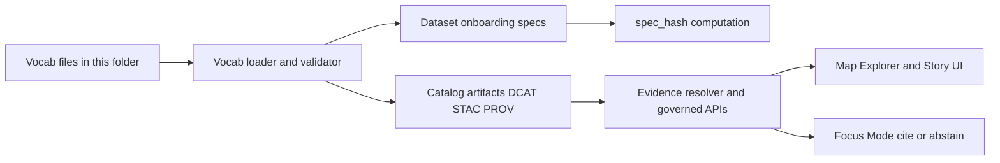

# Vocab registry
Canonical controlled vocabularies used across KFM registries, catalogs, policy, and evidence surfaces.

**Status:** Draft  
**Owners:** TBD (data stewards + registry maintainers)  


**Quick nav:** [What lives here](#what-lives-here) · [Why this matters](#why-this-matters) · [Vocabulary index](#vocabulary-index) · [Minimum required vocabularies](#minimum-required-vocabularies) · [Conventions](#conventions) · [Change process](#change-process) · [Validation and CI gates](#validation-and-ci-gates) · [Appendix](#appendix)

---

## What lives here

This directory is the **single in-repo source of truth** for controlled vocabularies (“vocab”) referenced by:

- dataset onboarding specs (inputs to `spec_hash`)
- policy labels and obligations
- catalog profiles (DCAT / STAC / PROV fields that are required + validated)
- evidence bundle and Focus Mode outputs (display + filtering)

**Important:** Changing a controlled vocabulary can change:
- whether a dataset spec validates,
- whether CI gates pass,
- whether policy enforcement behaves predictably,
- whether UI badges/filters render consistently.

---

## Why this matters

Controlled vocabularies are a core part of KFM’s “predictable identity + strict validation” posture:

- **Strict validation:** catalogs/specs should fail fast when they contain unknown or misspelled values.
- **Governance consistency:** policy decisions depend on stable labels (e.g., sensitive location handling).
- **Interoperability:** catalog fields (like DCAT theme) should align to an agreed set.

---

## Architecture at a glance



---

## Vocabulary index

The table below is the *minimum* set expected to exist, plus room for domain-specific vocabularies.

| Vocabulary | Domain | What it controls | Examples | Notes |
|---|---|---|---|---|
| `policy_label` | Governance | Access + sensitivity classification | `public`, `restricted_sensitive_location` | Drives allow/deny + obligations |
| `artifact.zone` | Data lifecycle | Where an artifact lives in the promotion flow | `raw`, `processed` | Useful in provenance + promotion checks |
| `citation.kind` | Evidence | What kind of evidence a citation points to | `dcat`, `prov`, `doc` | Prefer resolvable kinds |
| `geometry.generalization_method` | Safety | How geometry was generalized for public output | `centroid_only`, `dissolve_to_admin_unit` | Used when publishing generalized layers |
| `dcat.theme` | Discovery | Dataset thematic categorization | TBD | Domain-owned; not defined in the minimum set |

---

## Minimum required vocabularies

This section documents the *starter sets* that must remain stable and be expanded carefully.

### policy_label

Classification values used by policy evaluation, UI badges, and promotion gates.

| Term | Meaning |
|---|---|
| `public` | Safe to show publicly |
| `public_generalized` | Public derivative of sensitive data (geometry generalized) |
| `restricted` | Requires authorization; not public |
| `restricted_sensitive_location` | Precise locations protected; default-deny posture |
| `internal` | Visible to operators/stewards only |
| `embargoed` | Time-limited restriction pending release |
| `quarantine` | Not promoted (validation or rights unresolved) |

### artifact.zone

Data lifecycle zones used for provenance and promotion reasoning.

| Term | Meaning |
|---|---|
| `raw` | Ingested, immutable inputs |
| `work` | Intermediate artifacts (quarantine/workbench) |
| `processed` | Validated derived artifacts |
| `catalog` | Catalog surfaces (DCAT/STAC/PROV, linkable metadata) |
| `published` | API bundles / runtime-ready promoted bundles |

### citation.kind

Evidence type classification. This is about “what is being cited” (catalog, provenance, doc, etc.).

| Term | Meaning |
|---|---|
| `dcat` | DCAT dataset/distribution metadata |
| `stac` | STAC collection/item/asset metadata |
| `prov` | PROV lineage (activities/entities/agents) |
| `doc` | Governed documents and story citations |
| `graph` | Entity relations (if enabled) |
| `oci` | Optional future (OCI-based artifacts) |
| `url` | Discouraged; prefer resolvable schemes |

### geometry.generalization_method

Used when a dataset/version is published in generalized form (e.g., for public display).

| Term | Meaning |
|---|---|
| `centroid_only` | Replace geometry with centroid |
| `grid_aggregation_` | Grid aggregation method (parameterized; see conventions) |
| `random_offset_` | Random offset method (parameterized; see conventions) |
| `dissolve_to_admin_unit` | Dissolve to an administrative boundary |
| `bounding_box_only` | Replace geometry with bbox |
| `none` | No generalization applied |

---

## Conventions

### Naming

- Prefer **lowercase** and **snake_case** for terms (consistent with dataset slug conventions).
- Do **not** rename existing terms. If a term is wrong, deprecate it and add a new one.

### Deprecation

When retiring a term:
- keep the old term present but mark it as deprecated (metadata field; see proposed file format below),
- add a replacement term,
- add a migration note in the PR description (which specs/catalogs need updating).

### Parameterized terms

Some vocab entries are intended as prefixes (e.g., `grid_aggregation_`).
**Proposed rule:** if a method requires a parameter, encode it as a suffix in a stable unit.
Examples:
- `grid_aggregation_5000m`
- `random_offset_1000m`

If the repository already enforces a different pattern, treat that as authoritative and update this README.

---

## File format

No authoritative on-disk format is defined here (it is repo-local). The goal is to keep vocabularies:
- machine-readable,
- easy to diff/review,
- stable under hashing/validation.

### Proposed canonical JSON shape

One file per vocabulary, stored in this directory:

```text
data/registry/vocab/
  README.md
  policy_label.json
  artifact.zone.json
  citation.kind.json
  geometry.generalization_method.json
```

Example schema:

```json
{
  "vocab": "policy_label",
  "version": "1.0.0",
  "updated_at": "2026-02-22",
  "terms": [
    {
      "id": "public",
      "label": "Public",
      "description": "Safe to show publicly.",
      "status": "active"
    },
    {
      "id": "quarantine",
      "label": "Quarantine",
      "description": "Not promoted (validation or rights unresolved).",
      "status": "active"
    }
  ]
}
```

---

## Change process

Vocab changes are governance-impacting and should be handled like a promotion-critical contract change.

Minimum PR expectations:

1. **Describe the change**
   - What term(s) are being added/deprecated?
   - Why is it needed?
   - What systems/fields are affected (specs, catalogs, policy rules, UI)?

2. **Update any fixtures**
   - If CI fixtures reference vocab values, update them.

3. **Steward review required**
   - Especially for `policy_label` and any vocab affecting sensitive-location handling.

---

## Validation and CI gates

This folder is designed to support **fail-closed validation**:

- **Vocabulary validation** should run in CI for changed specs/catalogs.
- **Hash stability** must be preserved for canonical inputs (`spec_hash` should not drift).
- **Catalog validators + link-checkers** should treat unknown vocab values as failures where required fields are controlled.

### Developer checklist

- [ ] New/updated vocab file passes format/schema validation
- [ ] Any new term is used in at least one fixture or is explicitly “reserved for future”
- [ ] No term removals without deprecation metadata
- [ ] CI gates pass (schema, policy tests, spec/hash stability, link-check)

---

## Appendix

### Term request template

Use this block in PR descriptions to keep review consistent:

```text
Vocabulary:
Term:
Type: add | deprecate | replace
Meaning:
Rationale:
Used by fields:
Safety/governance impact:
Migration plan:
```

<a id="back-to-top"></a>
**Back to top:** [Vocab registry](#vocab-registry)
