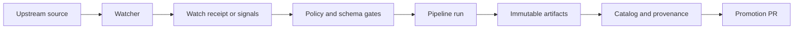

<!-- [KFM_META_BLOCK_V2]
doc_id: kfm://doc/3b51a6bb-e02e-4b3e-8a44-7ef5f26d4a9b
title: Watchers Registry
type: standard
version: v1
status: draft
owners: KFM Maintainers (TODO: set CODEOWNERS group)
created: 2026-03-02
updated: 2026-03-02
policy_label: public
related:
  - kfm://doc/TODO (KFM governance guide)
  - ../../schemas/watcher.v1.schema.json (if present)
tags: [kfm, registry, watchers, governance, receipts]
notes:
  - This README documents the *registry* for watchers (allow-list), not the watcher runtime implementation.
  - Default-deny: a watcher is not runnable unless it is registered, schema-valid, and signature-verified.
[/KFM_META_BLOCK_V2] -->

# data/registry/watchers — Watchers Registry (Allow‑List)

**Purpose:** Define a **typed, signed allow‑list** of automated “watchers” that monitor upstream sources and emit **watch signals / receipts** that can safely drive governed ingestion & promotion workflows.

> **WARNING**
> Watchers are *automation*. Treat this directory as **security-sensitive configuration**: be explicit, be deterministic, and fail closed.

---

## Badges (TODO: replace with repo-real)


---

## Quick navigation

- [What is a watcher](#what-is-a-watcher)
- [How it fits in KFM](#how-it-fits-in-kfm)
- [Directory layout](#directory-layout)
- [Watcher contract](#watcher-contract)
- [Governance gates](#governance-gates)
- [Add a new watcher](#add-a-new-watcher)
- [Security notes](#security-notes)
- [FAQ](#faq)

---

## What is a watcher

A **watcher** is a small, repeatable check that answers:

- “Has the upstream changed?”
- “Is it still reachable and within policy bounds?”
- “If it changed, what *exactly* changed (hashes, ETag, size, schema drift signals)?”

A watcher **does not** publish datasets by itself. It emits **evidence** (signals/receipts) that downstream pipelines can consume in a governed way.

---

## How it fits in KFM

The recurring governance loop is:



Key implication: **Watchers are upstream of promotion**. If a watcher is wrong or ungoverned, it can cause unsafe automation drift.

---

## Directory layout

> NOTE  
> Exact filenames may vary by implementation; this README defines the **intent and constraints**.

Recommended structure:

```text
data/registry/watchers/
  README.md
  entries/
    <watcher_id>.watcher.v1.json      # or .yaml (see canonicalization rules)
  signatures/
    <watcher_id>.sig                  # optional: detached signature material
  allowlists/
    watchers.index.json               # optional: machine-readable rollup
```

### Acceptable inputs (what belongs here)

- ✅ Watcher registry entries (JSON or YAML) that conform to the **Watcher schema**.
- ✅ Public, non-secret endpoints and polling metadata.
- ✅ Signature references / attestations references (no private keys).

### Exclusions (what must NOT go here)

- ❌ Raw datasets or large snapshots.
- ❌ Credentials, API keys, tokens, cookies, client secrets.
- ❌ “Just run this curl” ad-hoc scripts that bypass governance.
- ❌ Private coordinates or sensitive site locations (use coarse geography where needed).

---

## Watcher contract

### Contract goals

A watcher entry is designed to be:

- **Typed**: schema-valid with `additionalProperties: false`.
- **Deterministic**: stable `spec_hash` derived from canonicalized content.
- **Verifiable**: signature reference is required so automation can be enabled/disabled safely.
- **Policy-aware**: explicit staleness and drift tolerances to avoid “silent” changes.

### Minimum required fields (conceptual)

Your watcher entry MUST include, at minimum:

- `watcher_id` — stable ID (lowercase, `a-z0-9:_-`)
- `canonical_id` — stable dataset/source identity this watcher corresponds to
- `endpoint` — upstream URI
- `poll.interval_seconds` (+ optional `poll.mode`)
- `policy` — tolerances for staleness/drift
- `outputs` — what signals/receipts it emits (paths or artifact refs)
- `schema_url` — schema or spec reference for upstream format (if applicable)
- `version` — watcher entry schema version marker
- `spec_hash` — hash of canonicalized watcher spec
- `signature_ref` — how verifiers find the signature/attestation

### Example watcher entry

```json
{
  "$schema": "../../schemas/watcher.v1.schema.json",
  "watcher_id": "kdot:wzdx:prod",
  "canonical_id": "dataset:kdot_wzdx",
  "endpoint": "https://example.gov/wzdx/feed.geojson",
  "poll": {
    "interval_seconds": 900,
    "mode": "poll"
  },
  "policy": {
    "staleness_s": 86400,
    "spec_change_pct": 0.05,
    "geom_shift_m": 50
  },
  "outputs": {
    "signals": "artifact://kfm/watchers/kdot:wzdx:prod/signals@sha256:...",
    "receipt": "artifact://kfm/watchers/kdot:wzdx:prod/receipt@sha256:..."
  },
  "schema_url": "https://example.gov/wzdx/schema.json",
  "version": "v1",
  "spec_hash": "sha256:0000000000000000000000000000000000000000000000000000000000000000",
  "signature_ref": "sigstore://rekor/uuid/TODO"
}
```

> TIP  
> For HTTP polling, prefer conditional requests (`ETag` / `If-None-Match`) when supported to reduce load and avoid unnecessary downloads.

---

## Governance gates

Watchers are governed like any other automation input:

### Required invariants (fail closed)

- Schema validation MUST pass.
- `spec_hash` MUST be computed from canonicalized content and stable over time.
- Signature verification MUST pass before a watcher is considered runnable.
- Any “fail” signal MUST block downstream promotion lanes until reviewed.

### Typical CI flow (conceptual)

1. Watcher runs on a schedule or on-demand.
2. Watcher emits a receipt/signals artifact.
3. Policy gate evaluates receipt + watcher allow-list.
4. If allowed, automation may open a PR that updates catalogs / proposals.

> NOTE  
> This repository may implement these steps in GitHub Actions and OPA/Conftest; the contract here is designed to support deny-by-default enforcement.

---

## Add a new watcher

Checklist (PR-sized, reversible):

- [ ] Create a new watcher entry in `entries/`.
- [ ] Ensure it conforms to the watcher schema (no extra fields).
- [ ] Compute `spec_hash` from canonicalized content.
- [ ] Produce/attach a verifiable signature or `signature_ref`.
- [ ] Add/adjust policy tolerances (`staleness_s`, drift thresholds).
- [ ] Add at least one test/fixture proving **fail-closed** behavior (bad schema, missing sig, etc.).
- [ ] Document expected outputs (`signals`, `receipt`) and how they link to downstream pipelines.

Definition of Done:

- [ ] CI passes schema + policy checks.
- [ ] Watcher is disabled unless allow-listed and verified.
- [ ] A reviewer can trace: watcher entry → signature → emitted receipt → gate decision.

---

## Security notes

- Treat this directory as an **allow-list**: if it’s not here (and verified), it’s not allowed.
- Never store signing keys or secrets in-repo.
- Avoid endpoints that expose sensitive locations or operational details; when in doubt, **generalize** and flag for governance review.

---

## FAQ

### Why do we require signatures in the watcher spec?
To prevent **silent automation drift** and ensure CI/Focus Mode can make deterministic allow/deny decisions based on verified inputs.

### Can a watcher be webhook-driven instead of polling?
Yes, if your runtime supports it. The registry supports a `poll.mode` concept (poll/webhook/hybrid). The important part is still: **schema-valid + spec_hash + signature + receipts**.

### Where do the watcher receipts live?
Implementation-dependent. The key requirement is that receipts/signals are **first-class artifacts** that can be validated and used as evidence for gating decisions.

---

<details>
<summary>Appendix: Suggested fields quick reference</summary>

| Field | Intent | Notes |
|---|---|---|
| watcher_id | stable identifier | pattern `^[a-z0-9:_-]+$` |
| canonical_id | stable dataset/source mapping | keep stable across renames |
| endpoint | upstream URI | must be public if repo is public |
| poll.interval_seconds | cadence | min recommended: 60s+ |
| poll.mode | poll/webhook/hybrid | runtime capability-dependent |
| policy.staleness_s | staleness tolerance | defines when to alert/deny |
| policy.spec_change_pct | drift tolerance | blocks large schema drift |
| policy.geom_shift_m | spatial drift tolerance | blocks large geometry shifts |
| outputs | declared outputs | receipts/signals, not raw datasets |
| schema_url | upstream schema/spec | optional but recommended |
| spec_hash | deterministic hash | computed from canonicalization |
| signature_ref | signature/attestation locator | verifiable by CI |

</details>

---

_Back to top: [↑](#dataregistrywatchers--watchers-registry-allowlist)_
