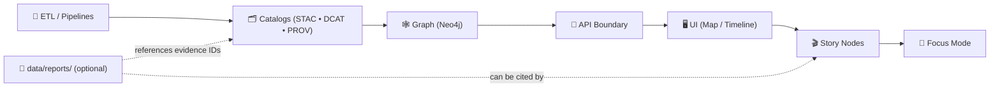
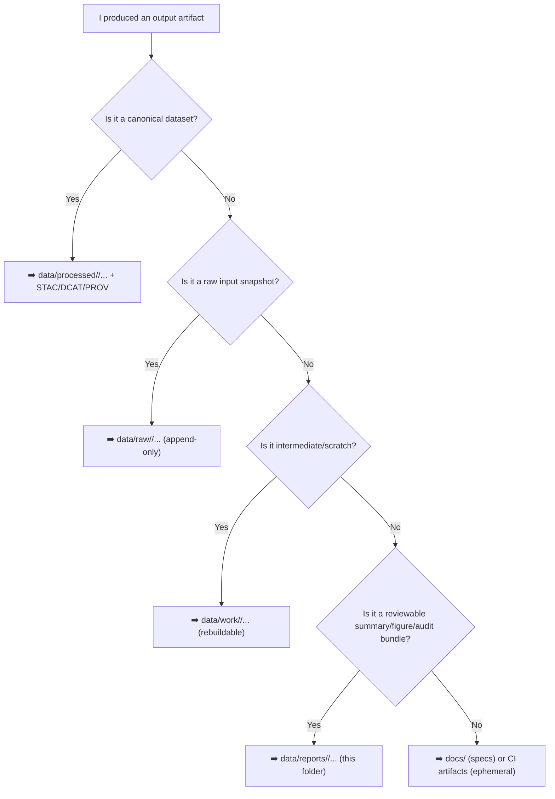

<a id="top"></a>

<div align="center">

# 📑 `data/reports/` — KFM Data Reports (Evidence Outputs)


**A governed home for reviewable analysis outputs** (PDF/MD/HTML/figures/tables/export bundles) **derived from certified KFM datasets** — when those outputs need to be reviewed, shared, cited, shipped, or audited. 🧭🧾

</div>

> [!IMPORTANT]
> **Reports do not bypass the pipeline.**  
> Canonical ordering (non‑negotiable): **ETL → Catalogs (STAC/DCAT/PROV) → Graph → API → UI → Story Nodes → Focus Mode**.  
> If a report becomes **public-facing** or **decision-significant**, it must be **discoverable + traceable** through the catalogs (**STAC/DCAT/PROV**) and served via the contracted **API boundary** (never UI → Neo4j direct). 🔐🧾

---

## ⚡ Quick links

### Evidence chain (what reports must point to)
- 📥 Raw inputs (immutable) → [`../raw/`](../raw/)
- 🧰 Workbench (WIP / experiments) → [`../work/`](../work/)
- 📦 Certified datasets (publish-ready files) → [`../processed/`](../processed/)
- 🛰️ STAC (asset indexing) → [`../stac/`](../stac/) · [`../stac/collections/`](../stac/collections/) · [`../stac/items/`](../stac/items/)
- 🗂️ DCAT (dataset discoverability) → [`../catalog/dcat/`](../catalog/dcat/)
- 🧬 PROV (lineage bundles) → [`../prov/`](../prov/)

### System neighbors (where reports get consumed)
- 🧠 Graph build/runtime (if present) → `src/graph/` or `graph/` *(repo-dependent)*
- 🔌 API boundary (governed access) → `api/` *(preferred in project docs)* or `src/server/` *(if your repo uses that layout)*
- 🖥️ UI client → `web/`
- 🎬 Story Nodes (runtime/editorial; repo-dependent) → `web/story_nodes/` *(preferred in project docs)* and/or `docs/reports/story_nodes/`

### Upstream metadata (nice-to-have if your repo uses it)
- 🧾 External dataset manifests → `data/sources/` *(if present)*

### Governance & security
- 🔐 Security policy / reporting → [`../../SECURITY.md`](../../SECURITY.md) *(or `../../.github/SECURITY.md` if that’s your canonical location)*
- ✅ CI/QA helpers → `tools/` *(if present)*

---

<details>
<summary><strong>📌 Table of contents</strong></summary>

- [🧭 What this folder is](#-what-this-folder-is)
- [✅ What belongs here (and what does not)](#-what-belongs-here-and-what-does-not)
- [🧩 Report taxonomy](#-report-taxonomy)
- [🧱 Where reports fit in the KFM pipeline](#-where-reports-fit-in-the-kfm-pipeline)
- [🧭 “Where should I put this?” decision guide](#-where-should-i-put-this-decision-guide)
- [🗂️ Directory layout](#️-directory-layout)
- [🧾 Report bundle contract (minimum required)](#-report-bundle-contract-minimum-required)
- [🧷 IDs, naming, and “atomic publish”](#-ids-naming-and-atomic-publish)
- [🔗 Traceability rules (STAC ↔ DCAT ↔ PROV ↔ Graph)](#-traceability-rules-stac--dcat--prov--graph)
- [🧪 Reproducibility & scientific integrity](#-reproducibility--scientific-integrity)
- [🔐 Security, privacy & sensitive-location handling](#-security-privacy--sensitive-location-handling)
- [✅ Validation & CI/CD expectations](#-validation--cicd-expectations)
- [📚 Reference shelf (project library)](#-reference-shelf-project-library)
- [🕰️ Version history](#-version-history)

</details>

---

## 🧭 What this folder is

`data/reports/` is the canonical place for **reviewable, shareable outputs** derived from KFM data — **when the output is not itself the canonical dataset**.

Reports are typically:
- 📊 *summaries* (EDA, trends, comparisons, diagnostics)
- 🧠 *model artifacts* (metrics, calibration, residual plots, posterior summaries)
- 🧪 *simulation outputs* (verification/validation notes, sensitivity analyses, uncertainty runs)
- 🧼 *validation outputs* (schema checks, geometry validity summaries, link checks, QA diffs)
- 📦 *audit bundles* (what a reviewer needs to approve a dataset change)

> [!NOTE]
> This folder is **optional** in the abstract, but the discipline is not.  
> If you keep long-lived analytical artifacts, keep them **provenance-linked**, **reproducible**, and **classification-aware**.

---

## ✅ What belongs here (and what does not)

| ✅ Put it in `data/reports/` when… | 🚫 Don’t put it here when… |
|---|---|
| You created a PDF/MD/HTML report with charts/tables meant for review, citation, or audit | The output is a **final dataset** meant for downstream computation (→ `data/processed/`) |
| You exported figures/tables summarizing a certified dataset version | You’re storing raw downloads or “as received” archives (→ `data/raw/`) |
| You generated a QA/validation summary you need to keep long-term | It’s an intermediate transform / scratch join (→ `data/work/`) |
| You produced an “approval packet” for maintainers (what changed + impact) | You’re writing narrative Story content (→ `web/story_nodes/` and/or `docs/reports/story_nodes/`) |
| The report is referenced by a Story Node or UI feature **and** you can link it to evidence IDs | It contains secrets/PII/restricted coordinates without protection (→ stop, redact, follow governance/security) |

---

## 🧩 Report taxonomy

Use this taxonomy to keep report intent consistent (and CI-checkable):

| Type | Examples | Typical audience | Traceability requirement |
|---|---|---|---|
| 🧼 QA / validation | schema compliance, geometry validity, link checks, catalog QA diffs | maintainers + reviewers | **Required** if used to approve/publish |
| 📈 EDA / analytics | distributions, time-series charts, anomaly summaries | analysts + contributors | Required if cited in Story/UI |
| 🧠 Modeling | regression diagnostics, Bayesian posterior plots, drift checks | analysts + maintainers | **Required** (STAC/DCAT/PROV pointers) |
| 🧪 Simulation & V&V | verification notes, sensitivity runs, UQ summaries | analysts + stewards | **Required** for decision-significant outputs |
| 🎨 Cartographic exports | map sheets, legend comps, print layouts, thumbnails | UI/story maintainers | Required if shipped |
| 📦 Release evidence bundles | “what changed / why / impact” with links | maintainers | **Required** for releases |

> [!TIP]
> If the report is going to influence a decision, treat it like a dataset: **IDs, lineage, checksums, and review gates**. ✅

---

## 🧱 Where reports fit in the KFM pipeline



**Interpretation:** reports are downstream artifacts that should point back to the canonical evidence chain (**catalogs + provenance**) instead of becoming “shadow datasets.”

---

## 🧭 “Where should I put this?” decision guide



---

## 🗂️ Directory layout

> [!TIP]
> Keep bundles **small + reviewable**.  
> For large binaries: use pointers + checksums + external storage (DVC/LFS/object storage/releases), but keep the **manifest + README** in Git.

```text
📁 data/
└── 📁 reports/
    ├── 📄 README.md                      👈 you are here
    ├── 📁 registry/                      ⭐ recommended (discoverability)
    │   ├── 📄 reports_index.md            (human index: browse + links)
    │   └── 📄 reports_registry.csv        (machine index: filter/sort/ingest)
    ├── 📁 <domain>/
    │   ├── 📄 README.md                  ⭐ recommended (domain index)
    │   └── 📁 <YYYY-MM-DD>__<slug>__v<semver>/
    │       ├── 📄 README.md              ✅ required (bundle “report card”)
    │       ├── 📄 REPORT_MANIFEST.json   ⭐ recommended (machine-readable)
    │       ├── 📄 checksums.sha256       ⭐ recommended (integrity)
    │       ├── 📄 report.md              (optional)
    │       ├── 📄 report.pdf             (optional)
    │       ├── 📁 assets/                (figures, maps, thumbnails)
    │       ├── 📁 tables/                (csv/parquet extracts; keep small)
    │       ├── 📁 notebooks/             (ipynb / qmd / rmd)
    │       └── 📁 refs/                  ⭐ recommended (evidence pointers)
    │           ├── 📄 stac_refs.txt
    │           ├── 📄 dcat_refs.txt
    │           └── 📄 prov_refs.txt
    └── 📁 _shared/                       (optional; avoid unless truly cross-domain)
        └── 📄 README.md
```

---

## 🧾 Report bundle contract (minimum required)

Every report bundle should be auditable like a dataset drop: **human context + machine pointers + integrity**.

| Artifact | Required | Why | Minimum “good enough” |
|---|---:|---|---|
| `README.md` | ✅ | Human-friendly report card | summary, scope, inputs, outputs, caveats, how to reproduce |
| `REPORT_MANIFEST.json` | ⭐ recommended | Machine-readable linkage | evidence IDs (STAC/DCAT), PROV activity IDs, file list, checksums |
| `checksums.sha256` | ⭐ recommended | Tamper-evidence + portability | sha256 for report outputs (and any included tables/figures) |
| `refs/*.txt` | ⭐ recommended | Evidence pointers (no “orphan facts”) | list of IDs/paths to STAC/DCAT/PROV used |

> [!IMPORTANT]
> If the report is referenced by a Story Node, a UI feature, or a release note: **evidence pointers become mandatory**.

---

## 🧷 IDs, naming, and “atomic publish”

### ✅ Report ID (stable join key)
Use a stable `report_id` that can be referenced in:
- PR discussions / reviews
- release notes
- Story Nodes
- Graph nodes (as a lightweight evidence pointer)

Suggested pattern:
```text
kfm.report.<domain>.<slug>.v<semver>
# example:
kfm.report.environment.ndvi_qc_summary.v1.2.0
```

### ✅ Bundle folder naming (sortable + grep-friendly)
```text
data/reports/<domain>/<YYYY-MM-DD>__<slug>__v<semver>/
# example:
data/reports/environment/2026-01-12__ndvi-qc-summary__v1.2.0/
```

### 🔒 Atomic publish rule (carry-over from pipeline discipline)
If a report is part of approving or shipping a dataset version:
- **publish as a bundle** (README + manifest + checksums + refs)
- link to the exact dataset version (STAC/DCAT) and lineage (PROV)
- avoid partial updates that leave reviewers guessing

> [!TIP]
> “Atomic publish” for reports means: **if the report references evidence, it ships with the pointers and integrity metadata—every time.** ✅

---

## 🔗 Traceability rules (STAC ↔ DCAT ↔ PROV ↔ Graph)

### ✅ Golden rule: pointers > copies 🧷
- Reports should **reference** certified datasets via stable IDs (**STAC/DCAT**) and lineage via **PROV**.
- Avoid duplicating large datasets in report bundles (unless it’s a tiny, explicitly justified review extract).

### ✅ Minimum pointer set (recommended)
A report bundle should be able to answer:

1) **What inputs?** → STAC/DCAT IDs (or paths resolving to them)  
2) **How generated?** → PROV activity/bundle ID (plus run config/commit where possible)  
3) **What outputs?** → files in this bundle + checksums  
4) **Can we reproduce?** → entrypoint + pinned environment

### 🧩 `REPORT_MANIFEST.json` starter (copy/paste)

```json
{
  "report_id": "kfm.report.<domain>.<slug>.v1.0.0",
  "title": "Human-readable report title",
  "domain": "<domain>",
  "created": "2026-01-12",
  "classification": "public|internal|confidential|restricted",
  "summary": "1–3 sentences explaining why this report exists.",

  "evidence": {
    "stac": ["path:data/stac/items/<...>.json", "path:data/stac/collections/<...>.json"],
    "dcat": ["path:data/catalog/dcat/<...>.jsonld"],
    "prov": ["path:data/prov/<...>.jsonld"]
  },

  "methods": {
    "type": ["eda|regression|bayesian|simulation|qa|cartography"],
    "tools": ["python", "r", "qgis", "gee", "postgis"],
    "notes": "Keep it short; point to README for narrative."
  },

  "repro": {
    "commit_sha": "TBD",
    "entrypoint": "notebooks/report.ipynb",
    "seeds": [42],
    "environment": {
      "method": "pip|conda|docker",
      "lockfiles": ["requirements.txt", "poetry.lock", "environment.yml"],
      "notes": "Pin deps; record runtime + hardware notes if relevant."
    }
  },

  "outputs": [
    { "path": "report.pdf", "media_type": "application/pdf", "sha256": "TBD" },
    { "path": "assets/figure-01.png", "media_type": "image/png", "sha256": "TBD" }
  ]
}
```

### 🌐 If a report becomes a “shipped evidence asset”
Pick one pattern (repo-specific, but keep it deterministic):

- **Pattern A — Add report files as STAC Assets** on an existing STAC Item  
  Best when the report documents a specific dataset version/time slice.
- **Pattern B — Dedicated STAC Item for the report**  
  Best when the report is a standalone evidence product (e.g., release audit bundle).

Either way:
- add (or update) a **DCAT distribution** for discoverability
- ensure **PROV links** “inputs → activity → report outputs”
- keep access mediated via **API** if classification requires

---

## 🧪 Reproducibility & scientific integrity

Reports are where “it looked right on my machine” goes to die ☠️ — unless we keep them reproducible.

### ✅ Baseline integrity checklist
- [ ] Inputs are certified (prefer `data/processed/<domain>/` + evidence IDs)
- [ ] Sampling/filtering is explained (time window, AOI, inclusion criteria)
- [ ] Metrics/criteria are stated *before* conclusions (avoid post-hoc storytelling)
- [ ] Modeling includes diagnostics/uncertainty (not just point estimates)
- [ ] Simulation includes V&V notes and at least one sensitivity check (when applicable)
- [ ] Outputs are checksummed and versioned
- [ ] Conclusions separate **facts vs interpretation**
- [ ] If AI-assisted: label it and keep every claim evidence-linked (no “free-floating” summaries)

### 📌 Recommended “report card” headings (`README.md` inside each bundle)
```text
# Report title
## Why this report exists (intent)
## Inputs (STAC/DCAT IDs)
## Methods (tools, parameters, assumptions)
## Outputs (files + checksums)
## Findings (with links to figures/tables)
## Uncertainty / limitations
## Sensitivity / governance notes
## How to reproduce (commands + env)
```

---

## 🔐 Security, privacy & sensitive-location handling

Reports can leak sensitive information even if the underlying dataset is protected (aggregation + joins can re-identify a place). Treat this as first-class risk. 🧨

### Hard rules
- 🚫 No secrets, tokens, credentials, private keys (ever)
- 🚫 No restricted coordinates or culturally sensitive locations without explicit review
- ✅ Preserve (or increase) classification — never “downgrade” sensitivity through reporting
- ✅ When in doubt: generalize (coarse bbox), redact, or keep internal

> [!IMPORTANT]
> If a report involves security-sensitive findings, follow coordinated disclosure (`SECURITY.md`) and do **not** post exploit details in public issues/PRs.

---

## ✅ Validation & CI/CD expectations

### Recommended CI behavior
- **If a report is referenced by Story Nodes / UI / releases:** validate it (pointers exist, links resolve, checksums present).
- **If a report is purely internal and not referenced:** treat it as optional, but keep the bundle contract.

### Suggested automated checks (fast gates)
- [ ] Markdown lint / basic hygiene (links, headings)
- [ ] `REPORT_MANIFEST.json` schema validation *(recommended if you add a schema)*
- [ ] Evidence pointer validation:
  - STAC/DCAT IDs exist (or paths resolve)
  - PROV activity/bundle referenced exists
- [ ] Link checks for internal relative links
- [ ] Secret/PII scanning gates (defense-in-depth)

> [!TIP]
> CI artifacts (Actions-uploaded files) are great for **ephemeral** outputs.  
> Commit to `data/reports/` when the report must be reviewable long-term and referenced by IDs.

---

## 📚 Reference shelf (project library)

> ⚠️ Reference PDFs may have licenses different from the repository code/data.  
> Treat this as a **reading pack / influence map**, not a redistribution mandate. 📚

<details>
<summary><strong>🧭 Core KFM docs (governing context)</strong></summary>

- `Kansas Frontier Matrix (KFM) – Comprehensive Technical Documentation.docx`
- `🌟 Kansas Frontier Matrix – Latest Ideas & Future Proposals.docx`

</details>

<details>
<summary><strong>🛰️ Remote sensing + GIS (methods + QA habits)</strong></summary>

- `Cloud-Based Remote Sensing with Google Earth Engine-Fundamentals and Applications.pdf`
- `python-geospatial-analysis-cookbook.pdf`
- `PostgreSQL Notes for Professionals - PostgreSQLNotesForProfessionals.pdf`
- `making-maps-a-visual-guide-to-map-design-for-gis.pdf`
- `Mobile Mapping_ Space, Cartography and the Digital - 9789048535217.pdf`
- `compressed-image-file-formats-jpeg-png-gif-xbm-bmp.pdf`

</details>

<details>
<summary><strong>📈 Statistics, experiments, inference (report integrity)</strong></summary>

- `Understanding Statistics & Experimental Design.pdf`
- `graphical-data-analysis-with-r.pdf`
- `regression-analysis-with-python.pdf`
- `Regression analysis using Python - slides-linear-regression.pdf`
- `think-bayes-bayesian-statistics-in-python.pdf`

</details>

<details>
<summary><strong>🧪 Simulation & modeling discipline (V&V, UQ, sensitivity)</strong></summary>

- `Scientific Modeling and Simulation_ A Comprehensive NASA-Grade Guide.pdf`
- `Generalized Topology Optimization for Structural Design.pdf`
- `Spectral Geometry of Graphs.pdf`

</details>

<details>
<summary><strong>🌐 Web + visualization (reports often ship into UI workflows)</strong></summary>

- `responsive-web-design-with-html5-and-css3.pdf`
- `webgl-programming-guide-interactive-3d-graphics-programming-with-webgl.pdf`

</details>

<details>
<summary><strong>⚙️ Systems + scale + interoperability</strong></summary>

- `Scalable Data Management for Future Hardware.pdf`
- `concurrent-real-time-and-distributed-programming-in-java-threads-rtsj-and-rmi.pdf`
- `Data Spaces.pdf`

</details>

<details>
<summary><strong>❤️ Ethics + accountability</strong></summary>

- `Introduction to Digital Humanism.pdf`
- `Principles of Biological Autonomy - book_9780262381833.pdf`
- `On the path to AI Law’s prophecies and the conceptual foundations of the machine learning age.pdf`

</details>

<details>
<summary><strong>🛡️ Security (defensive mindset only)</strong></summary>

- `ethical-hacking-and-countermeasures-secure-network-infrastructures.pdf`
- `Gray Hat Python - Python Programming for Hackers and Reverse Engineers (2009).pdf`

> These inform **defensive controls** (threat modeling, secure coding, incident response).  
> They are **not** a request for offensive tooling contributions.

</details>

<details>
<summary><strong>🧰 General programming shelf (bundles)</strong></summary>

- `A programming Books.pdf`
- `B-C programming Books.pdf`
- `D-E programming Books.pdf`
- `F-H programming Books.pdf`
- `I-L programming Books.pdf`
- `M-N programming Books.pdf`
- `O-R programming Books.pdf`
- `S-T programming Books.pdf`
- `U-X programming Books.pdf`
- `Deep Learning for Coders with fastai and PyTorch - Deep.Learning.for.Coders.with.fastai.and.PyTorchpdf`

</details>

---

## 🕰️ Version history

| Version | Date | Change | Author |
|---|---|---|---|
| v1.0.0 | 2025-12-26 | Initial `data/reports/` README scaffold | TBD |
| v1.1.0 | 2026-01-08 | Align to evidence-first bundles; add manifest + traceability rules | TBD |
| v1.2.0 | 2026-01-12 | Align links to project structure (`api/`, `pipelines/`, `web/story_nodes/`), add atomic publish guidance + registry suggestion | TBD |

---

<p align="right"><a href="#top">⬆️ Back to top</a></p>
