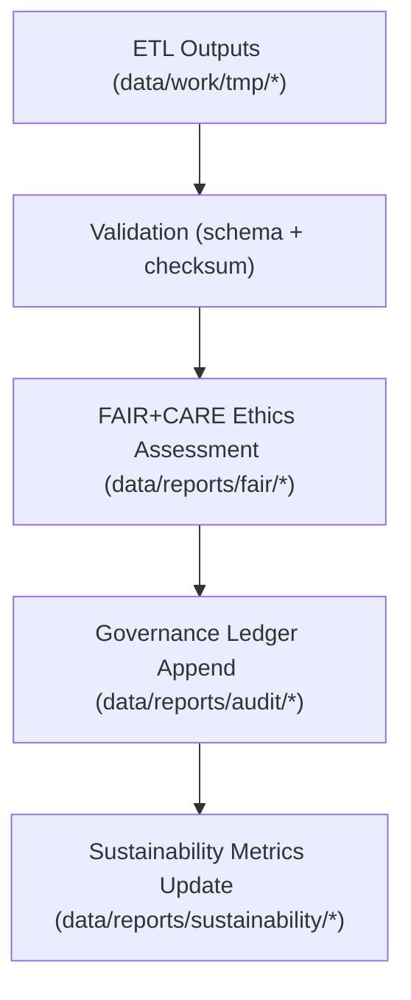

<div align="center">

# 📑 **Kansas Frontier Matrix — Reports & Governance Artifacts**  
`data/reports/README.md`

**Purpose:**  
Define the **canonical audit & governance layer** for KFM v11 — including **validation reports, FAIR+CARE assessments, AI explainability logs, sustainability metrics, and provenance ledgers** — ensuring system-wide accountability, reproducibility, and ethical transparency.

[]()  
[]()  
[]()  
[]()  
[]()

</div>

---

## 📘 Overview

The **Reports Layer** is KFM’s **official audit trail and governance surface**.

All validations, ethics reviews, sustainability metrics, and AI explainability outputs are captured here as **append-only, provenance-rich artifacts**. This directory is the primary source for:

- FAIR+CARE certification evidence  
- Schema & checksum validation history  
- AI bias / interpretability reports (including Focus Mode v3)  
- Sustainability and energy/carbon telemetry summaries  
- Governance ledger entries & signatures

### 🔁 v11.0.0 Enhancements

- Upgraded to **KFM-MDP v11.0.0** with extended metadata & governance semantics  
- **Focus Mode v3** explainability & risk-flag schemas integrated into AI reports  
- **DCAT 3.0 + PROV-O** alignment for all report categories  
- Unified telemetry v3 bindings (energy Wh, gCO₂e, records_processed) per report set  
- Improved linkage between **data products ↔ reports ↔ governance decisions**

---

## 🗂️ Directory Layout

```plaintext
data/reports/
├── README.md
│
├── audit/                                 # Governance + append-only provenance ledgers
│   ├── ai_climate_ledger.json
│   ├── ai_hazards_ledger.json
│   ├── ai_tabular_ledger.json
│   └── data_provenance_ledger.json
│
├── fair/                                  # FAIR+CARE audit reports & ethics assessments
│   ├── data_care_assessment.json
│   ├── hazards_summary.json
│   ├── climate_summary.json
│   └── landcover_summary.json
│
├── self-validation/                       # Automated self-validation outputs (per pipeline)
│   ├── work-climate-validation.json
│   ├── work-hazards-validation.json
│   ├── work-hydrology-validation.json
│   └── work-tabular-validation.json
│
├── validation/                            # Schema + checksum validation summaries
│   ├── schema_validation_summary.json
│   ├── checksum_registry.json
│   └── stac_validation_report.json
│
└── sustainability/                        # ISO 14064/50001 energy & carbon compliance
    ├── energy_audit_summary.json
    ├── carbon_metrics.json
    └── renewable_usage_report.json
````

---

## 🧩 Example Governance Record (v11, PROV-O + DCAT Aligned)

```json
{
  "ledger_id": "governance_record_2025Q4_001",
  "kind": "dataset_validation",
  "dataset_id": "processed_hazards_v11.0.0",
  "dcat:dataset": "urn:kfm:data:processed:hazards:v11",
  "validated_by": "@kfm-governance",
  "fairstatus": "certified",
  "checksum_verified": true,
  "prov:wasAssociatedWith": "@kfm-governance-bot",
  "prov:generatedAtTime": "2025-11-19T22:50:00Z",
  "ledger_signature": "pgp-sha256:49af2c1b89d6e3f9a7f2b4c5d8e1a9f3b5c7d1e6",
  "blockchain_hash": "0x8a3f9bde29f415f0...",
  "telemetry": {
    "records_processed": 98213,
    "energy_wh": 12.4,
    "carbon_gco2e": 16.9
  }
}
```

---

## ⚙️ Report Categories

| Category              | Description                                   | Typical Outputs                               | Cadence    |
| --------------------- | --------------------------------------------- | --------------------------------------------- | ---------- |
| **Audit**             | Governance & provenance ledger entries        | `audit/*_ledger.json`                         | Continuous |
| **FAIR+CARE**         | Ethics, accessibility & reuse assessments     | `fair/*_summary.json`                         | Quarterly  |
| **Validation**        | Schema, checksum & integrity verification     | `validation/*.json`, `self-validation/*.json` | Continuous |
| **AI Explainability** | Model interpretability & bias logs (Focus v3) | `audit/ai_*_ledger.json`, explainer outputs   | Quarterly  |
| **Sustainability**    | ISO 14064/50001 energy & carbon metrics       | `sustainability/*.json`                       | Biannual   |

---

## 🧠 FAIR+CARE Governance Alignment

| Principle                | Implementation                                                            | Oversight            |
| ------------------------ | ------------------------------------------------------------------------- | -------------------- |
| **Findable**             | Reports indexed by dataset/version & UUID in governance ledgers (JSON-LD) | `@kfm-data`          |
| **Accessible**           | Open JSON with signatures & traceable provenance                          | `@kfm-accessibility` |
| **Interoperable**        | ISO 19115 + DCAT 3.0 + PROV-O compatible metadata                         | `@kfm-architecture`  |
| **Reusable**             | Complete checksums, ethics summaries, and lineage                         | `@kfm-design`        |
| **Collective Benefit**   | Public, inspectable governance increases trust                            | `@faircare-council`  |
| **Authority to Control** | Council validates and signs governance records                            | `@kfm-governance`    |
| **Responsibility**       | Validators maintain integrity & ethics documentation                      | `@kfm-security`      |
| **Ethics**               | All reports reviewed for responsible data handling & openness             | `@kfm-ethics`        |

Key artifacts:

* `data/reports/fair/data_care_assessment.json`
* `data/reports/audit/data_provenance_ledger.json`

---

## 🔁 Validation & Publication Workflow



1. **Validation** — Post-ETL schema conformance & checksum verification
2. **FAIR+CARE Assessment** — Ethics, accessibility, and reuse certification
3. **Governance Ledgers** — Signed, append-only records of validation & ethics outcomes
4. **Sustainability** — Energetic and carbon reporting linked to processing runs

---

## 🌱 Sustainability Metrics (Example v11 Snapshot)

| Metric                     |      Value | Verified By           |
| -------------------------- | ---------: | --------------------- |
| Energy per Audit Cycle     |    17.9 Wh | `@kfm-sustainability` |
| Carbon Output              | 23.2 gCO₂e | `@kfm-security`       |
| Renewable Power Share      |       100% | `@kfm-infrastructure` |
| FAIR+CARE Governance Score |       100% | `@faircare-council`   |

Telemetry source (v11): `../../releases/v11.0.0/focus-telemetry.json`

---

## 🧾 Internal Use Citation (v11)

```text
Kansas Frontier Matrix (2025). Reports & Governance Artifacts (v11.0.0).
Centralized repository of FAIR+CARE audits, validation reports, AI explainability logs, and append-only governance ledgers, ensuring transparent, reproducible, and ethical operation of all KFM data and AI workflows.
```

---

## 🕰️ Version History

| Version | Date       | Author            | Summary                                                                                                                  |
| ------- | ---------- | ----------------- | ------------------------------------------------------------------------------------------------------------------------ |
| v11.0.0 | 2025-11-19 | Lead Programmer   | Upgraded to KFM-MDP v11, DCAT 3.0 + PROV-O alignment, Focus Mode v3 explainability schema, unified telemetry v3 bindings |
| v10.2.2 | 2025-11-12 | `@kfm-governance` | Telemetry v2 bindings, Streaming STAC refs, Focus v2.1 explainability schema                                             |
| v10.0.0 | 2025-11-09 | `@kfm-governance` | Initial reports layer with FAIR+CARE, validation, and sustainability structure                                           |

---

<div align="center">

**Kansas Frontier Matrix — Reports & Governance Layer**
📑 *Transparency × FAIR+CARE Ethics × Governance Accountability*

[⬅️ Back to Data Root](../README.md) ·
[📐 Data Architecture](../ARCHITECTURE.md) ·
[⚖️ Governance Charter](../../docs/standards/governance/ROOT-GOVERNANCE.md)

</div>
