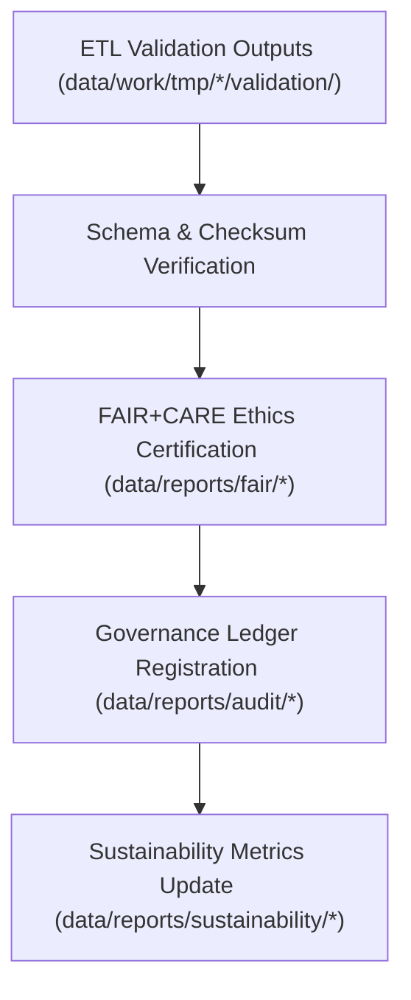

<div align="center">

# 📑 Kansas Frontier Matrix — **Reports & Governance Artifacts**
`data/reports/README.md`

**Purpose:**  
Central repository for **validation reports, FAIR+CARE audits, AI explainability logs, sustainability metrics, and governance records** across the Kansas Frontier Matrix (KFM).  
This layer ensures accountability, reproducibility, and transparency for ethics, provenance, and certification audits.

[](../../docs/architecture/README.md)
[](../../LICENSE)
[](../../docs/standards/faircare-validation.md)
[]()
[]()

</div>

---

## 📘 Overview

The **Reports Layer** functions as KFM’s **official audit trail**.  
All validations, governance actions, AI model audits, and **FAIR+CARE** assessments are stored here for regulatory compliance, open-data certification, and reproducibility.

### Core Responsibilities
- Maintain **validation & FAIR+CARE audit** reports for all domains.  
- Archive **AI explainability** and bias audit results.  
- Register and verify **provenance entries** in the Governance Ledger.  
- Provide dashboards for **quarterly sustainability** reporting.

---

## 🗂️ Directory Layout

```plaintext
data/reports/
├── README.md
│
├── audit/                                 # Governance + blockchain-linked provenance
│   ├── ai_climate_ledger.json
│   ├── ai_hazards_ledger.json
│   ├── ai_tabular_ledger.json
│   └── data_provenance_ledger.json
│
├── fair/                                  # FAIR+CARE audit reports & ethics assessments
│   ├── data_care_assessment.json
│   ├── hazards_summary.json
│   ├── climate_summary.json
│   └── landcover_summary.json
│
├── self-validation/                       # Automated self-validation outputs
│   ├── work-climate-validation.json
│   ├── work-hazards-validation.json
│   ├── work-hydrology-validation.json
│   └── work-tabular-validation.json
│
├── validation/                            # Schema + checksum validation summaries
│   ├── schema_validation_summary.json
│   ├── checksum_registry.json
│   └── stac_validation_report.json
│
└── sustainability/                        # ISO 14064 energy & carbon compliance
    ├── energy_audit_summary.json
    ├── carbon_metrics.json
    └── renewable_usage_report.json
```

---

## 🧩 Example Governance Record

```json
{
  "ledger_id": "governance_record_2025Q4_001",
  "dataset": "processed_hazards_v9.7.0",
  "validated_by": "@kfm-governance",
  "fairstatus": "certified",
  "checksum_verified": true,
  "ledger_signature": "pgp-sha256:49af2c1b89d6e3f9a7f2b4c5d8e1a9f3b5c7d1e6",
  "blockchain_hash": "0x8a3f9bde29f415f0...",
  "created": "2025-11-06T22:50:00Z"
}
```

---

## ⚙️ Report Categories

| Category            | Description                                   | Output      | Frequency  |
|---------------------|-----------------------------------------------|-------------|------------|
| **Audit Reports**   | Governance & provenance validation records.   | JSON        | Continuous |
| **FAIR+CARE**       | Ethics certification & accessibility audits.  | JSON / CSV  | Quarterly  |
| **Validation**      | Schema, checksum, integrity verification.     | JSON        | Continuous |
| **AI Explainability**| Model interpretability & bias logs.          | JSON        | Quarterly  |
| **Sustainability**  | ISO 14064/50001 energy & carbon metrics.      | JSON        | Biannual   |

---

## 🧠 FAIR+CARE Governance Alignment

| Principle | Implementation | Oversight |
|-----------|----------------|-----------|
| **Findable** | Reports indexed by dataset/version in ledger manifests. | `@kfm-data` |
| **Accessible** | Open JSON with audit traceability & signatures. | `@kfm-accessibility` |
| **Interoperable** | ISO 19115 + DCAT/PROV-O compatible metadata. | `@kfm-architecture` |
| **Reusable** | Complete provenance, checksums, & ethics summaries. | `@kfm-design` |
| **Collective Benefit** | Promotes public trust in open governance. | `@faircare-council` |
| **Authority to Control** | Council validates governance certification. | `@kfm-governance` |
| **Responsibility** | Validators maintain integrity and ethics documentation. | `@kfm-security` |
| **Ethics** | Reviewed for responsible data handling & openness. | `@kfm-ethics` |

**Audit results:**  
`data/reports/fair/data_care_assessment.json` · `data/reports/audit/data_provenance_ledger.json`

---

## ⚙️ Validation & Publication Workflow



1) **Validation** → Post-ETL schema & checksum reports  
2) **Certification** → FAIR+CARE ethics compliance evaluation  
3) **Governance** → Immutable ledger entries + signatures  
4) **Sustainability** → Energy & carbon dashboards (ISO 14064/50001)

---

## 📊 Example FAIR+CARE Report

```json
{
  "id": "faircare_audit_hazards_v9.7.0",
  "category": "hazards",
  "fairstatus": "certified",
  "care_compliance": 100.0,
  "accessibility_score": 98.7,
  "ethics_reviewed": true,
  "validated_by": "@kfm-faircare",
  "created": "2025-11-06T22:55:00Z",
  "governance_ref": "data/reports/audit/data_provenance_ledger.json"
}
```

---

## ⚖️ Retention & Provenance Policy

| Report Type         | Retention | Policy                                              |
|---------------------|----------:|-----------------------------------------------------|
| Governance Ledgers  | Permanent | Immutable, blockchain-linked records.               |
| FAIR+CARE Reports   | Permanent | Ethics & accessibility compliance log.              |
| Validation Reports  | 365 Days  | Archived after annual certification cycle.          |
| Sustainability      | 730 Days  | Maintained for ISO reporting & trend analysis.      |
| Self-Validation     | 180 Days  | Rotated after QA verification checkpoints.          |

**Retention automation:** `reports_retention_cleanup.yml`

---

## 🌱 Sustainability Metrics

| Metric                     | Value | Verified By           |
|---------------------------|------:|-----------------------|
| Energy (per audit cycle)  | 18.4 Wh | `@kfm-sustainability` |
| Carbon Output             | 24.5 gCO₂e | `@kfm-security`     |
| Renewable Power           | 100% (RE100) | `@kfm-infrastructure` |
| FAIR+CARE Governance      | 100% | `@faircare-council`   |

**Telemetry:** `../../releases/v9.7.0/focus-telemetry.json`

---

## 🧾 Internal Use Citation

```text
Kansas Frontier Matrix (2025). Reports & Governance Artifacts (v9.7.0).
Central repository of FAIR+CARE audits, validation reports, and blockchain-backed governance records ensuring transparency and ethical data stewardship across all KFM workflows.
```

---

## 🕰️ Version History

| Version | Date       | Author         | Summary |
|--------:|------------|----------------|---------|
| v9.7.0  | 2025-11-06 | `@kfm-governance` | Upgraded to v9.7.0; telemetry/schema refs updated; directory map refined; badges hardened. |
| v9.6.0  | 2025-11-03 | `@kfm-governance` | Added sustainability & governance integration for FAIR+CARE cycles. |
| v9.5.0  | 2025-11-02 | `@kfm-ai`         | Enhanced AI explainability & validation report indexing. |
| v9.3.2  | 2025-10-28 | `@kfm-core`       | Established reports directory under FAIR+CARE governance. |

---

<div align="center">

**Kansas Frontier Matrix**  
*Transparency × FAIR+CARE Ethics × Governance Accountability*  
© 2025 Kansas Frontier Matrix — CC-BY 4.0 · Diamond⁹ Ω / Crown∞Ω Ultimate Certified  

[Back to Data Architecture](../README.md) · [Governance Charter](../../docs/standards/governance/DATA-GOVERNANCE.md)

</div>