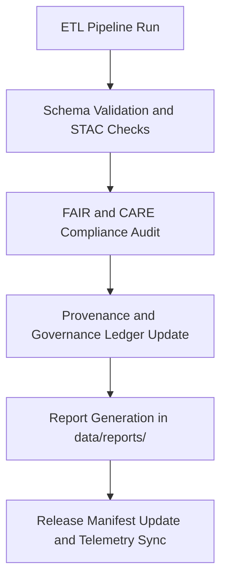

<div align="center">

# 🧾 Kansas Frontier Matrix — **Data Reports & Validation Logs**
`data/reports/README.md`

**Purpose:** Documents the structure and function of validation, FAIR+CARE, and governance reports for all datasets in the Kansas Frontier Matrix data ecosystem.  
Provides traceability, auditability, and reproducibility across all ETL and data lifecycle processes.

[](../../.github/workflows/stac-validate.yml)
[](../../LICENSE)
[](../../docs/standards/faircare-validation.md)
[](../../docs/architecture/repo-focus.md)

</div>

---

## 📚 Overview

The `data/reports/` directory centralizes **data validation outputs**, **FAIR+CARE audit results**, and **governance logs** for the Kansas Frontier Matrix (KFM).  
It acts as the **transparency layer** between raw data ingestion, ETL transformation, and published archives.  

Reports here document:
- STAC validation and schema compliance  
- FAIR+CARE audits and ethical assessments  
- Provenance tracking and cryptographic integrity  
- Data lineage and version history  

Every report is automatically generated during CI/CD workflows and versioned to preserve full audit trails.

---

## 🗂️ Directory Layout

```plaintext
data/reports/
├── README.md                          # This file — overview of data reporting system
│
├── audit/                             # Provenance, checksum, and governance logs
│   ├── data_provenance_ledger.json
│   ├── ai_hazards_ledger.json
│   ├── ui_ethics_review.json
│   └── archive_integrity_log.json
│
├── fair/                              # FAIR+CARE validation results and metrics
│   ├── data_fair_summary.json
│   ├── data_care_assessment.json
│   ├── faircare_scorecard.csv
│   └── ethics_review_summary.md
│
├── validation/                        # Schema and STAC validation reports
│   ├── stac_validation_report.json
│   ├── schema_validation_summary.json
│   ├── geojson_schema_validation.log
│   └── ai_validation_metrics.csv
│
└── lineage/                           # Data lineage and workflow tracking
    ├── data_lineage_tree.json
    ├── etl_job_history.json
    ├── transformation_steps.md
    └── pipeline_checksums.sha256
```

---

## 🧩 Reporting Workflow



**Key Processes:**
1. **ETL validation:** Confirms data structure, coordinate system, and schema alignment.  
2. **FAIR+CARE validation:** Runs ethical and metadata completeness checks.  
3. **Governance ledger update:** Records hash, author, timestamp, and decision metadata.  
4. **Report archival:** Results stored here for reproducibility and external verification.  

---

## 🧠 Report Types

| Category | Description | Workflow | Output Example |
|-----------|--------------|-----------|----------------|
| **Validation Reports** | Schema, STAC, and JSON schema conformance checks. | `stac-validate.yml` | `validation/stac_validation_report.json` |
| **FAIR+CARE Reports** | FAIR+CARE scoring and ethical compliance audits. | `faircare-validate.yml` | `fair/data_fair_summary.json` |
| **Audit Ledgers** | Provenance, checksum, and digital signatures for integrity. | `governance-ledger.yml` | `audit/data_provenance_ledger.json` |
| **Lineage Records** | Tracks dataset transformations across ETL cycles. | `etl-run.yml` | `lineage/data_lineage_tree.json` |

---

## ⚙️ FAIR+CARE Governance Metrics

Each dataset and transformation step is measured by the FAIR+CARE framework:

| Metric | Description | Value Range | Source |
|---------|--------------|--------------|---------|
| `fair_score` | Metadata completeness and STAC linkage | 0–100 | `fair/data_fair_summary.json` |
| `care_score` | Ethical compliance and governance transparency | 0–100 | `fair/data_care_assessment.json` |
| `audit_status` | Governance approval result (approved / flagged) | Boolean | `audit/data_provenance_ledger.json` |
| `provenance_depth` | Number of lineage nodes per dataset | Integer | `lineage/data_lineage_tree.json` |

> 🧩 **Note:** FAIR+CARE scores are aggregated quarterly for governance review and recorded in `reports/faircare_scorecard.csv`.

---

## 🧾 Provenance Chain Example

```json
{
  "dataset": "hazards_v9.3.2",
  "source": "NOAA Storm Events Database",
  "checksum": "c7b3d29e59b6f5b2...",
  "validator": "@kfm-etl-ops",
  "validation_date": "2025-10-28T15:02:45Z",
  "faircare_score": 98,
  "governance_status": "approved",
  "lineage": {
    "extracted_from": "data/sources/noaa_weather_datasets.json",
    "transformed_by": "etl/hazards_pipeline.py",
    "validated_in": "reports/validation/stac_validation_report.json"
  }
}
```

This structure provides transparent traceability for every dataset, transformation, and validation step.

---

## 🔍 Validation Workflows

| Workflow | Description | Output Path |
|-----------|--------------|-------------|
| `.github/workflows/stac-validate.yml` | STAC and schema validation for all datasets | `validation/stac_validation_report.json` |
| `.github/workflows/faircare-validate.yml` | FAIR+CARE ethical validation | `fair/data_fair_summary.json` |
| `.github/workflows/governance-ledger.yml` | Governance and provenance registration | `audit/data_provenance_ledger.json` |

Each workflow is automatically triggered upon commits affecting `data/` directories.

---

## 🧩 Governance Integration

Reports in this directory link directly to:
- `releases/v9.3.2/manifest.zip` — Dataset manifest with hash references  
- `reports/audit/data_provenance_ledger.json` — Source and validation lineage  
- `docs/standards/governance/` — Governance policy documents  
- `schemas/telemetry/work-data-governance-v14.json` — Telemetry schema for validation metadata  

Governance reports are accessible to the **FAIR+CARE Council** for review and archival.

---

## 🧾 Version History

| Version | Date       | Author             | Summary |
|----------|------------|--------------------|----------|
| v9.3.2   | 2025-10-28 | @kfm-data-lab      | Added FAIR+CARE, lineage, and audit integration documentation. |
| v9.3.1   | 2025-10-27 | @bartytime4life    | Enhanced governance and telemetry tracking documentation. |
| v9.3.0   | 2025-10-26 | @kfm-architecture  | Established reporting structure and validation workflow documentation. |

---

<div align="center">

**Kansas Frontier Matrix** · *Data Integrity × FAIR+CARE Governance × Transparent Validation*  
[🔗 Repository](https://github.com/bartytime4life/Kansas-Frontier-Matrix) • [🧭 Docs Portal](../../docs/) • [⚖️ Governance Ledger](../../docs/standards/governance/)

</div>
