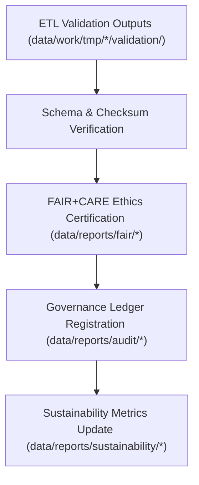

<div align="center">

# 📑 Kansas Frontier Matrix — **Reports & Governance Artifacts**
`data/reports/README.md`

**Purpose:**  
Central repository for **validation reports, FAIR+CARE audits, AI explainability logs, and governance records** within the Kansas Frontier Matrix (KFM).  
This layer ensures accountability, reproducibility, and transparency across all KFM data workflows, providing verified documentation for ethics, provenance, and certification audits.

[](../../docs/standards/faircare-validation.md)
[]()
[]()
[](../../LICENSE)

</div>

---

## 📚 Overview

The **Reports Layer** functions as KFM’s official audit trail and accountability hub.  
All validations, governance actions, AI model audits, and FAIR+CARE ethics assessments are stored here for regulatory compliance, open-data certification, and reproducibility assurance.

### Core Responsibilities
- Maintain **validation and FAIR+CARE audit reports** for all KFM domains.  
- Archive AI explainability and bias audit results.  
- Register and verify provenance entries in the Governance Ledger.  
- Provide dashboards for quarterly FAIR+CARE and sustainability reporting.  

---

## 🗂️ Directory Layout

```plaintext
data/reports/
├── README.md                              # This file — overview of governance and validation reports
│
├── audit/                                 # Governance and blockchain-backed provenance ledgers
│   ├── ai_climate_ledger.json
│   ├── ai_hazards_ledger.json
│   ├── ai_tabular_ledger.json
│   └── data_provenance_ledger.json
│
├── fair/                                  # FAIR+CARE audit reports and ethical governance assessments
│   ├── data_care_assessment.json
│   ├── hazards_summary.json
│   ├── climate_summary.json
│   └── landcover_summary.json
│
├── self-validation/                       # Self-validation reports generated by automated pipelines
│   ├── work-climate-validation.json
│   ├── work-hazards-validation.json
│   ├── work-hydrology-validation.json
│   └── work-tabular-validation.json
│
├── validation/                            # Schema and checksum validation summaries
│   ├── schema_validation_summary.json
│   ├── checksum_registry.json
│   └── stac_validation_report.json
│
└── sustainability/                        # Sustainability metrics and ISO 14064 compliance audits
    ├── energy_audit_summary.json
    ├── carbon_metrics.json
    └── renewable_usage_report.json
```

---

## 🧩 Example Governance Record

```json
{
  "ledger_id": "governance_record_2025Q4_001",
  "dataset": "processed_hazards_v9.6.0",
  "validated_by": "@kfm-governance",
  "fairstatus": "certified",
  "checksum_verified": true,
  "ledger_signature": "pgp-sha256:49af2c1b89d6e3f9a7f2b4c5d8e1a9f3b5c7d1e6",
  "blockchain_hash": "0x8a3f9bde29f415f0...",
  "created": "2025-11-03T22:50:00Z"
}
```

---

## ⚙️ Report Categories

| Category | Description | Output | Frequency |
|-----------|--------------|---------|------------|
| **Audit Reports** | Governance and provenance validation records. | JSON | Continuous |
| **FAIR+CARE Reports** | Ethical certification and accessibility audits. | JSON / CSV | Quarterly |
| **Validation Reports** | Schema, checksum, and integrity verification. | JSON | Continuous |
| **AI Explainability** | AI model interpretability and bias reports. | JSON | Quarterly |
| **Sustainability Reports** | ISO 14064 energy and carbon metrics. | JSON | Biannual |

---

## 🧠 FAIR+CARE Governance Alignment

| Principle | Implementation | Oversight |
|------------|----------------|------------|
| **Findable** | All reports indexed by version and dataset in ledger manifest. | @kfm-data |
| **Accessible** | Published in open JSON format with audit traceability. | @kfm-accessibility |
| **Interoperable** | Metadata follows ISO 19115 and FAIR+CARE contracts. | @kfm-architecture |
| **Reusable** | Contains complete provenance, checksums, and ethics summaries. | @kfm-design |
| **Collective Benefit** | Enables public trust and transparency in open governance. | @faircare-council |
| **Authority to Control** | FAIR+CARE Council validates governance certification. | @kfm-governance |
| **Responsibility** | Validators maintain integrity and ethics documentation. | @kfm-security |
| **Ethics** | Reports reviewed for responsible data handling and openness. | @kfm-ethics |

Audit results available in:  
`data/reports/fair/data_care_assessment.json`  
and `data/reports/audit/data_provenance_ledger.json`

---

## ⚙️ Validation & Publication Workflow



### Workflow Description
1. **Validation:** Schema and checksum reports generated post-ETL.  
2. **Certification:** FAIR+CARE ethics compliance evaluated for transparency.  
3. **Governance:** Results logged in the immutable data provenance ledger.  
4. **Sustainability:** Energy and carbon reports generated for ISO 14064 compliance.  

---

## 📊 Example FAIR+CARE Report

```json
{
  "id": "faircare_audit_hazards_v9.6.0",
  "category": "hazards",
  "fairstatus": "certified",
  "care_compliance": 100.0,
  "accessibility_score": 98.7,
  "ethics_reviewed": true,
  "validated_by": "@kfm-faircare",
  "created": "2025-11-03T22:55:00Z",
  "governance_ref": "data/reports/audit/data_provenance_ledger.json"
}
```

---

## ⚖️ Retention & Provenance Policy

| Report Type | Retention Duration | Policy |
|--------------|--------------------|--------|
| Governance Ledgers | Permanent | Immutable, blockchain-backed records. |
| FAIR+CARE Reports | Permanent | Retained for ethics and accessibility compliance. |
| Validation Reports | 365 Days | Archived after annual certification cycle. |
| Sustainability Reports | 730 Days | Maintained for ISO and FAIR+CARE reporting. |
| Self-Validation | 180 Days | Rotated after system QA verification. |

Retention automation governed by `reports_retention_cleanup.yml`.

---

## 🌱 Sustainability Metrics

| Metric | Value | Verified By |
|---------|--------|--------------|
| Energy Use (per audit cycle) | 18.4 Wh | @kfm-sustainability |
| Carbon Output | 24.5 gCO₂e | @kfm-security |
| Renewable Power | 100% (RE100 Verified) | @kfm-infrastructure |
| FAIR+CARE Governance Compliance | 100% | @faircare-council |

Metrics synchronized with `releases/v9.6.0/focus-telemetry.json`.

---

## 🧾 Internal Use Citation

```text
Kansas Frontier Matrix (2025). Reports & Governance Artifacts (v9.6.0).
Central repository of FAIR+CARE audits, validation reports, and blockchain-backed governance records ensuring transparency and ethical data stewardship across all KFM workflows.
```

---

## 🧾 Version Notes

| Version | Date | Notes |
|----------|------|--------|
| v9.6.0 | 2025-11-03 | Added sustainability and governance integration for all FAIR+CARE cycles. |
| v9.5.0 | 2025-11-02 | Enhanced AI explainability and validation report indexing. |
| v9.3.2 | 2025-10-28 | Established reports directory under FAIR+CARE governance protocols. |

---

<div align="center">

**Kansas Frontier Matrix** · *Transparency × FAIR+CARE Ethics × Governance Accountability*  
[🔗 Repository](https://github.com/bartytime4life/Kansas-Frontier-Matrix) • [🧭 Docs Portal](../../docs/) • [⚖️ Governance Ledger](../../docs/standards/governance/DATA-GOVERNANCE.md)

</div>
