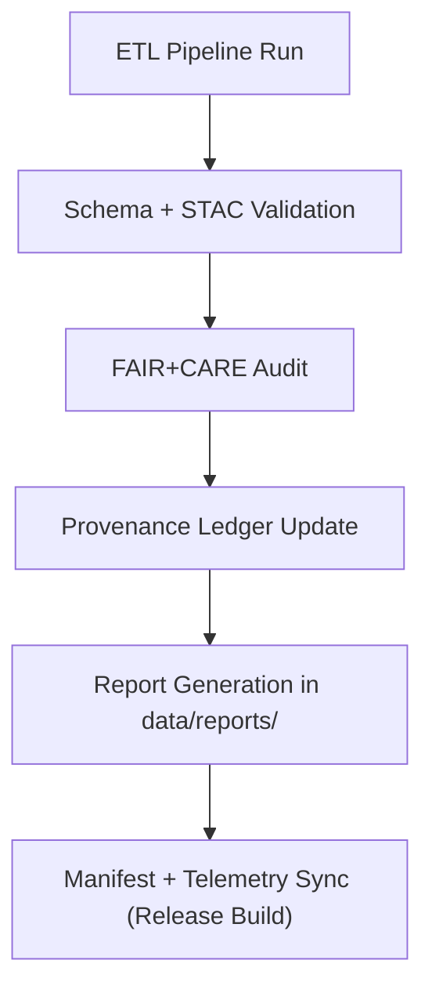

<div align="center">

# 🧾 Kansas Frontier Matrix — **Data Reports & Validation Logs**  
`data/reports/README.md`

**Purpose:** Centralizes **validation outputs**, **FAIR+CARE audit results**, and **provenance logs** for all datasets in the Kansas Frontier Matrix (KFM).  
Acts as the transparency and reproducibility layer connecting raw data ingestion, ETL pipelines, and archival governance.

[](../../.github/workflows/stac-validate.yml)
[](../../docs/standards/faircare-validation.md)
[](../../LICENSE)
[](../../docs/architecture/repo-focus.md)

</div>

---

## 📚 Overview

The `data/reports/` directory documents **validation, audit, and lineage reports** generated across the KFM data lifecycle.  
Every transformation, ingestion, and governance decision generates a corresponding report stored here for permanent reproducibility.

### Reports Track:
- ✅ STAC/DCAT metadata validation  
- 🧭 FAIR+CARE ethical compliance  
- 🔐 Provenance and checksum integrity  
- ⚙️ ETL lineage and transformation logs  
- 📊 Governance and telemetry metrics  

All reports are automatically generated and version-controlled via GitHub CI workflows.

---

## 🗂️ Directory Layout

```plaintext
data/reports/
├── README.md                            # This file — overview of data reporting system
│
├── audit/                               # Provenance, checksum, and governance logs
│   ├── data_provenance_ledger.json
│   ├── ai_hazards_ledger.json
│   ├── ui_ethics_review.json
│   └── archive_integrity_log.json
│
├── fair/                                # FAIR+CARE validation and ethics audits
│   ├── data_fair_summary.json
│   ├── data_care_assessment.json
│   ├── faircare_scorecard.csv
│   └── ethics_review_summary.md
│
├── validation/                          # Schema, STAC, and AI validation reports
│   ├── stac_validation_report.json
│   ├── schema_validation_summary.json
│   ├── geojson_schema_validation.log
│   └── ai_validation_metrics.csv
│
└── lineage/                             # Data lineage and workflow logs
    ├── data_lineage_tree.json
    ├── etl_job_history.json
    ├── transformation_steps.md
    └── pipeline_checksums.sha256
```

---

## ⚙️ Reporting Workflow



### Process Summary:
1. **Schema Validation:** Confirms dataset and geometry structure integrity.  
2. **FAIR+CARE Audit:** Runs ethical and metadata completeness checks.  
3. **Governance Update:** Writes hash, timestamp, and decision records to ledgers.  
4. **Report Generation:** Compiles outputs into structured JSON/CSV/Markdown files.  
5. **Telemetry Sync:** Updates focus-telemetry.json for governance dashboards.

---

## 🧠 Report Categories

| Type | Purpose | Workflow | Output |
|------|----------|-----------|---------|
| **Validation Reports** | STAC/DCAT/schema conformance | `stac-validate.yml` | `validation/stac_validation_report.json` |
| **FAIR+CARE Reports** | FAIR+CARE scoring, ethics validation | `faircare-validate.yml` | `fair/data_fair_summary.json` |
| **Audit Ledgers** | Provenance & checksum chain | `governance-ledger.yml` | `audit/data_provenance_ledger.json` |
| **Lineage Reports** | Dataset ETL and transformation tracing | `etl-run.yml` | `lineage/data_lineage_tree.json` |

---

## 📊 FAIR+CARE Metrics

Every dataset is assessed using FAIR+CARE key performance indicators.

| Metric | Definition | Range | Source |
|---------|-------------|--------|--------|
| `fair_score` | Metadata completeness & STAC alignment | 0–100 | `fair/data_fair_summary.json` |
| `care_score` | Governance & ethical compliance | 0–100 | `fair/data_care_assessment.json` |
| `audit_status` | Ledger integrity validation result | Pass/Fail | `audit/data_provenance_ledger.json` |
| `lineage_depth` | Number of lineage nodes in ETL graph | Integer | `lineage/data_lineage_tree.json` |

> FAIR+CARE scores and audit results are aggregated quarterly for inclusion in `fair/faircare_scorecard.csv`.

---

## 🔍 Provenance Chain Example

```json
{
  "dataset": "noaa_storm_events_2025",
  "source": "NOAA NCEI",
  "checksum": "c7b3d29e59b6f5b2a473b7d0e8e55a93...",
  "validator": "@kfm-etl-ops",
  "validation_date": "2025-10-30T16:30:00Z",
  "faircare_score": 97,
  "governance_status": "approved",
  "lineage": {
    "source_manifest": "data/sources/noaa_weather_datasets.json",
    "etl_pipeline": "src/pipelines/etl/noaa_ingest.py",
    "validated_report": "data/reports/validation/stac_validation_report.json"
  }
}
```

Each record includes full lineage from ingestion to approval.

---

## 🧩 Governance Integration

Reports link directly to governance resources for traceability:

| Artifact | Description | Location |
|-----------|--------------|----------|
| **Release Manifest** | Master checksum registry | `releases/v9.5.1/manifest.zip` |
| **Governance Ledger** | Provenance record of dataset transformations | `audit/data_provenance_ledger.json` |
| **FAIR+CARE Validation** | Ethical and metadata conformance summary | `fair/data_fair_summary.json` |
| **Telemetry Schema** | JSON schema for governance telemetry | `schemas/telemetry/work-data-governance-v14.json` |

All reports undergo quarterly FAIR+CARE Council audits and retention validation.

---

## 🧾 Validation Workflows

| Workflow | Function | Trigger | Output |
|-----------|-----------|----------|---------|
| `stac-validate.yml` | STAC & schema validation | Push/PR | `validation/stac_validation_report.json` |
| `faircare-validate.yml` | FAIR+CARE audit pipeline | Post-ingestion | `fair/data_fair_summary.json` |
| `governance-ledger.yml` | Provenance ledger updates | Merge/Release | `audit/data_provenance_ledger.json` |
| `etl-validate.yml` | ETL pipeline performance & checksums | Nightly | `lineage/etl_job_history.json` |

---

## 🧾 Version History

| Version | Date | Author | Summary |
|----------|------|---------|----------|
| v9.5.1 | 2025-10-30 | @kfm-data-lab | Updated FAIR+CARE scoring, governance telemetry, and release references. |
| v9.3.2 | 2025-10-28 | @kfm-data-lab | Expanded FAIR+CARE lineage and audit reporting. |
| v9.3.0 | 2025-10-26 | @kfm-architecture | Established baseline validation and governance reporting workflow. |

---

<div align="center">

**Kansas Frontier Matrix** · *Data Integrity × FAIR+CARE Accountability × Transparent Validation*  
[🔗 Repository](https://github.com/bartytime4life/Kansas-Frontier-Matrix) • [🧭 Docs Portal](../../docs/) • [⚖️ Governance Ledger](../../docs/standards/governance/)

</div>
