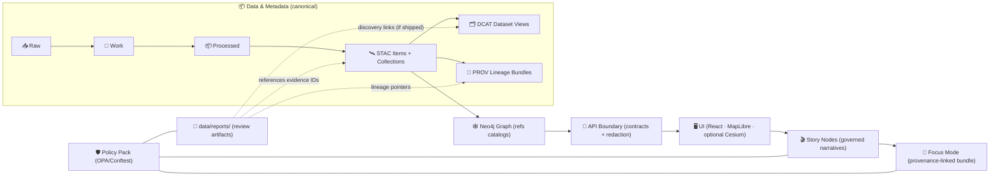
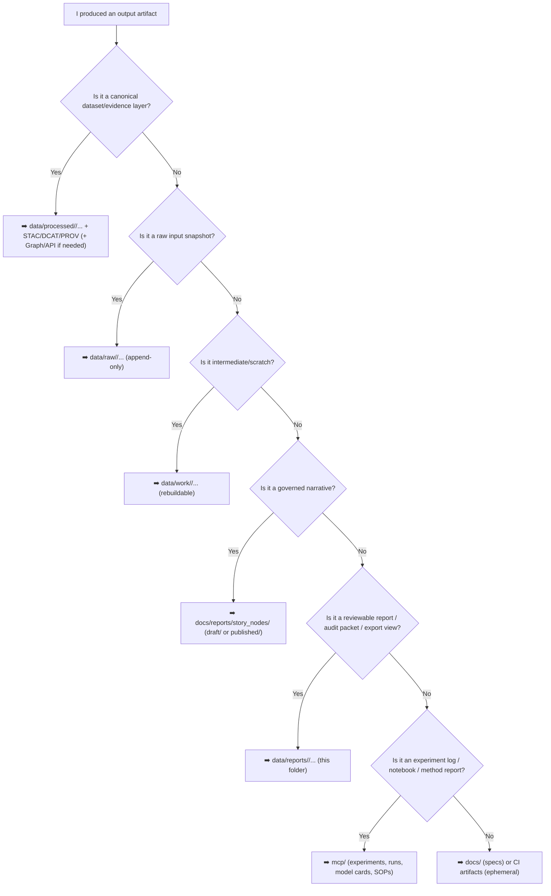

<a id="top"></a>

<div align="center">

# 📑 `data/reports/` — KFM Data Reports (Evidence Outputs)


**A governed home for reviewable analysis outputs** (PDF/MD/HTML/figures/tables/export bundles) **derived from certified KFM datasets** — when those outputs need to be reviewed, shared, cited, shipped, or audited. 🧭🧾

</div>

> [!IMPORTANT]
> **Reports do not bypass the pipeline.**  
> Canonical ordering (non‑negotiable): **Raw → Work → Processed → STAC → DCAT → PROV → Graph → API → UI → Story Nodes → Focus Mode**.  
> If a report becomes **public-facing** or **decision-significant**, it must be **discoverable + traceable** through the catalogs (**STAC/DCAT/PROV**) and served via the contracted **API boundary** (never UI → Neo4j direct). 🔐🧾

> [!IMPORTANT]
> **Focus Mode is a hard gate.**  
> If a figure/table/report is shown in Focus Mode (or referenced by a Story Node), it must be provenance-linked (IDs + catalogs + lineage) and policy-validated. If it lacks evidence IDs, it doesn’t ship. 🧠🔒

---

## ⚡ Quick links

### Evidence chain (what reports must point to)
- 📥 Raw inputs (immutable) → [`../raw/`](../raw/) *(per-domain: `../raw/<domain>/`)*  
- 🧰 Workbench (WIP / experiments) → [`../work/`](../work/) *(per-domain: `../work/<domain>/`)*  
- 📦 Certified datasets (publish-ready files) → [`../processed/`](../processed/) *(per-domain: `../processed/<domain>/`)*  

> [!TIP]
> **If your “report output” is actually a derived *dataset*** (e.g., a simulated raster, an AI-predicted layer, an OCR corpus), treat it as an **evidence artifact dataset**: store it in `data/processed/<domain>/...` and catalog it.  
> `data/reports/` is for **reviewable narratives + visuals + audit packets**, not canonical compute inputs.

### Catalogs & lineage (what makes evidence real)
- 🛰️ STAC (asset indexing) → [`../stac/`](../stac/) · [`../stac/collections/`](../stac/collections/) · [`../stac/items/`](../stac/items/)
- 🗂️ DCAT (dataset discoverability) → [`../catalog/dcat/`](../catalog/dcat/)
- 🧬 PROV (lineage bundles) → [`../prov/`](../prov/)

### System neighbors (where reports get consumed)
- 🧰 ETL / pipelines → `src/pipelines/` *(canonical v13 home)*
- 🧠 Graph build/runtime → `src/graph/` + `data/graph/` *(imports/exports)*
- 🔌 API boundary (governed access) → `src/server/` *(preferred)* or `api/` *(legacy)*
- 🖥️ UI client → `web/`
- 🎬 Story Nodes (governed narratives) → `docs/reports/story_nodes/` *(draft/ + published/)*  
  *(optional compiled/runtime mirrors may exist under `web/story_nodes/` depending on build)*
- 🧪 MCP (Methods & Computational Experiments) → `mcp/` *(runs, notebooks, model cards, SOPs)*
- 📦 Releases & ship bundles → `releases/`

### Policy / schemas / governance (the “no surprises” layer)
- 🛡️ Policy pack (OPA/Conftest) → `tools/validation/policy/` *(typical)* and/or `api/scripts/policy/`
- 📐 Schemas (contracts-first) → `schemas/` *(recommended home for report manifest schemas too)*
- ⚖ Governance & ethics → `docs/governance/` *(FAIR+CARE + sovereignty rules)*
- 🔐 Security policy / reporting → [`../../SECURITY.md`](../../SECURITY.md) *(or `../../.github/SECURITY.md` if canonical)*

---

<details>
<summary><strong>📌 Table of contents</strong></summary>

- [🧭 What this folder is](#-what-this-folder-is)
- [✅ What belongs here (and what does not)](#-what-belongs-here-and-what-does-not)
- [🧩 Report taxonomy](#-report-taxonomy)
- [🧱 Where reports fit in the KFM pipeline](#-where-reports-fit-in-the-kfm-pipeline)
- [🧭 “Where should I put this?” decision guide](#-where-should-i-put-this-decision-guide)
- [🗂️ Directory layout](#️-directory-layout)
- [🗃️ Registry & discoverability](#️-registry--discoverability)
- [🧾 Report bundle contract (minimum required)](#-report-bundle-contract-minimum-required)
- [🧷 IDs, naming, and “atomic publish”](#-ids-naming-and-atomic-publish)
- [🔗 Traceability rules (STAC ↔ DCAT ↔ PROV ↔ Graph ↔ Story/Focus)](#-traceability-rules-stac--dcat--prov--graph--storyfocus)
- [🛡️ Policy Pack & CI gates (OPA/Conftest)](#️-policy-pack--ci-gates-opaconftest)
- [🧪 Reproducibility & scientific integrity](#-reproducibility--scientific-integrity)
- [🤖 AI-assisted reports (disclosure + audit)](#-ai-assisted-reports-disclosure--audit)
- [🔐 Security, privacy & sensitive-location handling](#-security-privacy--sensitive-location-handling)
- [📦 Offline packs & exported views](#-offline-packs--exported-views)
- [📚 Reference shelf (project library)](#-reference-shelf-project-library)
- [🕰️ Version history](#-version-history)

</details>

---

## 🧭 What this folder is

`data/reports/` is the canonical place for **reviewable, shareable outputs** derived from KFM evidence — **when the output is not itself the canonical dataset**.

Reports are typically:
- 📊 *summaries* (EDA, trends, comparisons, diagnostics)
- 🧠 *model artifacts* (metrics, calibration, residual plots, posterior summaries)
- 🧪 *simulation artifacts* (verification/validation notes, sensitivity analyses, uncertainty runs)
- 🧼 *validation artifacts* (schema checks, geometry validity summaries, link checks, QA diffs)
- 🧾 *governance evidence* (policy check outputs, redaction logs, review packets)
- 📦 *release evidence bundles* (“what changed / why / impact” with traceable IDs)

> [!NOTE]
> This folder is **optional** in the abstract, but the discipline is not.  
> If you keep long-lived analytical artifacts, keep them **provenance-linked**, **reproducible**, and **classification-aware**. ✅

---

## ✅ What belongs here (and what does not)

| ✅ Put it in `data/reports/` when… | 🚫 Don’t put it here when… |
|---|---|
| You created a PDF/MD/HTML report with charts/tables meant for review, citation, or audit | The output is a **canonical dataset** meant for downstream computation (→ `data/processed/<domain>/...` + catalogs) |
| You exported figures/tables summarizing a certified dataset version | You’re storing raw downloads or “as received” archives (→ `data/raw/<domain>/...`) |
| You generated a QA/validation summary you need to keep long-term | It’s an intermediate transform / scratch join (→ `data/work/<domain>/...`) |
| You produced an “approval packet” for maintainers (what changed + impact) | You’re writing governed narrative Story content (→ `docs/reports/story_nodes/`) |
| You’re shipping a UI/export view (PDF map sheet, dashboard snapshot) **with evidence pointers** | You’re trying to “smuggle evidence” into the UI without catalogs / API contracts |
| You have a policy/lineage/citation audit artifact supporting Focus Mode/Story Node gating | It contains secrets/PII/restricted coordinates without protection (→ stop, redact, follow governance/security) |

---

## 🧩 Report taxonomy

Use this taxonomy to keep report intent consistent (and CI-checkable):

| Type | Examples | Typical audience | Traceability requirement |
|---|---|---|---|
| 🧼 QA / validation | schema compliance, geometry validity, link checks, catalog diffs | maintainers + reviewers | **Required** if used to approve/publish |
| 📈 EDA / analytics | distributions, time-series, anomaly summaries | analysts + contributors | Required if cited in Story/UI |
| 🧠 Modeling | regression diagnostics, Bayesian posterior plots, drift checks | analysts + maintainers | **Required** (STAC/DCAT/PROV pointers) |
| 🧪 Simulation & V&V | verification notes, sensitivity runs, UQ summaries | analysts + stewards | **Required** for decision-significant outputs |
| 🎨 Cartographic exports | map sheets, legend comps, thumbnails, 3D snapshot packs | UI/story maintainers | Required if shipped |
| 🧾 Governance evidence | policy pass/fail, redaction logs, access audits | governance + maintainers | **Required** when enforcing gates |
| 🧭 Focus/Story support | “evidence packets” for Story Nodes / Focus Mode | editors + reviewers | **Required** (hard gate if shown) |
| 📦 Release evidence bundles | “what changed / why / impact” with links | maintainers | **Required** for releases |

> [!TIP]
> If the report influences a decision, treat it like a dataset: **IDs, lineage, checksums, review gates**. ✅

---

## 🧱 Where reports fit in the KFM pipeline



**Interpretation:** reports are downstream artifacts that point back to canonical evidence (**STAC/DCAT/PROV**) instead of becoming “shadow datasets.” 🧷

---

## 🧭 “Where should I put this?” decision guide



---

## 🗂️ Directory layout

> [!TIP]
> Keep bundles **small + reviewable**.  
> For large binaries: use pointers + checksums + external storage (DVC/LFS/object storage/releases), but keep the **manifest + README** in Git. 📦

```text
📁 data/
└── 📁 reports/
    ├── 📄 README.md                      👈 you are here
    ├── 📁 registry/                      ⭐ recommended (discoverability)
    │   ├── 📄 reports_index.md            (human index: browse + links)
    │   └── 📄 reports_registry.csv        (machine index: filter/sort/ingest)
    ├── 📁 <domain>/
    │   ├── 📄 README.md                  ⭐ recommended (domain index)
    │   └── 📁 <YYYY-MM-DD>__<slug>__v<semver>/
    │       ├── 📄 README.md              ✅ required (bundle “report card”)
    │       ├── 📄 REPORT_MANIFEST.json   ⭐ recommended (machine-readable)
    │       ├── 📄 checksums.sha256       ⭐ recommended (integrity)
    │       ├── 📄 policy_results.json    ⭐ recommended (policy pack output)
    │       ├── 📄 telemetry.json         ⭐ recommended (cost/trace signals; if applicable)
    │       ├── 📄 ai_disclosure.md        ⭐ recommended (if AI-assisted)
    │       ├── 📄 report.md              (optional)
    │       ├── 📄 report.pdf             (optional)
    │       ├── 📁 assets/                (figures, maps, thumbnails)
    │       ├── 📁 tables/                (csv/parquet extracts; keep small)
    │       ├── 📁 notebooks/             (ipynb / qmd / rmd)
    │       └── 📁 refs/                  ⭐ recommended (evidence pointers)
    │           ├── 📄 stac_refs.txt
    │           ├── 📄 dcat_refs.txt
    │           └── 📄 prov_refs.txt
    └── 📁 _shared/                       (optional; avoid unless truly cross-domain)
        └── 📄 README.md
```

---

## 🗃️ Registry & discoverability

The **registry** exists so reports are:
- 🔎 easy to discover (humans + machines)
- 🧠 easy to reference from Story Nodes / PRs / release notes
- 🧷 easy to ingest into Graph as lightweight “evidence pointers”

### `reports_registry.csv` (suggested columns)

```csv
report_id,domain,title,created,version,classification,bundle_path,stac_refs,dcat_refs,prov_refs,story_refs,notes
kfm.report.environment.ndvi_qc_summary.v1.2.0,environment,NDVI QC Summary,2026-01-12,1.2.0,public,data/reports/environment/2026-01-12__ndvi-qc-summary__v1.2.0/,"...","...","...","...","..."
```

> [!TIP]
> If a report is referenced anywhere outside `data/reports/` (Story Node, docs, issues, releases), add it to the registry. ✅

---

## 🧾 Report bundle contract (minimum required)

Every report bundle should be auditable like a dataset drop: **human context + machine pointers + integrity**. 🧾

| Artifact | Required | Why | Minimum “good enough” |
|---|---:|---|---|
| `README.md` | ✅ | Human-friendly report card | summary, scope, inputs, outputs, caveats, how to reproduce |
| `REPORT_MANIFEST.json` | ⭐ recommended | Machine-readable linkage | evidence IDs (STAC/DCAT), PROV activity IDs, file list, checksums |
| `checksums.sha256` | ⭐ recommended | Tamper-evidence + portability | sha256 for report outputs (and included tables/figures) |
| `refs/*.txt` | ⭐ recommended | Evidence pointers (no “orphan facts”) | list of IDs/paths to STAC/DCAT/PROV used |
| `policy_results.json` | ⭐ recommended | “prove you passed the gate” | saved Conftest/OPA results snapshot for reviewers |
| `telemetry.json` | ⭐ recommended | governance + performance signals | runtime, cost notes, redactions applied (when applicable) |
| `ai_disclosure.md` | ⭐ recommended | transparency | what AI assisted, prompts/config references, limitations |
| `attestations/` | ⭐ (release-only) | supply-chain integrity | SBOM / provenance attestations for shipped evidence |

> [!IMPORTANT]
> If the report is referenced by a Story Node, a UI feature, or release notes: **evidence pointers become mandatory** (no exceptions). 🧷

---

## 🧷 IDs, naming, and “atomic publish”

### ✅ Report ID (stable join key)
Use a stable `report_id` that can be referenced in:
- PR discussions / reviews
- release notes
- Story Nodes
- Graph nodes (as lightweight evidence pointers)
- DCAT distributions (if shipped)

Suggested pattern:
```text
kfm.report.<domain>.<slug>.v<semver>
# example:
kfm.report.environment.ndvi_qc_summary.v1.2.0
```

### ✅ Bundle folder naming (sortable + grep-friendly)
```text
data/reports/<domain>/<YYYY-MM-DD>__<slug>__v<semver>/
# example:
data/reports/environment/2026-01-12__ndvi-qc-summary__v1.2.0/
```

### 🔒 Atomic publish rule (carry-over from pipeline discipline)
If a report is part of approving or shipping a dataset version:
- **publish as a bundle** (README + manifest + checksums + refs)
- link to the exact dataset version (STAC/DCAT) and lineage (PROV)
- save the policy outcome (`policy_results.json`) when it matters
- avoid partial updates that leave reviewers guessing

> [!TIP]
> “Atomic publish” for reports means: **if the report references evidence, it ships with pointers + integrity metadata—every time.** ✅

---

## 🔗 Traceability rules (STAC ↔ DCAT ↔ PROV ↔ Graph ↔ Story/Focus)

### ✅ Golden rule: pointers > copies 🧷
- Reports should **reference** certified datasets via stable IDs (**STAC/DCAT**) and lineage via **PROV**.
- Avoid duplicating large datasets in report bundles (unless it’s a tiny, explicitly justified review extract).

### ✅ Minimum pointer set (recommended)
A report bundle should be able to answer:

1) **What inputs?** → STAC/DCAT IDs (or paths resolving to them)  
2) **How generated?** → PROV activity/bundle ID (plus run config/commit where possible)  
3) **What outputs?** → files in this bundle + checksums  
4) **Can we reproduce?** → entrypoint + pinned environment + seeds

### 🧩 `REPORT_MANIFEST.json` starter (copy/paste)

```json
{
  "schema_version": "kfm.report_manifest.v1",

  "report_id": "kfm.report.<domain>.<slug>.v1.0.0",
  "title": "Human-readable report title",
  "domain": "<domain>",
  "created": "2026-01-19",

  "classification": "public|internal|confidential|restricted",
  "summary": "1–3 sentences explaining why this report exists.",

  "profiles": {
    "kfm_stac_profile": "v11.x",
    "kfm_dcat_profile": "v11.x",
    "kfm_prov_profile": "v11.x"
  },

  "evidence": {
    "stac": ["path:data/stac/items/<...>.json", "path:data/stac/collections/<...>.json"],
    "dcat": ["path:data/catalog/dcat/<...>.jsonld"],
    "prov": ["path:data/prov/<...>.jsonld"]
  },

  "methods": {
    "type": ["eda|regression|bayesian|simulation|qa|cartography|governance"],
    "tools": ["python", "r", "qgis", "gee", "postgis"],
    "notes": "Keep it short; point to README for narrative."
  },

  "policy": {
    "pack": "path:tools/validation/policy",
    "results": "path:policy_results.json"
  },

  "repro": {
    "commit_sha": "TBD",
    "entrypoint": "notebooks/report.ipynb",
    "seeds": [42],
    "environment": {
      "method": "pip|conda|docker|devcontainer",
      "lockfiles": ["requirements.txt", "poetry.lock", "environment.yml"],
      "notes": "Pin deps; record runtime + hardware notes if relevant."
    }
  },

  "outputs": [
    { "path": "report.pdf", "media_type": "application/pdf", "sha256": "TBD" },
    { "path": "assets/figure-01.png", "media_type": "image/png", "sha256": "TBD" }
  ]
}
```

### 🌐 If a report becomes a “shipped evidence asset”
Pick one pattern (repo-specific, but keep it deterministic):

- **Pattern A — Add report files as STAC Assets** on an existing STAC Item  
  Best when the report documents a specific dataset version/time slice.
- **Pattern B — Dedicated STAC Item for the report**  
  Best when the report is a standalone evidence product (e.g., release audit bundle).

Either way:
- add (or update) a **DCAT distribution** for discoverability
- ensure **PROV links** “inputs → activity → report outputs”
- keep access mediated via **API** if classification requires

---

## 🛡️ Policy Pack & CI gates (OPA/Conftest)

KFM enforces **policy-as-code** so we don’t rely on “tribal knowledge” or reviewers guessing. 🛡️

### Expected behavior
- **Detect → Validate → Promote** is the mental model:
  - *Detect*: changes appear (new data, new report, new Story Node)
  - *Validate*: policy pack + schemas + link checks + security scans
  - *Promote*: only policy-clean artifacts become “publish-ready” (and only then get referenced by Story/Focus)

### Suggested fast gates for reports
- [ ] Markdown lint / basic hygiene (links, headings)
- [ ] `REPORT_MANIFEST.json` schema validation *(recommended if you add a schema under `schemas/`)*
- [ ] Evidence pointer validation:
  - STAC/DCAT references exist (or paths resolve)
  - PROV activity/bundle exists
- [ ] Checksums validation (if present)
- [ ] Classification propagation check (outputs never “less restricted” than inputs)
- [ ] Secret/PII scanning (defense-in-depth)
- [ ] Story/Focus coupling gate:
  - If referenced by `docs/reports/story_nodes/published/...` → **must** have pointers + pass policy

> [!TIP]
> Keep `policy_results.json` in the bundle when a report supports a governance decision. It makes review *much* faster. ✅

---

## 🧪 Reproducibility & scientific integrity

Reports are where “it looked right on my machine” goes to die ☠️ — unless we keep them reproducible.

### ✅ Baseline integrity checklist
- [ ] Inputs are certified (prefer `data/processed/<domain>/` + evidence IDs)
- [ ] Sampling/filtering is explained (time window, AOI, inclusion criteria)
- [ ] Metrics/criteria are stated *before* conclusions (avoid post-hoc storytelling)
- [ ] Modeling includes diagnostics/uncertainty (not just point estimates)
- [ ] Simulation includes V&V notes + at least one sensitivity check (when applicable)
- [ ] Outputs are checksummed + versioned
- [ ] Conclusions separate **facts vs interpretation**
- [ ] If AI-assisted: label it + link every claim to evidence (no free-floating summaries)

### 📌 Recommended “report card” headings (`README.md` inside each bundle)
```text
# Report title
## Why this report exists (intent)
## Inputs (STAC/DCAT IDs)
## Methods (tools, parameters, assumptions)
## Outputs (files + checksums)
## Findings (with links to figures/tables)
## Uncertainty / limitations
## Sensitivity / governance notes (FAIR+CARE, sovereignty)
## How to reproduce (commands + env + seeds)
```

---

## 🤖 AI-assisted reports (disclosure + audit)

AI can help, but it must not become a “mystery author.” 🤖🧾

### Hard expectations (when AI assisted anything in the report)
- ✅ Clearly label AI involvement (`ai_disclosure.md` recommended)
- ✅ Keep evidence-first: every factual claim remains evidence-linked (catalog IDs)
- ✅ Save enough to audit:
  - model/provider/version (where applicable)
  - prompts/templates (or references to them)
  - retrieval context policy (what sources were allowed)
  - confidence/uncertainty statements if the workflow emits them
- ✅ Respect sovereignty + sensitivity rules (no coordinate leaks, no speculation on protected topics)

> [!IMPORTANT]
> If AI-generated content is ever shown in Focus Mode, it must be **opt-in**, clearly labeled, and still constrained by evidence + policy gates. 🧠🔒

---

## 🔐 Security, privacy & sensitive-location handling

Reports can leak sensitive information even if the underlying dataset is protected (aggregation + joins can re-identify a place). Treat this as first-class risk. 🧨

### Hard rules
- 🚫 No secrets, tokens, credentials, private keys (ever)
- 🚫 No restricted coordinates or culturally sensitive locations without explicit review
- ✅ Preserve (or increase) classification — never “downgrade” sensitivity through reporting
- ✅ When in doubt: generalize (coarse bbox), redact, or keep internal
- ✅ Prefer “safe by design” exports: thumbnails, coarse AOIs, redacted tables

> [!IMPORTANT]
> If a report involves security-sensitive findings, follow coordinated disclosure (`SECURITY.md`) and do **not** post exploit details in public issues/PRs.

---

## 📦 Offline packs & exported views

KFM supports **offline** and **export** workflows (print packets, field packs, classroom kits, review bundles). 📦🗺️

### If you include reports in an offline/export bundle
- ✅ Keep the export as an **atomic bundle**: report + manifest + checksums + evidence pointers
- ✅ Include **credits + licenses + citations** (no “orphan graphics”)
- ✅ Ensure access control is preserved:
  - public packs can include only public/classified-safe artifacts
  - restricted packs must be distributed through approved channels (API + access control)

> [!TIP]
> A good offline pack is basically “Focus Mode in a box”: provenance-linked, redaction-safe, and reviewable. 🧠📦

---

## 📚 Reference shelf (project library)

> ⚠️ Reference PDFs may have licenses different from the repository code/data.  
> Treat this as a **reading pack / influence map**, not a redistribution mandate. 📚

<details>
<summary><strong>🧭 Core KFM docs (rules + architecture)</strong></summary>

- 📘 Master Guide v13 (pipeline ordering, invariants, canonical homes)  [oai_citation:0‡MARKDOWN_GUIDE_v13.md.gdoc](file-service://file-UYVruFXfueR8veHMUKeugU)
- 📚 KFM Data Intake — Technical & Design Guide (intake discipline, provenance-first)  [oai_citation:1‡📚 Kansas Frontier Matrix (KFM) Data Intake – Technical & Design Guide.pdf](file-service://file-EbUCdsJMbu5KwpoKMrLrgj)
- 🧠 KFM AI System Overview (policy pack, detect→validate→promote, safe automation patterns)  [oai_citation:2‡Kansas Frontier Matrix (KFM) – AI System Overview 🧭🤖.pdf](file-service://file-Pv8eev6RWvCKrGCXyzY7zg)
- 🖥️ KFM UI System Overview (Story + Focus integration, evidence UX expectations)  [oai_citation:3‡Kansas Frontier Matrix – Comprehensive UI System Overview.pdf](file-service://file-KcBQruYcoFVDEixzzRHTwt)
- 🧱 KFM Architecture, Features, and Design (W-P-E agents, subsystem design)  [oai_citation:4‡Kansas Frontier Matrix (KFM) – Comprehensive Architecture, Features, and Design.pdf](file-service://file-4Umt1yHoGKicdmLWzFJ9sC)
- 📖 KFM Comprehensive Technical Documentation (end-to-end implementation context)  [oai_citation:5‡Kansas Frontier Matrix (KFM) – Comprehensive Technical Documentation.pdf](file-service://file-AkqwUuYPp5zePf7pv5SMxi)
- 🌟 Latest Ideas & Future Proposals (offline packs, RBAC, supply-chain rigor)  [oai_citation:6‡🌟 Kansas Frontier Matrix – Latest Ideas & Future Proposals.docx.pdf](file-service://file-SQ3f7ve8SGiusT6ThZEuCe)
- 💡 Innovative Concepts to Evolve KFM (AR, digital twins, community verification)  [oai_citation:7‡Innovative Concepts to Evolve the Kansas Frontier Matrix (KFM).pdf](file-service://file-G71zNoWKxsoSW44iwZaaCC)
- 🗺️ Open-Source Geospatial Historical Mapping Hub Design (catalog-first, experiment reports/SOP patterns)  [oai_citation:8‡Kansas-Frontier-Matrix_ Open-Source Geospatial Historical Mapping Hub Design.pdf](file-service://file-64djFYQUCmxN1h6L6X7KUw)

</details>

<details>
<summary><strong>📦 Project reading packs (PDF portfolios)</strong></summary>

- 🤖 AI Concepts & more (ethics, humanism, AI law, accountability)  [oai_citation:9‡Maps-GoogleMaps-VirtualWorlds-Archaeological-Computer Graphics-Geospatial-webgl.pdf](file-service://file-RshcX5sNY2wpiNjRfoP6z6)
- 🛰️ Maps / WebGL / GIS portfolio (MapLibre/WebGL/cartography + geospatial method shelf)  [oai_citation:10‡Data Managment-Theories-Architures-Data Science-Baysian Methods-Some Programming Ideas.pdf](file-service://file-RrXMFY7cP925exsQYermf2)
- 🧮 Data management / Bayesian / architecture portfolio (data engineering, reproducibility, inference)  [oai_citation:11‡🌟 Kansas Frontier Matrix – Latest Ideas & Future Proposals.docx.pdf](file-service://file-SQ3f7ve8SGiusT6ThZEuCe)
- 🧰 Programming languages & resources portfolio (broad engineering shelf; **security texts = defensive mindset only**)  [oai_citation:12‡Various programming langurages & resources 1.pdf](file-service://file-4wp3wSSZs7gk5qHWaJVudi)

> ℹ️ These are **PDF Portfolios** (collections of embedded documents). Open in Acrobat/Reader to browse.

</details>

---

## 🕰️ Version history

| Version | Date | Change | Author |
|---|---|---|---|
| v1.0.0 | 2025-12-26 | Initial `data/reports/` README scaffold | TBD |
| v1.1.0 | 2026-01-08 | Align to evidence-first bundles; add manifest + traceability rules | TBD |
| v1.2.0 | 2026-01-12 | Align links to v13 structure (`src/pipelines/`, `src/server/`, Story Nodes in `docs/reports/story_nodes/`) | TBD |
| v1.3.0 | 2026-01-19 | Add Policy Pack + CI gates, registry guidance, AI disclosure expectations, offline/export guidance | TBD |

---

<p align="right"><a href="#top">⬆️ Back to top</a></p>