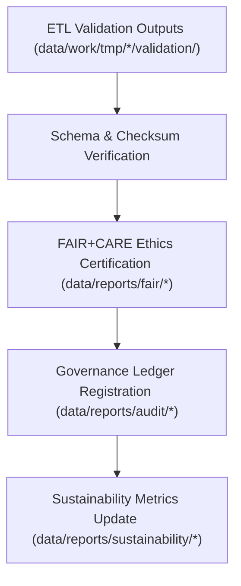

<div align="center">

# 📑 Kansas Frontier Matrix — **Reports & Governance Artifacts**  
`data/reports/README.md`

**Purpose:**  
Central repository for **validation reports, FAIR+CARE audits, AI explainability logs, sustainability metrics, and governance records** across the Kansas Frontier Matrix (KFM).  
This layer ensures accountability, reproducibility, and transparency for ethics, provenance, and certification audits.

[](../../docs/README.md)
[](../../LICENSE)
[](../../docs/standards/faircare.md)
[]()
[]()

</div>

---

## 📘 Overview

The **Reports Layer** is KFM’s **official audit trail**.  
All validations, governance actions, AI model audits, and **FAIR+CARE** assessments are stored here for regulatory compliance, open-data certification, and reproducibility.

**v10.2.2 Enhancements**
- **Telemetry v2** bindings — energy/CO₂ and validation-coverage metrics attached to each report set; JSON-LD linkage to ledgers.  
- **Streaming STAC** references where catalogs update continuously.  
- Expanded AI explainability schema for **Focus Mode v2.1**.

### Core Responsibilities

- Maintain **validation & FAIR+CARE** audit reports for all domains.  
- Archive **AI explainability** and bias audit results.  
- Register and verify **provenance entries** in the Governance Ledger.  
- Provide dashboards for **quarterly sustainability** reporting.

---

## 🗂️ Directory Layout

```plaintext
data/reports/
├── README.md
│
├── audit/                                 # Governance + append-only provenance
│   ├── ai_climate_ledger.json
│   ├── ai_hazards_ledger.json
│   ├── ai_tabular_ledger.json
│   └── data_provenance_ledger.json
│
├── fair/                                  # FAIR+CARE audit reports & ethics assessments
│   ├── data_care_assessment.json
│   ├── hazards_summary.json
│   ├── climate_summary.json
│   └── landcover_summary.json
│
├── self-validation/                       # Automated self-validation outputs
│   ├── work-climate-validation.json
│   ├── work-hazards-validation.json
│   ├── work-hydrology-validation.json
│   └── work-tabular-validation.json
│
├── validation/                            # Schema + checksum validation summaries
│   ├── schema_validation_summary.json
│   ├── checksum_registry.json
│   └── stac_validation_report.json
│
└── sustainability/                        # ISO 14064/50001 energy & carbon compliance
    ├── energy_audit_summary.json
    ├── carbon_metrics.json
    └── renewable_usage_report.json
```

---

## 🧩 Example Governance Record

```json
{
  "ledger_id": "governance_record_2025Q4_001",
  "dataset": "processed_hazards_v10.2.2",
  "validated_by": "@kfm-governance",
  "fairstatus": "certified",
  "checksum_verified": true,
  "ledger_signature": "pgp-sha256:49af2c1b89d6e3f9a7f2b4c5d8e1a9f3b5c7d1e6",
  "blockchain_hash": "0x8a3f9bde29f415f0...",
  "created": "2025-11-12T22:50:00Z"
}
```

---

## ⚙️ Report Categories

| Category | Description | Output | Cadence |
|---|---|---|---|
| **Audit** | Governance & provenance validation records | JSON | Continuous |
| **FAIR+CARE** | Ethics certification & accessibility audits | JSON/CSV | Quarterly |
| **Validation** | Schema, checksum, integrity verification | JSON | Continuous |
| **AI Explainability** | Model interpretability & bias logs | JSON | Quarterly |
| **Sustainability** | ISO 14064/50001 energy & carbon metrics | JSON | Biannual |

---

## 🧠 FAIR+CARE Governance Alignment

| Principle | Implementation | Oversight |
|---|---|---|
| **Findable** | Reports indexed by dataset/version in ledger manifests (JSON-LD). | `@kfm-data` |
| **Accessible** | Open JSON with audit traceability & signatures. | `@kfm-accessibility` |
| **Interoperable** | ISO 19115 + DCAT/PROV-O compatible metadata. | `@kfm-architecture` |
| **Reusable** | Complete provenance, checksums, and ethics summaries. | `@kfm-design` |
| **Collective Benefit** | Promotes public trust in open governance. | `@faircare-council` |
| **Authority to Control** | Council validates governance certification. | `@kfm-governance` |
| **Responsibility** | Validators maintain integrity and ethics documentation. | `@kfm-security` |
| **Ethics** | Reviewed for responsible data handling & openness. | `@kfm-ethics` |

**Audit results:**  
`data/reports/fair/data_care_assessment.json` · `data/reports/audit/data_provenance_ledger.json`

---

## ⚙️ Validation & Publication Workflow



1. **Validation** → Post-ETL schema & checksum reports  
2. **Certification** → FAIR+CARE ethics compliance evaluation  
3. **Governance** → Append-only ledger entries + signatures  
4. **Sustainability** → Energy & carbon dashboards (ISO 14064/50001)

---

## 🌱 Sustainability Metrics

| Metric | Value | Verified By |
|---|---:|---|
| Energy (per audit cycle) | 17.9 Wh | `@kfm-sustainability` |
| Carbon Output | 23.2 gCO₂e | `@kfm-security` |
| Renewable Power | 100% (RE100) | `@kfm-infrastructure` |
| FAIR+CARE Governance | 100% | `@faircare-council` |

**Telemetry:** `../../releases/v10.2.0/focus-telemetry.json`

---

## 🧾 Internal Use Citation

```text
Kansas Frontier Matrix (2025). Reports & Governance Artifacts (v10.2.2).
Central repository of FAIR+CARE audits, validation reports, and append-only governance records ensuring transparency and ethical data stewardship across all KFM workflows.
```

---

## 🕰️ Version History

| Version | Date | Author | Summary |
|---|---|---|---|
| v10.2.2 | 2025-11-12 | `@kfm-governance` | Align to v10.2: telemetry v2 bindings, Streaming STAC references, Focus v2.1 explainability schema. |
| v10.0.0 | 2025-11-09 | `@kfm-governance` | Telemetry v2 & Streaming STAC references; AI explainability schema expanded. |
| v9.7.0 | 2025-11-06 | `@kfm-governance` | Directory map refined; governance & telemetry integration added. |

---

<div align="center">

**Kansas Frontier Matrix**  
*Transparency × FAIR+CARE Ethics × Governance Accountability*  
© 2025 Kansas Frontier Matrix — CC-BY 4.0 · Diamond⁹ Ω / Crown∞Ω Ultimate Certified  

[Back to Data Architecture](../ARCHITECTURE.md) · [Governance Charter](../../docs/standards/governance/DATA-GOVERNANCE.md)

</div>