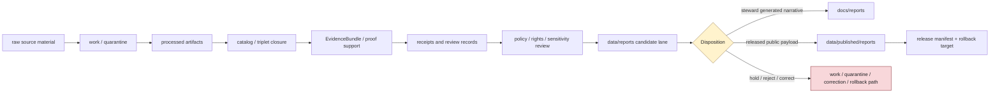

<!-- [KFM_META_BLOCK_V2]
doc_id: kfm://data/reports/readme
name: Reports README
path: data/reports/README.md
type: data-reports-parent-readme
version: v0.1.0
status: draft
owners:
  - <data-steward>
  - <reports-steward>
  - <domain-stewards>
  - <sensitivity-steward>
  - <rights-steward>
  - <evidence-steward>
  - <proof-steward>
  - <receipt-steward>
  - <catalog-steward>
  - <policy-steward>
  - <release-steward>
  - <docs-steward>
created: 2026-06-29
updated: 2026-06-29
policy_label: restricted-review
truth_posture: cite-or-abstain
responsibility_root: data/
artifact_family: report-candidate-and-report-support-parent-lane
path_posture: existing-greenfield-stub-replaced; data-readme-lists-reports; directory-rules-data-tree-lists-data-published-reports-not-data-reports; parent-contract-is-conservative-compatibility-report-candidate-contract; not-release-authority; not-public-report-authority; topology-needs-adr-or-directory-rules-resolution
sensitivity_posture: no-public-path-by-default; reports-are-downstream-carriers-not-truth; domain-sensitive-postures-inherit; no-raw-work-quarantine-internal-canonical-direct-model-or-direct-source-system-public-use; evidence-aware; rights-aware; policy-aware; release-blocked-until-gates-close
related:
  - ../README.md
  - ../raw/
  - ../work/
  - ../quarantine/
  - ../processed/
  - ../catalog/
  - ../triplets/
  - ../receipts/
  - ../proofs/
  - ../published/README.md
  - ../published/reports/README.md
  - ../../docs/reports/README.md
  - ../../docs/doctrine/directory-rules.md
  - ../../release/
  - ../../policy/
  - ../../contracts/
  - ../../schemas/
  - agriculture/README.md
  - archaeology/README.md
  - atmosphere/README.md
  - fauna/README.md
  - flora/README.md
  - geology/README.md
  - habitat/README.md
  - hazards/README.md
  - hydrology/README.md
  - people-dna-land/README.md
  - roads-rail-trade/README.md
  - settlements-infrastructure/README.md
  - soil/README.md
tags:
  - kfm
  - data
  - reports
  - report-candidate
  - report-support
  - parent-contract
  - compatibility-lane
  - downstream-carrier
  - not-root-truth
  - not-public-report-lane
  - not-release-authority
  - evidence-first
  - cite-or-abstain
  - proof
  - receipts
  - catalog
  - policy
  - release-gated
  - rollback
  - no-public-path
notes:
  - "This README replaces the greenfield stub at `data/reports/README.md`."
  - "`data/README.md` lists `reports` among data-root content, but Directory Rules v1.4 explicitly names released report payloads under `data/published/reports/`."
  - "This parent contract is therefore intentionally conservative: `data/reports/` is a compatibility, report-candidate, or report-support lane until Directory Rules, an ADR, or a migration decision resolves the topology."
  - "Reports here are downstream carriers. They do not replace source records, processed data, catalog records, triplets, EvidenceBundles, proofs, receipts, source descriptors, sensitivity decisions, policy decisions, release manifests, correction records, rollback records, or generated-answer receipts."
  - "Public clients must not read this lane. Public report payloads belong under `data/published/reports/` after governed release. Steward-facing generated narrative belongs under `docs/reports/`."
  - "Several child READMEs were authored while this parent was still a stub and may still say the parent is a greenfield stub. This parent README supersedes that parent-status note, but child status-note refresh remains a maintenance task."
[/KFM_META_BLOCK_V2] -->

<a id="top"></a>

# Reports

Parent contract for `data/reports/`, an existing **report-candidate and report-support compatibility lane** under the `data/` responsibility root.

<p>
  
  
  
  
  
  
  
</p>

**Quick links:** [Scope](#scope) · [Path posture](#path-posture) · [Repo fit](#repo-fit) · [Child report lanes](#child-report-lanes) · [Report boundary](#report-boundary) · [Accepted material](#accepted-material) · [Exclusions](#exclusions) · [Domain guardrails](#domain-guardrails) · [Report flow](#report-flow) · [Suggested directory shape](#suggested-directory-shape) · [Required checks](#required-checks-before-use) · [Status notes](#status-notes) · [Evidence ledger](#evidence-ledger)

> [!CAUTION]
> `data/reports/` is not a public report payload lane, not release authority, not proof, not receipt storage, not catalog closure, not source registry authority, not policy authority, not schema authority, not a direct API/UI source, and not root truth. Treat it as a bounded report-candidate/report-support compatibility lane until Directory Rules, an ADR, or a migration plan resolves whether this root should remain, migrate, or be narrowed.

---

## Scope

`data/reports/` may hold **unreleased report candidates**, report-support indexes, local preview-support material, and report-assembly sidecars that are derived from governed upstream artifacts but are not themselves canonical trust artifacts.

This lane is useful when a maintainer needs a data-root place to stage or inspect candidate report material before one of these governed outcomes:

- released public report payload under [`../published/reports/`](../published/reports/README.md);
- steward-facing generated narrative under [`../../docs/reports/`](../../docs/reports/README.md);
- catalog/proof/release-linked report artifact referenced by a governed review console;
- rejected, quarantined, corrected, superseded, withdrawn, stale-state, tombstoned, or rolled-back candidate.

A report candidate does **not** make a claim true. Consequential claims must resolve to source descriptors, processed data, catalog records, triplets where applicable, EvidenceBundles, proofs, receipts, review records, policy decisions, release state, correction paths, and rollback targets.

---

## Path posture

The existing parent lane is:

```text
data/reports/
```

Current placement evidence is intentionally mixed:

- [`../README.md`](../README.md) lists `reports` as a data-root content family.
- [`../../docs/doctrine/directory-rules.md`](../../docs/doctrine/directory-rules.md) names the lifecycle invariant and lists released report payloads under `data/published/reports/`, not `data/reports/`.
- [`../published/reports/README.md`](../published/reports/README.md) is the clearer released public report payload lane.
- [`../../docs/reports/README.md`](../../docs/reports/README.md) is the clearer steward-facing generated narrative lane.

Therefore this README treats `data/reports/` as **CONFIRMED path presence / NEEDS VERIFICATION topology**. This file defines a conservative local contract so existing child lanes do not drift into public or trust authority while the topology is unresolved.

Do **not** use this parent README to justify bypassing release gates. Publication is a governed transition, not a file move.

---

## Repo fit

| Responsibility | Correct home | Boundary |
|---|---|---|
| Report candidates and report-support bundles | `data/reports/` | Existing compatibility lane; topology still needs ADR, Directory Rules, or migration resolution. |
| Released public report payloads | [`../published/reports/`](../published/reports/README.md) | Release-approved payloads only. |
| Steward-facing generated narratives | [`../../docs/reports/`](../../docs/reports/README.md) | Generated narrative summaries; not data payloads or trust artifacts. |
| RAW source captures | [`../raw/`](../raw/) | Source-edge material only; never public clients. |
| WORK candidates and scratch | [`../work/`](../work/) | Working/candidate data; no public API/UI. |
| Held or failed material | [`../quarantine/`](../quarantine/) | Rights, sensitivity, validation, or schema holds. |
| Normalized data | [`../processed/`](../processed/) | Validated processed artifacts; not release by placement. |
| Catalog closure | [`../catalog/`](../catalog/) | STAC/DCAT/PROV/domain catalog closure; reports cite but do not replace. |
| Graph/triplet projections | [`../triplets/`](../triplets/) | Relationship projections; not canonical replacement semantics. |
| Process memory | [`../receipts/`](../receipts/) | Run, validation, transform, AI, review, policy, and release-support receipts. |
| Evidence support | [`../proofs/`](../proofs/) | EvidenceBundle, ProofPack, citation validation, integrity support. |
| Source/layer/dataset/right/sensitivity registries | [`../registry/`](../registry/) | Append-only registry/control state; not report narrative. |
| Release decisions | [`../../release/`](../../release/) | ReleaseManifest, PromotionDecision, CorrectionNotice, RollbackCard, WithdrawalNotice, signatures. |
| Contracts, schemas, policy | [`../../contracts/`](../../contracts/), [`../../schemas/`](../../schemas/), [`../../policy/`](../../policy/) | Meaning, machine shape, and allow/deny/restrict/abstain logic. |

---

## Child report lanes

The following child README files have been created or expanded as report-candidate/report-support lanes. Their presence does not prove report payloads, generators, validators, or releases exist.

| Child lane | Posture | High-risk boundary summary |
|---|---|---|
| [`agriculture/`](agriculture/README.md) | Existing candidate/support lane | Not yield truth, compliance proof, parcel/farm verification, pesticide advice, or public release. |
| [`archaeology/`](archaeology/README.md) | Existing candidate/support lane | Exact site geometry, burials, sacred sites, looting-risk, and culturally sensitive detail fail closed. |
| [`atmosphere/`](atmosphere/README.md) | Existing candidate/support lane | Not weather alerting, AQI/concentration authority, forecast authority, advisory authority, or life-safety guidance. |
| [`fauna/`](fauna/README.md) | Existing candidate/support lane | Sensitive species, nests, dens, roosts, hibernacula, spawning sites, telemetry, and private-land detail fail closed. |
| [`flora/`](flora/README.md) | Existing candidate/support lane | Rare/protected/culturally sensitive plant locations, specimen locality, collection-risk, and private-land detail fail closed. |
| [`geology/`](geology/README.md) | Existing candidate/support lane | Occurrence, deposit, estimate, permit, production, reserve, borehole, sample, and model records must not collapse. |
| [`habitat/`](habitat/README.md) | Existing candidate/support lane | Suitability is not occurrence; corridors are not confirmed movement; restoration opportunities are not prescriptions. |
| [`hazards/`](hazards/README.md) | Existing candidate/support lane | Not alerts, warnings, evacuation/routing/response guidance, official-source substitution, or life-safety guidance. |
| [`hydrology/`](hydrology/README.md) | Existing candidate/support lane | NFHL is regulatory context, not observed flooding; reports are not flood warnings or water-rights/engineering authority. |
| [`people-dna-land/`](people-dna-land/README.md) | Existing candidate/support lane | Living-person data, DNA/genomics, consent, revocation, person-parcel joins, current-owner detail, and title claims fail closed. |
| [`roads-rail-trade/`](roads-rail-trade/README.md) | Existing candidate/support lane | Not navigation, routing, dispatch, rail operations, legal access, right-of-way proof, or emergency routing. |
| [`settlements-infrastructure/`](settlements-infrastructure/README.md) | Existing candidate/support lane | Critical asset detail, condition/vulnerability, dependency graphs, operator data, and emergency/operations guidance fail closed. |
| [`soil/`](soil/README.md) | Existing candidate/support lane | Support types must stay separated; not field verification, conservation compliance, agronomic prescription, or parcel truth. |

> [!NOTE]
> Some child READMEs were authored before this parent README was expanded and may still contain a status note saying the parent was a greenfield stub. This parent README supersedes that parent-status note for the current repository state; refreshing child status notes is a follow-up documentation hygiene task.

---

## Report boundary

| Rule | Handling |
|---|---|
| Report is downstream | Reports summarize governed artifacts; they do not create source truth, evidence truth, release truth, or policy truth. |
| Candidate is not publication | A readable, rendered, or mapped file here is still unreleased unless a release decision says otherwise. |
| Evidence outranks language | EvidenceBundle, proof support, source descriptor, citation validation, and catalog closure outrank generated prose. |
| Proof remains separate | EvidenceBundle, ProofPack, citation validation, and integrity proof stay in `data/proofs/`. |
| Receipts remain separate | Run, validation, transform, redaction, aggregation, review, policy, model, AI, and release-support receipts stay in `data/receipts/`. |
| Catalog remains separate | STAC/DCAT/PROV/domain catalog records stay in `data/catalog/`. |
| Release remains separate | ReleaseManifest, PromotionDecision, CorrectionNotice, RollbackCard, WithdrawalNotice, signatures, and rollback targets stay in `release/`. |
| Policy remains separate | Sensitivity, rights, consent, source-role, stale-state, redaction, aggregation, and publication rules stay in `policy/`. |
| AI is not report truth | Generated report text must resolve to evidence or abstain and requires receipt/runtime-envelope support when used in governed flows. |
| Public clients do not read this lane | Public UI/API/report surfaces consume governed APIs, released artifacts, catalog/proof-backed responses, and policy-safe envelopes. |
| Sensitive domains inherit stricter policy | DNA/genomics, living-person, archaeology, rare species, infrastructure, cultural/sovereignty, burial/sacred, private property, and exact-location exposure fail closed unless release support proves otherwise. |

---

## Accepted material

Accepted material is limited to files that help review or assemble report candidates without replacing trust artifacts:

- unreleased report-candidate Markdown, HTML source, JSON metadata, or PDF-generation source;
- candidate indexes pointing to processed, catalog, proof, receipt, source registry, policy, release, and published artifacts;
- report-local evidence-reference draft indexes, citation draft indexes, caveat files, freshness/stale-state summaries, source-role summaries, rights summaries, and sensitivity summaries;
- preview-support material for steward review, clearly marked as unreleased;
- correction, supersession, stale-state, withdrawal, tombstone, or rollback notes that point to canonical release/proof records rather than replacing them;
- child README files that define domain-specific boundaries.

Accepted material must carry enough metadata to keep claims inspectable: source role, evidence references, release state, policy posture, sensitivity posture, rights posture, generated-by information where applicable, candidate status, and rollback/correction pointer where material.

---

## Exclusions

| Do not place here | Correct home | Why |
|---|---|---|
| RAW source captures, API dumps, source mirrors, uploads, scans, rasters, vectors, model files, logs, or raw report inputs | `../raw/` | Source-edge material requires source metadata, checksums, rights, and admission control. |
| WORK scratch, transform intermediates, unresolved candidates, failed validations, or unreviewed joins | `../work/` or `../quarantine/` | Unresolved material must stay upstream or held. |
| Normalized domain datasets | `../processed/` | Processed data is not report narrative. |
| Catalog, STAC, DCAT, PROV, graph/triplet records | `../catalog/`, `../triplets/` | Catalog and graph carriers have separate closure rules. |
| EvidenceBundle, ProofPack, CitationValidationReport, integrity bundles | `../proofs/` | Proof is the trust spine; reports cite it. |
| Receipts and review/process records | `../receipts/` | Receipts are process memory; reports summarize only. |
| Source descriptors, rights/sensitivity registries, layer/dataset registries | `../registry/` | Registry/control records belong in registry lanes. |
| Release manifests, promotion decisions, rollback cards, corrections, withdrawals, signatures | `../../release/` | Release decisions are not report candidates. |
| Released public report payloads | `../published/reports/` | Public payloads must be release-approved. |
| Steward-facing generated report narratives | `../../docs/reports/` | Generated human-readable reports belong in docs. |
| Contracts, schemas, policy rules, validators, tests, workflows, code | `../../contracts/`, `../../schemas/`, `../../policy/`, `../../tools/`, `../../tests/`, `.github/workflows/` | Separate authority roots. |
| Public UI/API material | Governed API/released artifact path | Public clients must not read candidate lanes directly. |
| Uncited generated claims | Governed answer/report generation flow with evidence, policy, receipts, and finite outcome | Generated language is evidence-subordinate. |

---

## Domain guardrails

Reports inherit the strictest applicable domain posture. The table below is a maintainer reminder, not a replacement for child README, policy, or release review.

| Domain class | Minimum guardrail |
|---|---|
| People / DNA / Land | Default deny for living-person fields, raw DNA/genomic material, consent-sensitive content, private person-parcel joins, current-owner exposure, and title-sensitive claims. |
| Archaeology and cultural sites | Default deny for exact site geometry, burials, sacred places, looting-risk detail, culturally sensitive knowledge, and community/sovereignty-controlled context. |
| Flora / Fauna / Habitat | Default deny for exact rare-species locations, sensitive habitat inference, nests/dens/roosts/hibernacula/spawning sites, telemetry, and collection-risk detail. |
| Infrastructure and settlements | Default deny for critical asset detail, condition/vulnerability, dependency graphs, operator-sensitive context, emergency readiness, and sensitive facility geometry. |
| Hazards / Hydrology / Atmosphere | Reports are not live alerts, warnings, emergency guidance, official-source replacements, or life-safety instructions. Freshness and stale-state must be visible. |
| Roads / Rail / Trade | Reports are not navigation, routing, rail-operation, dispatch, legal-access, right-of-way, or emergency-routing authority. |
| Soil / Agriculture / Geology | Reports are not field verification, compliance findings, agronomic prescriptions, reserve/resource certification, property/title proof, or engineering advice. |

---

## Report flow


```mermaid
flowchart LR
    RAW[raw source material] --> WORK[work / quarantine]
    WORK --> PROC[processed artifacts]
    PROC --> CAT[catalog / triplet closure]
    CAT --> PROOF[EvidenceBundle / proof support]
    PROOF --> RECEIPT[receipts and review records]
    RECEIPT --> POLICY[policy / rights / sensitivity review]
    POLICY --> CAND[data/reports candidate lane]
    CAND --> DECISION{Disposition}
    DECISION -- steward generated narrative --> DOCS[docs/reports]
    DECISION -- released public payload --> PUB[data/published/reports]
    DECISION -- hold / reject / correct --> HOLD[work / quarantine / correction / rollback path]
    PUB --> REL[release manifest + rollback target]

    classDef gate fill:#fff3cd,stroke:#8a6d3b,color:#202124;
    classDef hold fill:#f8d7da,stroke:#842029,color:#202124;
    class DECISION gate;
    class HOLD hold;
```

> [!NOTE]
> This flow is a responsibility map, not proof that all generators, validators, release manifests, CI checks, or report payloads currently exist.

---

## Suggested directory shape

This shape is **PROPOSED** and deliberately conservative. Do not pre-create empty stubs.

```text
data/reports/
├── README.md
├── <domain>/
│   ├── README.md
│   ├── candidates/                         # unreleased report candidates
│   │   └── <report_slug>/
│   │       ├── report.candidate.md
│   │       ├── report.inputs.index.json
│   │       ├── evidence_refs.candidate.json
│   │       ├── source_role_refs.candidate.json
│   │       ├── policy_refs.candidate.json
│   │       ├── release_refs.candidate.json
│   │       ├── citations.candidate.json
│   │       ├── caveats.candidate.md
│   │       └── README.md
│   ├── previews/                           # steward-only rendered previews
│   │   └── <report_slug>/
│   ├── indexes/                            # report-local candidate indexes
│   │   └── <domain>.report-candidates.index.json
│   ├── superseded/                         # retained candidates with lineage
│   │   └── README.md
│   └── withdrawn/                          # withdrawn, denied, or stale report candidates
│       └── README.md
└── indexes/                                # optional parent-level candidate indexes
    └── reports.index.json
```

If a candidate is promoted as a public report payload, the released payload belongs under `data/published/reports/` and the release decision belongs under `release/`. If a generator emits steward-facing narrative, the generated report belongs under `docs/reports/`.

---

## Required checks before use

- [ ] Confirm whether `data/reports/` remains a compatibility/candidate lane, becomes an accepted report-candidate lane, or should be migrated away.
- [ ] Confirm every child report candidate resolves consequential claims to catalog/proof/evidence or abstains.
- [ ] Confirm no file here stores canonical receipts, proofs, review records, release manifests, source descriptors, policy rules, schemas, source data, processed datasets, or public payloads.
- [ ] Confirm no public UI/API/report surface reads directly from this lane.
- [ ] Confirm every report candidate carries candidate status, source-role posture, evidence refs, citation posture, rights posture, sensitivity posture, policy posture, release posture, correction path, and rollback target where material.
- [ ] Confirm sensitive-domain material fails closed until redaction/generalization/aggregation/review/release support exists.
- [ ] Confirm generated or AI-assisted report text has evidence references, finite outcome, and AIReceipt/runtime-envelope support where applicable.
- [ ] Confirm published report payloads are promoted only through release governance to `data/published/reports/`.
- [ ] Confirm generated steward-facing narratives are emitted to `docs/reports/`, not kept as authoritative data artifacts here.
- [ ] Refresh child README status notes that still describe this parent as a greenfield stub.

---

## Status notes

| Item | Status | Notes |
|---|---:|---|
| Target path presence | CONFIRMED | This README replaces the greenfield stub at `data/reports/README.md`. |
| Data root reports mention | CONFIRMED | `data/README.md` lists `reports`, while the data root itself is marked `PROPOSED`. |
| Directory Rules data tree | CONFIRMED doctrine | Current Directory Rules list released report payloads under `data/published/reports/`; `data/reports/` topology remains unresolved. |
| Published reports lane | CONFIRMED README | `data/published/reports/README.md` exists and defines released report payload posture. |
| Docs reports lane | CONFIRMED README | `docs/reports/README.md` exists and defines steward-facing generated narrative posture. |
| Child report README files | CONFIRMED partial set | Domain child READMEs exist for the lanes listed in [Child report lanes](#child-report-lanes). |
| Actual report candidates | UNKNOWN | This README does not prove candidate payloads exist. |
| Released report payloads | UNKNOWN | This README does not prove public report payloads exist or are approved. |
| Generators, validators, and CI enforcement | NEEDS VERIFICATION | No report generator, validator, or workflow enforcement was proven by this edit. |
| Public release readiness | DENY until proven | Files here cannot publish claims by placement. |
| Child status-note drift | NEEDS REFRESH | Some child READMEs may still say this parent was a greenfield stub because they were authored before this update. |

---

## Migration and rollback posture

If a future ADR or Directory Rules update resolves `data/reports/`, use one of these governed outcomes:

| Outcome | Action | Rollback note |
|---|---|---|
| Keep as candidate lane | Add parent contract status, generator expectations, validators, CODEOWNERS, and child status-note refresh. | Revert contract change if it creates unintended authority. |
| Migrate to `docs/reports/` | Move steward-facing generated narratives out of `data/reports/`; leave redirects or migration notes. | Keep old candidate lineage and map old paths to new docs locations. |
| Migrate to `data/published/reports/` | Only move release-approved payloads with ReleaseManifest, digest, correction path, and rollback support. | Roll back aliases and release references, not just files. |
| Retire `data/reports/` | Replace child lanes with tombstone READMEs pointing to accepted lifecycle/docs/published homes. | Preserve old commit/path lineage and candidate disposition records. |

---

## Evidence ledger

| Source | Status | Supports | Limits |
|---|---|---|---|
| Previous target file | CONFIRMED | `data/reports/README.md` existed as a five-line greenfield stub. | Did not define lane boundaries. |
| [`../README.md`](../README.md) | CONFIRMED | `data/` root lists reports among data-root content. | The data root status is `PROPOSED`; this does not make `data/reports/` canonical. |
| [`../published/reports/README.md`](../published/reports/README.md) | CONFIRMED | Released report payload lane under `data/published/`; reports there are downstream carriers and not source/proof/receipt/release authority. | Does not create authority for `data/reports/`. |
| [`../../docs/reports/README.md`](../../docs/reports/README.md) | CONFIRMED | Steward-facing generated narrative lane; derivative reports must cite canonical anchors. | Docs reports are not public payloads or trust artifacts. |
| [`../../docs/doctrine/directory-rules.md`](../../docs/doctrine/directory-rules.md) | CONFIRMED doctrine | Data lifecycle invariant, published reports placement, compatibility-root warning, promotion as governed state transition. | `data/reports/` topology still needs ADR, Directory Rules, or migration resolution. |
| Child domain READMEs under `data/reports/*/README.md` | CONFIRMED partial set | Multiple domain child READMEs now define conservative report-candidate boundaries. | Child files may need status-note refresh after this parent update. |

[Back to top](#top)
