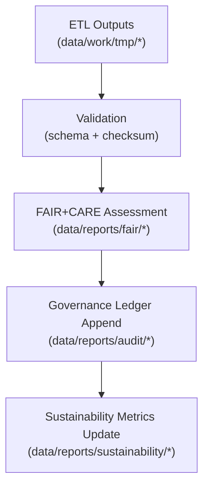

<div align="center">

# 📑 **Kansas Frontier Matrix — Reports & Governance Artifacts**  
`data/reports/README.md`

**Purpose**  
Define the **canonical audit & governance layer** for KFM v11 — including **validation reports, FAIR+CARE assessments, AI explainability logs, sustainability metrics, and provenance ledgers** — ensuring system-wide accountability, reproducibility, and ethical transparency.

[]() ·
[]() ·
[]() ·
[]() ·
[]()

</div>

---

## 📘 Overview

The **Reports Layer** is KFM’s **official audit trail and governance surface**.

All validations, ethics reviews, sustainability metrics, and AI explainability outputs are captured here as **append-only, provenance-rich artifacts**. This directory is the primary source for:

- FAIR+CARE certification evidence  
- Schema & checksum validation history  
- AI bias / interpretability reports (including Focus Mode v3)  
- Sustainability and energy/carbon telemetry summaries  
- Governance ledger entries & signatures  

### 🔁 v11 Enhancements

- Upgraded to **KFM-MDP v11.2.2** with extended metadata & governance semantics  
- **Focus Mode v3** explainability & risk-flag schemas integrated into AI reports  
- **DCAT 3.0 + PROV-O** alignment for all report categories  
- Unified telemetry bindings (energy Wh, gCO₂e, records_processed) per report set  
- Improved linkage between **data products ↔ reports ↔ governance decisions**

---

## 🗂️ Directory Layout (Emoji Style A)

```text
data/reports/
├── 📄 README.md
│
├── 📂 audit/                          # Governance + append-only provenance ledgers
│   ├── 📜 ai_climate_ledger.json
│   ├── 📜 ai_hazards_ledger.json
│   ├── 📜 ai_tabular_ledger.json
│   └── 📜 data_provenance_ledger.json
│
├── 📂 fair/                           # FAIR+CARE audit reports & ethics assessments
│   ├── 📊 data_care_assessment.json
│   ├── 📊 hazards_summary.json
│   ├── 📊 climate_summary.json
│   └── 📊 landcover_summary.json
│
├── 📂 self-validation/                # Automated self-validation outputs (per pipeline)
│   ├── ✅ work-climate-validation.json
│   ├── ✅ work-hazards-validation.json
│   ├── ✅ work-hydrology-validation.json
│   └── ✅ work-tabular-validation.json
│
├── 📂 validation/                     # Schema + checksum validation summaries
│   ├── 📑 schema_validation_summary.json
│   ├── 📑 checksum_registry.json
│   └── 📑 stac_validation_report.json
│
└── 📂 sustainability/                 # ISO 14064/50001 energy & carbon compliance
    ├── 🌱 energy_audit_summary.json
    ├── 🌍 carbon_metrics.json
    └── ⚡ renewable_usage_report.json
```

---

## 🧩 Example Governance Record (v11 · PROV-O + DCAT Aligned)

```json
{
  "ledger_id": "governance_record_2025Q4_001",
  "kind": "dataset_validation",
  "dataset_id": "processed_hazards_v11.0.0",
  "dcat:dataset": "urn:kfm:data:processed:hazards:v11",
  "validated_by": "@kfm-governance",
  "fairstatus": "certified",
  "checksum_verified": true,
  "prov:wasAssociatedWith": "@kfm-governance-bot",
  "prov:generatedAtTime": "2025-11-19T22:50:00Z",
  "ledger_signature": "pgp-sha256:49af2c1b89d6e3f9a7f2b4c5d8e1a9f3b5c7d1e6",
  "blockchain_hash": "0x8a3f9bde29f415f0...",
  "telemetry": {
    "records_processed": 98213,
    "energy_wh": 12.4,
    "carbon_gco2e": 16.9
  }
}
```

---

## ⚙️ Report Categories

| Category              | Description                                   | Typical Outputs                               | Cadence    |
|-----------------------|-----------------------------------------------|-----------------------------------------------|------------|
| **Audit**             | Governance & provenance ledger entries        | `audit/*_ledger.json`                         | Continuous |
| **FAIR+CARE**         | Ethics, accessibility & reuse assessments     | `fair/*_summary.json`                         | Quarterly  |
| **Validation**        | Schema, checksum & integrity verification     | `validation/*.json`, `self-validation/*.json` | Continuous |
| **AI Explainability** | Model interpretability & bias logs (Focus v3) | `audit/ai_*_ledger.json`, explainer outputs   | Quarterly  |
| **Sustainability**    | ISO 14064/50001 energy & carbon metrics       | `sustainability/*.json`                       | Biannual   |

---

## 🧠 FAIR+CARE Governance Alignment

| Principle                | Implementation                                                            | Oversight            |
|--------------------------|---------------------------------------------------------------------------|----------------------|
| **Findable**             | Reports indexed as DCAT datasets & JSON-LD ledger records                | `@kfm-data`          |
| **Accessible**           | Open JSON/JSON-LD content w/ signatures & provenance                     | `@kfm-accessibility` |
| **Interoperable**        | DCAT 3.0 + PROV-O + ISO 19115 mapping                                    | `@kfm-architecture`  |
| **Reusable**             | Clear rights, lineage, and ethics metadata                               | `@kfm-design`        |
| **Collective Benefit**   | Governance outputs support community trust & transparency                | `@faircare-council`  |
| **Authority to Control** | Council-owned ledgers & signatures                                       | `@kfm-governance`    |
| **Responsibility**       | Logs tie decisions to accountable actors                                 | `@kfm-security`      |
| **Ethics**               | Ethics assessments documented in FAIR reports                            | `@kfm-ethics`        |

Key governance artifacts:

```text
data/reports/fair/data_care_assessment.json
data/reports/audit/data_provenance_ledger.json
```

---

## 🔁 Validation & Publication Workflow



1. **Validation** — Schema and checksum checks (JSON Schema, SHACL, contracts).  
2. **FAIR+CARE Assessment** — Ethics & governance evaluation; may trigger masking or restrictions.  
3. **Governance Ledger** — Append-only, signed JSON logs describing the decision.  
4. **Sustainability** — Energetic and carbon reporting linked to the validation run.

---

## 🌱 Sustainability Metrics (Example v11 Snapshot)

| Metric                     | Value    | Verified By           |
|----------------------------|---------:|-----------------------|
| Energy per Audit Cycle     | 17.9 Wh  | `@kfm-sustainability` |
| Carbon Output              | 23.2 gCO₂e | `@kfm-security`     |
| Renewable Power Share      | 100%     | `@kfm-infrastructure` |
| FAIR+CARE Governance Score | 100%     | `@faircare-council`   |

Telemetry source for these metrics:

```text
../../releases/v11.2.2/focus-telemetry.json
```

---

## 🧾 Internal Use Citation (v11)

```text
Kansas Frontier Matrix (2025). Reports & Governance Artifacts (v11.0.0).
Centralized repository of FAIR+CARE audits, validation reports, AI explainability logs,
sustainability metrics, and append-only governance ledgers, ensuring transparent,
reproducible, and ethically governed operation of all KFM data and AI workflows.
```

---

## 🕰 Version History

| Version | Date       | Summary                                                                                                                  |
|--------:|-----------:|--------------------------------------------------------------------------------------------------------------------------|
| v11.2.2 | 2025-11-27 | Updated to KFM-MDP v11.2.2; emoji directory layout applied; metadata & governance fields standardized; footer aligned.   |
| v11.0.0 | 2025-11-19 | Upgraded to KFM-MDP v11.0; DCAT 3.0 + PROV-O alignment; Focus Mode v3 explainability schema; unified telemetry v3.      |
| v10.2.2 | 2025-11-12 | Telemetry v2 bindings, streaming STAC references, Focus v2.1 explainability schema.                                     |
| v10.0.0 | 2025-11-09 | Initial reports layer with FAIR+CARE, validation, and sustainability structure.                                         |

---

<div align="center">

© 2025 Kansas Frontier Matrix — CC-BY 4.0 / FAIR+CARE Certified  
[⬅️ Back to Data Root](../README.md) · [📐 Data Architecture](../ARCHITECTURE.md) · [🛡️ Governance Charter](../../docs/standards/governance/ROOT-GOVERNANCE.md)

</div>