<div align="center">

# 📑 `data/reports/` — KFM Data Reports (Evidence Outputs)


**A governed home for optional analysis outputs** (PDF/MD/HTML/figures/tables/export bundles) **derived from KFM datasets** — when those outputs need to be reviewed, shared, cited, or shipped. 🧭

</div>

> [!IMPORTANT]
> **Reports do not bypass the pipeline.**  
> Canonical ordering (non‑negotiable): **ETL → STAC/DCAT/PROV → Graph → API → UI → Story Nodes → Focus Mode**.  
> If a report becomes **public-facing** or **decision-significant**, it must be made **discoverable + traceable** through the catalogs (STAC/DCAT/PROV) and served via the contracted API boundary (never UI → Neo4j direct). 🔐🧾

---

## ⚡ Quick links

- 🧪 Certified datasets (inputs should come from here) → [`../processed/`](../processed/)
- 📥 Raw + work staging (where transformations live) → [`../raw/`](../raw/) · [`../work/`](../work/)
- 🛰️ STAC (asset indexing) → [`../stac/collections/`](../stac/collections/) · [`../stac/items/`](../stac/items/)
- 🗂️ DCAT (dataset discoverability) → [`../catalog/dcat/`](../catalog/dcat/)
- 🧬 PROV (lineage bundles) → [`../prov/`](../prov/)
- 🧼 QA outputs (if you split QA vs reports) → [`../qa/`](../qa/) *(if present)*
- 🎬 Story Nodes (narrative, not data) → [`../../docs/reports/story_nodes/`](../../docs/reports/story_nodes/) *(if present)*
- 🔐 Security reporting → [`../../SECURITY.md`](../../SECURITY.md) *(or `../../.github/SECURITY.md` if that’s your canonical location)*

---

<details>
<summary><strong>📌 Table of contents</strong></summary>

- [What this folder is](#-what-this-folder-is)
- [What belongs here (and what does not)](#-what-belongs-here-and-what-does-not)
- [Report taxonomy](#-report-taxonomy)
- [Where reports fit in the KFM pipeline](#-where-reports-fit-in-the-kfm-pipeline)
- [“Where should I put this?” decision guide](#-where-should-i-put-this-decision-guide)
- [Directory layout](#️-directory-layout)
- [Report bundle contract (minimum required)](#-report-bundle-contract-minimum-required)
- [Traceability rules (STAC ↔ DCAT ↔ PROV ↔ Graph)](#-traceability-rules-stac--dcat--prov--graph)
- [Reproducibility & scientific integrity](#-reproducibility--scientific-integrity)
- [Security, privacy & sensitive-location handling](#-security-privacy--sensitive-location-handling)
- [Validation & CI/CD expectations](#-validation--cicd-expectations)
- [Reference shelf (project library)](#-reference-shelf-project-library)
- [Version history](#-version-history)
- [Footer refs](#-footer-refs)

</details>

---

## 🧭 What this folder is

`data/reports/` is the canonical place for **reviewable, shareable outputs** derived from KFM data — **when the output is not itself the canonical dataset**.

Reports are typically:
- 📊 *summaries* (EDA, trends, comparisons, diagnostics)
- 🧠 *model artifacts* (metrics, calibration, residual plots, posterior summaries)
- 🧪 *simulation outputs* (verification/validation notes, sensitivity analyses, uncertainty runs)
- 🧼 *validation outputs* (schema checks, geometry validity summaries, link checks, QA diffs)
- 📦 *export bundles* (what a reviewer needs to audit a dataset change)

> [!NOTE]
> This folder is **optional**. If your repo doesn’t use `data/reports/`, that’s okay.  
> But if it exists, it must remain **governed**: reproducible, provenance-linked, and classification-aware.

---

## ✅ What belongs here (and what does not)

| ✅ Put it in `data/reports/` when… | 🚫 Don’t put it here when… |
|---|---|
| You created a PDF/MD/HTML report with charts/tables meant for review or citation | The output is a **final dataset** meant for downstream computation (→ `data/processed/`) |
| You exported figures/tables that summarize a certified dataset | You’re storing raw downloads or “as received” archives (→ `data/raw/`) |
| You generated a validation/QA summary that needs to be kept long-term | It’s an intermediate transform / scratch join (→ `data/work/`) |
| You produced a release candidate bundle for maintainers | You’re writing narrative Story content (→ `docs/reports/story_nodes/`) |
| The report is referenced by a Story Node (and you can link it to evidence IDs) | It contains secrets/PII/restricted coordinates without protection (→ stop + follow governance/security) |

---

## 🧩 Report taxonomy

Use this taxonomy to keep “report intent” consistent:

| Type | Examples | Typical audience | Traceability requirement |
|---|---|---|---|
| 🧼 QA / validation | schema compliance, geometry validity, link checks, catalog QA diffs | maintainers + reviewers | **Required** if used to approve/publish |
| 📈 EDA / analytics | distributions, time-series charts, anomaly summaries | analysts + contributors | Required if cited in Story/UI |
| 🧠 Modeling | regression diagnostics, Bayesian posterior plots, drift checks | analysts + maintainers | **Required** (STAC/DCAT/PROV pointers) |
| 🧪 Simulation & V&V | verification notes, sensitivity runs, UQ summaries | analysts + domain stewards | **Required** for decision-significant outputs |
| 🗺️ Cartographic exports | map sheets, legend comps, print layouts, thumbnails | UI/story maintainers | Required if shipped |
| 📦 Release evidence bundles | “what changed / why / impact” with links | maintainers | **Required** for releases |

---

## 🧱 Where reports fit in the KFM pipeline

```mermaid
flowchart LR
  ETL["🧰 ETL / Pipelines"] --> CAT["🗂️ Catalogs (STAC • DCAT • PROV)"]
  CAT --> GRAPH["🕸️ Graph (Neo4j)"]
  GRAPH --> API["🔌 API Boundary"]
  API --> UI["🖥️ UI (Map / Timeline)"]
  UI --> STORY["🎬 Story Nodes"]
  STORY --> FOCUS["🧠 Focus Mode"]

  REP["📑 data/reports/ (optional)"] -. "references evidence IDs" .-> CAT
  REP -. "can be cited by" .-> STORY
```



**Interpretation:** reports are *downstream artifacts* that should point back to the canonical evidence chain (catalogs + provenance). They should not become “shadow datasets.”

---

## 🧭 “Where should I put this?” decision guide


---

## 🗂️ Directory layout

> [!TIP]
> Keep bundles **small + reviewable**. For large binaries, use pointers + checksums + external storage (DVC/LFS/release assets), but keep the manifest and README in Git.

```text
📁 data/
└── 📁 reports/
    ├── 📄 README.md                     👈 you are here
    ├── 📁 <domain>/
    │   ├── 📄 README.md                 (recommended domain index)
    │   └── 📁 <YYYY-MM-DD>__<slug>__v<semver>/
    │       ├── 📄 README.md             ✅ required (bundle “report card”)
    │       ├── 📄 report.md             (optional)
    │       ├── 📄 report.pdf            (optional)
    │       ├── 📄 REPORT_MANIFEST.json  ✅ recommended (machine-readable)
    │       ├── 📄 checksums.sha256      ✅ recommended
    │       ├── 📁 assets/               (figures, maps, thumbnails)
    │       ├── 📁 tables/               (csv/parquet extracts)
    │       ├── 📁 notebooks/            (ipynb / qmd / rmd)
    │       └── 📁 refs/                 ✅ recommended (evidence pointers)
    │           ├── 📄 stac_refs.txt
    │           ├── 📄 dcat_refs.txt
    │           └── 📄 prov_refs.txt
    └── 📁 _shared/                      (optional; avoid unless truly cross-domain)
        └── 📄 README.md
```

---

## 🧾 Report bundle contract (minimum required)

Every report bundle should be auditable like a dataset drop: **human context + machine pointers + integrity**.

| Artifact | Required | Why | Minimum “good enough” |
|---|---:|---|---|
| `README.md` | ✅ | Human-friendly “report card” | summary, scope, inputs, outputs, caveats, how to reproduce |
| `REPORT_MANIFEST.json` | ⭐ recommended | Machine-readable linkage | evidence IDs (STAC/DCAT), PROV activity IDs, file list, checksums |
| `checksums.sha256` | ⭐ recommended | Tamper-evidence + portability | sha256 for report outputs (and any included tables/figures) |
| `refs/*.txt` | ⭐ recommended | Evidence pointers (no “orphan facts”) | list of IDs/paths to STAC/DCAT/PROV items used |

> [!IMPORTANT]
> If the report is referenced by a Story Node, a UI feature, or a release note: **the evidence pointers become mandatory**.

---

## 🔗 Traceability rules (STAC ↔ DCAT ↔ PROV ↔ Graph)

### ✅ Golden rule: pointers > copies 🧷
- Reports should **reference** certified datasets via stable IDs (STAC/DCAT) and lineage via PROV.
- Avoid duplicating big datasets in report bundles (unless it’s a tiny review extract).

### ✅ Minimum pointer set (recommended)
A report bundle should be able to answer:

1) **What inputs?** → STAC/DCAT IDs  
2) **How generated?** → PROV activity ID (plus run config/commit where possible)  
3) **What outputs?** → files in this bundle + checksums  
4) **Can we reproduce?** → commands or notebook + pinned environment

### 🧩 `REPORT_MANIFEST.json` starter (copy/paste)

```json
{
  "report_id": "kfm.report.<domain>.<slug>.v1.0.0",
  "title": "Human-readable report title",
  "domain": "<domain>",
  "created": "2026-01-08",
  "classification": "public|internal|confidential|restricted",
  "summary": "1–3 sentences explaining why this report exists.",

  "evidence": {
    "stac": ["kfm.ks.<...>.v1", "path:data/stac/items/<...>.json"],
    "dcat": ["path:data/catalog/dcat/<...>.jsonld"],
    "prov": ["path:data/prov/<...>.jsonld"]
  },

  "methods": {
    "type": ["eda|regression|bayesian|simulation|qa|cartography"],
    "tools": ["python", "r", "qgis", "gee", "postgis"],
    "notes": "Keep it short; point to README for narrative."
  },

  "repro": {
    "commit_sha": "TBD",
    "entrypoint": "notebooks/report.ipynb",
    "seeds": [42],
    "environment": {
      "python": "3.12",
      "notes": "Pin deps via lockfiles where possible."
    }
  },

  "outputs": [
    { "path": "report.pdf", "media_type": "application/pdf", "sha256": "TBD" },
    { "path": "assets/figure-01.png", "media_type": "image/png", "sha256": "TBD" }
  ]
}
```

### 🌐 If a report becomes a “shipped evidence asset”
Choose one pattern (repo-specific):

- **Pattern A:** add report files as **STAC Assets** on an existing STAC Item (best when the report documents a specific dataset version).
- **Pattern B:** create a dedicated STAC Item where the primary assets are the report files (best when the report is its own standalone evidence product).

Either way:
- add (or update) a DCAT distribution for discoverability
- ensure PROV links “inputs → activity → report outputs”

---

## 🧪 Reproducibility & scientific integrity

Reports are where “it looked right on my machine” goes to die ☠️ — unless we keep them reproducible.

### ✅ Baseline integrity checklist
- [ ] Inputs are **certified** (prefer `data/processed/<domain>/` + evidence IDs)
- [ ] Any sampling is explained (filters, time windows, inclusion criteria)
- [ ] Any modeling includes uncertainty/diagnostics (not just point estimates)
- [ ] Any simulation includes V&V notes and sensitivity where appropriate
- [ ] Outputs are checksummed and versioned
- [ ] Narrative conclusions clearly separate **facts vs interpretation**
- [ ] If AI-assisted: clearly label assistance + point to evidence IDs (no unsourced claims)

### 📈 Recommended “report card” headings (`README.md` inside each bundle)
```text
# Report title
## Why this report exists (intent)
## Inputs (STAC/DCAT IDs)
## Methods (tools, parameters, assumptions)
## Outputs (files + checksums)
## Findings (with links to figures/tables)
## Uncertainty / limitations
## Sensitivity / governance notes
## How to reproduce (commands + env)
```

---

## 🔐 Security, privacy & sensitive-location handling

Reports can leak sensitive information even if the underlying dataset is protected (e.g., aggregation + joins can re-identify a location). Treat this as a first-class risk. 🧨

### Hard rules
- 🚫 Do not store secrets, tokens, credentials, private keys
- 🚫 Do not publish restricted coordinates or culturally sensitive locations without explicit review
- ✅ Preserve (or increase) classification — never “downgrade” sensitivity through reporting
- ✅ When in doubt: generalize (coarse bbox), redact, or keep internal

> [!IMPORTANT]
> If a report involves security-sensitive findings, follow the repo’s coordinated disclosure process (`SECURITY.md`) and do **not** open public issues with exploit details.

---

## 🧪 Validation & CI/CD expectations

### Recommended CI behavior
- **If a report is referenced by Story Nodes / UI / release notes:** validate it (pointers exist, links resolve, checksums present).
- **If a report is purely internal and not referenced:** treat it as optional (but keep the bundle contract).

### Suggested automated checks (fast gates)
- [ ] Markdown lint / front-matter sanity (if used)
- [ ] `REPORT_MANIFEST.json` schema validation *(if you add a schema)*
- [ ] Evidence pointer validation:
  - STAC/DCAT IDs exist (or paths resolve)
  - PROV activity referenced exists
- [ ] Basic link checks for internal relative links
- [ ] No secrets / PII patterns in committed artifacts (defense-in-depth)

> [!TIP]
> CI artifacts (Actions uploaded files) are great for ephemeral outputs.  
> Commit to `data/reports/` when the report must be reviewable long-term and referenced by IDs.

---

## 📚 Reference shelf (project library)

`data/reports/` is influenced by the repo’s multidisciplinary library — especially around **statistical hygiene**, **simulation discipline**, **GIS rigor**, **systems scaling**, **security**, and **human-centered governance**.

<details>
<summary><strong>📖 Full reference list (grouped)</strong></summary>

### 🧭 Core KFM specs
- `docs/specs/Kansas Frontier Matrix (KFM) – Comprehensive Technical Documentation.docx`
- `docs/specs/MARKDOWN_GUIDE_v13.md` *(or equivalent master work protocol)*
- `docs/specs/Kansas-Frontier-Matrix Design Audit – Gaps and Enhancement Opportunities.pdf` *(if present)*

### 🛰️ Remote sensing + geospatial analytics
- `Cloud-Based Remote Sensing with Google Earth Engine-Fundamentals and Applications.pdf`
- `python-geospatial-analysis-cookbook.pdf`
- `PostgreSQL Notes for Professionals - PostgreSQLNotesForProfessionals.pdf`

### 🎨 Cartography + mapping practice
- `making-maps-a-visual-guide-to-map-design-for-gis.pdf`
- `Mobile Mapping_ Space, Cartography and the Digital - 9789048535217.pdf`
- `compressed-image-file-formats-jpeg-png-gif-xbm-bmp.pdf`

### 🌐 Web + visualization (reports often ship to the UI)
- `responsive-web-design-with-html5-and-css3.pdf`
- `webgl-programming-guide-interactive-3d-graphics-programming-with-webgl.pdf`

### 📈 Statistics, experiments, inference (report integrity)
- `Understanding Statistics & Experimental Design.pdf`
- `graphical-data-analysis-with-r.pdf`
- `regression-analysis-with-python.pdf`
- `Regression analysis using Python - slides-linear-regression.pdf`
- `think-bayes-bayesian-statistics-in-python.pdf`

### 🧪 Simulation & modeling discipline (V&V, UQ, sensitivity)
- `Scientific Modeling and Simulation_ A Comprehensive NASA-Grade Guide.pdf`

### 🧠 ML practice (when reports include model outputs)
- `Deep Learning for Coders with fastai and PyTorch - Deep.Learning.for.Coders.with.fastai.and.PyTorchpdf`

### ⚙️ Systems + scaling (when reports include performance/infra diagnostics)
- `Scalable Data Management for Future Hardware.pdf`
- `concurrent-real-time-and-distributed-programming-in-java-threads-rtsj-and-rmi.pdf`
- `Data Spaces.pdf`

### 🧠 Advanced math + optimization (specialized analytic reports)
- `Spectral Geometry of Graphs.pdf`
- `Generalized Topology Optimization for Structural Design.pdf`

### ❤️ Ethics + accountability (when reports carry real-world implications)
- `Introduction to Digital Humanism.pdf`
- `Principles of Biological Autonomy - book_9780262381833.pdf`
- `On the path to AI Law’s prophecies and the conceptual foundations of the machine learning age.pdf`

### 🛡️ Security (defensive mindset; do not contribute misuse-ready content)
- `ethical-hacking-and-countermeasures-secure-network-infrastructures.pdf`
- `Gray Hat Python - Python Programming for Hackers and Reverse Engineers (2009).pdf`

### 🧰 General programming shelf (bundles)
- `A programming Books.pdf`
- `B-C programming Books.pdf`
- `D-E programming Books.pdf`
- `F-H programming Books.pdf`
- `I-L programming Books.pdf`
- `M-N programming Books.pdf`
- `O-R programming Books.pdf`
- `S-T programming Books.pdf`
- `U-X programming Books.pdf`

</details>

---

## 🕰️ Version history

| Version | Date | Change | Author |
|---|---|---|---|
| v1.0.0 | 2025-12-26 | Initial `data/reports/` README scaffold | TBD |
| v1.1.0 | 2026-01-08 | Align to v13 pipeline + evidence-first report bundles, add manifest + traceability rules | TBD |

---

## 🧷 Footer refs

- Canonical ordering + invariants: `docs/specs/MARKDOWN_GUIDE_v13.md`
- System design: `docs/specs/Kansas Frontier Matrix (KFM) – Comprehensive Technical Documentation.docx`
- Governance: `docs/governance/ROOT_GOVERNANCE.md`
- Ethics: `docs/governance/ETHICS.md`
- Sovereignty: `docs/governance/SOVEREIGNTY.md`
- Data lifecycle: `data/raw/` · `data/work/` · `data/processed/`
- Catalogs + lineage: `data/stac/` · `data/catalog/dcat/` · `data/prov/`
- Story Nodes: `docs/reports/story_nodes/` *(if present)*

<p align="right"><a href="#-datareports--kfm-data-reports-evidence-outputs">⬆️ Back to top</a></p>