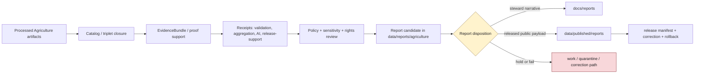

<!-- [KFM_META_BLOCK_V2]
doc_id: kfm://data/reports/agriculture/readme
name: Agriculture Reports README
path: data/reports/agriculture/README.md
type: data-reports-agriculture-readme
version: v0.1.0
status: draft
owners:
  - <data-steward>
  - <reports-steward>
  - <agriculture-domain-steward>
  - <evidence-steward>
  - <proof-steward>
  - <receipt-steward>
  - <catalog-steward>
  - <policy-steward>
  - <release-steward>
  - <docs-steward>
created: 2026-06-29
updated: 2026-06-29
policy_label: restricted-review
truth_posture: cite-or-abstain
responsibility_root: data/
domain: agriculture
artifact_family: report-candidate-and-report-support-lane
path_posture: existing-greenfield-stub-replaced; parent-data-reports-readme-is-greenfield-stub; data-readme-lists-reports; directory-rules-data-tree-lists-data-published-reports-not-data-reports; compatibility-or-steward-facing-report-candidate-lane-until-parent-contract-or-adr-resolves
sensitivity_posture: no-public-path-by-default; report-is-downstream-carrier-not-truth; private-field-operator-parcel-yield-pesticide-proprietary-joins-fail-closed; aggregation-receipt-load-bearing; nass-suppression-aware; source-role-preserving; evidence-aware; rights-aware; policy-aware; release-blocked-until-gates-close
related:
  - ../README.md
  - ../../README.md
  - ../../processed/agriculture/README.md
  - ../../catalog/domain/agriculture/README.md
  - ../../receipts/agriculture/README.md
  - ../../proofs/
  - ../../registry/sources/agriculture/
  - ../../published/README.md
  - ../../published/reports/README.md
  - ../../published/layers/agriculture/README.md
  - ../../../docs/reports/README.md
  - ../../../docs/dashboards/domain/agriculture.md
  - ../../../docs/domains/agriculture/CANONICAL_PATHS.md
  - ../../../docs/domains/agriculture/DATA_LIFECYCLE.md
  - ../../../docs/domains/agriculture/PIPELINE.md
  - ../../../docs/domains/agriculture/OBJECTS.md
  - ../../../docs/domains/agriculture/sublanes/cropland.md
  - ../../../docs/doctrine/directory-rules.md
  - ../../../contracts/domains/agriculture/
  - ../../../schemas/contracts/v1/domains/agriculture/
  - ../../../policy/domains/agriculture/
  - ../../../release/
tags:
  - kfm
  - data
  - reports
  - agriculture
  - report-candidate
  - report-support
  - generated-report
  - downstream-carrier
  - evidence-first
  - cite-or-abstain
  - aggregation-receipt
  - nass-suppression
  - private-join-denial
  - source-role
  - proof
  - receipts
  - catalog
  - release-gated
  - rollback
  - no-public-path
notes:
  - "This README replaces the greenfield stub at `data/reports/agriculture/README.md`."
  - "The parent `data/reports/README.md` is currently a greenfield stub, so this file is self-bounding and intentionally conservative."
  - "Directory Rules v1.4 lists released report payloads under `data/published/reports/`; this existing `data/reports/agriculture/` lane is therefore treated as compatibility, report-candidate, or steward-facing report-support material until parent contract or ADR review resolves the lane."
  - "Agriculture reports are downstream carriers. They do not replace source records, processed data, catalog records, EvidenceBundles, proofs, receipts, policy decisions, review records, release manifests, correction records, rollback records, or generated-answer receipts."
[/KFM_META_BLOCK_V2] -->

<a id="top"></a>

# Agriculture Reports

Report-candidate and report-support lane for Agriculture-domain generated report material that is not yet a released public report payload.

<p>
  
  
  
  
  
  
  
</p>

**Quick links:** [Scope](#scope) · [Path posture](#path-posture) · [Repo fit](#repo-fit) · [Report boundary](#report-boundary) · [Accepted material](#accepted-material) · [Exclusions](#exclusions) · [Agriculture report guardrails](#agriculture-report-guardrails) · [Report flow](#report-flow) · [Suggested directory shape](#suggested-directory-shape) · [Required checks](#required-checks-before-use) · [Status notes](#status-notes)

> [!CAUTION]
> `data/reports/agriculture/` is not Agriculture truth, not a public report lane, not proof, not receipt storage, not catalog closure, not release authority, not policy authority, not schema authority, not source registry authority, and not a direct public API/UI source. Treat it as an existing report-candidate or report-support lane until `data/reports/` receives an accepted parent contract or migration decision.

---

## Scope

`data/reports/agriculture/` may hold Agriculture-domain report candidates, generated report-support bundles, report-local indexes, preview summaries, and report assembly sidecars that are derived from governed upstream artifacts but are **not** themselves canonical trust artifacts.

This lane is useful only when a maintainer needs a data-root place to stage, inspect, or assemble Agriculture report material before one of the following governed outcomes:

- a released public report payload under `data/published/reports/`;
- a generated steward-facing narrative under `docs/reports/`;
- a catalog/proof/release-linked report artifact referenced by a governed API or review console;
- a rejected, quarantined, corrected, superseded, withdrawn, or rolled-back report candidate.

Agriculture report material may summarize crop observations, crop rotations, county or regional crop progress, stress indicators, irrigation context, conservation-practice context, agricultural economy observations, supply-chain context, soil-crop suitability, aggregation posture, suppression posture, validation posture, proof posture, catalog posture, release posture, correction posture, and rollback posture.

A report candidate does **not** make a crop, field, operator, yield, parcel, pesticide, irrigation, conservation-practice, suitability, stress, economy, or supply-chain claim true. Consequential claims must remain supported by source descriptors, processed data, catalog records, EvidenceBundles, receipts, policy decisions, release state, correction paths, and rollback targets.

---

## Path posture

The existing target lane is:

```text
data/reports/agriculture/
```

The parent currently exists as a greenfield stub:

```text
data/reports/README.md
```

Current placement evidence is mixed:

- `data/README.md` lists `reports` as content that may belong under `data/`.
- `docs/doctrine/directory-rules.md` lists canonical data lifecycle and emitted-proof families, including `data/published/reports/`, but does not establish `data/reports/` as a lifecycle phase in the same way as `raw`, `work`, `quarantine`, `processed`, `catalog`, `triplets`, `published`, `receipts`, `proofs`, `rollback`, and `registry`.
- `data/published/reports/README.md` is the clearer released public report payload lane.
- `docs/reports/README.md` is the clearer generated steward-facing narrative lane.

Therefore this README treats `data/reports/agriculture/` as **CONFIRMED path presence / NEEDS VERIFICATION topology**. Do not let this lane become a parallel report authority. If an ADR or parent README later makes `data/reports/` canonical, update this README and migrate child conventions with a rollback plan. If `data/reports/` is retired, migrate report candidates to the correct lifecycle, docs, or published lane.

---

## Repo fit

| Responsibility | Correct home | Boundary |
|---|---|---|
| Agriculture report candidates and report-support bundles | `data/reports/agriculture/` | Existing compatibility/steward-facing candidate lane until topology is resolved. |
| Parent reports lane | [`../README.md`](../README.md) | Currently greenfield; does not yet define a full report-family contract. |
| Data root | [`../../README.md`](../../README.md) | Lifecycle data and emitted proof root; reports listed but parent contract remains thin. |
| Processed Agriculture artifacts | [`../../processed/agriculture/README.md`](../../processed/agriculture/README.md) | Normalized Agriculture data upstream of catalog/report/public products. |
| Agriculture domain catalog | [`../../catalog/domain/agriculture/README.md`](../../catalog/domain/agriculture/README.md) | Catalog closure and release-linked discovery records; not report narrative. |
| Agriculture receipts | [`../../receipts/agriculture/README.md`](../../receipts/agriculture/README.md) | Process memory; reports may summarize receipts but must not store or replace them. |
| Proof and EvidenceBundle authority | `../../proofs/` | Evidence support and citation validation; reports cite these, not replace them. |
| Released public report payloads | [`../../published/reports/README.md`](../../published/reports/README.md) | Release-approved report payloads only. |
| Released Agriculture map carriers | [`../../published/layers/agriculture/README.md`](../../published/layers/agriculture/README.md) | Published map layer carriers; reports may reference them after release. |
| Steward-facing generated narratives | [`../../../docs/reports/README.md`](../../../docs/reports/README.md) | Human-readable generated review/release reports; not data payloads. |
| Agriculture lifecycle doctrine | [`../../../docs/domains/agriculture/DATA_LIFECYCLE.md`](../../../docs/domains/agriculture/DATA_LIFECYCLE.md) | Phase obligations, receipts, aggregation, and sensitivity gates. |
| Agriculture placement doctrine | [`../../../docs/domains/agriculture/CANONICAL_PATHS.md`](../../../docs/domains/agriculture/CANONICAL_PATHS.md) | Domain segment placement; path claims still need repo verification. |
| Dashboard specification | [`../../../docs/dashboards/domain/agriculture.md`](../../../docs/dashboards/domain/agriculture.md) | Governance-health dashboard specification, not report payload storage. |
| Release decisions | `../../../release/` | ReleaseManifest, PromotionDecision, correction, rollback, withdrawal, and signatures. |
| Contracts, schemas, policy | `../../../contracts/domains/agriculture/`, `../../../schemas/contracts/v1/domains/agriculture/`, `../../../policy/domains/agriculture/` | Meaning, machine shape, and allow/deny/restrict/abstain logic. |

---

## Report boundary

| Rule | Handling |
|---|---|
| Report is a downstream carrier | It can summarize governed artifacts, but it is never root truth. |
| Candidate is not publication | A file here is not public just because it is readable or renderable. |
| Public report payloads move through release | Released report payloads belong under `data/published/reports/` with release support. |
| Steward narratives belong under docs | Generated human-readable review/release narratives belong under `docs/reports/`. |
| Proof remains separate | EvidenceBundle, ProofPack, citation validation, and integrity proof stay in proof lanes. |
| Receipts remain separate | RunReceipt, AggregationReceipt, validation, policy, AI, transform, and release-support receipts stay in `data/receipts/`. |
| Catalog remains separate | Domain catalog, STAC, DCAT, and PROV records stay in `data/catalog/`. |
| Release remains separate | ReleaseManifest, PromotionDecision, CorrectionNotice, RollbackCard, WithdrawalNotice, and signatures stay in `release/`. |
| Policy remains separate | Suppression, aggregation threshold, private-join, rights, and sensitivity rules stay in `policy/`. |
| AI is not report truth | Generated language must resolve to evidence or abstain; AI summaries require AIReceipt/runtime-envelope support when used in governed flows. |
| Public clients do not read this lane | Public UI/API/report surfaces consume governed APIs, released artifacts, catalog/proof-backed responses, and policy-safe envelopes. |

---

## Accepted material

Accepted material is limited to Agriculture report-candidate and report-support files that do not become parallel trust artifacts:

- report-candidate Markdown, HTML, JSON, or PDF-generation source files that are explicitly unreleased;
- report-local indexes that point to processed, catalog, proof, receipt, release, and published artifacts without replacing them;
- report assembly sidecars, such as candidate table-of-contents, figure list, map snapshot index, citation draft index, and evidence-reference draft index;
- report-local caveat summaries, sensitivity summaries, suppression summaries, and aggregation summaries that link to their canonical policy/proof/receipt inputs;
- preview artifacts for steward review, clearly marked as candidates and not public release payloads;
- correction, supersession, withdrawal, or rollback notes that point to canonical release/proof records rather than replacing them;
- README files explaining local report-candidate boundaries.

---

## Exclusions

| Do not place here | Correct home | Why |
|---|---|---|
| RAW source captures, uploaded files, source mirrors, API dumps, or raw report inputs | `../../raw/agriculture/` | Source-edge captures require immutable source context and admission metadata. |
| WORK scratch, transform intermediates, or unresolved report candidates | `../../work/agriculture/` or `../../quarantine/agriculture/` | Candidate material that has not passed gates belongs upstream or in hold lanes. |
| Normalized Agriculture datasets | `../../processed/agriculture/` | Processed data is not a report. |
| Domain catalog, STAC, DCAT, PROV, or graph/triplet records | `../../catalog/`, `../../triplets/` | Catalog/graph carriers have their own closure rules. |
| EvidenceBundle, ProofPack, CitationValidationReport, or integrity bundles | `../../proofs/` | Proof is the trust spine; reports cite it. |
| RunReceipt, AggregationReceipt, ValidationReceipt, TransformReceipt, AIReceipt, or release-support receipts | `../../receipts/agriculture/` or accepted receipt lanes | Receipts are process memory; reports summarize them only. |
| SourceDescriptor or source activation records | `../../registry/sources/` | Source identity and rights posture belong in the registry. |
| ReleaseManifest, PromotionDecision, CorrectionNotice, RollbackCard, WithdrawalNotice, signatures, or release changelog | `../../../release/` | Release decisions are not report candidates. |
| Released public report payloads | `../../published/reports/` | Public report payloads must be release-approved. |
| Generated steward-facing narrative reports | `../../../docs/reports/` | Human-readable generated reports belong in docs. |
| Contracts, schemas, policy rules, validators, tests, code, or workflows | `../../../contracts/`, `../../../schemas/`, `../../../policy/`, `../../../tools/`, `../../../tests/`, `.github/workflows/` | Separate authority roots. |
| Uncited AI summaries or generated authoritative claims | Governed answer/report generation flow with evidence, policy, and receipts | Generated language is evidence-subordinate. |

---

## Agriculture report guardrails

| Risk | Guardrail |
|---|---|
| Field/operator/parcel identifiability | Field-level, operator-level, parcel-level, ownership-sensitive, or living-person-linked report content fails closed unless policy and review explicitly allow it. |
| Private yield or proprietary records | Private-yield, proprietary, pesticide-record, input-cost, farm-management, or operator-sensitive detail cannot be exposed by report formatting. |
| Aggregation weakness | Public-safe aggregate Agriculture reports require aggregation posture and, where load-bearing, an AggregationReceipt or equivalent reviewed support. |
| Suppression failure | NASS-style suppression, complementary suppression, small-cell, or re-identification checks must be satisfied before public report release. |
| Source-role collapse | CDL, NASS QuickStats, Census of Agriculture, remote-sensed stress, modeled suitability, and administrative records retain their source roles and caveats. |
| Cross-lane confusion | Soil, Hydrology, Atmosphere, Habitat, Flora, Fauna, Geology, Hazards, and People/Land keep their own authority and sensitivity boundaries. |
| Stress indicators framed as alerts | Drought or pest stress reports are evidence/context carriers, not emergency alert authority. |
| Report-as-proof drift | A report may make evidence easier to read; it does not become the evidence. |
| Report-as-release drift | A report may summarize release state; it does not approve release. |

---

## Report flow



> [!NOTE]
> The diagram is a responsibility map, not proof that generators, validators, payloads, manifests, or CI wiring currently exist.

---

## Suggested directory shape

This shape is **PROPOSED** until `data/reports/` receives an accepted parent contract or migration decision. Do not pre-create empty stubs.

```text
data/reports/agriculture/
├── README.md
├── candidates/                         # PROPOSED: unreleased report candidates
│   └── <report_slug>/
│       ├── report.candidate.md
│       ├── report.inputs.index.json
│       ├── evidence_refs.candidate.json
│       ├── citations.candidate.json
│       ├── caveats.candidate.md
│       └── README.md
├── previews/                           # PROPOSED: steward-only rendered previews
│   └── <report_slug>/
├── indexes/                            # PROPOSED: report-local candidate indexes
│   └── agriculture.report-candidates.index.json
├── superseded/                         # PROPOSED: retained candidates with lineage
│   └── README.md
└── withdrawn/                          # PROPOSED: withdrawn report candidates
    └── README.md
```

If a candidate is promoted as a public report payload, the released payload belongs under `data/published/reports/` and the release decision belongs under `release/`. If a generator emits steward-facing narrative, the generated report belongs under `docs/reports/`.

---

## Required checks before use

- [ ] Confirm whether `data/reports/` is an accepted report-candidate lane, a compatibility lane, or a migration target.
- [ ] Confirm whether `data/reports/agriculture/` should hold candidates, indexes, previews, or should redirect to `docs/reports/` and `data/published/reports/`.
- [ ] Confirm CODEOWNERS for reports, Agriculture, evidence, proof, receipts, catalog, policy, release, and docs review.
- [ ] Confirm every report claim resolves to catalog/proof/evidence or abstains.
- [ ] Confirm report candidates do not store canonical receipts, proofs, release manifests, source descriptors, policy rules, schemas, or processed datasets.
- [ ] Confirm aggregation, suppression, threshold, and public-safe geometry posture for any public-facing Agriculture report.
- [ ] Confirm field/operator/parcel, private-yield, pesticide-record, proprietary, ownership, living-person, and farm-specific details are denied, generalized, redacted, or reviewed before exposure.
- [ ] Confirm source-role distinctions remain visible in the report narrative and metadata.
- [ ] Confirm AI-generated summaries have evidence references, citation validation, finite outcome, and AIReceipt/runtime envelope support where applicable.
- [ ] Confirm released report payloads are promoted to `data/published/reports/` only after ReleaseManifest, correction path, rollback target, digest, and citation/evidence closure exist.
- [ ] Confirm generated steward-facing narratives belong in `docs/reports/` rather than this data lane.

---

## Status notes

| Item | Status | Notes |
|---|---:|---|
| Target path presence | CONFIRMED | This README replaces a greenfield stub at `data/reports/agriculture/README.md`. |
| Parent reports README | CONFIRMED stub | `data/reports/README.md` exists but does not yet define a report-family contract. |
| Data root reports mention | CONFIRMED | `data/README.md` lists reports, but marks the root status `PROPOSED`. |
| Directory Rules data tree | CONFIRMED doctrine | Current Directory Rules list `data/published/reports/` and the canonical data lifecycle families; `data/reports/` remains topology-NEEDS VERIFICATION. |
| Published reports lane | CONFIRMED README | `data/published/reports/README.md` exists and is the clearer released report payload lane. |
| Docs reports lane | CONFIRMED README | `docs/reports/README.md` exists and is the clearer steward-facing generated narrative lane. |
| Agriculture lifecycle docs | CONFIRMED README/doc evidence | Agriculture lifecycle and processed/catalog/receipt/published docs establish aggregation and private-join boundaries. |
| Actual report payloads | UNKNOWN | This README does not prove report candidates or released reports exist. |
| Generator, validator, or CI enforcement | NEEDS VERIFICATION | No generator/validator wiring was proven by this edit. |
| Public release readiness | DENY until proven | Report existence here cannot publish Agriculture claims. |

---

## Evidence ledger

| Source | Status | Supports | Limits |
|---|---|---|---|
| Previous target file | CONFIRMED | `data/reports/agriculture/README.md` existed as a greenfield stub. | Did not define lane boundaries. |
| [`../README.md`](../README.md) | CONFIRMED stub | Parent `data/reports/` path exists. | Does not yet define report-family authority or canonical topology. |
| [`../../README.md`](../../README.md) | CONFIRMED | `data/` root lists reports among data-root content. | Parent status remains `PROPOSED`; not enough to define report lifecycle semantics. |
| [`../../processed/agriculture/README.md`](../../processed/agriculture/README.md) | CONFIRMED | Processed Agriculture artifacts are upstream of catalog/reports/release and not public by default. | Does not prove report payloads or generators exist. |
| [`../../catalog/domain/agriculture/README.md`](../../catalog/domain/agriculture/README.md) | CONFIRMED | Agriculture catalog lane and aggregation/sensitivity requirements. | Catalog records are not report payloads. |
| [`../../receipts/agriculture/README.md`](../../receipts/agriculture/README.md) | CONFIRMED | Agriculture receipt/process-memory boundaries and private-join defaults. | Receipts are not proof or reports. |
| [`../../published/reports/README.md`](../../published/reports/README.md) | CONFIRMED | Released report payload lane under `data/published/`. | Does not create `data/reports/` authority. |
| [`../../../docs/reports/README.md`](../../../docs/reports/README.md) | CONFIRMED | Generated steward-facing report narrative lane. | Docs reports are not public report payloads or trust artifacts. |
| [`../../../docs/domains/agriculture/DATA_LIFECYCLE.md`](../../../docs/domains/agriculture/DATA_LIFECYCLE.md) | CONFIRMED doctrine / PROPOSED implementation | Agriculture lifecycle, aggregation receipts, field-level denial, and gate posture. | Many implementation paths are explicitly PROPOSED/NEEDS VERIFICATION. |
| [`../../../docs/doctrine/directory-rules.md`](../../../docs/doctrine/directory-rules.md) | CONFIRMED doctrine | Responsibility-root, lifecycle, domain-segment, published-reports, and release-vs-published separation. | `data/reports/` topology still needs parent contract or ADR review. |

[Back to top](#top)
