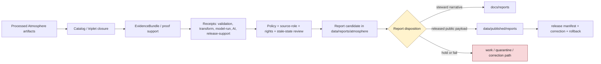

<!-- [KFM_META_BLOCK_V2]
doc_id: kfm://data/reports/atmosphere/readme
name: Atmosphere Reports README
path: data/reports/atmosphere/README.md
type: data-reports-atmosphere-readme
version: v0.1.0
status: draft
owners:
  - <data-steward>
  - <reports-steward>
  - <atmosphere-domain-steward>
  - <air-quality-steward>
  - <weather-steward>
  - <climate-steward>
  - <forecast-model-steward>
  - <evidence-steward>
  - <proof-steward>
  - <receipt-steward>
  - <catalog-steward>
  - <source-steward>
  - <rights-steward>
  - <policy-steward>
  - <release-steward>
  - <docs-steward>
created: 2026-06-29
updated: 2026-06-29
policy_label: restricted-review
truth_posture: cite-or-abstain
responsibility_root: data/
domain: atmosphere
artifact_family: report-candidate-and-report-support-lane
path_posture: existing-greenfield-stub-replaced; parent-data-reports-readme-is-greenfield-stub; data-readme-lists-reports; directory-rules-data-tree-lists-data-published-reports-not-data-reports; compatibility-or-steward-facing-report-candidate-lane-until-parent-contract-or-adr-resolves
sensitivity_posture: no-public-path-by-default; report-is-downstream-carrier-not-truth; not-emergency-alerting; not-life-safety-guidance; not-current-weather-authority; not-official-advisory-authority; official-source-redirection-required; source-role-preserving; aqi-not-concentration; aod-not-pm25; model-field-not-observation; low-cost-sensor-caveats-required; stale-state-required; evidence-aware; rights-aware; policy-aware; release-blocked-until-gates-close
related:
  - ../README.md
  - ../../README.md
  - ../../raw/atmosphere/README.md
  - ../../work/atmosphere/README.md
  - ../../quarantine/atmosphere/README.md
  - ../../processed/atmosphere/README.md
  - ../../catalog/domain/atmosphere/README.md
  - ../../registry/sources/atmosphere/README.md
  - ../../proofs/atmosphere/README.md
  - ../../proofs/validation_report/atmosphere/README.md
  - ../../receipts/README.md
  - ../../published/README.md
  - ../../published/reports/README.md
  - ../../published/atmosphere/README.md
  - ../../published/layers/atmosphere/README.md
  - ../../../docs/reports/README.md
  - ../../../docs/domains/atmosphere/README.md
  - ../../../docs/domains/atmosphere/SOURCE_REGISTRY.md
  - ../../../docs/domains/atmosphere/ARCHITECTURE.md
  - ../../../docs/domains/atmosphere/VERIFICATION_BACKLOG.md
  - ../../../docs/doctrine/directory-rules.md
  - ../../../contracts/domains/atmosphere/
  - ../../../schemas/contracts/v1/domains/atmosphere/
  - ../../../policy/domains/atmosphere/
  - ../../../policy/sensitivity/
  - ../../../policy/rights/
  - ../../../release/
tags:
  - kfm
  - data
  - reports
  - atmosphere
  - air
  - air-quality
  - weather
  - climate
  - smoke
  - aerosol
  - aod
  - aqi
  - pm25
  - ozone
  - forecast-context
  - advisory-context
  - report-candidate
  - report-support
  - downstream-carrier
  - evidence-first
  - cite-or-abstain
  - source-role
  - stale-state
  - official-advisory-redirection
  - not-emergency-alerting
  - not-life-safety-guidance
  - proof
  - receipts
  - catalog
  - release-gated
  - rollback
  - no-public-path
notes:
  - "This README replaces the greenfield stub at `data/reports/atmosphere/README.md`."
  - "The parent `data/reports/README.md` is currently a greenfield stub, so this file is self-bounding and intentionally conservative."
  - "Directory Rules v1.4 lists released report payloads under `data/published/reports/`; this existing `data/reports/atmosphere/` lane is therefore treated as compatibility, report-candidate, or steward-facing report-support material until parent contract or ADR review resolves the lane."
  - "Atmosphere reports are downstream carriers. They do not replace source records, processed data, catalog records, EvidenceBundles, proofs, receipts, source descriptors, policy decisions, release manifests, correction records, rollback records, official advisory sources, or generated-answer receipts."
  - "Atmosphere report candidates must preserve source role, method, units, time semantics, freshness, caveats, uncertainty, official-source redirection, evidence refs, and release state."
[/KFM_META_BLOCK_V2] -->

<a id="top"></a>

# Atmosphere Reports

Report-candidate and report-support lane for Atmosphere-domain generated report material that is not yet a released public report payload.

<p>
  
  
  
  
  
  
  
</p>

**Quick links:** [Scope](#scope) · [Path posture](#path-posture) · [Repo fit](#repo-fit) · [Report boundary](#report-boundary) · [Accepted material](#accepted-material) · [Exclusions](#exclusions) · [Atmosphere report guardrails](#atmosphere-report-guardrails) · [Report flow](#report-flow) · [Suggested directory shape](#suggested-directory-shape) · [Required checks](#required-checks-before-use) · [Status notes](#status-notes)

> [!CAUTION]
> `data/reports/atmosphere/` is not Atmosphere truth, not a public report lane, not current-weather authority, not air-quality compliance proof, not emergency alerting, not life-safety guidance, not proof, not receipt storage, not catalog closure, not release authority, not policy authority, not schema authority, not source registry authority, and not a direct public API/UI source. Treat it as an existing report-candidate or report-support lane until `data/reports/` receives an accepted parent contract or migration decision.

---

## Scope

`data/reports/atmosphere/` may hold Atmosphere-domain report candidates, generated report-support bundles, report-local indexes, preview summaries, and report assembly sidecars that are derived from governed upstream artifacts but are **not** themselves canonical trust artifacts.

This lane is useful only when a maintainer needs a data-root place to stage, inspect, or assemble Atmosphere report material before one of the following governed outcomes:

- a released public report payload under `data/published/reports/`;
- a generated steward-facing narrative under `docs/reports/`;
- a catalog/proof/release-linked report artifact referenced by a governed API or review console;
- a rejected, quarantined, corrected, superseded, withdrawn, or rolled-back report candidate.

Atmosphere report material may summarize air-quality observations, station context, PM2.5 and ozone context, AQI-report context, smoke context, AOD/remote-sensing context, weather observations, precipitation, temperature, wind fields, climate normals, climate anomalies, forecast/model context, official advisory context, source-role posture, freshness/stale-state posture, validation posture, proof posture, catalog posture, release posture, correction posture, and rollback posture.

A report candidate does **not** make an air-quality, weather, smoke, AOD, climate, forecast, advisory, exposure, health, compliance, crop-impact, hydrology-impact, hazard, route, or life-safety claim true. Consequential claims must remain supported by source descriptors, processed data, catalog records, EvidenceBundles, receipts, policy decisions, release state, correction paths, and rollback targets.

---

## Path posture

The existing target lane is:

```text
data/reports/atmosphere/
```

The parent currently exists as a greenfield stub:

```text
data/reports/README.md
```

Current placement evidence is mixed:

- `data/README.md` lists `reports` as content that may belong under `data/`.
- `docs/doctrine/directory-rules.md` lists canonical data lifecycle and emitted-proof families, including `data/published/reports/`, but does not establish `data/reports/` as a lifecycle phase in the same way as `raw`, `work`, `quarantine`, `processed`, `catalog`, `triplets`, `published`, `receipts`, `proofs`, `rollback`, and `registry`.
- `data/published/reports/README.md` is the clearer released public report payload lane.
- `docs/reports/README.md` is the clearer generated steward-facing narrative lane.

Therefore this README treats `data/reports/atmosphere/` as **CONFIRMED path presence / NEEDS VERIFICATION topology**. Do not let this lane become a parallel report authority. If an ADR or parent README later makes `data/reports/` canonical, update this README and migrate child conventions with a rollback plan. If `data/reports/` is retired, migrate report candidates to the correct lifecycle, docs, or published lane.

---

## Repo fit

| Responsibility | Correct home | Boundary |
|---|---|---|
| Atmosphere report candidates and report-support bundles | `data/reports/atmosphere/` | Existing compatibility/steward-facing candidate lane until topology is resolved. |
| Parent reports lane | [`../README.md`](../README.md) | Currently greenfield; does not yet define a full report-family contract. |
| Data root | [`../../README.md`](../../README.md) | Lifecycle data and emitted proof root; reports listed but parent contract remains thin. |
| Processed Atmosphere artifacts | [`../../processed/atmosphere/README.md`](../../processed/atmosphere/README.md) | Normalized Atmosphere data upstream of catalog/report/public products. |
| Atmosphere domain catalog | [`../../catalog/domain/atmosphere/README.md`](../../catalog/domain/atmosphere/README.md) | Catalog closure and release-linked discovery records; not report narrative. |
| Atmosphere source registry | [`../../registry/sources/atmosphere/README.md`](../../registry/sources/atmosphere/README.md) | Source admission and source-role records; not report payloads. |
| Atmosphere receipts | `../../receipts/atmosphere/` or accepted receipt lanes | Process memory; reports may summarize receipts but must not store or replace them. |
| Proof and EvidenceBundle authority | `../../proofs/` | Evidence support and citation validation; reports cite these, not replace them. |
| Released public report payloads | [`../../published/reports/README.md`](../../published/reports/README.md) | Release-approved report payloads only. |
| Released Atmosphere domain carriers | [`../../published/atmosphere/README.md`](../../published/atmosphere/README.md) | Broader published Atmosphere artifact lane after release. |
| Released Atmosphere map carriers | [`../../published/layers/atmosphere/README.md`](../../published/layers/atmosphere/README.md) | Published public-safe map layer carriers; reports may reference them after release. |
| Steward-facing generated narratives | [`../../../docs/reports/README.md`](../../../docs/reports/README.md) | Human-readable generated review/release reports; not data payloads. |
| Atmosphere domain doctrine | [`../../../docs/domains/atmosphere/README.md`](../../../docs/domains/atmosphere/README.md) | Domain scope, object families, source-role denials, lifecycle and publication posture. |
| Atmosphere source doctrine | [`../../../docs/domains/atmosphere/SOURCE_REGISTRY.md`](../../../docs/domains/atmosphere/SOURCE_REGISTRY.md) | Human-facing source-admission and authority-control guidance. |
| Release decisions | `../../../release/` | ReleaseManifest, PromotionDecision, correction, rollback, withdrawal, and signatures. |
| Contracts, schemas, policy | `../../../contracts/domains/atmosphere/`, `../../../schemas/contracts/v1/domains/atmosphere/`, `../../../policy/domains/atmosphere/` | Meaning, machine shape, and allow/deny/restrict/abstain logic. |

---

## Report boundary

| Rule | Handling |
|---|---|
| Report is a downstream carrier | It can summarize governed artifacts, but it is never root truth. |
| Candidate is not publication | A file here is not public just because it is readable, renderable, current-looking, or useful for review. |
| Atmosphere reports are not alerts | Reports may describe evidence context; they must not issue emergency, evacuation, health, life-safety, or operational instructions. |
| Official-source redirection is required | Advisory or current-condition context must preserve issuing authority, issue/valid/expiry time, stale state, and official-source reference. |
| Public report payloads move through release | Released report payloads belong under `data/published/reports/` with release support. |
| Steward narratives belong under docs | Generated human-readable review/release narratives belong under `docs/reports/`. |
| Proof remains separate | EvidenceBundle, ProofPack, citation validation, and integrity proof stay in proof lanes. |
| Receipts remain separate | RunReceipt, ValidationReport, TransformReceipt, ModelRunReceipt, PolicyDecision, AIReceipt, and release-support receipts stay in receipt/proof lanes. |
| Catalog remains separate | Domain catalog, STAC, DCAT, and PROV records stay in `data/catalog/`. |
| Release remains separate | ReleaseManifest, PromotionDecision, CorrectionNotice, RollbackCard, WithdrawalNotice, and signatures stay in `release/`. |
| Policy remains separate | Rights, source-role, sensitivity, advisory, stale-state, low-cost-sensor, and public-release rules stay in `policy/`. |
| AI is not report truth | Generated language must resolve to evidence or abstain; AI summaries require AIReceipt/runtime-envelope support when used in governed flows. |
| Public clients do not read this lane | Public UI/API/report surfaces consume governed APIs, released artifacts, catalog/proof-backed responses, and policy-safe envelopes. |

---

## Accepted material

Accepted material is limited to Atmosphere report-candidate and report-support files that do not become parallel trust artifacts:

- report-candidate Markdown, HTML, JSON, or PDF-generation source files that are explicitly unreleased;
- report-local indexes that point to processed, catalog, proof, receipt, source registry, release, and published artifacts without replacing them;
- report assembly sidecars, such as candidate table-of-contents, figure list, map snapshot index, citation draft index, evidence-reference draft index, caveat index, and freshness/stale-state index;
- report-local caveat summaries, freshness summaries, source-role summaries, source-family summaries, model-run summaries, advisory-redirection summaries, validation summaries, and release-readiness summaries that link to their canonical policy/proof/receipt inputs;
- preview artifacts for steward review, clearly marked as candidates and not public release payloads;
- correction, supersession, withdrawal, or rollback notes that point to canonical release/proof records rather than replacing them;
- README files explaining local report-candidate boundaries.

All accepted material must preserve source role, method, units, time semantics, uncertainty, caveats, freshness, official-source boundaries, evidence refs, and release posture.

---

## Exclusions

| Do not place here | Correct home | Why |
|---|---|---|
| RAW source captures, sensor exports, agency-feed dumps, model files, satellite rasters, advisory text dumps, logs, uploaded files, source mirrors, or raw report inputs | `../../raw/atmosphere/` | Source-edge captures require immutable source context, rights, checksums, and admission metadata. |
| WORK scratch, transform intermediates, unresolved report candidates, or failed validation material | `../../work/atmosphere/` or `../../quarantine/atmosphere/` | Candidate material that has not passed gates belongs upstream or in hold lanes. |
| Normalized Atmosphere datasets | `../../processed/atmosphere/` | Processed data is not a report. |
| Domain catalog, STAC, DCAT, PROV, or graph/triplet records | `../../catalog/`, `../../triplets/` | Catalog/graph carriers have their own closure rules. |
| EvidenceBundle, ProofPack, CitationValidationReport, validation report, or integrity bundles | `../../proofs/` | Proof is the trust spine; reports cite it. |
| RunReceipt, ValidationReceipt, TransformReceipt, ModelRunReceipt, PolicyDecision, AIReceipt, RepresentationReceipt, or release-support receipts | `../../receipts/atmosphere/` or accepted receipt/proof lanes | Receipts are process memory; reports summarize them only. |
| SourceDescriptor, source activation records, rights registry records, or source-family registry records | `../../registry/sources/atmosphere/` or accepted registry lanes | Source identity and rights posture belong in the registry. |
| ReleaseManifest, PromotionDecision, CorrectionNotice, RollbackCard, WithdrawalNotice, signatures, or release changelog | `../../../release/` | Release decisions are not report candidates. |
| Released public report payloads | `../../published/reports/` | Public report payloads must be release-approved. |
| Generated steward-facing narrative reports | `../../../docs/reports/` | Human-readable generated reports belong in docs. |
| Contracts, schemas, policy rules, validators, tests, code, or workflows | `../../../contracts/`, `../../../schemas/`, `../../../policy/`, `../../../tools/`, `../../../tests/`, `.github/workflows/` | Separate authority roots. |
| Emergency alerts, evacuation advice, current operational weather instructions, health advice, routing advice, or life-safety directives | Official authorities outside this lane | KFM Atmosphere is evidence/context, not emergency guidance. |
| Uncited AI summaries or generated authoritative claims | Governed answer/report generation flow with evidence, policy, and receipts | Generated language is evidence-subordinate. |

---

## Atmosphere report guardrails

| Risk | Guardrail |
|---|---|
| AQI/concentration collapse | AQI buckets, AQI reports, and pollutant concentrations must remain distinct. Do not report AQI as measured concentration. |
| AOD/PM2.5 collapse | AOD and other satellite/proxy products must not be reported as PM2.5 observations without governed transformation, evidence, caveats, and source-role clarity. |
| Model/observation collapse | ForecastContext, WindField model output, smoke models, reanalysis, and interpolations must remain model/context products, not observed truth. |
| Advisory as authority drift | Advisory context may point to official issuing authorities; KFM reports must not become advisory authority or life-safety guidance. |
| Low-cost sensor overclaim | Low-cost sensor report content requires correction method, caveats, confidence, limitations, rights posture, and release limits. |
| Stale-current confusion | Current-looking reports must show observed time, valid time, model run time, retrieval time, release time, expiry time, and stale-state posture where material. |
| Cross-lane ownership confusion | Hazards owns life-safety event truth; Agriculture owns crop/yield claims; Hydrology owns water claims; Biodiversity lanes own species/habitat claims; Roads/Settlements own built-environment truth. |
| Sensitive joined context | Atmosphere joined to sensitive species, infrastructure, archaeology, living-person, or private-location context fails closed until policy and review allow a public-safe representation. |
| Report-as-proof drift | A report may make evidence easier to read; it does not become the evidence. |
| Report-as-release drift | A report may summarize release state; it does not approve release. |

---

## Report flow



> [!NOTE]
> The diagram is a responsibility map, not proof that generators, validators, payloads, manifests, review records, or CI wiring currently exist.

---

## Suggested directory shape

This shape is **PROPOSED** until `data/reports/` receives an accepted parent contract or migration decision. Do not pre-create empty stubs.

```text
data/reports/atmosphere/
├── README.md
├── candidates/                         # PROPOSED: unreleased report candidates
│   └── <report_slug>/
│       ├── report.candidate.md
│       ├── report.inputs.index.json
│       ├── evidence_refs.candidate.json
│       ├── source_role_refs.candidate.json
│       ├── freshness_refs.candidate.json
│       ├── citations.candidate.json
│       ├── caveats.candidate.md
│       └── README.md
├── previews/                           # PROPOSED: steward-only rendered previews
│   └── <report_slug>/
├── indexes/                            # PROPOSED: report-local candidate indexes
│   └── atmosphere.report-candidates.index.json
├── superseded/                         # PROPOSED: retained candidates with lineage
│   └── README.md
└── withdrawn/                          # PROPOSED: withdrawn or denied report candidates
    └── README.md
```

If a candidate is promoted as a public report payload, the released payload belongs under `data/published/reports/` and the release decision belongs under `release/`. If a generator emits steward-facing narrative, the generated report belongs under `docs/reports/`.

---

## Required checks before use

- [ ] Confirm whether `data/reports/` is an accepted report-candidate lane, a compatibility lane, or a migration target.
- [ ] Confirm whether `data/reports/atmosphere/` should hold candidates, indexes, previews, or should redirect to `docs/reports/` and `data/published/reports/`.
- [ ] Confirm CODEOWNERS for reports, Atmosphere, air quality, weather, climate, model/forecast context, evidence, proof, receipts, catalog, source, rights, policy, release, and docs review.
- [ ] Confirm every report claim resolves to catalog/proof/evidence or abstains.
- [ ] Confirm report candidates do not store canonical receipts, proofs, release manifests, source descriptors, policy rules, schemas, or processed datasets.
- [ ] Confirm AQI, concentration, AOD, PM2.5, model output, observation, climate normal, anomaly, advisory context, and low-cost sensor content are not collapsed in report prose, figures, captions, indexes, or metadata.
- [ ] Confirm advisory/current-condition content carries official-source reference, source role, issue/valid/expiry time, stale-state posture, and no life-safety instruction.
- [ ] Confirm low-cost sensor, remote-sensing, modeled, derived, aggregate, and interpolated outputs carry method, caveats, uncertainty, rights, source role, and release posture.
- [ ] Confirm cross-lane joins preserve Hazards, Agriculture, Hydrology, Biodiversity, Roads, Settlements, People/Land, and Archaeology ownership and sensitivity boundaries.
- [ ] Confirm AI-generated summaries have evidence references, citation validation, finite outcome, and AIReceipt/runtime envelope support where applicable.
- [ ] Confirm released report payloads are promoted to `data/published/reports/` only after ReleaseManifest, correction path, rollback target, digest, freshness posture, and citation/evidence closure exist.
- [ ] Confirm generated steward-facing narratives belong in `docs/reports/` rather than this data lane.

---

## Status notes

| Item | Status | Notes |
|---|---:|---|
| Target path presence | CONFIRMED | This README replaces a greenfield stub at `data/reports/atmosphere/README.md`. |
| Parent reports README | CONFIRMED stub | `data/reports/README.md` exists but does not yet define a report-family contract. |
| Data root reports mention | CONFIRMED | `data/README.md` lists reports, but marks the root status `PROPOSED`. |
| Directory Rules data tree | CONFIRMED doctrine | Current Directory Rules list `data/published/reports/` and the canonical data lifecycle families; `data/reports/` remains topology-NEEDS VERIFICATION. |
| Published reports lane | CONFIRMED README | `data/published/reports/README.md` exists and is the clearer released report payload lane. |
| Docs reports lane | CONFIRMED README | `docs/reports/README.md` exists and is the clearer steward-facing generated narrative lane. |
| Atmosphere processed lane | CONFIRMED README | `data/processed/atmosphere/README.md` establishes PROCESSED-stage boundaries and no-public-path posture. |
| Atmosphere catalog lane | CONFIRMED README | `data/catalog/domain/atmosphere/README.md` establishes catalog-stage boundaries and release-only exposure posture. |
| Atmosphere source registry | CONFIRMED README | `data/registry/sources/atmosphere/README.md` establishes source-admission, source-role, rights, and no-public-path posture. |
| Atmosphere published domain lane | CONFIRMED README | `data/published/atmosphere/README.md` establishes release-gated public-safe carrier posture. |
| Atmosphere published layers | CONFIRMED README | `data/published/layers/atmosphere/README.md` establishes release-gated public-safe layer-carrier posture. |
| Actual report payloads | UNKNOWN | This README does not prove report candidates or released reports exist. |
| Generator, validator, review, or CI enforcement | NEEDS VERIFICATION | No generator/validator/review tooling was proven by this edit. |
| Public release readiness | DENY until proven | Report existence here cannot publish Atmosphere claims. |

---

## Evidence ledger

| Source | Status | Supports | Limits |
|---|---|---|---|
| Previous target file | CONFIRMED | `data/reports/atmosphere/README.md` existed as a greenfield stub. | Did not define lane boundaries. |
| [`../README.md`](../README.md) | CONFIRMED stub | Parent `data/reports/` path exists. | Does not yet define report-family authority or canonical topology. |
| [`../../README.md`](../../README.md) | CONFIRMED | `data/` root lists reports among data-root content. | Parent status remains `PROPOSED`; not enough to define report lifecycle semantics. |
| [`../../processed/atmosphere/README.md`](../../processed/atmosphere/README.md) | CONFIRMED | Processed Atmosphere artifacts are upstream of catalog/reports/release and not public by default. | Does not prove report payloads or generators exist. |
| [`../../catalog/domain/atmosphere/README.md`](../../catalog/domain/atmosphere/README.md) | CONFIRMED | Atmosphere catalog lane, source-role guardrails, evidence/source/policy/release refs. | Catalog records are not report payloads. |
| [`../../registry/sources/atmosphere/README.md`](../../registry/sources/atmosphere/README.md) | CONFIRMED | Source-admission boundary, source-role preservation, rights/sensitivity fail-closed posture, no-public-path posture. | Source registry records do not authorize publication or report release. |
| [`../../published/reports/README.md`](../../published/reports/README.md) | CONFIRMED | Released report payload lane under `data/published/`. | Does not create `data/reports/` authority. |
| [`../../published/atmosphere/README.md`](../../published/atmosphere/README.md) | CONFIRMED | Released public-safe Atmosphere carrier boundary and publication gates. | Does not prove report payloads or public report release. |
| [`../../published/layers/atmosphere/README.md`](../../published/layers/atmosphere/README.md) | CONFIRMED | Released public-safe Atmosphere map-carrier boundary and release checks. | Layer README does not prove report payloads or public report release. |
| [`../../../docs/reports/README.md`](../../../docs/reports/README.md) | CONFIRMED | Generated steward-facing report narrative lane. | Docs reports are not public report payloads or trust artifacts. |
| [`../../../docs/domains/atmosphere/README.md`](../../../docs/domains/atmosphere/README.md) | CONFIRMED doctrine / PROPOSED implementation | Atmosphere scope, object families, source-role denials, not-emergency-alerting boundary, lifecycle, validation, and publication posture. | Many implementation paths are explicitly PROPOSED/NEEDS VERIFICATION. |
| [`../../../docs/domains/atmosphere/SOURCE_REGISTRY.md`](../../../docs/domains/atmosphere/SOURCE_REGISTRY.md) | CONFIRMED doctrine / PROPOSED implementation | Atmosphere source-family, source-role, source-admission, and source-activation posture. | Does not prove concrete source descriptors, rights approvals, or releases. |
| [`../../../docs/doctrine/directory-rules.md`](../../../docs/doctrine/directory-rules.md) | CONFIRMED doctrine | Responsibility-root, lifecycle, domain-segment, published-reports, and release-vs-published separation. | `data/reports/` topology still needs parent contract or ADR review. |

[Back to top](#top)
