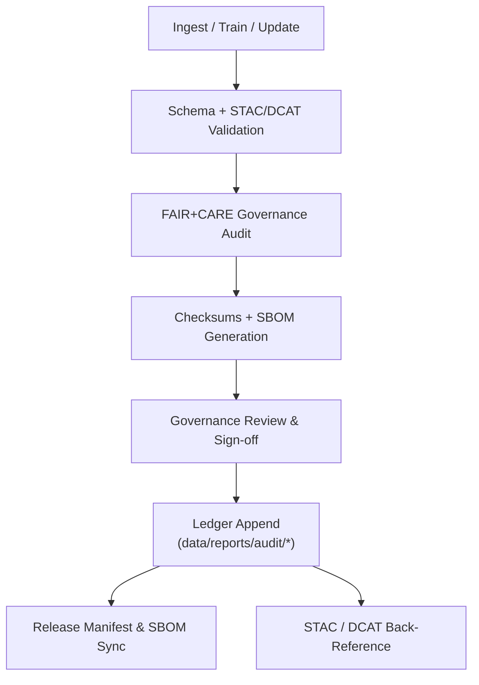

<div align="center">

# 🧾 **Kansas Frontier Matrix — Audit & Provenance Ledger**  
`data/reports/audit/README.md`

**Purpose**  
Define the **audit, provenance, and integrity verification framework** for all KFM data and AI/model assets in **v11**, including **Focus Mode v3** explainability.  
This layer records dataset/model lineage, transformation history, checksum integrity, governance decisions, and **FAIR+CARE** outcomes as **append-only, machine-verifiable ledgers**.

[]() ·
[]() ·
[]() ·
[]() ·
[]()

</div>

---

## 📘 Overview

`data/reports/audit/` is the **governance and provenance backbone** of KFM.

It maintains **immutable, cryptographically verifiable records** of how every dataset and model was:

- Sourced  
- Transformed  
- Validated  
- Signed  
- Approved (or rejected) for release  

Each audit artifact:

- Captures **lineage** from ingestion → ETL/AI → validation → release/archive  
- Stores **SHA-256 checksums** and references to **Release Manifests** and **SBOMs**  
- Logs **FAIR+CARE governance** decisions, ethical reviews, and approver signatures  
- Back-references **STAC/DCAT** items, validation outputs, and graph entity IDs  
- Powers **Focus Mode v3 tracebacks** (why a given data point or model output is trusted)

---

## 🗂️ Directory Layout (Emoji Style A)

```text
data/reports/audit/
├── 📄 README.md                          # This file — audit & provenance reference
│
├── 📜 data_provenance_ledger.json        # Master dataset lifecycle & checksum ledger
├── 🤖 ai_hazards_ledger.json             # AI model lineage, training hashes, drift metrics (hazards)
├── ♿ ui_ethics_review.json               # Accessibility & UX ethics review outcomes
└── 🧾 archive_integrity_log.json         # Periodic checksum verification of archived assets
```

All JSON files here are:

- **Append-only ledgers**  
- Retained for long-term, third-party verification  
- Structured for machine-reading (DCAT/PROV-O/JSON-LD compatible)

---

## 🧩 End-to-End Governance Workflow



**Sequence**

1. **Event** – ETL job, model training run, or dataset update completes.  
2. **Validation** – STAC/DCAT/schema checks confirm structure, metadata, and contracts.  
3. **FAIR+CARE Audit** – Ethics, sovereignty, and reuse checks recorded.  
4. **Integrity** – SHA-256 checksums computed; SBOM and `manifest.zip` updated.  
5. **Governance Review** – Approvers review & sign; decisions recorded.  
6. **Ledger Append** – Entries appended to `audit/*.json` with signatures and hashes.  
7. **Back-Reference** – STAC/DCAT items and graph entities updated to reference the ledger entry.

---

## 🧠 Ledger Files & Roles

| File                          | Purpose                                                     | Generated By           | Workflow(s)                          |
|-------------------------------|-------------------------------------------------------------|------------------------|--------------------------------------|
| `data_provenance_ledger.json` | Dataset lifecycle, provenance, checksums, approvals         | ETL + Governance       | `governance-ledger.yml`             |
| `ai_hazards_ledger.json`      | Model versions, training hashes, hyperparams, drift metrics | AI pipelines (hazards) | `ai-audit.yml` · `faircare_validate`|
| `ui_ethics_review.json`       | Accessibility & ethics review for data-driven UIs          | Docs/UX teams          | `site.yml` · `docs-validate.yml`    |
| `archive_integrity_log.json`  | Periodic verification of archives, releases, and checksums | Governance cron jobs   | `governance-ledger.yml` (nightly)   |

---

## 🔍 Example Data Provenance Ledger Entry (v11)

```json
{
  "dataset_id": "noaa_storm_events_2025_v11",
  "stac_item": "data/stac/items/noaa_storm_events_2025.json",
  "source": {
    "name": "NOAA NCEI Storm Events",
    "endpoint": "https://www.ncei.noaa.gov/stormevents/",
    "license": "Public Domain"
  },
  "ingest": {
    "pipeline": "src/pipelines/etl/noaa_ingest.py",
    "executor": "@kfm-etl-ops",
    "completed_at": "2025-11-19T16:05:12Z",
    "inputs": [
      "data/raw/hazards/noaa_storm_events_1950_2025.csv"
    ],
    "outputs": [
      "data/work/processed/hazards/noaa_storm_events_2025.geojson"
    ]
  },
  "validation": {
    "stac_report": "data/reports/validation/stac_validation_report.json",
    "schema_report": "data/reports/validation/schema_validation_summary.json",
    "result": "pass"
  },
  "faircare": {
    "fair_score": 98,
    "care_score": 100,
    "reviewers": ["@kfm-data-lab", "@kfm-architecture"],
    "decision": "approved",
    "decision_at": "2025-11-19T17:20:31Z"
  },
  "integrity": {
    "sha256": "sha256-f5a3e28d94e4b721b03c1f8d9236d6b4a88efab9deadbeef...",
    "manifest": "releases/v11.0.0/manifest.zip",
    "sbom": "releases/v11.0.0/sbom.spdx.json"
  },
  "telemetry": {
    "records_processed": 412938,
    "energy_wh": 9.7,
    "carbon_gco2e": 13.4
  },
  "notes": "No PII. STAC license and CRS fields verified. Focus Mode v3 explainability hooks registered."
}
```

---

## 🧮 Hashing & Integrity Controls

Core hashing standard:

- **SHA-256** for all data and model artifacts  
- Checksums computed:
  - At **ingestion**  
  - After **ETL/model training**  
  - During **nightly integrity audits**  

Integrity controls include:

- `data/checksums/manifest.json` — global checksum registry  
- `archive_integrity_log.json` — results of periodic re-checks  
- SBOM entries linking to artifact checksums  

Integrity failures:

- Trigger alerts to `@kfm-governance`, `@kfm-security`  
- Generate ledger entries documenting:
  - Nature of mismatch  
  - Scope and affected versions  
  - Mitigation or rollback steps  

---

## 🔗 Cross-References & Linkage

Each ledger entry references:

- **STAC** — `data/stac/**` items/collections  
- **DCAT** — `data/meta/**.jsonld` or domain-level catalog entries  
- **Validation** — `data/reports/validation/**`, `data/reports/self-validation/**`  
- **FAIR+CARE** — `data/reports/fair/**`  
- **Graph Entities** — Neo4j URIs for People, Places, Events, Datasets, Models

These connections are the backbone of **Focus Mode v3 tracebacks** — allowing the system (and humans) to answer:

> “Why is this dataset/model considered trustworthy and how do we know?”

---

## 🧭 Governance & FAIR+CARE Integration

| Principle                | Ledger Implementation                                                 | Oversight            |
|--------------------------|-----------------------------------------------------------------------|----------------------|
| **Findable**             | Stable IDs, JSON-LD, indexes over ledger IDs                         | `@kfm-data`          |
| **Accessible**           | Open JSON + documentation; reproducible via public repo + SBOM       | `@kfm-accessibility` |
| **Interoperable**        | DCAT 3.0 + PROV-O + STAC 1.x compatible structures                   | `@kfm-architecture`  |
| **Reusable**             | Complete lifecycle context & licensing, ethics, and usage notes       | `@kfm-design`        |
| **Collective Benefit**   | Governance records are public and support community trust             | `@faircare-council`  |
| **Authority to Control** | Council signatures & PGP hashes limit improper or unilateral changes | `@kfm-governance`    |
| **Responsibility**       | Ledger entries tie decisions to real actors and dates                 | `@kfm-security`      |
| **Ethics**               | All ledger entries reviewed for responsible use & representation      | `@kfm-ethics`        |

---

## 🧠 AI & Focus Mode v3 Audit Use

`ai_hazards_ledger.json` and related files track:

- Model architectures and versions  
- Training/eval datasets & their checksums  
- Hyperparameters and config IDs  
- Performance metrics and drift statistics  
- Bias/impact analysis and mitigations  

Focus Mode v3 uses these ledgers to:

- Explain **why** a model was selected  
- Show **which data** trained it  
- Reveal **governance decisions** that allowed the model into production  
- Mark any **ethical caveats** or constraints (e.g., not used for high-stakes decisions)

---

## 🕰 Version History

| Version | Date       | Author            | Summary                                                                                                                  |
|--------:|-----------:|------------------|--------------------------------------------------------------------------------------------------------------------------|
| v11.2.2 | 2025-11-27 | Lead Programmer  | Updated to KFM-MDP v11.2.2; emoji directory layout; clarified AI & Focus Mode audit roles; standardized footer styling. |
| v11.0.0 | 2025-11-19 | Lead Programmer  | v11 governance alignment; DCAT/PROV-O mapping; Focus Mode v3 explainability hooks; telemetry v3 integration.            |
| v10.0.0 | 2025-11-09 | `@kfm-governance`| Initial audit & provenance ledger documentation.                                                                         |

---

<div align="center">

© 2025 Kansas Frontier Matrix — CC-BY 4.0 / FAIR+CARE Governance License  
[⬅️ Back to Reports Index](../README.md) · [📐 Data Architecture](../../ARCHITECTURE.md) · [🛡️ Governance Charter](../../../docs/standards/governance/ROOT-GOVERNANCE.md)

</div>