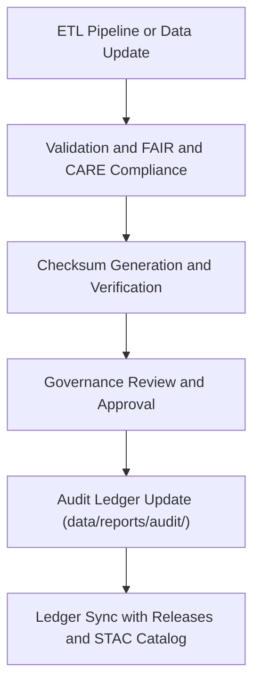

<div align="center">

# 🧮 Kansas Frontier Matrix — **Audit & Provenance Ledger**
`data/reports/audit/README.md`

**Purpose:** Defines the audit, provenance, and integrity verification framework for the Kansas Frontier Matrix (KFM) data repository.  
Tracks dataset lineage, transformation history, checksum integrity, and governance decisions for every data asset.

[](../../../docs/standards/faircare-validation.md)
[](../../../.github/workflows/stac-validate.yml)
[](../../../LICENSE)
[](../../../docs/architecture/repo-focus.md)

</div>

---

## 📚 Overview

The `data/reports/audit/` directory functions as the **governance and provenance backbone** of the Kansas Frontier Matrix data architecture.  
It maintains **verifiable records** of all datasets, their transformations, and ethical governance approvals through immutable JSON logs.

Each audit file:
- Records dataset lineage from ingestion to archival.  
- Stores digital checksums for reproducibility.  
- Logs FAIR+CARE governance reviews and sign-offs.  
- Links back to STAC catalog items, manifests, and schema validation results.  

Together, these files form the **Data Provenance Ledger**, ensuring that every dataset in KFM can be traced, verified, and ethically justified.

---

## 🗂️ Directory Layout

```plaintext
data/reports/audit/
├── README.md                          # This file — overview of the audit and provenance ledger
│
├── data_provenance_ledger.json        # Master ledger for all datasets (lineage, transformations, checksums)
├── ai_hazards_ledger.json             # AI and machine learning model provenance and drift logs
├── ui_ethics_review.json              # Accessibility and ethics audit of web-based UI data
└── archive_integrity_log.json         # Versioned checksum registry for archived datasets
```

---

## 🧩 Governance Workflow



### Description:
1. **ETL or AI job completion** triggers validation and checksum generation.  
2. FAIR+CARE Council reviews ethical and technical conformance.  
3. Governance signatures are appended to the audit ledger.  
4. The ledger entry is locked and propagated to:
   - `releases/v9.3.2/manifest.zip`
   - `data/stac/catalog.json`
   - `reports/fair/data_fair_summary.json`

---

## 🧠 Audit Files Description

| File | Purpose | Generated By | Workflow |
|------|----------|---------------|-----------|
| `data_provenance_ledger.json` | Tracks every dataset’s transformation chain, validator, and timestamp. | ETL Pipeline | `.github/workflows/governance-ledger.yml` |
| `ai_hazards_ledger.json` | Logs AI model runs, retraining events, and drift metrics. | AI Focus Mode | `.github/workflows/faircare-validate.yml` |
| `ui_ethics_review.json` | Evaluates accessibility and ethical design compliance for web datasets. | Web UI Validator | `.github/workflows/site.yml` |
| `archive_integrity_log.json` | Stores historical checksum verification for archived datasets. | Governance Sync | `.github/workflows/governance-ledger.yml` |

---

## 🔍 Example — Provenance Ledger Entry

```json
{
  "dataset_id": "hazards_v9.3.2",
  "source": "NOAA Storm Events Database",
  "validator": "@kfm-etl-ops",
  "checksum": "f5a3e28d94e4b721b03c1f8d9236d6b4a88efab9...",
  "timestamp": "2025-10-28T15:42:00Z",
  "fair_score": 99,
  "care_score": 100,
  "governance_decision": "approved",
  "linked_files": {
    "manifest": "releases/v9.3.2/manifest.zip",
    "validation_report": "data/reports/validation/stac_validation_report.json",
    "stac_item": "data/stac/items/hazards_v9.3.2.json"
  },
  "signatures": [
    {
      "reviewer": "@bartytime4life",
      "role": "Governance Lead",
      "date": "2025-10-28T16:10:00Z"
    }
  ]
}
```

> 🧾 **Note:** Every ledger entry is cryptographically signed and timestamped, ensuring full data accountability and authenticity.

---

## ⚙️ FAIR+CARE Governance Integration

| Principle | Implementation in Audit System |
|------------|-------------------------------|
| **Findable** | Ledger entries are indexed and searchable through dataset IDs. |
| **Accessible** | All JSON logs are published openly in the repository. |
| **Interoperable** | Uses JSON-LD and STAC-compatible fields for linkage. |
| **Reusable** | Each entry provides complete provenance metadata. |
| **Collective Benefit** | Promotes transparent and ethical use of public data. |
| **Authority to Control** | FAIR+CARE Council authorizes all governance approvals. |
| **Responsibility** | Data managers sign off on accuracy and compliance. |
| **Ethics** | Each dataset includes an ethical context note and review. |

---

## 🧩 Integrity & Verification

Each dataset’s checksum is verified automatically via:
- `sha256sum` comparison across ETL outputs  
- `archive_integrity_log.json` entries  
- Cross-reference with `releases/v9.3.2/manifest.zip`  

Checksum validation ensures:
- Immutable, tamper-proof archival datasets  
- Continuous verification across CI/CD pipelines  
- Long-term reproducibility in future research  

---

## 🧾 Governance Linkages

The audit ledger connects to multiple governance components:
- `reports/fair/data_fair_summary.json` — FAIR+CARE scores  
- `reports/validation/stac_validation_report.json` — Schema and metadata compliance  
- `docs/standards/governance/` — Governance framework  
- `schemas/telemetry/work-data-governance-v14.json` — Telemetry schema for audit tracking  

All provenance data is cross-referenced in the Neo4j Knowledge Graph for traceability in Focus Mode and archival queries.

---

## 🧾 Version History

| Version | Date       | Author            | Summary |
|----------|------------|-------------------|----------|
| v9.3.2   | 2025-10-28 | @kfm-data-lab     | Added detailed audit structure and FAIR+CARE governance integration. |
| v9.3.1   | 2025-10-27 | @bartytime4life   | Improved ledger examples and provenance trace schema. |
| v9.3.0   | 2025-10-26 | @kfm-architecture | Established audit ledger documentation and governance workflows. |

---

<div align="center">

**Kansas Frontier Matrix** · *Data Integrity × Provenance × Ethical Accountability*  
[🔗 Repository](https://github.com/bartytime4life/Kansas-Frontier-Matrix) • [🧭 Docs Portal](../../../docs/) • [⚖️ Governance Ledger](../../../docs/standards/governance/)

</div>
