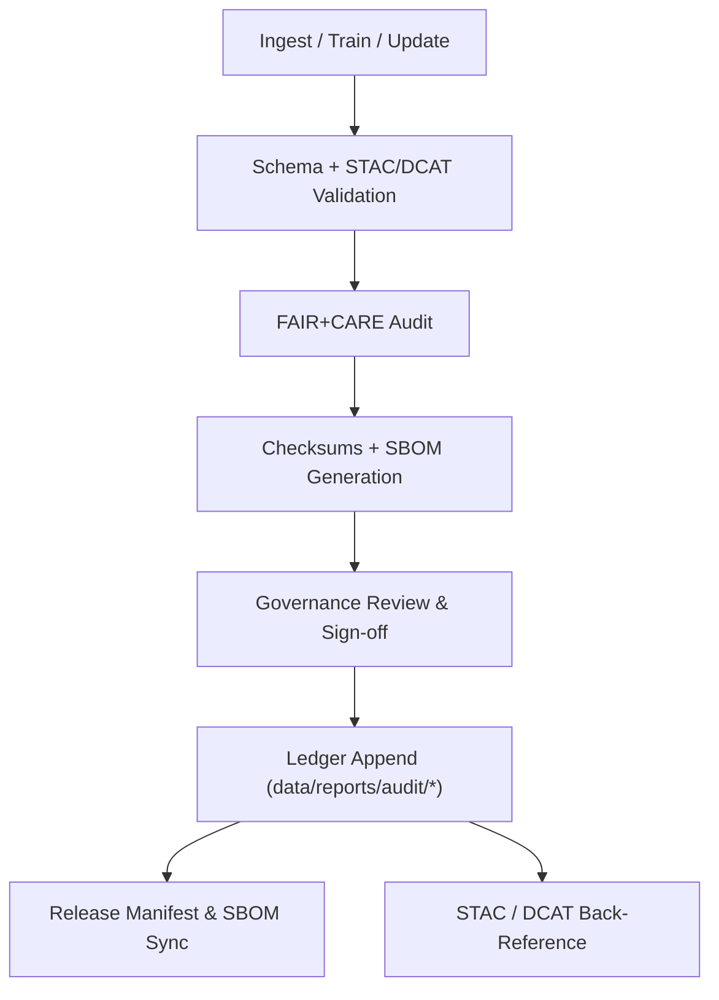

<div align="center">

# 🧾 **Kansas Frontier Matrix — Audit & Provenance Ledger**  
`data/reports/audit/README.md`

**Purpose:**  
Define the **audit, provenance, and integrity verification framework** for all KFM data and AI/model assets in **v11**, including **Focus Mode v3** explainability.  
This layer records dataset/model lineage, transformation history, checksum integrity, governance decisions, and **FAIR+CARE** outcomes as **append-only, machine-verifiable ledgers**.

[]()  
[]()  
[]()  
[]()  
[]()

</div>

---

## 📘 Overview

`data/reports/audit/` is the **governance and provenance backbone** of KFM.

It maintains **immutable, cryptographically verifiable records** of how every dataset and model was:

- sourced  
- transformed  
- validated  
- signed  
- and approved for release

Each audit resource:

- Captures **lineage** from ingestion → transformation → validation → release  
- Stores **SHA-256 checksums** and links to the **Release Manifest** and **SBOM**  
- Logs **FAIR+CARE governance** decisions, ethical reviews, and approver signatures  
- Back-references **STAC/DCAT** items, validation outputs, and knowledge-graph entity IDs  
- Powers **Focus Mode v3** tracebacks (why a given data point/model output is trusted)

---

## 🗂️ Directory Layout

```plaintext
data/reports/audit/
├── README.md                         # This file — audit & provenance reference
│
├── data_provenance_ledger.json       # Master dataset lifecycle & checksum ledger
├── ai_hazards_ledger.json            # AI model lineage, training data hashes, drift metrics
├── ui_ethics_review.json             # Accessibility & UX ethics review outcomes
└── archive_integrity_log.json        # Historical checksum verifications of archived assets
````

> **All files** are treated as **append-only ledgers** and are retained for long-term, third-party verification.

---

## 🧩 End-to-End Governance Workflow



**Sequence**

1. **Event** → ETL job, model training, or dataset update completes
2. **Validation** → STAC/DCAT/schema checks verify metadata & structure
3. **FAIR+CARE** → Ethics & completeness audits run; results logged
4. **Integrity** → SHA-256 checksums computed; SBOMs/manifest updated
5. **Governance** → Human/board review; decisions & signatures recorded
6. **Ledger** → Append-only entries added; nightly integrity checks appended
7. **Release** → `manifest.zip` & `sbom.spdx.json` updated; telemetry v3 recorded

---

## 🧠 Audit Files

| File                          | Purpose                                                     | Generated By     | Workflow(s)                                      |
| ----------------------------- | ----------------------------------------------------------- | ---------------- | ------------------------------------------------ |
| `data_provenance_ledger.json` | Dataset lifecycle, provenance, checksums, approvers         | ETL + Governance | `governance-ledger.yml`                          |
| `ai_hazards_ledger.json`      | Model versions, training hashes, hyperparams, drift metrics | AI pipelines     | `faircare-validate.yml` + `ai-audit.yml`         |
| `ui_ethics_review.json`       | Accessibility & ethics review outcomes for data-driven UI   | Docs/UX checks   | `site.yml` · `docs-validate.yml`                 |
| `archive_integrity_log.json`  | Periodic verification of archived release checksums         | Governance cron  | `governance-ledger.yml` nightly integrity checks |

---

## 🔍 Example — Data Provenance Ledger Entry (v11)

```json
{
  "dataset_id": "noaa_storm_events_2025_v11",
  "stac_item": "data/stac/items/noaa_storm_events_2025.json",
  "source": {
    "name": "NOAA NCEI Storm Events",
    "endpoint": "https://www.ncei.noaa.gov/stormevents/",
    "license": "Public Domain"
  },
  "ingest": {
    "pipeline": "src/pipelines/etl/noaa_ingest.py",
    "executor": "@kfm-etl-ops",
    "completed_at": "2025-11-19T16:05:12Z",
    "inputs": [
      "data/raw/hazards/noaa_storm_events_1950_2025.csv"
    ],
    "outputs": [
      "data/work/processed/hazards/noaa_storm_events_2025.geojson"
    ]
  },
  "validation": {
    "stac_report": "data/reports/validation/stac_validation_report.json",
    "schema_report": "data/reports/validation/schema_validation_summary.json",
    "result": "pass"
  },
  "faircare": {
    "fair_score": 98,
    "care_score": 100,
    "reviewers": ["@kfm-data-lab", "@kfm-architecture"],
    "decision": "approved",
    "decision_at": "2025-11-19T17:20:31Z"
  },
  "integrity": {
    "sha256": "f5a3e28d94e4b721b03c1f8d9236d6b4a88efab9deadbeef...",
    "manifest": "releases/v11.0.0/manifest.zip",
    "sbom": "releases/v11.0.0/sbom.spdx.json"
  },
  "telemetry": {
    "records_processed": 412938,
    "energy_wh": 9.7,
    "carbon_gco2e": 13.4
  },
  "notes": "No PII. STAC license and CRS fields verified. Focus Mode v3 explainability hooks registered."
}
```

---

## 🧮 Hashing & Integrity

KFM employs **SHA-256** for all dataset and model artifacts.

Integrity is enforced by:

* Deterministic builds and immutable raw storage
* Automated per-pipeline checksum manifests (`pipeline_checksums.sha256`)
* Release-time consolidation into `releases/v11.0.0/manifest.zip` (checksums + signatures)
* Nightly rechecks appended to `archive_integrity_log.json`

Any mismatch triggers:

* Alert to `@kfm-governance` and `@kfm-security`
* Ledger entry annotating the discrepancy and resolution
* Potential rollback actions via the dataset promotion workflow

---

## 🔗 Cross-References & Linkage

Each ledger entry includes stable references to:

* **STAC**: Items/Collections in `data/stac/**`
* **DCAT**: Dataset descriptors in `data/meta/**.jsonld`
* **Validation**: `data/reports/validation/**` & `data/reports/self-validation/**`
* **FAIR+CARE**: `data/reports/fair/**`
* **Knowledge Graph**: Neo4j URIs for People/Places/Events/Models

These linkages:

* Power **Focus Mode v3 explainability** (graph + audit trail)
* Enable external auditors to verify every step of the data/model lifecycle
* Allow programmatic queries like “show all ledgers affecting dataset X between dates Y and Z”

---

## 🧭 Governance & FAIR+CARE Integration

| Principle         | How the Ledger Enforces It                                        |
| ----------------- | ----------------------------------------------------------------- |
| **Findable**      | Stable IDs, JSON-LD context, searchable indexes over ledger IDs   |
| **Accessible**    | Text-based JSON, open in repo; signatures & hashes for trust      |
| **Interoperable** | PROV-O, DCAT 3.0, STAC 1.0.0 compliant structures                 |
| **Reusable**      | Full lifecycle context (who, what, when, how, why) with licensing |
| **CARE Ethics**   | Consent notes, authority-to-control info, equity/bias reviews     |

---

## 🕰️ Version History

| Version | Date       | Author            | Summary                                                                                                                                                 |
| ------- | ---------- | ----------------- | ------------------------------------------------------------------------------------------------------------------------------------------------------- |
| v11.0.0 | 2025-11-19 | Lead Programmer   | Upgraded to KFM-MDP v11; DCAT 3.0/PROV-O alignment, Focus Mode v3 explainability hooks, telemetry v3 integration, path aligned to `data/reports/audit/` |
| v10.0.0 | 2025-11-09 | `@kfm-governance` | Telemetry v2 & Streaming STAC references; AI explainability schema expanded; integrity logs hardened                                                    |
| v9.7.0  | 2025-11-06 | `@kfm-governance` | SBOM/manifest refs aligned; telemetry/schema paths added; badges hardened                                                                               |
| v9.5.1  | 2025-10-30 | `@kfm-data-lab`   | DCAT cross-refs and nightly integrity checks established                                                                                                |
| v9.3.2  | 2025-10-28 | `@kfm-data-lab`   | Baseline audit & governance workflows created                                                                                                           |

---

<div align="center">

**Kansas Frontier Matrix — Audit & Provenance Ledger**
🧾 *Data Integrity × Provenance × Ethical Accountability*

[⬅️ Back to Reports Index](../README.md) ·
[📐 Data Architecture](../../ARCHITECTURE.md) ·
[⚖️ Governance Charter](../../../docs/standards/governance/ROOT-GOVERNANCE.md)

</div>
