<div align="center">

# 🧾 Kansas Frontier Matrix — **Audit & Provenance Ledger**  
`data/raw/reports/audit/README.md`

**Purpose:**  
Defines the **audit, provenance, and integrity verification framework** for KFM data and model assets.  
Tracks dataset/model lineage, transformation history, checksum integrity, governance decisions, and **FAIR+CARE** outcomes for every asset in the repository.

[](../../../docs/architecture/README.md)
[](../../../docs/standards/faircare-validation.md)
[](../../../.github/workflows/stac-validate.yml)
[](../../../.github/workflows/dcat-export.yml)

</div>

---

## 📘 Overview

`data/raw/reports/audit/` is the **governance and provenance backbone** of KFM.  
It maintains **immutable, machine-verifiable records** of how every dataset and model was sourced, transformed, validated, signed, and approved.

Each audit resource:
- Captures **lineage** from ingestion → transformation → validation → release.  
- Stores **cryptographic checksums** (SHA-256) and links to the **Release Manifest** (SPDX SBOM + checksums).  
- Logs **FAIR+CARE governance** decisions, including ethical reviews and approver signatures.  
- Links to **STAC/DCAT** metadata, validation outputs, and knowledge graph entity IDs for traceability.

---

## 🗂️ Directory Layout

```plaintext
data/raw/reports/audit/
├── README.md                         # This file — audit & provenance reference
│
├── data_provenance_ledger.json       # Master lineage & checksum ledger for datasets
├── ai_hazards_ledger.json            # AI/ML model lineage, training data refs, drift metrics
├── ui_ethics_review.json             # Accessibility & UX ethics review outcomes
└── archive_integrity_log.json        # Historical checksum verifications of archived assets
```

> **All files** are append-only and retained for long-term, third-party verification.

---

## 🧩 End-to-End Governance Workflow

```mermaid
flowchart TD
  A["Ingest / Train / Update"] --> B["Schema & STAC/DCAT Validation"]
  B --> C["FAIR+CARE Audit"]
  C --> D["Checksums & SBOM Generation"]
  D --> E["Governance Review & Sign-off"]
  E --> F["Ledger Update — data/raw/reports/audit"]
  F --> G["Release Manifest & Telemetry Sync"]
  F --> H["STAC / DCAT Back-Reference"]
```



### Description
1. **Event**: ETL run, model training, or dataset update completes.  
2. **Validation**: STAC/DCAT/Schema checks verify metadata, geometry, structure.  
3. **FAIR+CARE**: Ethics & completeness audits run; results logged.  
4. **Integrity**: SHA-256 checksums computed; SBOM updated.  
5. **Governance**: Reviewers sign; decisions stored with timestamps.  
6. **Ledger**: Append-only entries added to audit ledgers.  
7. **Release**: `manifest.zip` & `sbom.spdx.json` updated; telemetry posted for dashboards.

---

## 🧠 Audit Files

| File | Purpose | Generated By | Workflow(s) |
|---|---|---|---|
| `data_provenance_ledger.json` | Dataset lifecycle, provenance, checksums, approvers | ETL + Governance | `.github/workflows/governance-ledger.yml` |
| `ai_hazards_ledger.json` | Model versions, training hashes, hyperparams, drift metrics | AI pipelines | `.github/workflows/faircare-validate.yml` |
| `ui_ethics_review.json` | Accessibility & ethics review outcomes for data-driven UI | Docs/UX checks | `.github/workflows/site.yml` · `docs-validate.yml` |
| `archive_integrity_log.json` | Periodic verification of archived release checksums | Governance sync | `.github/workflows/governance-ledger.yml` |

---

## 🔍 Example — Data Provenance Ledger Entry

```json
{
  "dataset_id": "noaa_storm_events_2025",
  "stac_item": "data/stac/items/noaa_storm_events_2025.json",
  "source": {
    "name": "NOAA NCEI Storm Events",
    "endpoint": "https://www.ncdc.noaa.gov/stormevents/",
    "license": "Public Domain"
  },
  "ingest": {
    "pipeline": "src/pipelines/etl/noaa_ingest.py",
    "executor": "@kfm-etl-ops",
    "completed_at": "2025-11-06T16:05:12Z",
    "inputs": ["data/raw/hazards/noaa_storm_events_1950_2025.csv"],
    "outputs": ["data/work/processed/hazards/noaa_storm_events_2025.geojson"]
  },
  "validation": {
    "stac_report": "data/reports/validation/stac_validation_report.json",
    "schema_report": "data/reports/validation/schema_validation_summary.json",
    "result": "pass"
  },
  "faircare": {
    "fair_score": 98,
    "care_score": 100,
    "reviewers": ["@kfm-data-lab", "@kfm-architecture"],
    "decision": "approved",
    "decision_at": "2025-11-06T17:20:31Z"
  },
  "integrity": {
    "sha256": "f5a3e28d94e4b721b03c1f8d9236d6b4a88efab9deadbeef...",
    "manifest": "releases/v9.7.0/manifest.zip",
    "sbom": "releases/v9.7.0/sbom.spdx.json"
  },
  "notes": "No PII. STAC license field populated. CRS EPSG:4326 verified."
}
```

---

## 🧮 Hashing & Integrity

KFM employs **SHA-256** for all dataset/model artifacts. Integrity is enforced by:

- Deterministic builds and immutable raw storage  
- Automated `pipeline_checksums.sha256` per ETL job  
- Release-time consolidation into `releases/v9.7.0/manifest.zip` (checksums + signatures)  
- Nightly rechecks appended to `archive_integrity_log.json`

---

## 🔗 Cross-References & Linkage

Audit records include stable references to:

- **STAC** (Items/Collections in `data/stac/**`)  
- **DCAT** feeds (`data/meta/**.jsonld`)  
- **Validation** (`data/reports/validation/**`)  
- **FAIR+CARE** audits (`data/reports/fair/**`)  
- **Knowledge Graph** (Neo4j entity URIs for People/Places/Events/Models)

These linkages power **Focus Mode** tracebacks and enable external verification.

---

## 🧠 Governance & FAIR+CARE Integration

| Principle | How the Ledger Enforces It |
|---|---|
| **Findable** | Indexed by stable IDs and exposed via governance API. |
| **Accessible** | Text-based JSON stored in-repo for public inspection. |
| **Interoperable** | JSON-LD-ready; aligns with STAC/DCAT/PROV-O. |
| **Reusable** | Complete, versioned context (who, what, when, why, how). |
| **CARE Ethics** | Captures consent notes, authority-to-control, and equity reviews. |

---

## 🕰️ Version History

| Version | Date       | Author           | Summary |
|--------:|------------|------------------|---------|
| v9.7.0  | 2025-11-06 | `@kfm-governance`| Upgraded to v9.7.0; aligned SBOM/manifest refs; added telemetry/schema paths; hardened badges. |
| v9.5.1  | 2025-10-30 | `@kfm-data-lab`  | Updated to v9.5.1; added DCAT cross-refs and nightly integrity checks. |
| v9.3.2  | 2025-10-28 | `@kfm-data-lab`  | Detailed audit structure and FAIR+CARE integration. |
| v9.3.1  | 2025-10-27 | `@bartytime4life`| Improved ledger examples and provenance schema. |
| v9.3.0  | 2025-10-26 | `@kfm-architecture`| Established baseline audit & governance workflows. |

---

<div align="center">

**Kansas Frontier Matrix**  
*Data Integrity × Provenance × Ethical Accountability*  
© 2025 Kansas Frontier Matrix — CC-BY 4.0 / FAIR+CARE Governance License · Diamond⁹ Ω / Crown∞Ω Ultimate Certified  

[Back to Reports Index](../../README.md) · [Docs Portal](../../../docs/) · [Governance Charter](../../../docs/standards/governance/ROOT-GOVERNANCE.md)

</div>