<div align="center">

# 🧾 Kansas Frontier Matrix — **Audit & Provenance Ledger**  
`data/reports/audit/README.md`

**Purpose:** Defines the audit, provenance, and integrity verification framework for the Kansas Frontier Matrix (KFM) data and model assets.  
Tracks dataset/model lineage, transformation history, checksum integrity, governance decisions, and FAIR+CARE outcomes for every asset in the repository.

[](../../../docs/standards/faircare-validation.md)
[](../../../.github/workflows/stac-validate.yml)
[](../../../.github/workflows/dcat-export.yml)
[](../../../docs/architecture/repo-focus.md)

</div>

---

## 📚 Overview

The `data/reports/audit/` directory is the **governance and provenance backbone** of KFM.  
It maintains **immutable, machine-verifiable records** of how every dataset and model was sourced, transformed, validated, signed, and approved.

Each audit resource:
- Captures **lineage** from ingestion → transformation → validation → release.  
- Stores **cryptographic checksums** (SHA-256) and links to the **Release Manifest** (SPDX SBOM + checksums).  
- Logs **FAIR+CARE governance** decisions, including ethical reviews and approver signatures.  
- Links to **STAC/DCAT metadata**, validation outputs, and knowledge graph entity IDs for traceability.

---

## 🗂️ Directory Layout

```plaintext
data/reports/audit/
├── README.md                         # This file — audit & provenance reference
│
├── data_provenance_ledger.json       # Master lineage & checksum ledger for datasets
├── ai_hazards_ledger.json            # AI/ML model lineage, training data refs, drift metrics
├── ui_ethics_review.json             # Accessibility & UX ethics review outcomes
└── archive_integrity_log.json        # Historical checksum verifications of archived assets
```

> All files use stable, append-only semantics and are designed for long-term retention and third-party verification.

---

## 🧩 End-to-End Governance Workflow

```mermaid
flowchart TD
  A["Ingest / Train / Update"] --> B["Schema and STAC–DCAT Validation"]
  B --> C["FAIR+CARE Audit"]
  C --> D["Checksum and SBOM Generation"]
  D --> E["Governance Review and Sign-off"]
  E --> F["Ledger Update — data/reports/audit"]
  F --> G["Release Manifest and Telemetry Sync"]
  F --> H["STAC / DCAT Back-Reference"]
```



### Description
1. **Event**: ETL run, model training, or dataset update completes.  
2. **Validation**: STAC/DCAT/schema checks verify metadata, geometry, and structure.  
3. **FAIR+CARE**: Ethical and metadata completeness audits run; results logged.  
4. **Integrity**: SHA-256 checksums computed; SBOM updated for supply-chain transparency.  
5. **Governance**: Reviewers sign off; decisions and notes are stored with timestamps.  
6. **Ledger**: Append-only entries added to audit ledgers.  
7. **Release**: `manifest.zip` and `sbom.spdx.json` updated; telemetry posted for dashboards.

---

## 🧠 Audit Files

| File | Purpose | Generated By | Workflow(s) |
|---|---|---|---|
| `data_provenance_ledger.json` | Tracks dataset lifecycle, provenance, checksums, approvers | ETL + Governance | `.github/workflows/governance-ledger.yml` |
| `ai_hazards_ledger.json` | Records model versions, training data hashes, hyperparams, metrics, drift | AI pipelines | `.github/workflows/faircare-validate.yml` |
| `ui_ethics_review.json` | Accessibility & ethics review outcomes for data-driven UI | Docs/UX checks | `.github/workflows/site.yml` / `docs-validate.yml` |
| `archive_integrity_log.json` | Periodic verification of archived release checksums | Governance sync | `.github/workflows/governance-ledger.yml` |

---

## 🔍 Example — Data Provenance Ledger Entry

```json
{
  "dataset_id": "noaa_storm_events_2025",
  "stac_item": "data/stac/items/noaa_storm_events_2025.json",
  "source": {
    "name": "NOAA NCEI Storm Events",
    "endpoint": "https://www.ncdc.noaa.gov/stormevents/",
    "license": "Public Domain"
  },
  "ingest": {
    "pipeline": "src/pipelines/etl/noaa_ingest.py",
    "executor": "@kfm-etl-ops",
    "completed_at": "2025-10-30T16:05:12Z",
    "inputs": ["data/raw/noaa/storm_events/storm_events_2025.csv"],
    "outputs": ["data/work/processed/noaa/storm_events_2025.geojson"]
  },
  "validation": {
    "stac_report": "data/reports/validation/stac_validation_report.json",
    "schema_report": "data/reports/validation/schema_validation_summary.json",
    "result": "pass"
  },
  "faircare": {
    "fair_score": 98,
    "care_score": 100,
    "reviewers": ["@kfm-data-lab", "@kfm-architecture"],
    "decision": "approved",
    "decision_at": "2025-10-30T17:20:31Z"
  },
  "integrity": {
    "sha256": "f5a3e28d94e4b721b03c1f8d9236d6b4a88efab9deadbeef...",
    "manifest": "releases/v9.5.1/manifest.zip",
    "sbom": "releases/v9.5.1/sbom.spdx.json"
  },
  "notes": "No PII. STAC license field populated. Validated CRS EPSG:4326."
}
```

---

## 🧮 Hashing & Integrity

KFM employs **SHA-256** for all dataset/model artifacts. Integrity is enforced by:
- **Deterministic builds** and immutable raw data storage  
- **Automated `pipeline_checksums.sha256`** per ETL job  
- **Release-time consolidation** into `releases/v9.5.1/manifest.zip` (checksums + signatures)  
- **Nightly rechecks** appended to `archive_integrity_log.json`

---

## 🔗 Cross-References & Linkage

Audit records include **stable references** to:
- **STAC** (Items/Collections in `data/stac/**`)  
- **DCAT** feeds (`data/meta/**.jsonld`)  
- **Validation** (`data/reports/validation/**`)  
- **FAIR+CARE** audits (`data/reports/fair/**`)  
- **Knowledge Graph** (entity URIs for People/Places/Events/Models in Neo4j)  

These linkages power **Focus Mode** tracebacks and enable external verification by third parties.

---

## 🧠 Governance & FAIR+CARE Integration

| Principle | How the Ledger Enforces It |
|---|---|
| **Findable** | Ledger entries are indexed by stable IDs and exposed via the governance API. |
| **Accessible** | Logs are text-based JSON and stored in-repo for public inspection. |
| **Interoperable** | JSON-LD-ready fields align with STAC/DCAT/PROV-O; easy to transform. |
| **Reusable** | Complete, versioned context (who, what, when, why, how) per entry. |
| **CARE Ethics** | Explicit capture of authority-to-control, consent notes, and ethics outcomes. |

---

## 🧾 Version History

| Version | Date | Author | Summary |
|---|---|---|---|
| v9.5.1 | 2025-10-30 | @kfm-data-lab | Updated to v9.5.1 (SBOM/manifest), added DCAT cross-refs and nightly integrity checks. |
| v9.3.2 | 2025-10-28 | @kfm-data-lab | Detailed audit structure and FAIR+CARE integration. |
| v9.3.1 | 2025-10-27 | @bartytime4life | Improved ledger examples and provenance schema. |
| v9.3.0 | 2025-10-26 | @kfm-architecture | Established baseline audit & governance workflows. |

---

<div align="center">

**Kansas Frontier Matrix** · *Data Integrity × Provenance × Ethical Accountability*  
[🔗 Repository](https://github.com/bartytime4life/Kansas-Frontier-Matrix) • [🧭 Docs Portal](../../../docs/) • [⚖️ Governance Ledger](../../../docs/standards/governance/)

</div>
